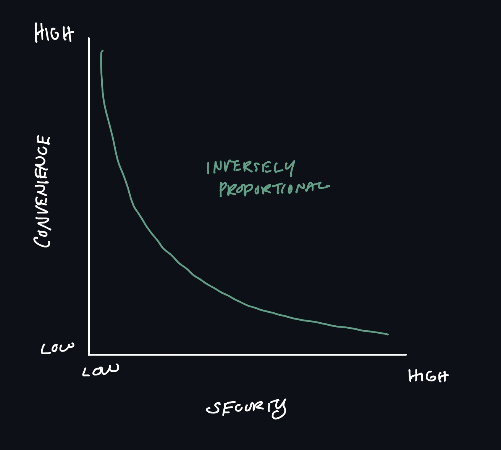

# Module 1: Introdution to Information Security

- The workforce that managed information security in an enterprise is usually divided into two broad catagories. Information security **managerial personnel** administer and manage plans, policies, and people, while information security technical personnel are concerned with designing, configuring, installing, and maintaining technical, security equipment. Within these two catagories are four generally recognized types of security positions:
    - **Chief information security officer (CISO)**. This person reports directly to the CIO. This person is responsible for assessing, managing, and implementing security. 
    - **Security manager**. The security manager reports to the CISO and supervises technicians, administrators, and security staff. Typically, a security manager wrks on tasks identified by the CISO and resolves issues identified by technicians. This position requires an understanding of configuration and operation but not necessarily technical mastery.
    - **Security administrator**. The security administer has both technical knowledge and managerial skills. A security administrator manages daily operations of security technology and may analyze and design security solutions within a specific entity as well as identify users' needs. 
    - **Security technician**. This is generally an entry-level position for a person who has the necessary technical skills. Technicians provide technical support to configure security hardware, implement security software, and diagnose and troubleshoot problems. 

# What is Information Security? 

## Understanding Security
- The **goal** of security is "the state of being free from danger". It is also defined as the "measures taken to ensure safety," which is the **process** of security. Since complete security can never be fully achieved, the focus of security is more often on the process instead of the goal. In this light, security can be defined as "the necessary steps to protect from harm."
- The relationship between security and convenience is **inversely proportional**, as security is increase, convenience is decreased. 

### Figure 1-1: Relationship of security to convenience.

## Principles of Security 

### Confidentiality, Integrity, and Availability (CIA)
- **Confidentiality**. It is important that only approved individuals can access sensitive information. For example, the credit card number used to make an online purchase must be kept secure and not made available to other parties. *Confidentiality* ensures that only authorized parties can view the information. Providing confidentiality can involve several different security tools, ranging from software to encrypt the credit card number stored on the web server to door locks to prevent access to those servers. 
- **Integrity**. *Integrity* ensures that the information is correct and no authorized person or malicious software has altered the data. In the example of the online purchse, an attacker who could change the amount of a purchase from $10,000.00 to $1.00 would violate the integrity of the information. 
- **Availability**. Information has value if the authorized parties who are assured of its integrity can access the information. *Availability* ensures that data is accessible to only authorized users and not to unapproved individuals. In this example, the total umber of items ordered as the result of an online purchase must be available to an employee in a warehouse so that the correct items can be shipped to the customer but not made available to a competitor. 

### Authentication, Authorization, and Accounting (AAA)
- The second basic security principle, *authentication, authorization, and accounting (AAA)*, involves controlling access to information. 
- [Based on scenario given] Checking the delivery person's credentials to be sure that they are authentic and not fabricated is *authentication*. Computer users, likewise, must have their credentials authenticated to ensure that they are who they claim to be. This is often done by entering a password, fingerprint scan, or other type of approved credentials. 
- *Authorization*, granting permission to take an action, is the next step... once users have presented their identification and been authenticated, they can log in to a computer system. 
- [Gabe] signing into the tablet is akin to *accounting*. Accounting creates a record that is preserved of who accessed the enterprise network, what recourses they accessed, and when they disconnected from the network. 
    - Accounting data can be used not only to provide an audit trail but also for billing, determining trends, identifying resource usage, and future capacity planning. 
- AAA provides a framework for controlling access to computer resources. The basic steps in this access control process are summarized in Table 1-1.

### Table 1-1: Basic steps in controlling access. 
| Action | Description | Scenario Example | Computer Process |
| --- | --- | --- | --- | 
| Identification | Review of credentials | Delivery person shows employee badge | User enters username |
| Authentication | Validate credentials as genuine | Gabe reads badge to determine it is real | User provides password |
| Authorization | Permission granted for admittance | Gabe opens door to allow delivery person in | User allowed to access only specific data |
| Accounting | Recod of user actions | Gabe signs to confirm he picked up the package | Information recorded in log file |

- A security **control** is a safegaurd (sometimes called a **countermeasure**) that is employed within an enterprise to protect the CIA of information. A control attempts to limit the exposure of an asset to a danger. The four broad categories of controls are listed in Table 1-2.

### Table 1-2: Categories of controls 
| Control Category | Description | Example |
| --- | --- | --- |
| **Managerial** | Controls that use administrative methods | Acceptable use policy that specifies users should not visit mmalicious websites |
| **Operational** | Controls implemented and executed by people | Conducting workshops to help train users to identify and delete suspicious mesages |
| **Technical** | Controls incorporated as part of hardware, software, or firmware | Hardware that blocks malicious content from entering the network |
| **Physical** | Controls that implement security in a defined structure and location | Installing a fence to prevent an unauthorized person from entering a building |

- Specific types of controls are found within these four broad catagories: 
    - **Deterrent Controls**. A *deterrent control* attempts to discourage security violations before they occur.
    - **Preventive Controls**. A *preventive control* works to prevent the threat from coming in contact with the vulnerability.
    - **Detective Controls**. A *detective control*  identifies any threat that has reached the system. 
    - **Compensating Controls**. A *compensating control* provides an alternative to normal controls that for some reason cannot be used. 
    - **Corrective Controls**. A *corrective control* mitigates or lessens the damage caused by the incident. 
    - **Directive Controls**. A *directive control* ensures that  aparticular outcome is achieved. 
        - One type of directive control is **incentive**, which is the "carrot" instead of the "stick". 

### Table 1-3: Control types
| Control Type | Description | When it Occurs | Example |
| --- | --- | --- | --- |
| Deterrent Control | Discourage attack | Before attack | Signs indicating that the area is under video surveillance |
| Preventive Control | Prevent attack | Before attack | Security awareness training for all users |
| Directive Control | Prevent attack | Before attack | An incentive to employees who pass a training course |
| Detective Control | Identify attack | During attack | Installing motion detection sensors |
| Compensating Control | Alternative to normal control | During attack | An infected computer is isolated on a different network |
| Corrective Control | Lessen damage from attack | After attack | A virus is cleaned from an infected server |

## Cybersecurity versus Information Security 

- Different terms are sometimes used when describing securiyt protections in an enterprise: **information security**, **computer security**, **IT security**, **cybersecurity**, and **information assurance**, just to name a few. 
- Cybersecurity usually involes a range of practices, processes, and technologies intended to protect devices, networks, and programs that process and store data in an electronic form. 
- Information security, on the other hand, protects "processed data" (information) that is essential in an enterprise business environment (more so than "raw data"). In addition, in a business, this information may be in any format, from electronic files to paper documents. Because business enterprises most often deal with information and that information is in a variety of formats, *information security* is often considered the most appropriate term in this setting. 
- Note: although there is no universal agreement on these definitions, generally speaking, *cybersecurity* is considered an overall umbrella term under which information security is found. 

## Defining Information Security 

- Information security describes the tasks of securing enterprise information often found in a digital format, whether it be manipulated by a microprocessor, preserved on a storage device, or transmitted over a network.
- Yet information security cannot completely prevent successful attacks or gaurante that a system is totally secure. 
- The goal of information security is to ensure that protective measures are propyl implemented to ward off attacks, prevent the total collapse of the system when a successful attack does occur, and recover as quickly as possible. 
- Thus, information security is, first and foremost, "protection".

- As shown in Figure 1-2, information and hardware, software, and communications are protected in three layers: **products**, **people**, and **policies and procedures**. The processed enable people to understand how to use products to protect information.

- Thus, information security may be defined as *that which protects the integrity, confidentiality, and availability of information through products, people, and procedures on the devices that store, manipulate, and trasmit the information*.

# Threat Actors and Their Motivations 

- In information security a **threat actor** (also called a **malicious actor**) is a term used to describe individuals or entities who are responsible for attacks. 
- Financial gain is the primary focus today; this financial cybercrime can be divided in the following three categories based on different targets:
    - **Individual Users**. Threat actors steal and use stolen data, credit card numbers, online financial account information, or SSNs to profit from its victims. 
    - **Enterprises**. Threat actors attempt to steal research on a new product from an enterprise so that they can sell it to an unscrupulous foreign supplier who will then build an imitation model of the product to sell worldwide. This deprives the legitimate business of profits after investing often hundreds of millions of dollars in product development and, because these foreign suppliers are in a diLEZHIN] Point Character Drawing Set & Secret Character Drawing [Taco]fferent country, they are beyond the reach of domestic enforcement agencies and courts. 
    - **Governments**. If the latest information on a nwe missile defense system can be stolen, it can be sold-at a high price-to that government's enemies. In addition, government information is often stolen and published to embarrass the government before its citizens and force it to stop what is considered a nefarious action. 

Note: In the past, **hacker** referred to a person who used advanced computer skills to attack computers. Yet this term was not always accurate, so it was then qualified in an attempt to distinguish between different types of hackers. For example, a **white hat hacker**, also known as an **ethical hacker**, would probe a system for weaknesses and then provide that information back to the organization. 

## Unskilled Attackers

- High technical skills and knowledge are not a prerequesite to attack a system. Instead, easy-to-use attack tools are freely available or can be purchased at a low cost to perform sophisticated attacks. Individuals who want to perform attacks yet lack the technical knowledge to carry them out are sometimes called **unskilled attackers**. 
- Note: In the early days of information security, the term "script kiddies" was used to describe unskilled attackers since they downloaded freely available automated attack software called scripts to perform malicious attacks. 
- Unskilled attackers can often be successful in penetrating defenses, particularly if the defenses are weak. Their motivation is usually **data exfiltration** (unauthorized copying of data) or **service disruption** (obstructing normal business electronic processes). 

## Shadow IT 

- The process of bypassing coporate approval for technology purchases is known as **shadow IT**. The employee's motivation is often **ethical** (has sound moral principles) but nevertheless weakens security.

## Organized Crime 

- **Organized crime** is a close-knit group of highly centralized enterprises set up for the purpose of engaging in illegal activities... In recent years, evidence indicates that organized crime has moved into cyberattacks, which they consider to be less risky and more rewarding than traditional crimes. The motivation by organized crime is generally **financial gain**. 

## Insider Threats 

- Another serious threat to an enterprise actually comes from its own employees, contractors, and business partners, called **insiders**, who pose an **insider threat** from the position of a trusted entity. 
- Motivations can be **revenge** or avenge by retaliation. Blackmail may also be used against insiders as a threat if they don't cooperate by stealing research and development data.
- Attacks from an insider treat are hard to recognize because the threat actor is already trusted to use the computer system and because they coem from within the enterprise, whos focus is watching for outsiders. 

## Hacktivists 

- A group that is strongly motivated by **philosophical/policital beliefs** (ideology for the sake of principles) is **hacktivists** (a combination of the words hack and activism). 
- Attacks are often used to "make a stateent", and some other attacks were retaliatory.
- Today many hacktivists work through disinformation campaigns by spreading fake news and supporting conspiracy theories, making their motivation **disruption/chaos**.

## Nation-State Actors 

- Instead of using an army to march across the battlefield to strike an adversary, governments are increasingly employing their own state-sponsered attackers for launching cyberattacks against their foes. These are knwon as **nation-state actors**. 
- The motivation is **espionage** (spying) or even to create war. 
- Many security researchers believe that nation-state actors might be the deadliest of any threat actor. Nation-state actors keep working until they are successful, unlike other hackers that will move onto different targets. Nation-State Actors are highly skilled and have enough government resources to breach almost any security defense.
- Nation-State actors are often involved in multiyear instrusion campaigns targeting highly sensitive economic, proprietary, or national security information. This has created a new class of attacks called **Advanced Persistent Threats (APTs)**. These attacks use innovative attack tools (**advanced**) and once a system is infected, it silently extracts data over an extended period of time (**persistent**). APTs are most commonly associated with nation-state actors. 

## Other Threat Actors 

| Threat Actor | Description | Explanation |
| --- | --- | --- |
| Competitors | Launch attack against an opponent's system to steal classified information. | Competitors may steal new product research or a list of current customers to gain a competitive advantage. |
| Brokers | Sell their knowledge of a weakness to other attackers or governments. | Individuals who uncover weaknesses do not report them to the software vendor but instead sell them to the highest bidder, who are willing to pay a high price for the unknown weakness. |
| Cyberterrorists | Attack a nation's network and computer infrastructure to cause disruption and panic among citizens. | Targets may include a small group of computers or networks that can affect the largest number of users, such as the computers that control the electrical power grid of a state or region. |

# How Attacks Occur 

## Threat Vectors and Attack Surfaces 

- An **attack surface**, also called a **threat vector**, is a digital plaatform that threat actors target for their exploits. These can be divided into mainstream attack surfaces and specialized threat vectors. 

### Mainstream Attack Surfaces 

- Some attack surfaces can be considered **mainstream** for several reasons. First, they have been the primary targets of threat actors since the beginning of cyberattacks. Second, these attack surfaces are found in all technology settings. Third, they continue to bear the brunt of attacks today. 
- The categories of mainstream attack surfaces are software, hardware, and networks. 

### Table 1-5

| Category | Attack Surface | Explanation |
| --- | --- | --- |
| Software | Vulnerable software | Vulnerable software contains one or more security vulnerabilities; this software can either be **client-based software** (software applications installed on a computer connected to a network) or **agentless software** (no additional processes are required to run in the background). |
| Software | File-based | Many attacks focus on infecting individual files on a compuoter. |
| Software | Image-based | An image is a copy of all the computer's contents, and a vulnerability would permit an attack on the image. |
| Hardware | Unsupported systems and applications | Computer systems and applications no longer supported by the organization are often ignored and do not recieve security updates. |
| Hardware | Removable devices | A removable media device, like a USB flash drive, can be connected to an unsecure computer and become infected with malware and, when inserted into a "clean" computer, it can infect that device. |
| Network | Unsecure networks | Unsecure wired and wireless networks are a vulnerability since an attacker who can breach the network could have access to hundreds of connected devices. 
| Network | Open service ports | Unnecessary ports that are disabled can allow attackers access to devices and networks. |
| Network | Default credentials | Networks may have default (preselected options) administrator accounts with a well-known password that attackers could target. |

