# Module 10: Basic Router Configuration 

# 10.1 Configure Initial Router Settings

## 10.1.1 Basic ROuter Configuration Steps 

The following tasks should be completed when configuring initial settings on a router.

1. Configure the device name.
```
Router(config)# hostname hostname
```

2. Secure privileged EXEC mode.
```
Router(config)# enable secret password
```

3. Secure user EXEC mode.
```
Router(config)# line console 0
Router(config-line)# password password
Router(config-line)# login
```
4. Secure remote Telnet / SSH access.
```
Router(config-line)# line vty 0 4
Router(config-line)# password password
Router(config-line)# login
Router(config-line)# transport input { ssh | telnet}
```
5. Secure all passwords in the config file.
```
Router(config-line)# exit
Router(config)# service password-encryption
```
6. Provide legal notification.
```
Router(config)# banner motd delimiter message delimiter
```
7. Save the configuration.
```
Router(config)# end
Router# copy running-config startup-config
```

## 10.1.2 Basic Router Configuration Example

In this example, router R1 in the topology diagram will be configured with initial settings.

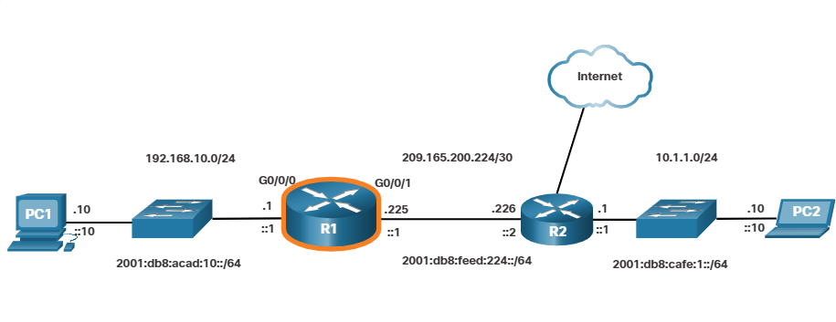

To configure the device name for R1, use the following commands.

```
Router> enable
Router# configure terminal
Enter configuration commands, one per line.
End with CNTL/Z.
Router(config)# hostname R1
R1(config)#
```

Note: Notice how the router prompt now displays the router hostname.

All router access should be secured. Privileged EXEC mode provides the user with complete access to the device and its configuration. Therefore, it is the most important mode to secure.

The following commands secure privileged EXEC mode and user EXEC mode, enable Telnet and SSH remote access, and encrypt all plaintext (i.e., user EXEC and VTY line) passwords.

```
R1(config)# enable secret class
R1(config)#
R1(config)# line console 0
R1(config-line)# password cisco
R1(config-line)# login
R1(config-line)# exit
R1(config)#
R1(config)# line vty 0 4
R1(config-line)# password cisco
R1(config-line)# login
R1(config-line)# transport input ssh telnet
R1(config-line)# exit
R1(config)#
R1(config)# service password-encryption
R1(config)#
```

The legal notification warns users that the device should only be accessed by permitted users. Legal notification is configured as follows.

```
R1(config)# banner motd #
Enter TEXT message. End with a new line and the #
****************************************
WARNING: Unauthorized access is prohibited!
****************************************
#
R1(config)#
```

If the previous commands were configured and the router accidently lost power, all configured commands would be lost. For this reason, it is important to save the configuration when changes are implemented. The following command saves the configuration to NVRAM.

```
R1# copy running-config startup-config
Destination filename [startup-config]?
Building configuration...
[OK]
R1#
```

## 10.2.1 Configure Router Interfaces

At this point, your routers have their basic configurations. The next step is to configure their interfaces. This is because routers are not reachable by end devices until the interfaces are configured. There are many different types of interfaces available on Cisco routers. For example, the Cisco ISR 4321 router is equipped with two Gigabit Ethernet interfaces:

- GigabitEthernet 0/0/0 (G0/0/0)
- GigabitEthernet 0/0/1 (G0/0/1)

The task to configure a router interface is very similar to a management SVI on a switch. Specifically, it includes issuing the following commands:

```
Router(config)# interface type-and-number
Router(config-if)# description description-text
Router(config-if)# ip address ipv4-address subnet-mask
Router(config-if)# ipv6 address ipv6-address/prefix-length
Router(config-if)# no shutdown
```

**Note:** When a router interface is enabled, information messages should be displayed confirming the enabled link.

Although the `description` command is not required to enable an interface, it is good practice to use it. It can be helpful in troubleshooting on production networks by providing information about the type of network connected. For example, if the interface connects to an ISP or service carrier, the `description` command would be helpful to enter the third-party connection and contact information.

**Note:** The `description-text` is limited to 240 characters.

Using the `no shutdown` command activates the interface and is similar to powering on the interface. The interface must also be connected to another device, such as a switch or a router, for the physical layer to be active.

**Note:** On inter-router connections where there is no Ethernet switch, both interconnecting interfaces must be configured and enabled.

## 10.2.2 Configure Router Interfaces Example

In this example, the directly connected interfaces of R1 in the topology diagram will be enabled.

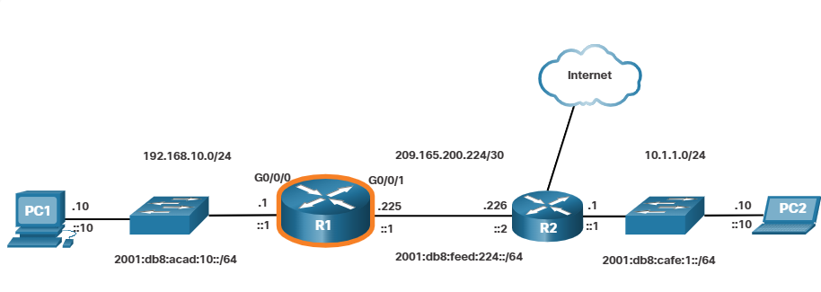

To configure the the interfaces on R1, use the following commands.

```
R1> enable
R1# configure terminal
Enter configuration commands, one per line.
End with CNTL/Z.
R1(config)# interface gigabitEthernet 0/0/0
R1(config-if)# description Link to LAN
R1(config-if)# ip address 192.168.10.1 255.255.255.0
R1(config-if)# ipv6 address 2001:db8:acad:10::1/64
R1(config-if)# no shutdown
R1(config-if)# exit
R1(config)#
*Aug 1 01:43:53.435: %LINK-3-UPDOWN: Interface GigabitEthernet0/0/0, changed state to down
*Aug 1 01:43:56.447: %LINK-3-UPDOWN: Interface GigabitEthernet0/0/0, changed state to up
*Aug 1 01:43:57.447: %LINEPROTO-5-UPDOWN: Line protocol on Interface GigabitEthernet0/0/0, changed state to up
R1(config)#
R1(config)#
R1(config)# interface gigabitEthernet 0/0/1
R1(config-if)# description Link to R2
R1(config-if)# ip address 209.165.200.225 255.255.255.252
R1(config-if)# ipv6 address 2001:db8:feed:224::1/64
R1(config-if)# no shutdown
R1(config-if)# exit
R1(config)#
*Aug 1 01:46:29.170: %LINK-3-UPDOWN: Interface GigabitEthernet0/0/1, changed state to down
*Aug 1 01:46:32.171: %LINK-3-UPDOWN: Interface GigabitEthernet0/0/1, changed state to up
*Aug 1 01:46:33.171: %LINEPROTO-5-UPDOWN: Line protocol on Interface GigabitEthernet0/0/1, changed state to up
R1(config)#
```

Note: Notice the informational messages informing us that G0/0/0 and G0/0/1 are enabled.

# 10.2.3 Verify Interface Configuration

There are several commands that can be used to verify interface configuration. The most useful of these is the show ip interface brief
and show ipv6 interface brief commands, as shown in the example.

```
R1# show ip interface brief
Interface               IP-Address      OK?     Method  Status                  Protocol
GigabitEthernet0/0/0    192.168.10.1    YES     manual  up                      up
GigabitEthernet0/0/1    209.165.200.225 YES     manual  up                      up
Vlan1                   unassigned      YES     unset   administratively down   down
R1# show ipv6 interface brief
GigabitEthernet0/0/0     [up/up]
    FE80::201:C9FF:FE89:4501
    2001:DB8:ACAD:10::1
GigabitEthernet0/0/1     [up/up]
    FE80::201:C9FF:FE89:4502
    2001:DB8:FEED:224::1
Vlan1    [administratively down/down]
    unassigned
R1#
```

## 10.2.4 Configuration Verification Commands
The table summarizes the more popular show commands used to verify interface configuration.

| Commands | Description |
|---|---|
| show ip interface brief <br> show ipv6 interface brief | The output displays all interfaces, their IP addresses, and their current status. The configured <br> and connected interfaces should display a Status of "up" and Protocol of "up". Anything else <br> would indicate a problem with either the configuration or the cabling. |
| show ip route <br> show ipv6 route | Displays the contents of the IP routing tables stored in RAM. |
| show interfaces | Displays statistics for all interfaces on the device. However, this command will only display the <br> IPv4 addressing information. |
| show ip interface | Displays the IPv4 statistics for all interfaces on a router. |
| show ipv6 interface | Displays the IPv6 statistics for all interfaces on a router. |

### show ip interface brief
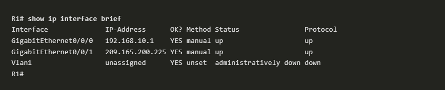

### show ipv6 interface brief
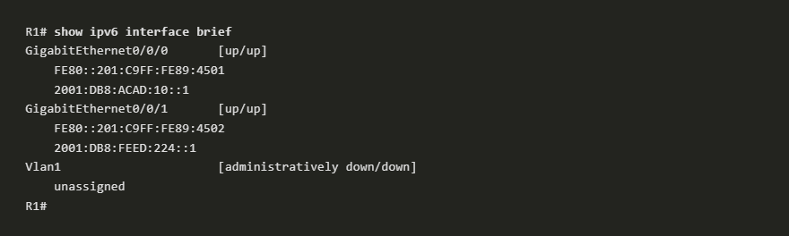

### show ip route
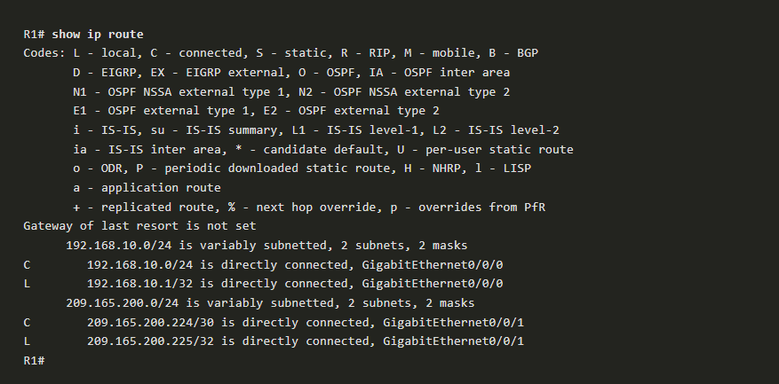

### show ipv6 route 
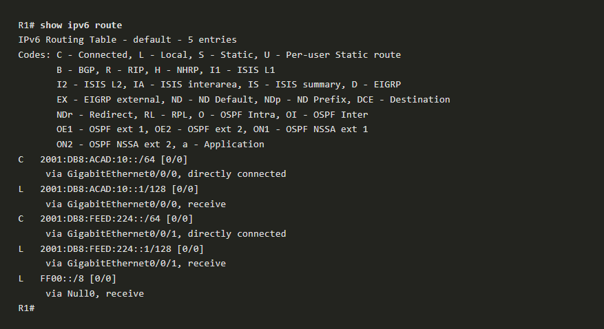

### show interfaces 
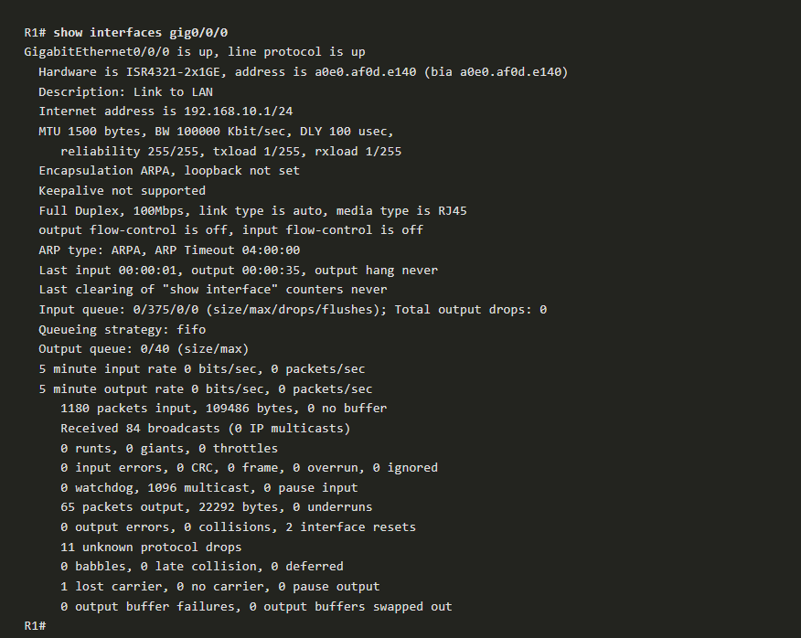

### show ip interface 
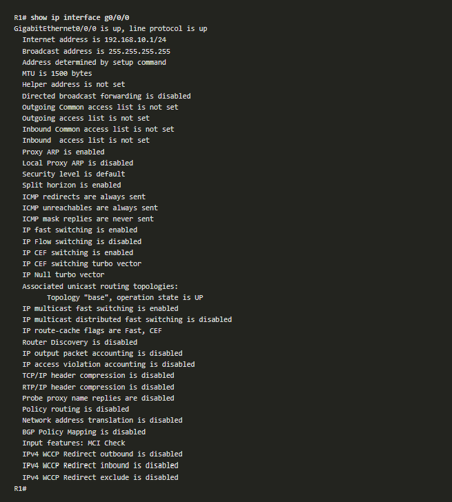

### show ipv6 interface
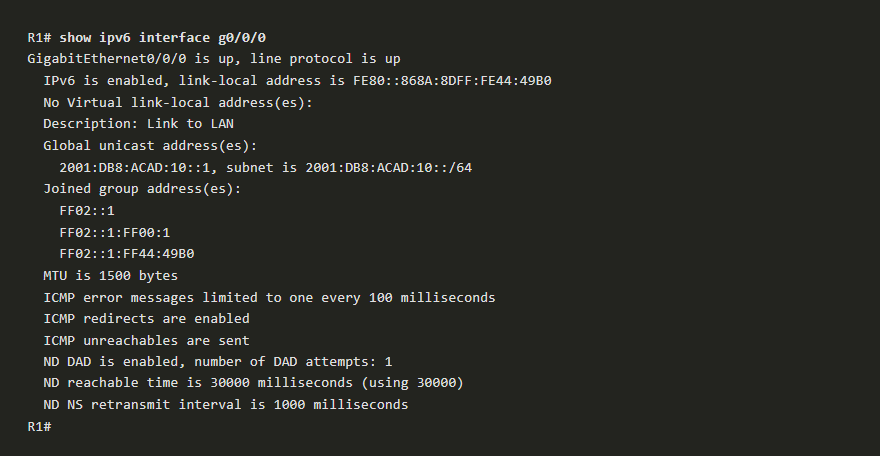

# 10.3 Configure the Default Gateway 

## 10.3.1 Default Gateway on a Host

If your local network has only one router, it will be the gateway router and all hosts and switches on your network must be configured with this information. If your local network has multiple routers, you must select one of them to be the default gateway router. This topic explains how to configure the default gateway on hosts and switches.

For an end device to communicate over the network, it must be configured with the correct IP address information, including the default gateway address. The default gateway is only used when the host wants to send a packet to a device on another network. The default gateway address is generally the router interface address attached to the local network of the host. The IP address of the host device and the router interface address must be in the same network.

For example, assume an IPv4 network topology consisting of a router interconnecting two separate LANs. G0/0/0 is connected to network 192.168.10.0, while G0/0/1 is connected to network 192.168.11.0. Each host device is configured with the appropriate default gateway address.

In this example, if PC1 sends a packet to PC2, then the default gateway is not used. Instead, PC1 addresses the packet with the IPv4 address of PC2 and forwards the packet directly to PC2 through the switch.

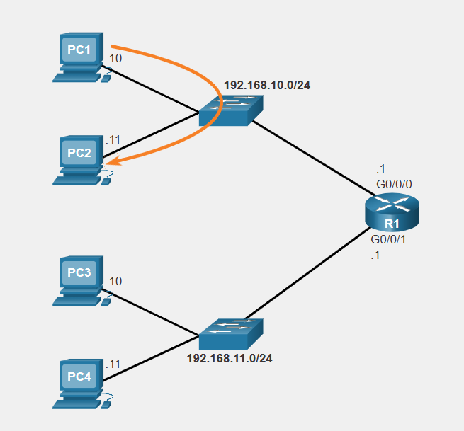

What if PC1 sent a packet to PC3? PC1 would address the packet with the IPv4 address of PC3, but would forward the packet to its default gateway, which is the G0/0/0 interface of R1. The router accepts the packet and accesses its routing table to determine that G0/0/1 is the appropriate exit interface based on the destination address. R1 then forwards the packet out of the appropriate interface to reach PC3.

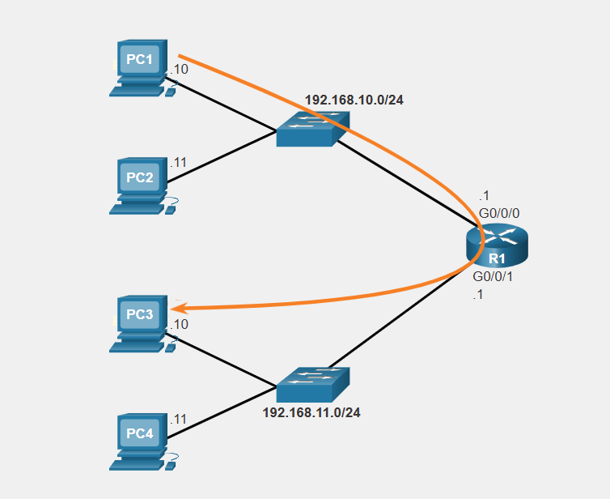

The same process would occur on an IPv6 network, although this is not shown in the topology. Devices would use the IPv6 address of the local router as their default gateway.

## 10.3.2 Default Gateway on a Switch

A switch that interconnects client computers is typically a Layer 2 device. As such, a Layer 2 switch does not require an IP address to function properly. However, an IP configuration can be configured on a switch to give an administrator remote access to the switch.

To connect to and manage a switch over a local IP network, it must have a switch virtual interface (SVI) configured. The SVI is configured with an IPv4 address and subnet mask on the local LAN. The switch must also have a default gateway address configured to remotely manage the switch from another network.

The default gateway address is typically configured on all devices that will communicate beyond their local network.

To configure an IPv4 default gateway on a switch, use the ip default-gateway ip-address global configuration command. The ip-address that is configured is the IPv4 address of the local router interface connected to the switch.

The figure shows an administrator establishing a remote connection to switch S1 on another network.

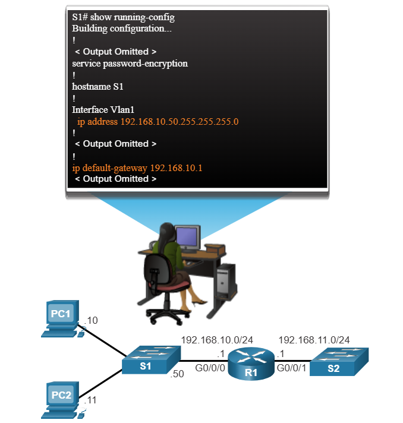

In this example, the administrator host would use its default gateway to send the packet to the G0/0/1 interface of R1. R1 would forward the packet to S1 out of its G0/0/0 interface. Because the packet source IPv4 address came from another network, S1 would require a default gateway to forward the packet to the G0/0/0 interface of R1. Therefore, S1 must be configured with a default gateway to be able to reply and establish an SSH connection with the administrative host.

**Note:** Packets originating from host computers connected to the switch must already have the default gateway address configured on their host computer operating systems.

A workgroup switch can also be configured with an IPv6 address on an SVI. However, the switch does not require the IPv6 address of the default gateway to be configured manually. The switch will automatically receive its default gateway from the ICMPv6 Router Advertisement message from the router.


