# Module 11: IPv4 Addressing

# 11.1 Ipv4 Address Structure

## 11.1.1 Network and Host Portions

An IPv4 address is a 32-bit hierarchical address that is made up of a network portion and a host portion. When determining the network portion versus the host portion, you must look at the 32-bit stream, as shown in the figure.

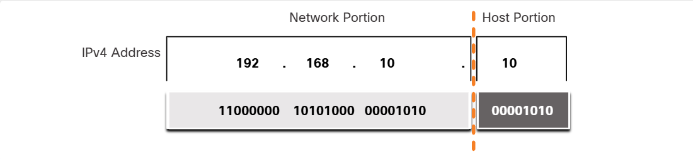

The bits within the network portion of the address must be identical for all devices that reside in the same network. The bits within the host portion of the address must be unique to identify a specific host within a network. If two hosts have the same bit-pattern in the specified network portion of the 32-bit stream, those two hosts will reside in the same network.

But how do hosts know which portion of the 32-bits identifies the network and which identifies the host? That is the role of the subnet mask.

## 11.1.2 The Subnet Mask

As shown in the figure, assigning an IPv4 address to a host requires the following:
-   **IPv4 address** - This is the unique IPv4 address of the host.
-   **Subnet mask**- This is used to identify the network/host portion of the IPv4 address.

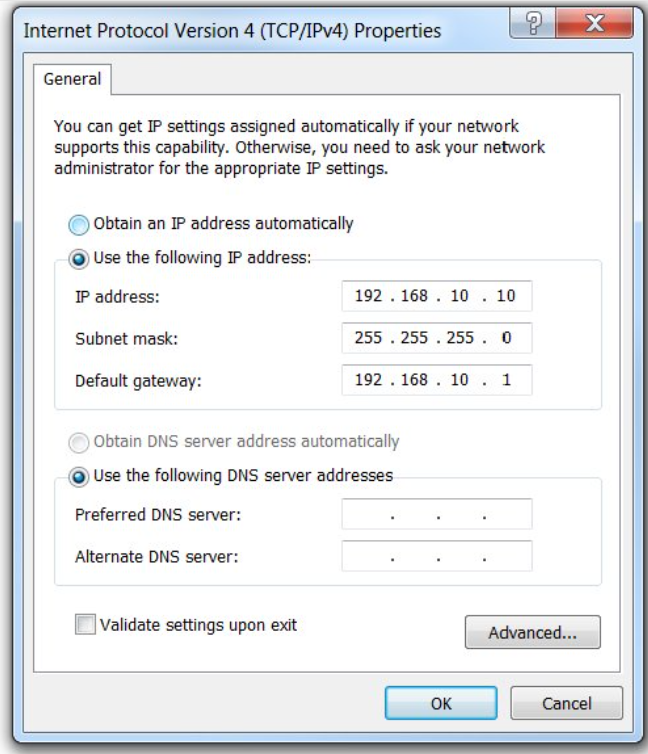

Note: A default gateway IPv4 address is required to reach remote networks and DNS server IPv4 addresses are required to translate domain names to IPv4 addresses. The IPv4 subnet mask is used to differentiate the network portion from the host portion of an IPv4 address. When an IPv4 address is assigned to a device, the subnet mask is used to determine the network address of the device. The network address represents all the devices on the same network.

The next figure displays the 32-bit subnet mask in dotted decimal and binary formats.

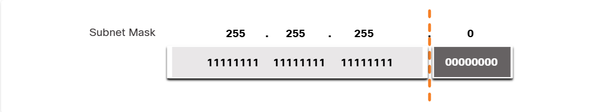

Notice how the subnet mask is a consecutive sequence of 1 bits followed by a consecutive sequence of 0 bits.

To identify the network and host portions of an IPv4 address, the subnet mask is compared to the IPv4 address bit for bit, from left to right as shown in the figure.

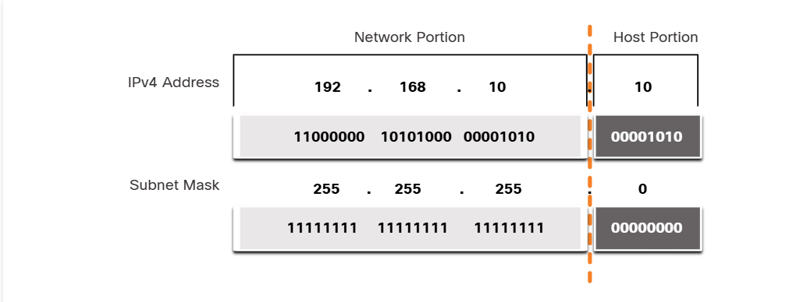

Note that the subnet mask does not actually contain the network or host portion of an IPv4 address, it just tells the computer where to look for the part of the IPv4 address that is the network portion and which part is the host portion.

The actual process used to identify the network portion and host portion is called ANDing.

## 11.1.3 The Prefix Length

Expressing network addresses and host addresses with the dotted decimal subnet mask address can become cumbersome. Fortunately, there is an alternative method of identifying a subnet mask, a method called the prefix length.

The prefix length is the number of bits set to 1 in the subnet mask. It is written in "slash notation", which is noted by a forward slash (/) followed by the number of bits set to 1. Therefore, count the number of bits in the subnet mask and prepend it with a slash.

Refer to the table for examples. The first column lists various subnet masks that can be used with a host address. The second column displays the converted 32-bit binary address. The last column displays the resulting prefix length.

### Comparing the Subnet Mask and Prefix Length

| Subnet Mask | 32-bit Address | Prefix Length |
|---|---|---|
| 255.0.0.0 | 11111111.00000000.00000000.00000000 | /8 |
| 255.255.0.0 | 11111111.11111111.00000000.00000000 | /16 |
| 255.255.255.0 | 11111111.11111111.11111111.00000000 | /24 |
| 255.255.255.128 | 11111111.11111111.11111111.10000000 | /25 |
| 255.255.255.192 | 11111111.11111111.11111111.11000000 | /26 |
| 255.255.255.224 | 11111111.11111111.11111111.11100000 | /27 |
| 255.255.255.240 | 11111111.11111111.11111111.11110000 | /28 |
| 255.255.255.248 | 11111111.11111111.11111111.11111000 | /29 |
| 255.255.255.252 | 11111111.11111111.11111111.11111100 | /30 |

Note: A network address is also referred to as a prefix or network prefix. Therefore, the prefix length is the number of 1 bits in the subnet mask.

When representing an IPv4 address using a prefix length, the IPv4 address is written followed by the prefix length with no spaces. For example, 192.168.10.10 255.255.255.0 would be written as 192.168.10.10/24. Using various types of prefix lengths will be discussed later. For now, the focus will be on the /24 (i.e. 255.255.255.0) prefix

## 11.1.4 Determining the Network - Logical AND

A logical AND is one of three Boolean operations used in Boolean or digital logic. The other two are OR and NOT. The AND operation is used in determining the network address.

Logical AND is the comparison of two bits that produce the results shown below. Note how only a 1 AND 1 produces a 1. Any other combination results in a 0.
- 1 AND 1 = 1
- 0 AND 1 = 0
- 1 AND 0 = 0
- 0 AND 0 = 0

Note: In digital logic, 1 represents True and 0 represents False. When using an AND operation, both input values must be True (1) for the result to be True (1).

To identify the network address of an IPv4 host, the IPv4 address is logically ANDed, bit by bit, with the subnet mask. ANDing between the address and the subnet mask yields the network address.

To illustrate how AND is used to discover a network address, consider a host with IPv4 address 192.168.10.10 and subnet mask of 255.255.255.0, as shown in the figure:
- IPv4 host address (192.168.10.10) - The IPv4 address of the host in dotted decimal and binary formats.
- Subnet mask (255.255.255.0) - The subnet mask of the host in dotted decimal and binary formats.
- Network address (192.168.10.0) - The logical AND operation between the IPv4 address and subnet mask results in an IPv4 network address shown in dotted decimal and binary formats.

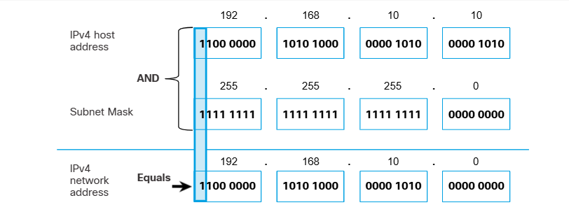

Using the first sequence of bits as an example, notice the AND operation is performed on the 1-bit of the host address with the 1-bit of the subnet mask. This results in a 1 bit for the network address. 1 AND 1 = 1.

The AND operation between an IPv4 host address and subnet mask results in the IPv4 network address for this host. In this example, the AND operation between the host address of 192.168.10.10 and the subnet mask 255.255.255.0 (/24), results in the IPv4 network address of 192.168.10.0/24. This is an important IPv4 operation, as it tells the host what network it belongs to.

## 11.1.6 Network, Host, and Broadcast Addresses

Within each network are three types of IP addresses:

- Network address
- Host addresses
- Broadcast address

Using the topology in the figure, these three types of addresses will be examined.

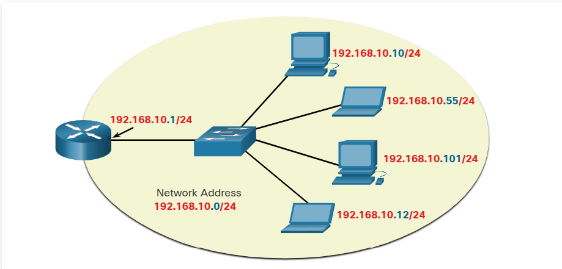

### Network address
A network address is an address that represents a specific network. A device belongs to this network if it meets three criteria:
- It has the same subnet mask as the network address.
- It has the same network bits as the network address, as indicated by the subnet mask.
- It is located on the same broadcast domain as other hosts with the same network address.

A host determines its network address by performing an AND operation between its IPv4 address and its subnet mask. As shown in the table, the network address has all 0 bits in the host portion, as determined by the subnet mask. In this example, the network address is 192.168.10.0/24. A network address cannot be assigned to a device.

### Network, Host, and Broadcast Addresses

|  | Network Portion | Host Portion | Host Bits |
|---|---|---|---|
| Subnet mask 255.255.255.0 or /24 | 255<br>11111111 255<br>11111111 255<br>11111111 | 0<br>00000000 |  |
| Network address 192.168.10.0 or /24 | 192<br>11000000 168<br>10101000 10<br>00001010 | 0<br>00000000 | All 0s |
| First address 192.168.10.1 or /24 | 192<br>11000000 168<br>10101000 10<br>00001010 | 1<br>00000001 | All 0s and a 1 |
| Last address 192.168.10.254 or /24 | 192<br>11000000 168<br>10101000 10<br>00001010 | 254<br>11111110 | All 1s and a 0 |
| Broadcast address 192.168.10.255 or /24 | 192<br>11000000 168<br>10101000 10<br>00001010 | 255<br>11111111 | All 1s |

### Host addresses

Host addresses are addresses that can be assigned to a device such as a host computer, laptop, smart phone, web camera, printer, router, etc. The host portion of the address is the bits indicated by 0 bits in the subnet mask. Host addresses can have any combination of bits in the host portion except for all 0 bits (this would be a network address) or all 1 bits (this would be a broadcast address).

All devices within the same network, must have the same subnet mask and the same network bits. Only the host bits will differ and must be unique.

Notice that in the table, there is a first and last host address:
- First host address - This first host within a network has all 0 bits with the last (right-most) bit as a 1 bit. In this example it is 192.168.10.1/24.
- Last host address - This last host within a network has all 1 bits with the last (right-most) bit as a 0 bit. In this example it is 192.168.10.254/24.

Any addresses between and including, 192.168.10.1/24 through 192.168.10.254/24 can be assigned to a device on the network.

### Broadcast address

A broadcast address is an address that is used when it is required to reach all devices on the IPv4 network. As shown in the table, the network broadcast address has all 1 bits in the host portion, as determined by the subnet mask. In this example, the network address is 192.168.10.255/24. A broadcast address cannot be assigned to a device.

# 11.2 IPv4 Unicast, Broadcast, and Multicast

## 11.2.1 Unicast

In the previous topic you learned about the structure of an IPv4 address; each has a network portion and a host portion. There are different ways to send a packet from a source device, and these different transmissions affect the destination IPv4 addresses.

Unicast transmission refers to one device sending a message to one other device in one-to-one communications.

A unicast packet has a destination IP address that is a unicast address which goes to a single recipient. A source IP address can only be a unicast address, because the packet can only originate from a single source. This is regardless of whether the destination IP address is a unicast, broadcast or multicast.

Note: In this course, all communication between devices is unicast unless otherwise noted. IPv4 unicast host addresses are in the address range of 1.0.0.1 to 223.255.255.255. However, within this range are many addresses that are reserved for special purposes. These special purpose addresses will be discussed later in this module.

## 11.2.2 Broadcast

Broadcast transmission refers to a device sending a message to all the devices on a network in one-to-all communications.

A broadcast packet has a destination IP address with all ones (1s) in the host portion, or 32 one (1) bits.

**Note:** IPv4 uses broadcast packets. However, there are no broadcast packets with IPv6.

A broadcast packet must be processed by all devices in the same broadcast domain. A broadcast domain identifies all hosts on the same network segment. A broadcast may be directed or limited. A directed broadcast is sent to all hosts on a specific network. For example, a host on the 172.16.4.0/24 network sends a packet to 172.16.4.255. A limited broadcast is sent to 255.255.255.255. By default, routers do not forward broadcasts.

Broadcast packets use resources on the network and make every receiving host on the network process the packet. Therefore, broadcast traffic should be limited so that it does not adversely affect the performance of the network or devices. Because routers separate broadcast domains, subdividing networks can improve network performance by eliminating excessive broadcast traffic.

## IP Directed Broadcasts

In addition to the 255.255.255.255 broadcast address, there is a broadcast IPv4 address for each network. Called a directed broadcast, this address uses the highest address in the network, which is the address where all the host bits are 1s. For example, the directed broadcast address for 192.168.1.0/24 is 192.168.1.255. This address allows communication to all the hosts in that network. To send data to all the hosts in a network, a host can send a single packet that is addressed to the broadcast address of the network.

A device that is not directly connected to the destination network forwards an IP directed broadcast in the same way it would forward unicast IP packets destined to a host on that network. When a directed broadcast packet reaches a router that is directly connected to the destination network, that packet is broadcast on the destination network.

Note: Because of security concerns and prior abuse from malicious users, directed broadcasts are turned off by default starting with Cisco IOS Release 12.0 with the global configuration command no ip directed-broadcasts.

## 11.2.3 Multicast

Multicast transmission reduces traffic by allowing a host to send a single packet to a selected set of hosts that subscribe to a multicast group.

A multicast packet is a packet with a destination IP address that is a multicast address. IPv4 has reserved the 224.0.0.0 to 239.255.255.255 addresses as a multicast range.

Hosts that receive particular multicast packets are called multicast clients. The multicast clients use services requested by a client program to subscribe to the multicast group.

Each multicast group is represented by a single IPv4 multicast destination address. When an IPv4 host subscribes to a multicast group, the host processes packets addressed to this multicast address, and packets addressed to its uniquely allocated unicast address.

Routing protocols such as OSPF use multicast transmissions. For example, routers enabled with OSPF communicate with each other using the reserved OSPF multicast address 224.0.0.5. Only devices enabled with OSPF will process these packets with 224.0.0.5 as the destination IPv4 address. All other devices will ignore these packets.

# 11.3 Types of IPv4 Address

## 11.3.1 Public and Private IPv4 Addresses

Just as there are different ways to transmit an IPv4 packet, there are also different types of IPv4 addresses. Some IPv4 addresses cannot be used to go out to the internet, and others are specifically allocated for routing to the internet. Some are used to verify a connection and others are self-assigned. As a network administrator, you will eventually become very familiar with the types of IPv4 addresses, but for now, you should at least know what they are and when to use them.

Public IPv4 addresses are addresses which are globally routed between internet service provider (ISP) routers. However, not all available IPv4 addresses can be used on the internet. There are blocks of addresses called private addresses that are used by most organizations to assign IPv4 addresses to internal hosts.

In the mid-1990s, with the introduction of the World Wide Web (WWW), private IPv4 addresses were introduced because of the depletion of IPv4 address space. Private IPv4 addresses are not unique and can be used internally within any network.

**Note:** The long-term solution to IPv4 address depletion was IPv6.

### The Private Address Blocks

| Network Address and Prefix | RFC 1918 Private Address Range |
|---|---|
| 10.0.0.0/8 | 10.0.0.0 - 10.255.255.255 |
| 172.16.0.0/12 | 172.16.0.0 - 172.31.255.255 |
| 192.168.0.0/16 | 192.168.0.0 - 192.168.255.255 |

Note: Private addresses are defined in RFC 1918 and sometimes referred to as RFC 1918 address space.

### 11.3.2 Routing to the Internet

Most internal networks, from large enterprises to home networks, use private IPv4 addresses for addressing all internal devices (intranet) including hosts and routers. However, private addresses are not globally routable.

In the figure, customer networks 1, 2, and 3 are sending packets outside their internal networks. These packets have a source IPv4 address that is a private address and a destination IPv4 address that is public (globally routable). Packets with a private address must be filtered (discarded) or translated to a public address before forwarding the packet to an ISP.

### Private IPv4 Addresses and Network Address Translation (NAT)

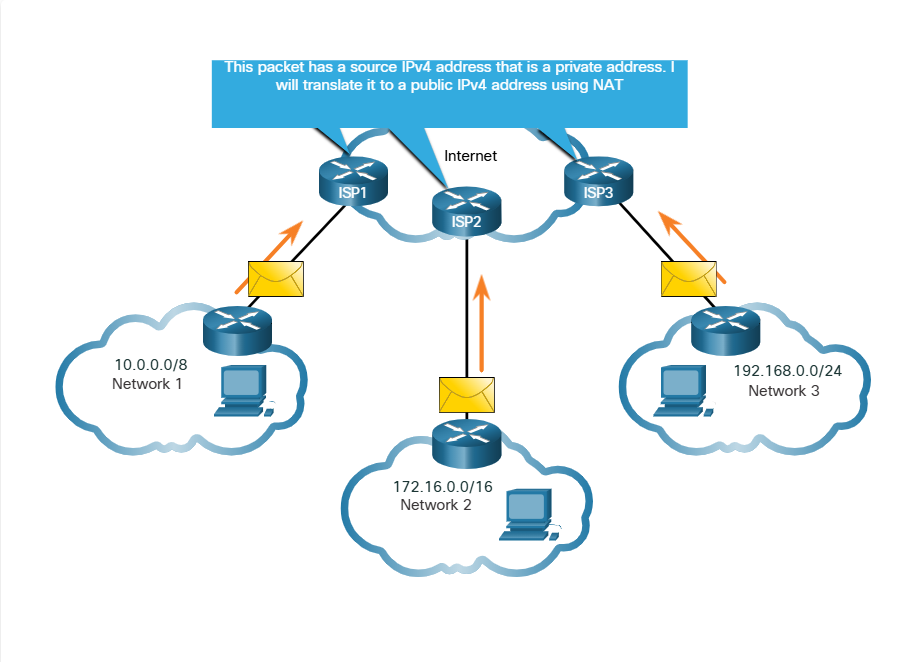

Before the ISP can forward this packet, it must translate the source IPv4 address, which is a private address, to a public IPv4 address using Network Address Translation (NAT). NAT is used to translate between private IPv4 and public IPv4 addresses. This is usually done on the router that connects the internal network to the ISP network. Private IPv4 addresses in the organization's intranet will be translated to public IPv4 addresses before routing to the internet.

Note: Although, a device with a private IPv4 address is not directly accessible from another device across the internet, the IETF does not consider private IPv4 addresses or NAT as effective security measures.

Organizations that have resources available to the internet, such as a web server, will also have devices that have public IPv4 addresses. As shown in the figure, this part of the network is known as the DMZ (demilitarized zone). The router in the figure not only performs routing, it also performs NAT and acts as a firewall for security.

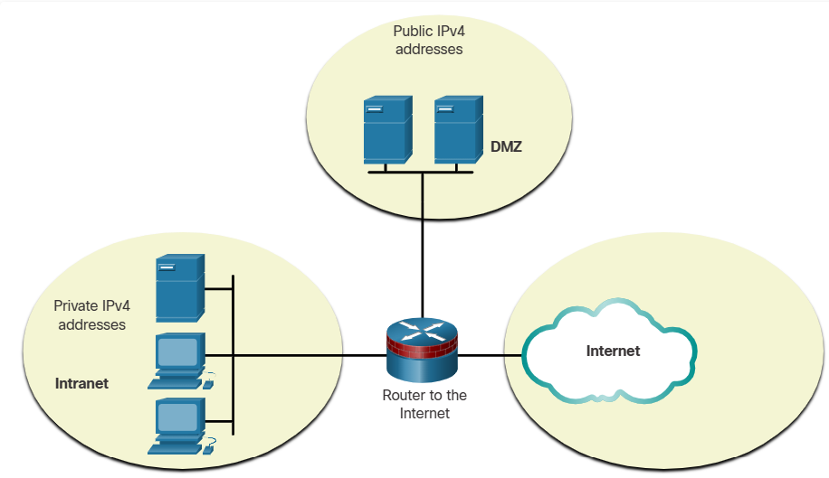

Note: Private IPv4 addresses are commonly used for educational purposes instead of using a public IPv4 address that most likely belongs to an organization.

## 11.3.4 Special Use IPv4 Addresses

There are certain addresses, such as the network address and broadcast address, that cannot be assigned to hosts. There are also special addresses that can be assigned to hosts, but with restrictions on how those hosts can interact within the network.

### Loopback addresses
Loopback addresses (127.0.0.0 /8 or 127.0.0.1 to 127.255.255.254) are more commonly identified as only 127.0.0.1, these are special addresses used by a host to direct traffic to itself. For example, it can be used on a host to test if the TCP/IP configuration is operational, as shown in the figure. Notice how the 127.0.0.1 loopback address replies to the ping command. Also note how any address within this block will loop back to the local host, which is shown with the second ping in the figure.

### Pinging the Loopback Interface
```
C:\Users\NetAcad> ping 127.0.0.1
Pinging 127.0.0.1 with 32 bytes of data:
Reply from 127.0.0.1: bytes=32 time<1ms TTL=128
Reply from 127.0.0.1: bytes=32 time<1ms TTL=128
Reply from 127.0.0.1: bytes=32 time<1ms TTL=128
Reply from 127.0.0.1: bytes=32 time<1ms TTL=128
Ping statistics for 127.0.0.1:
Packets: Sent = 4, Received = 4, Lost = 0 (0% loss),
Approximate round trip times in milli-seconds:
Minimum = 0ms, Maximum = 0ms, Average = 0ms
C:\Users\NetAcad> ping 127.1.1.1
Pinging 127.1.1.1 with 32 bytes of data:
Reply from 127.1.1.1: bytes=32 time<1ms TTL=128
Reply from 127.1.1.1: bytes=32 time<1ms TTL=128
Reply from 127.1.1.1: bytes=32 time<1ms TTL=128
Reply from 127.1.1.1: bytes=32 time<1ms TTL=128
Ping statistics for 127.1.1.1:
Packets: Sent = 4, Received = 4, Lost = 0 (0% loss),
Approximate round trip times in milli-seconds:
Minimum = 0ms, Maximum = 0ms, Average = 0ms
C:\Users\NetAcad>
```

### Link-Local addresses

Link-local addresses (169.254.0.0 /16 or 169.254.0.1 to 169.254.255.254) are more commonly known as the Automatic Private IP Addressing (APIPA) addresses or self-assigned addresses. They are used by a Windows DHCP client to self-configure in the event that there are no DHCP servers available. Link-local addresses can be used in a peer-to-peer connection but are not commonly used for this purpose.

## 11.3.5 Legacy Classful Addressing

In 1981, IPv4 addresses were assigned using classful addressing as defined in RFC 790 (https://tools.ietf.org/html/rfc790), Assigned Numbers. Customers were allocated a network address based on one of three classes, A, B, or C. The RFC divided the unicast ranges into specific classes as follows:
- Class A (0.0.0.0/8 to 127.0.0.0/8) - Designed to support extremely large networks with more than 16 million host addresses. Class A used a fixed /8 prefix with the first octet to indicate the network address and the remaining three octets for host addresses (more than 16 million host addresses per network).
- Class B (128.0.0.0/16 - 191.255.0.0/16) - Designed to support the needs of moderate to large size networks with up to approximately 65,000 host addresses. Class B used a fixed /16 prefix with the two high-order octets to indicate the network address and the remaining two octets for host addresses (more than 65,000 host addresses per network).
- Class C (192.0.0.0/24 - 223.255.255.0/24) - Designed to support small networks with a maximum of 254 hosts. Class C used a fixed /24 prefix with the first three octets to indicate the network and the remaining octet for the host addresses (only 254 host addresses per network).

Note: There is also a Class D multicast block consisting of 224.0.0.0 to 239.0.0.0 and a Class E experimental address block consisting of 240.0.0.0 - 255.0.0.0.

At the time, with a limited number of computers using the internet, classful addressing was an effective means to allocate addresses. As shown in the figure, Class A and B networks have a very large number of host addresses and Class C has very few. Class A networks accounted for 50% of the IPv4 networks. This caused most of the available IPv4 addresses to go unused.

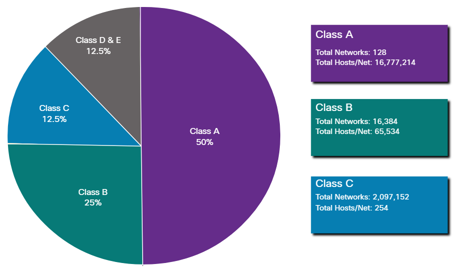

In the mid-1990s, with the introduction of the World Wide Web (WWW), classful addressing was deprecated to more efficiently allocate the limited IPv4 address space. Classful address allocation was replaced with classless addressing, which is used today. Classless addressing ignores the rules of classes (A, B, C). Public IPv4 network addresses (network addresses and subnet masks) are allocated based on the number of addresses that can be justified.

## 11.3.6 Assignment of IP Addresses

Public IPv4 addresses are addresses which are globally routed over the internet. Public IPv4 addresses must be unique.

Both IPv4 and IPv6 addresses are managed by the Internet Assigned Numbers Authority (IANA). The IANA manages and allocates blocks of IP addresses to the Regional Internet Registries (RIRs). The five RIRs are shown in the figure.

RIRs are responsible for allocating IP addresses to ISPs who provide IPv4 address blocks to organizations and smaller ISPs. Organizations can also get their addresses directly from an RIR (subject to the policies of that RIR).

### Regional Internet Registries

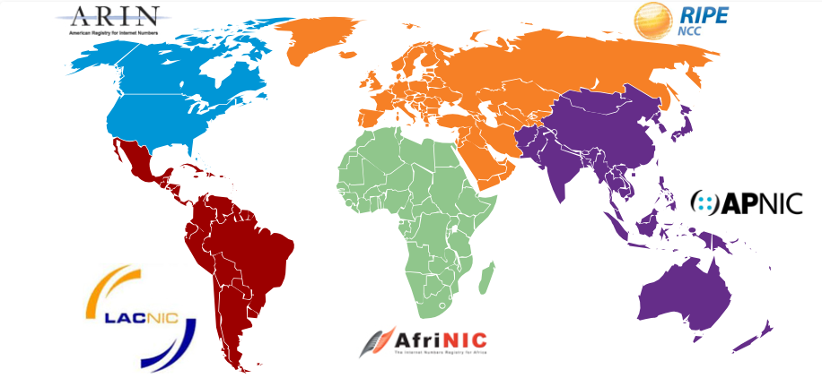

- AfriNIC (African Network Information Centre) - Africa Region
- APNIC (Asia Pacific Network Information Centre) - Asia/Pacific Region
- ARIN (American Registry for Internet Numbers) - North America Region
- LACNIC (Regional Latin-American and Caribbean IP Address Registry) - Latin America and some Caribbean Islands
- RIPE NCC (Réseaux IP Européens Network Coordination Centre) - Europe, the Middle East, and Central Asia

# 11.4 Network Segmentation 

## 11.4.1 Broadcast Domains and Segmentation

Have you ever received an email that was addressed to every person at your work or school? This was a broadcast email. Hopefully, it contained information that each of you needed to know. But often a broadcast is not really pertinent to everyone in the mailing list. Sometimes, only a segment of the population needs to read that information.

In an Ethernet LAN, devices use broadcasts and the Address Resolution Protocol (ARP) to locate other devices.. ARP sends Layer 2 broadcasts to a known IPv4 address on the local network to discover the associated MAC address. Devices on Ethernet LANs also locate other devices using services. A host typically acquires its IPv4 address configuration using the Dynamic Host Configuration Protocol (DHCP) which sends broadcasts on the local network to locate a DHCP server.

Switches propagate broadcasts out all interfaces except the interface on which it was received. For example, if a switch in the figure were to receive a broadcast, it would forward it to the other switches and other users connected in the network.

### Routers Segement Broadcast Domains
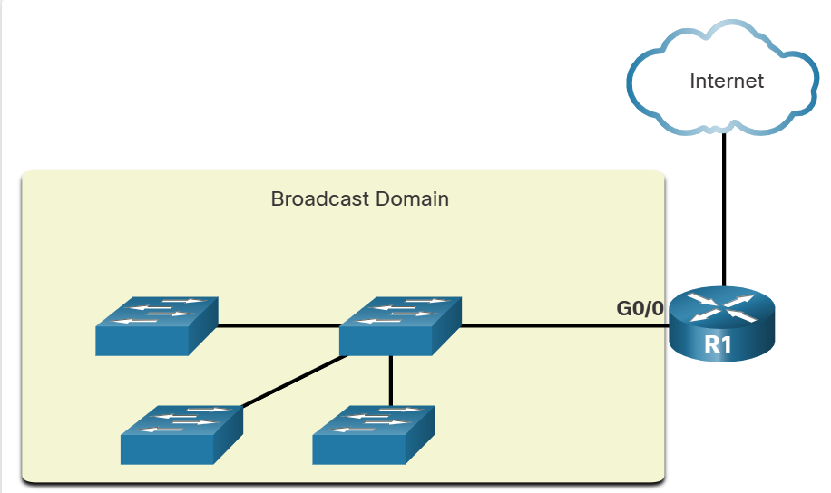

Routers do not propagate broadcasts. When a router receives a broadcast, it does not forward it out other interfaces. For instance, when R1 receives a broadcast on its Gigabit Ethernet 0/0 interface, it does not forward out another interface.

Therefore, each router interface connects to a broadcast domain and broadcasts are only propagated within that specific broadcast domain.

## 11.4.2 Problems with Large Broadcast Domains

A large broadcast domain is a network that connects many hosts. A problem with a large broadcast domain is that these hosts can generate excessive broadcasts and negatively affect the network. In the figure, LAN 1 connects 400 users that could generate an excess amount of broadcast traffic. This results in slow network operations due to the significant amount of traffic it can cause, and slow device operations because a device must accept and process each broadcast packet.

### A Large Broadcast Domain
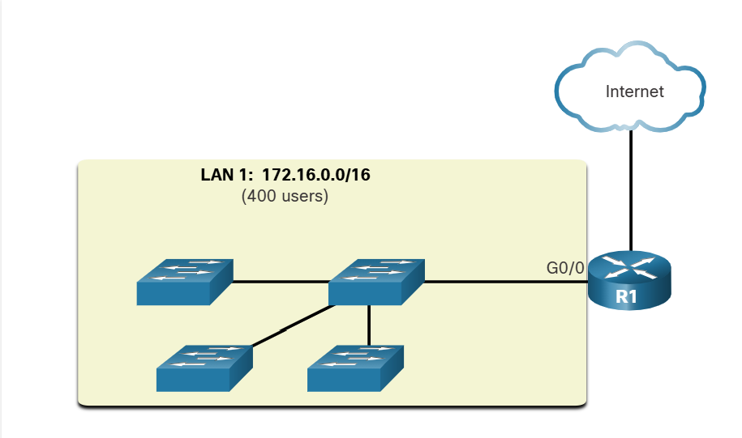

The solution is to reduce the size of the network to create smaller broadcast domains in a process called subnetting. These smaller network spaces are called subnets.

In the figure, the 400 users in LAN 1 with network address 172.16.0.0/16 have been divided into two subnets of 200 users each: 172.16.0.0/24 and 172.16.1.0/24. Broadcasts are only propagated within the smaller broadcast domains. Therefore, a broadcast in LAN 1 would not propagate to LAN 2.

### Communicating Between Networks

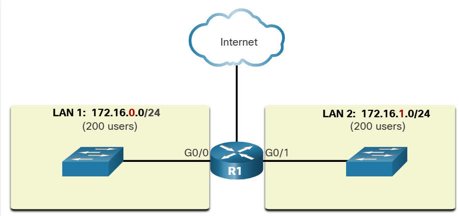

Notice how the prefix length has changed from a single /16 network to two /24 networks. This is the basis of subnetting: using host bits to create additional subnets.

**Note:** The terms subnet and network are often used interchangeably. Most networks are a subnet of some larger address block.

## 11.4.3 Reasons for Segmenting Networks

Subnetting reduces overall network traffic and improves network performance. It also enables an administrator to implement security policies such as which subnets are allowed or not allowed to communicate together. Another reason is that it reduces the number of devices affected by abnormal broadcast traffic due to misconfigurations, hardware/software problems, or malicious intent.

There are various ways of using subnets to help manage network devices.

### Location 

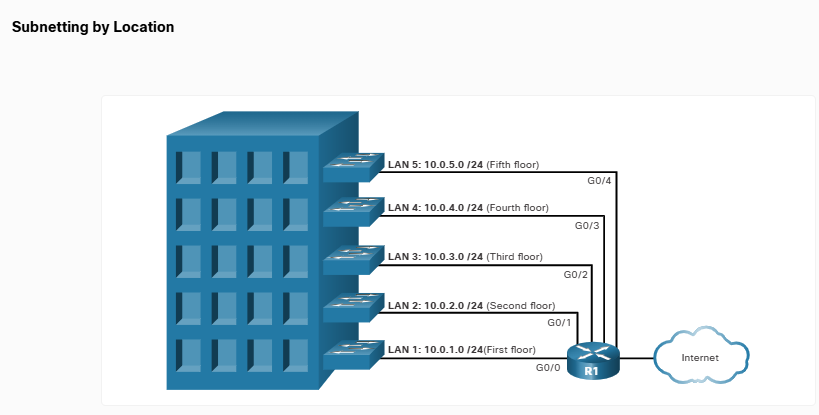

### Group or Function

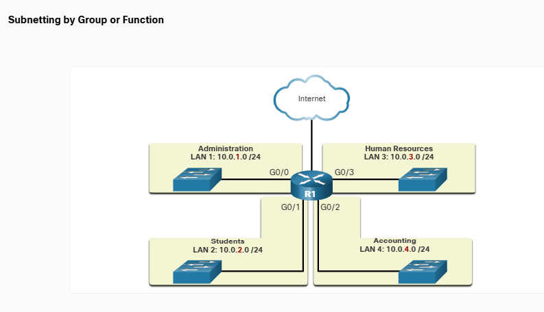

### Device Type 

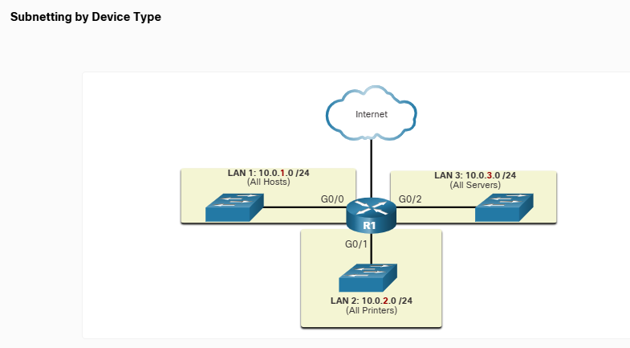

Network administrators can create subnets using any other division that makes sense for the network. Notice in each figure, the subnets use longer prefix lengths to identify networks.

Understanding how to subnet networks is a fundamental skill that all network administrators must develop. Various methods have been created to help understand this process. Although a little overwhelming at first, pay close attention to the detail and, with practice, subnetting will become easier.

# 11.5 Subnet an IPv4 Network 

## 11.5.1 Subnet on an Octet Boundary

In the previous topic you learned several good reasons for segmenting a network. You also learned that segmenting a network is called subnetting. Subnetting is a critical skill to have when administering an IPv4 network. It is a bit daunting at first, but it gets much easier with practice.

IPv4 subnets are created by using one or more of the host bits as network bits. This is done by extending the subnet mask to borrow some of the bits from the host portion of the address to create additional network bits. The more host bits that are borrowed, the more subnets that can be defined. The more bits that are borrowed to increase the number of subnets reduces the number of hosts per subnet.

Networks are most easily subnetted at the octet boundary of /8, /16, and /24. The table identifies these prefix lengths. Notice that using longer prefix lengths decreases the number of hosts per subnet.

### Subnet Masks on Octet Boundaries

| Prefix Length | Subnet Mask | Subnet Mask in Binary (n = network, h = host) | # of hosts |
| :------------ | :---------- | :-------------------------------------------- | :--------- |
| /8            | 255.0.0.0   | nnnnnnnn.hhhhhhhh.hhhhhhhh.hhhhhhhh<br>11111111.00000000.00000000.00000000 | 16,777,214 |
| /16           | 255.255.0.0 | nnnnnnnn.nnnnnnnn.hhhhhhhh.hhhhhhhh<br>11111111.11111111.00000000.00000000 | 65,534     |
| /24           | 255.255.255.0 | nnnnnnnn.nnnnnnnn.nnnnnnnn.hhhhhhhh<br>11111111.11111111.11111111.00000000 | 254        |

To understand how subnetting on the octet boundary can be useful, consider the following example. Assume an enterprise has chosen the private address 10.0.0.0/8 as its internal network address. That network address can connect 16,777,214 hosts in one broadcast domain. Obviously, having more than 16 million hosts on a single subnet is not ideal.

The enterprise could further subnet the 10.0.0.0/8 address at the octet boundary of /16 as shown in the table. This would provide the enterprise the ability to define up to 256 subnets (i.e., 10.0.0.0/16 - 10.255.0.0/16) with each subnet capable of connecting 65,534 hosts. Notice how the first two octets identify the network portion of the address whereas the last two octets are for host IP addresses.

### Subnetting Network 10.0.0.0/8 using a /16

| Subnet Address (256 Possible Subnets) | Host Range (65,534 possible hosts per subnet) | Broadcast |
|---|---|---|
| 10.0.0.0/16 | 10.0.0.1 - 10.0.255.254 | 10.0.255.255 |
| 10.1.0.0/16 | 10.1.0.1 - 10.1.255.254 | 10.1.255.255 |
| 10.2.0.0/16 | 10.2.0.1 - 10.2.255.254 | 10.2.255.255 |
| 10.3.0.0/16 | 10.3.0.1 - 10.3.255.254 | 10.3.255.255 |
| 10.4.0.0/16 | 10.4.0.1 - 10.4.255.254 | 10.4.255.255 |
| 10.5.0.0/16 | 10.5.0.1 - 10.5.255.254 | 10.5.255.255 |
| 10.6.0.0/16 | 10.6.0.1 - 10.6.255.254 | 10.6.255.255 |
| 10.7.0.0/16 | 10.7.0.1 - 10.7.255.254 | 10.7.255.255 |
| ... | ... | ... |
| 10.255.0.0/16 | 10.255.0.1 - 10.255.255.254 | 10.255.255.255 |

Alternatively, the enterprise could choose to subnet the 10.0.0.0/8 network at the /24 octet boundary, as shown in the table. This would enable the enterprise to define 65,536 subnets each capable of connecting 254 hosts. The /24 boundary is very popular in subnetting because it accommodates a reasonable number of hosts and conveniently subnets at the octet boundary.

### Subnetting Network 10.0.0.0/8 using a /24 Prefix

| Subnet Address (65,536 Possible Subnets) | Host Range (254 possible hosts per subnet) | Broadcast |
|---|---|---|
| 10.0.0.0/24 | 10.0.0.1 - 10.0.0.254 | 10.0.0.255 |
| 10.0.1.0/24 | 10.0.1.1 - 10.0.1.254 | 10.0.1.255 |
| 10.0.2.0/24 | 10.0.2.1 - 10.0.2.254 | 10.0.2.255 |
| ... | ... | ... |
| 10.0.255.0/24 | 10.0.255.1 - 10.0.255.254 | 10.0.255.255 |
| 10.1.0.0/24 | 10.1.0.1 - 10.1.0.254 | 10.1.0.255 |
| 10.1.1.0/24 | 10.1.1.1 - 10.1.1.254 | 10.1.1.255 |
| 10.1.2.0/24 | 10.1.2.1 - 10.1.2.254 | 10.1.2.255 |
| ... | ... | ... |
| 10.100.0.0/24 | 10.100.0.1 - 10.100.0.254 | 10.100.0.255 |
| ... | ... | ... |
| 10.255.255.0/24 | 10.255.255.1 - 10.2255.255.254 | 10.255.255.255 |

## 11.5.2 Subnet within an Octet Boundary

The examples shown thus far borrowed host bits from the common /8, /16, and /24 network prefixes. However, subnets can borrow bits from any host bit position to create other masks.

For instance, a /24 network address is commonly subnetted using longer prefix lengths by borrowing bits from the fourth octet. This provides the administrator with additional flexibility when assigning network addresses to a smaller number of end devices. Refer to the table to see six ways to subnet a /24 network.

### Subnet a /24 Network

| Prefix Length | Subnet Mask | Subnet Mask in Binary (n = network, h = host) | # of subnets | # of hosts |
|---|---|---|---|---|
| /25 | 255.255.255.128 | nnnnnnnn.nnnnnnnn.nnnnnnnn.nhhhhhhh<br>11111111.11111111.11111111.10000000 | 2 | 126 |
| /26 | 255.255.255.192 | nnnnnnnn.nnnnnnnn.nnnnnnnn.nnhhhhhh<br>11111111.11111111.11111111.11000000 | 4 | 62 |
| /27 | 255.255.255.224 | nnnnnnnn.nnnnnnnn.nnnnnnnn.nnnhhhhh<br>11111111.11111111.11111111.11100000 | 8 | 30 |
| /28 | 255.255.255.240 | nnnnnnnn.nnnnnnnn.nnnnnnnn.nnnnhhhh<br>11111111.11111111.11111111.11110000 | 16 | 14 |
| /29 | 255.255.255.248 | nnnnnnnn.nnnnnnnn.nnnnnnnn.nnnnnhhh<br>11111111.11111111.11111111.11111000 | 32 | 6 |
| /30 | 255.255.255.252 | nnnnnnnn.nnnnnnnn.nnnnnnnn.nnnnnnhh<br>11111111.11111111.11111111.11111100 | 64 | 2 |

For each bit borrowed in the fourth octet, the number of subnetworks available is doubled, while reducing the number of host addresses per subnet:
- /25 row - Borrowing 1 bit from the fourth octet creates 2 subnets supporting 126 hosts each.
- /26 row - Borrowing 2 bits creates 4 subnets supporting 62 hosts each.
- /27 row - Borrowing 3 bits creates 8 subnets supporting 30 hosts each.
- /28 row - Borrowing 4 bits creates 16 subnets supporting 14 hosts each.
- /29 row - Borrowing 5 bits creates 32 subnets supporting 6 hosts each.
- /30 row - Borrowing 6 bits creates 64 subnets supporting 2 hosts each.

## 11.5.3 - 11.5.4 The Subnet Mask, Subnet with the Magic Number 

# 11.6 Subnet a Slash 16 and a Slash 8 Prefix 

## 11.6.1 Create Subnets with a Slash 16 prefix

Some subnetting is easier than other subnetting. This topic explains how to create subnets that each have the same number of hosts.

In a situation requiring a larger number of subnets, an IPv4 network is required that has more hosts bits available to borrow. For example, the network address 172.16.0.0 has a default mask of 255.255.0.0, or /16. This address has 16 bits in the network portion and 16 bits in the host portion. The 16 bits in the host portion are available to borrow for creating subnets. The table highlights all the possible scenarios for subnetting a /16 prefix.

### Subnet a /16 Network

| Prefix Length | Subnet Mask | Network Address (n = network, h = host) | # of subnets | # of hosts |
|---|---|---|---|---|
| /17 | 255.255.128.0 | .nnnnnnn.nnnnnn.ahhhhhhhhhhhhhhh<br>11111111.11111111.10000000.00000000 | 2 | 32766 |
| /18 | 255.255.192.0 | .nnnnnnn.nnnnnn.aahhhhhhhhhhhhhh<br>11111111.11111111.11000000.00000000 | 4 | 16382 |
| /19 | 255.255.224.0 | .nnnnnnn.nnnnnn.aaahhhhhhhhhhhhh<br>11111111.11111111.11100000.00000000 | 8 | 8190 |
| /20 | 255.255.240.0 | .nnnnnnn.nnnnnn.aaaahhhhhhhhhhhh<br>11111111.11111111.11110000.00000000 | 10 | 4094 |
| /21 | 255.255.248.0 | .nnnnnnn.nnnnnn.aaaaanhhhhhhhhhh<br>11111111.11111111.11111000.00000000 | 32 | 2046 |
| /22 | 255.255.252.0 | .nnnnnnn.nnnnnn.aaaaaahhhhhhhh<br>11111111.11111111.11111100.00000000 | 64 | 1022 |
| /23 | 255.255.254.0 | .nnnnnnn.nnnnnn.aaaaaaahhhhhh<br>11111111.11111111.11111110.00000000 | 128 | 510 |
| /24 | 255.255.255.0 | .nnnnnnn.nnnnnn.aaaaaaaahhhh<br>11111111.11111111.11111111.00000000 | 256 | 254 |
| /25 | 255.255.255.128 | .nnnnnnn.nnnnnn.aaaaaaaaahhh<br>11111111.11111111.11111111.10000000 | 512 | 126 |
| /26 | 255.255.255.192 | .nnnnnnn.nnnnnn.aaaaaaaaaah<br>11111111.11111111.11111111.11000000 | 1024 | 62 |
| /27 | 255.255.255.224 | .nnnnnnn.nnnnnn.aaaaaaaaaa<br>11111111.11111111.11111111.11100000 | 2048 | 30 |
| /28 | 255.255.255.240 | .nnnnnnn.nnnnnn.aaaaaaaaaaa<br>11111111.11111111.11111111.11110000 | 4096 | 14 |
| /29 | 255.255.255.248 | .nnnnnnn.nnnnnn.aaaaaaaaaaaa<br>11111111.11111111.11111111.11111000 | 8192 | 6 |
| /30 | 255.255.255.252 | .nnnnnnn.nnnnnn.aaaaaaaaaaaaa<br>11111111.11111111.11111111.11111100 | 16384 | 2 |

Although you do not need to memorize this table, you still need a good understanding of how each value in the table is generated. Do not let the size of the table intimidate you. The reason it is big is that it has 8 additional bits that can be borrowed, and, therefore, the numbers of subnets and hosts are simply larger.

## 11.6.2 Create 100 Subnets with a Slash 16 prefix

Consider a large enterprise that requires at least 100 subnets and has chosen the private address 172.16.0.0/16 as its internal network address.

When borrowing bits from a /16 address, start borrowing bits in the third octet, going from left to right. Borrow a single bit at a time until the number of bits necessary to create 100 subnets is reached.

The figure displays the number of subnets that can be created when borrowing bits from the third octet and the fourth octet. Notice there are now up to 14 host bits that can be borrowed.

### Number of Subnets Created 

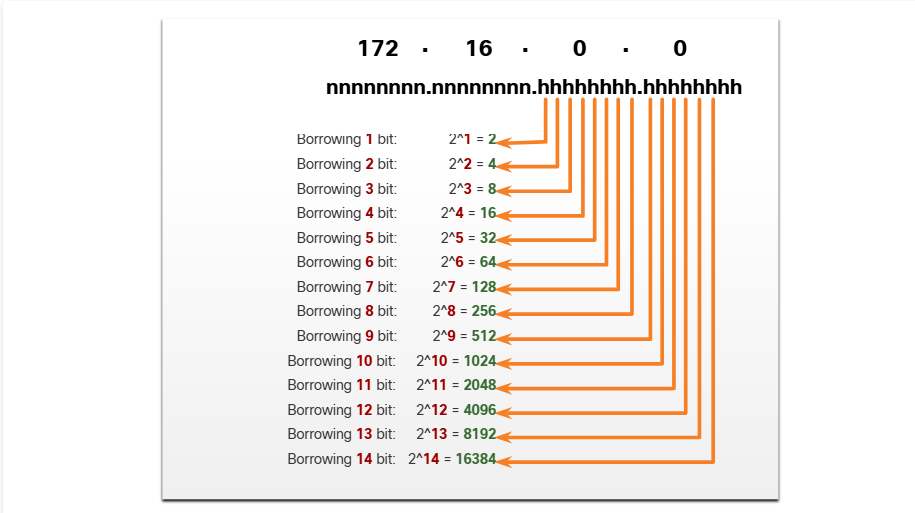 

To satisfy the requirement of 100 subnets for the enterprise, 7 bits (i.e., 2⁷ = 128 subnets) would need to be borrowed (for a total of 128 subnets), as shown in the figure.

### 172.16.0.0/23 Network

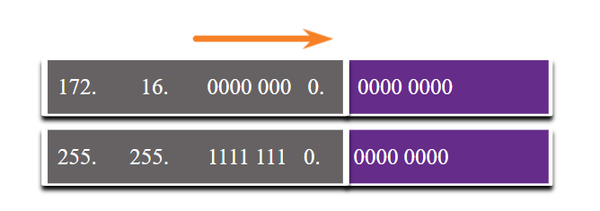

Recall that the subnet mask must change to reflect the borrowed bits. In this example, when 7 bits are borrowed, the mask is extended 7 bits into the third octet. In decimal, the mask is represented as 255.255.254.0, or a /23 prefix, because the third octet is 11111110 in binary and the fourth octet is 00000000 in binary.

The figure displays the resulting subnets from 172.16.0.0 /23 up to 172.16.254.0 /23.

### Resulting /23 Subnets

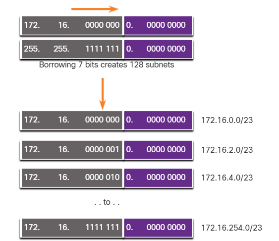

After borrowing 7 bits for the subnet, there is one host bit remaining in the third octet, and 8 host bits remaining in the fourth octet, for a total of 9 bits that were not borrowed. 2⁹ results in 512 total host addresses. The first address is reserved for the network address and the last address is reserved for the broadcast address, so subtracting for these two addresses (2⁹ - 2) equals 510 available host addresses for each /23 subnet.

As shown in the figure, the first host address for the first subnet is 172.16.0.1, and the last host address is 172.16.1.254.

### Address Range for 172.16.0.0/23 Subnet

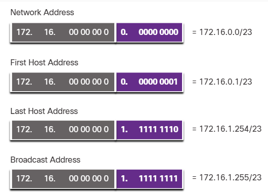

## 11.6.3 Create 1000 Subnets with a Slash 8 prefix

Some organizations, such as small service providers or large enterprises, may need even more subnets. For example, take a small ISP that requires 1000 subnets for its clients. Each client will need plenty of space in the host portion to create its own subnets.

The ISP has a network address 10.0.0.0 255.0.0.0 or 10.0.0.0/8. This means there are 8 bits in the network portion and 24 host bits available to borrow toward subnetting. Therefore, the small ISP will subnet the 10.0.0.0/8 network.

To create subnets, you must borrow bits from the host portion of the IPv4 address of the existing internetwork. Starting from the left to the right with the first available host bit, borrow a single bit at a time until you reach the number of bits necessary to create 1000 subnets.

As shown in the figure, you need to borrow 10 bits to create 1024 subnets (210 = 1024). This includes 8 bits in the second octet and 2 additional bits from the third octet.

### Number of Subnets Created

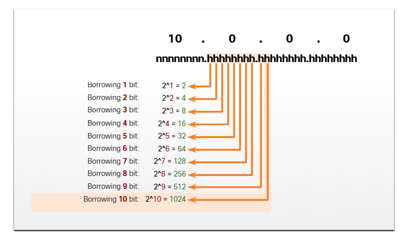

This figure displays the network address and the resulting subnet mask, which converts to 255.255.192.0 or 10.0.0.0/18.

### 10.0.0.0/18 Network

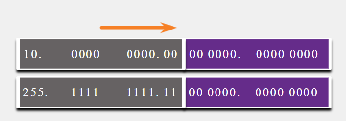

This figure displays the subnets resulting from borrowing 10 bits, creating subnets from 10.0.0.0/18 to 10.255.192.0/18.

### Resulting /18 Subnets

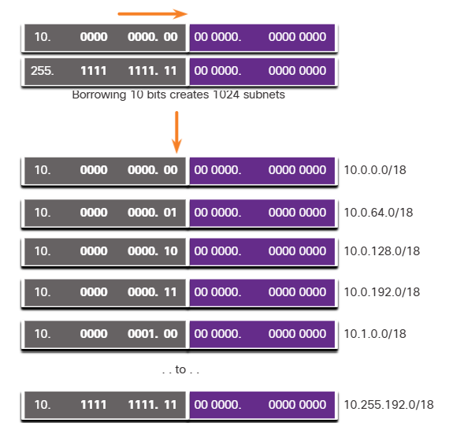

Borrowing 10 bits to create the subnets, leaves 14 host bits for each subnet. Subtracting two hosts per subnet (one for the network address and one for the broadcast address) equates to 2¹⁴ - 2 = 16382 hosts per subnet. This means that each of the 1000 subnets can support up to 16,382 hosts.

This figure displays the specifics of the first subnet.

### Address Range for 10.0.0.0/18 Subnet

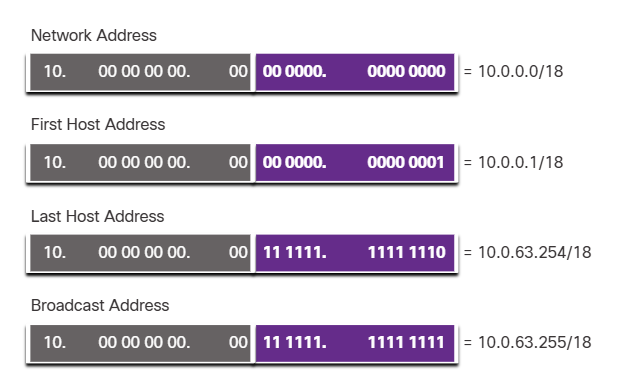

# 11.7 Subnet to Meet Requirements 

## 11.7.1 Subnet Private versus Public IPv4 Address Space

While it is nice to quickly segment a network into subnets, your organization's network may use both public and private IPv4 addresses. This affects how you will subnet your network.

The figure shows a typical enterprise network:
-   **Intranet** - This is the internal part of a company's network, accessible only within the organization. Devices in the intranet use private IPv4 addresses.
-   **DMZ** - This is part of the company's network containing resources available to the internet such as a web server. Devices in the DMZ use public IPv4 addresses.

### Public and Private IPv4 Address Space

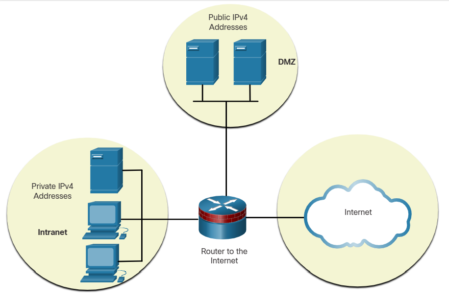

Both the intranet and the DMZ have their own subnetting requirements and challenges. The intranet uses private IPv4 addressing space. This allows an organization to use any of the private IPv4 network addresses including the 10.0.0.0/8 prefix with 24 host bits and over 16 million hosts. Using a network address with 24 host bits makes subnetting easier and more flexible. This includes subnetting on an octet boundary using a /16 or /24.

For example, the private IPv4 network address 10.0.0.0/8 can be subnetted using a /16 mask. As shown in the table, this results in 256 subnets, with 65,534 hosts per subnet. If an organization has a need for fewer than 200 subnets, allowing for some growth, this gives each subnet more than enough host addresses.

### Subnetting Network 10.0.0.0/8 using a /16

| Subnet Address (256 Possible Subnets) | Host Range (65,534 possible hosts per subnet) | Broadcast |
|---|---|---|
| 10.0.0.0/16 | 10.0.0.1 - 10.0.255.254 | 10.0.255.255 |
| 10.1.0.0/16 | 10.1.0.1 - 10.1.255.254 | 10.1.255.255 |
| 10.2.0.0/16 | 10.2.0.1 - 10.2.255.254 | 10.2.255.255 |
| 10.3.0.0/16 | 10.3.0.1 - 10.3.255.254 | 10.3.255.255 |
| 10.4.0.0/16 | 10.4.0.1 - 10.4.255.254 | 10.4.255.255 |
| 10.5.0.0/16 | 10.5.0.1 - 10.5.255.254 | 10.5.255.255 |
| 10.6.0.0/16 | 10.6.0.1 - 10.6.255.254 | 10.6.255.255 |
| 10.7.0.0/16 | 10.7.0.1 - 10.7.255.254 | 10.7.255.255 |
| ... | ... | ... |
| 10.255.0.0/16 | 10.255.0.1 - 10.255.255.254 | 10.255.255.255 |

Another option using the 10.0.0.0/8 private IPv4 network address is to subnet using a /24 mask. As shown in the table, this results in 65,536 subnets, with 254 hosts per subnet. If an organization needs more than 256 subnets, then using a /24 can be used with 254 hosts per subnet.

### Subnetting Network 10.0.0.0/8 using a /24

| Subnet Address (65,536 Possible Subnets) | Host Range (254 possible hosts per subnet) | Broadcast |
|---|---|---|
| 10.0.0.0/24 | 10.0.0.1 - 10.0.0.254 | 10.0.0.255 |
| 10.0.1.0/24 | 10.0.1.1 - 10.0.1.254 | 10.0.1.255 |
| 10.0.2.0/24 | 10.0.2.1 - 10.0.2.254 | 10.0.2.255 |
| ... | ... | ... |
| 10.0.255.0/24 | 10.0.255.1 - 10.0.255.254 | 10.0.255.255 |
| 10.1.0.0/24 | 10.1.0.1 - 10.1.0.254 | 10.1.0.255 |
| 10.1.1.0/24 | 10.1.1.1 - 10.1.1.254 | 10.1.1.255 |
| 10.1.2.0/24 | 10.1.2.1 - 10.1.2.254 | 10.1.2.255 |
| ... | ... | ... |
| 10.100.0.0/24 | 10.100.0.1 - 10.100.0.254 | 10.100.0.255 |
| ... | ... | ... |
| 10.255.255.0/24 | 10.255.255.1 - 10.2255.255.254 | 10.255.255.255 |

The 10.0.0.0/8 can also be subnetted using any other number of prefix lengths, such as /12, /18, /20, etc. This would give the network administrator a wide variety of options. Using a 10.0.0.0/8 private IPv4 network address makes subnet planning and implementation easy.

### What about the DMZ?

Because these devices need to be publicly accessible from the internet, the devices in the DMZ require public IPv4 addresses. The depletion of public IPv4 address space became an issue beginning in the mid-1990s. Since 2011, IANA and four out of five RIRs have run out of IPv4 address space. Although organizations are making the transition to IPv6, the remaining IPv4 address space remains severely limited. This means an organization must maximize its own limited number of public IPv4 addresses. This requires the network administrator to subnet their public address space into subnets with different subnet masks, in order to minimize the number of unused host addresses per subnet. This is known as Variable Subnet Length Masking (VLSM).

## 11.7.2 Minimize Unused Host IPv4 Addresses and Maximize Subnets

To minimize the number of unused host IPv4 addresses and maximize the number of available subnets, there are two considerations when planning subnets: the number of host addresses required for each network and the number of individual subnets needed.

The table displays the specifics for subnetting a /24 network. Notice how there is an inverse relationship between the number of subnets and the number of hosts. The more bits that are borrowed to create subnets, the fewer host bits remain available. If more host addresses are needed, more host bits are required, resulting in fewer subnets.

The number of host addresses required in the largest subnet will determine how many bits must be left in the host portion. Recall that two of the addresses cannot be used, so the usable number of addresses can be calculated as 2n-2.

### Subnetting a /24 Network

| Prefix Length | Subnet Mask | Subnet Mask in Binary (n = network, h = host) | # of subnets | # of hosts per subnet |
|---|---|---|---|---|
| /25 | 255.255.255.128 | nnnnnnnn.nnnnnnnn.nnnnnnnn.nnnhhhhhhh<br>11111111.11111111.11111111.10000000 | 2 | 126 |
| /26 | 255.255.255.192 | nnnnnnnn.nnnnnnnn.nnnnnnnn.nnnhhhhhh<br>11111111.11111111.11111111.11000000 | 4 | 62 |
| /27 | 255.255.255.224 | nnnnnnnn.nnnnnnnn.nnnnnnnn.nnnhhhhh<br>11111111.11111111.11111111.11100000 | 8 | 30 |
| /28 | 255.255.255.240 | nnnnnnnn.nnnnnnnn.nnnnnnnn.nnnhhhh<br>11111111.11111111.11111111.11110000 | 16 | 14 |
| /29 | 255.255.255.248 | nnnnnnnn.nnnnnnnn.nnnnnnnn.nnnhhh<br>11111111.11111111.11111111.11111000 | 32 | 6 |
| /30 | 255.255.255.252 | nnnnnnnn.nnnnnnnn.nnnnnnnn.nnnhh<br>11111111.11111111.11111111.11111100 | 64 | 2 |

Network administrators must devise the network addressing scheme to accommodate the maximum number of hosts for each network and the number of subnets. The addressing scheme should allow for growth in both the number of host addresses per subnet and the total number of subnets.

## 11.7.3 Example – Efficient IPv4 Subnetting

In this example, corporate headquarters has been allocated a public network address of 172.16.0.0/22 (10 host bits) by its ISP. As shown in the figure, this will provide 1,022 host addresses.

Note: 172.16.0.0/22 is part of the IPv4 private address space. We are using this address instead of an actual public IPv4 address.

### Network Address

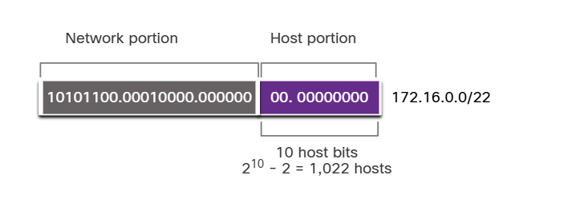

The corporate headquarters has a DMZ and four branch offices, each needing its own public IPv4 address space. Corporate headquarters needs to make best use of its limited IPv4 address space.

The topology shown in the figure consists of five sites; a corporate office and four branch sites. Each site requires internet connectivity and therefore, five internet connections. This means that the organization requires 10 subnets from the company's 172.16.0.0/22 public address. The largest subnet requires 40 addresses.

### Corporate Topology with Five Sites

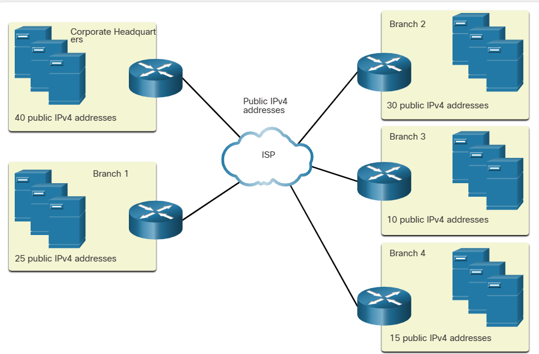

The 172.16.0.0/22 network address has 10 host bits, as shown in the figure. Because the largest subnet requires 40 hosts, a minimum of 6 host bits are needed to provide addressing for 40 hosts. This is determined by using this formula: 2⁶ - 2 = 62 hosts.

### Subnet Scheme

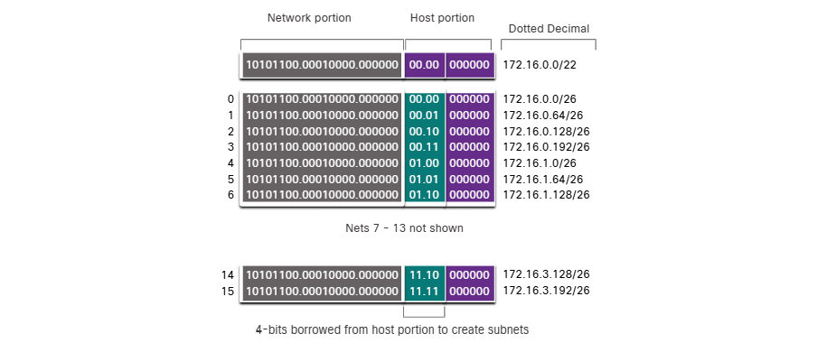

Using the formula for determining subnets results in 16 subnets: 24 = 16. Because the example internetwork requires 10 subnets, this will meet the requirement and allow for some additional growth.

Therefore, the first 4 host bits can be used to allocate subnets. This means two bits from the 3rd octet and two bits from the 4th octet will be borrowed. When 4 bits are borrowed from the 172.16.0.0/22 network, the new prefix length is /26 with a subnet mask of 255.255.255.192.

As shown in this figure, the subnets can be assigned to each location and router-to-ISP connections.

### Subnet Assignments to each Site and ISP

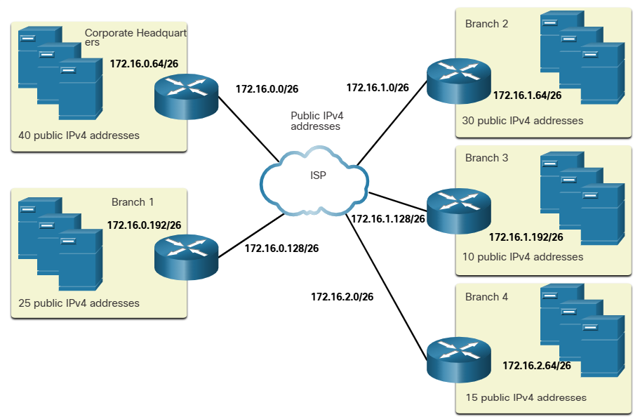

# 11.8 VLSM 

# 11.8.3 IPv4 Address Conservation

Because of the depletion of public IPv4 address space, making the most out of the available host addresses is a primary concern when subnetting IPv4 networks.

**Note:** The larger IPv6 address allows for much easier address planning and allocation than IPv4 allows. Conserving IPv6 addresses is not an issue. This is one of the driving forces for transitioning to IPv6.

Using traditional subnetting, the same number of addresses is allocated for each subnet. If all the subnets have the same requirements for the number of hosts, or if conserving IPv4 address space is not an issue, these fixed-size address blocks would be efficient. Typically, with public IPv4 addresses, that is not the case.

For example, the topology shown in the figure requires seven subnets, one for each of the four LANs, and one for each of the three connections between the routers.

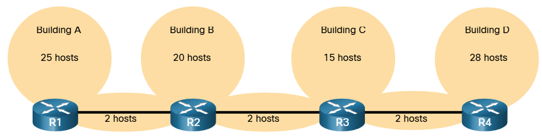

Using traditional subnetting with the given address of 192.168.20.0/24, three bits can be borrowed from the host portion in the last octet to meet the subnet requirement of seven subnets. As shown in the figure, borrowing 3 bits creates 8 subnets and leaves 5 host bits with 30 usable hosts per subnet. This scheme creates the needed subnets and meets the host requirement of the largest LAN.

### Basic Subnet Scheme

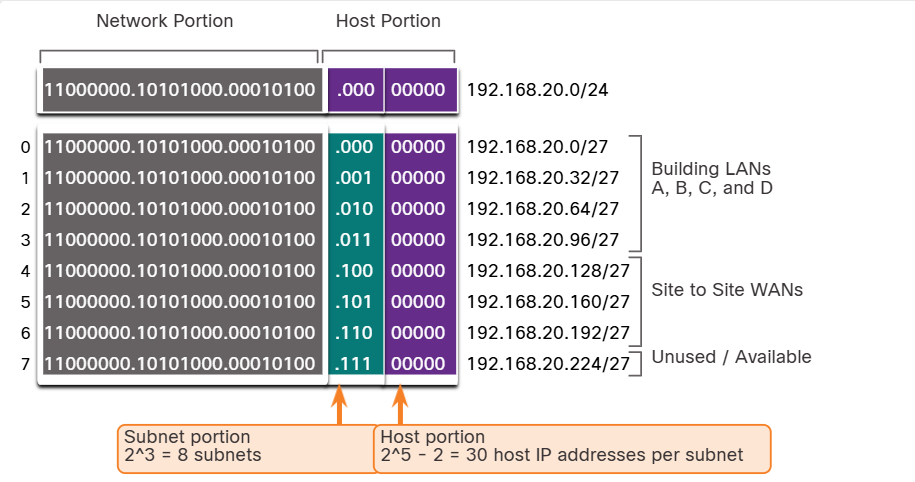

These seven subnets could be assigned to the LAN and WAN networks, as shown in the figure.

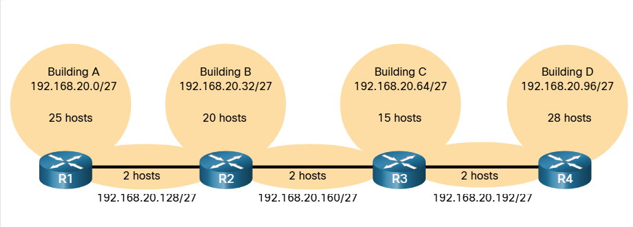

Although this traditional subnetting meets the needs of the largest LAN and divides the address space into an adequate number of subnets, it results in significant waste of unused addresses.

For example, only two addresses are needed in each subnet for the three WAN links. Because each subnet has 30 usable addresses, there are 28 unused addresses in each of these subnets. As shown in the figure, this results in 84 unused addresses (28x3).

### Unused Addresses on WAN Subnets

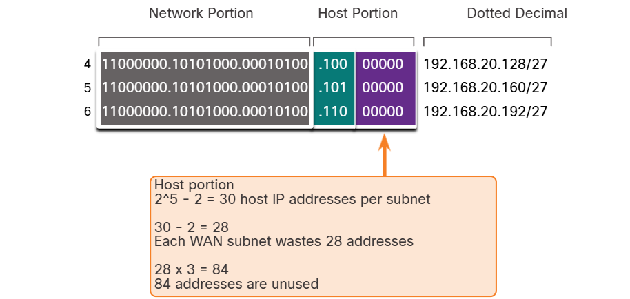

Further, this limits future growth by reducing the total number of subnets available. This inefficient use of addresses is characteristic of traditional subnetting. Applying a traditional subnetting scheme to this scenario is not very efficient and is wasteful.

The variable-length subnet mask (VLSM) was developed to avoid wasting addresses by enabling us to subnet a subnet.

## 11.8.4 VLSM

In all of the previous subnetting examples, the same subnet mask was applied for all the subnets. This means that each subnet has the same number of available host addresses. As illustrated in the left side of the figure, traditional subnetting creates subnets of equal size. Each subnet in a traditional scheme uses the same subnet mask. As shown in the right side of the figure, VLSM allows a network space to be divided into unequal parts. With VLSM, the subnet mask will vary depending on how many bits have been borrowed for a particular subnet, thus the "variable" part of the VLSM.

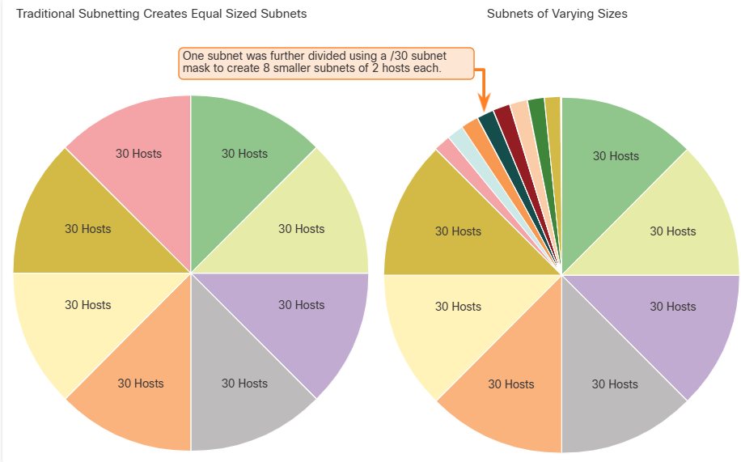

VLSM is just subnetting a subnet. The same topology used previously is shown in the figure. Again, we will use the 192.168.20.0/24 network and subnet it for seven subnets, one for each of the four LANs, and one for each of the three connections between the routers.

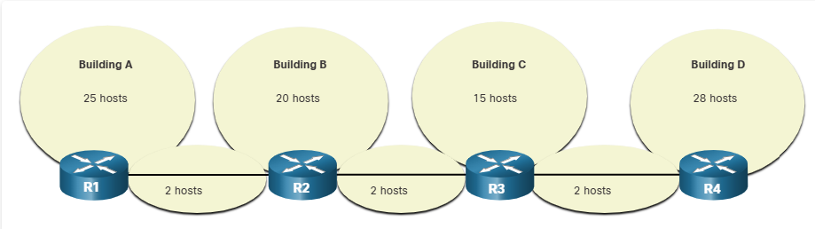

The figure shows how network 192.168.20.0/24 subnetted into eight equal-sized subnets with 30 usable host addresses per subnet. Four subnets are used for the LANs and three subnets could be used for the connections between the routers.

### Basic Subnetting Scheme

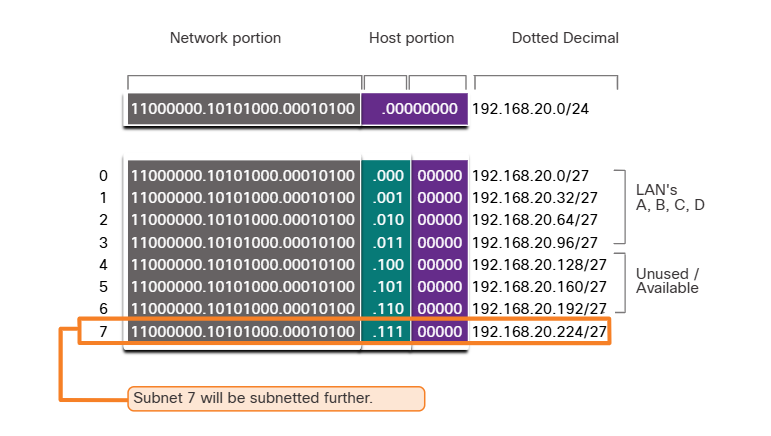

However, the connections between the routers require only two host addresses per subnet (one host address for each router interface). Currently all subnets have 30 usable host addresses per subnet. To avoid wasting 28 addresses per subnet, VLSM can be used to create smaller subnets for the inter-router connections.

To create smaller subnets for the inter-router links, one of the subnets will be divided. In this example, the last subnet, 192.168.20.224/27, will be further subnetted. The figure shows the last subnet has been subnetted further by using the subnet mask 255.255.255.252 or /30.

### VLSM Subnetting Scheme

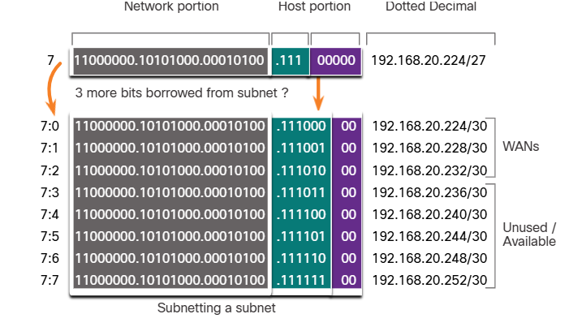

Why /30? Recall that when the number of needed host addresses is known, the formula 2n-2 (where n equals the number of host bits remaining) can be used. To provide two usable addresses, two host bits must be left in the host portion.

Because there are five host bits in the subnetted 192.168.20.224/27 address space, three more bits can be borrowed, leaving two bits in the host portion. The calculations at this point are exactly the same as those used for traditional subnetting. The bits are borrowed, and the subnet ranges are determined. The figure shows how the four /27 subnets have been assigned to the LANs and three of the /30 subnets have been assigned to the inter-router links.

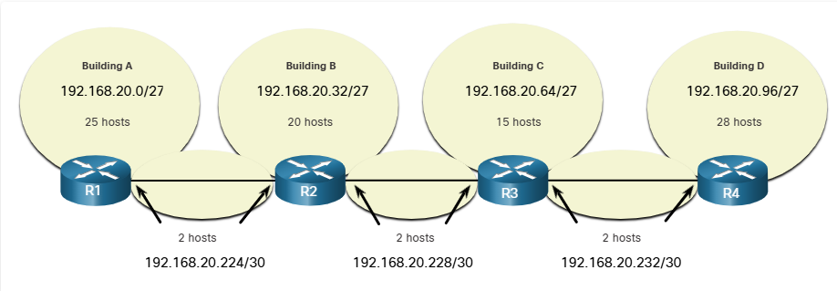

This VLSM subnetting scheme reduces the number of addresses per subnet to a size appropriate for the networks that require fewer subnets. Subnetting subnet 7 for inter-router links, allows subnets 4, 5, and 6 to be available for future networks, as well as five additional subnets available for inter-router connections.

**Note:** When using VLSM, always begin by satisfying the host requirements of the largest subnet. Continue subnetting until the host requirements of the smallest subnet are satisfied.

## 11.8.5 VLSM Topology Address Assignment

Using the VLSM subnets, the LAN and inter-router networks can be addressed without unnecessary waste.

The figure shows the network address assignments and the IPv4 addresses assigned to each router interface.

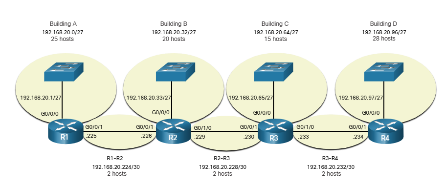

Using a common addressing scheme, the first host IPv4 address for each subnet is assigned to the LAN interface of the router. Hosts on each subnet will have a host IPv4 address from the range of host addresses for that subnet and an appropriate mask. Hosts will use the address of the attached router LAN interface as the default gateway address.

The table shows the network addresses and range of host addresses for each network. The default gateway address is displayed for the four LANs.

|  | Network Address | Range of Host Addresses | Default Gateway Address |
|---|---|---|---|
| Building A | 192.168.20.0/27 | 192.168.20.1/27 to 192.168.20.30/27 | 192.168.20.1/27 |
| Building B | 192.168.20.32/27 | 192.168.20.33/27 to 192.168.20.62/27 | 192.168.20.33/27 |
| Building C | 192.168.20.64/27 | 192.168.20.65/27 to 192.168.20.94/27 | 192.168.20.65/27 |
| Building D | 192.168.20.96/27 | 192.168.20.97/27 to 192.168.20.126/27 | 192.168.20.97/27 |
| R1-R2 | 192.168.20.224/30 | 192.168.20.225/30 to 192.168.20.226/30 |  |
| R2-R3 | 192.168.20.228/30 | 192.168.20.229/30 to 192.168.20.230/30 |  |
| R3-R4 | 192.168.20.232/30 | 192.168.20.233/30 to 192.168.20.234/30 |  |

# 11.9 Structured Design 

## 11.9.1 IPv4 Network Address Planning

Before you start subnetting, you should develop an IPv4 addressing scheme for your entire network. You will need to know how many subnets you need, how many hosts a particular subnet requires, what devices are part of the subnet, which parts of your network use private addresses, and which use public, and many other determining factors. A good addressing scheme allows for growth. A good addressing scheme is also the sign of a good network administrator.

Planning IPv4 network subnets requires you to examine both the needs of an organization's network usage, and how the subnets will be structured. Performing a network requirement study is the starting point. This means looking at the entire network, both the intranet and the DMZ, and determining how each area will be segmented. The address plan includes determining where address conservation is needed (usually within the DMZ), and where there is more flexibility (usually within the intranet).

Where address conservation is required, the plan should determine how many subnets are needed and how many hosts per subnet. As discussed earlier, this is usually required for public IPv4 address space within the DMZ. This will most likely include using VLSM.

Within the corporate intranet, address conservation is usually less of an issue This is largely due to using private IPv4 addressing, including 10.0.0.0/8, with over 16 million host IPv4 addresses.

For most organizations, private IPv4 addresses allow for more than enough internal (intranet) addresses. For many larger organizations and ISPs, even private IPv4 address space is not large enough to accommodate their internal needs. This is another reason why organizations are transitioning to IPv6.

For intranets that use private IPv4 addresses and DMZs that use public IPv4 addresses, address planning and assignment is important.

Where required, the address plan includes determining the needs of each subnet in terms of size. How many hosts there will be per subnet? The address plan also needs to include how host addresses will be assigned, which hosts will require static IPv4 addresses, and which hosts can use DHCP for obtaining their addressing information. This will also help prevent the duplication of addresses, while allowing for monitoring and managing of addresses for performance and security reasons.

Knowing your IPv4 address requirements will determine the range, or ranges, of host addresses that you implement and help ensure that there are enough addresses to cover your network needs.

## 11.9.2 Device Address Assignment

Within a network, there are different types of devices that require addresses:

-   **End user clients** - Most networks allocate IPv4 addresses to client devices dynamically, using Dynamic Host Configuration Protocol (DHCP). This reduces the burden on network support staff and virtually eliminates entry errors. With DHCP, addresses are only leased for a period of time, and can be reused when the lease expires. This is an important feature for networks that support transient users and wireless devices. Changing the subnetting scheme means that the DHCP server needs to be reconfigured, and the clients must renew their IPv4 addresses. IPv6 clients can obtain address information using DHCPv6 or SLAAC.
-   **Servers and peripherals** - These should have a predictable static IP address. Use a consistent numbering system for these devices.
-   **Servers that are accessible from the internet** - Servers that need to be publicly available on the internet must have a public IPv4 address, most often accessed using NAT. In some organizations, internal servers (not publicly available) must be made available to the remote users. In most cases, these servers are assigned private addresses internally, and the user is required to create a virtual private network (VPN) connection to access the server. This has the same effect as if the user is accessing the server from a host within the intranet.
-   **Intermediary devices** - These devices are assigned addresses for network management, monitoring, and security. Because we must know how to communicate with intermediary devices, they should have predictable, statically assigned addresses.
-   **Gateway** - Routers and firewall devices have an IP address assigned to each interface which serves as the gateway for the hosts in that network. Typically, the router interface uses either the lowest or highest address in the network.

When developing an IP addressing scheme, it is generally recommended that you have a set pattern of how addresses are allocated to each type of device. This benefits administrators when adding and removing devices, filtering traffic based on IP, as well as simplifying documentation.


