# Module 12: IPv6 Addressing

# 12.1 IPv4 Issues 

## 12.1.1 Need for IPv6

You already know that IPv4 is running out of addresses. That is why you need to learn about IPv6. IPv6 is designed to be the successor to IPv4. IPv6 has a larger 128-bit address space, providing 340 undecillion (i.e., 340 followed by 36 zeroes) possible addresses. However, IPv6 is more than just larger addresses.

When the IETF began its development of a successor to IPv4, it used this opportunity to fix the limitations of IPv4 and include enhancements. One example is Internet Control Message Protocol version 6 (ICMPv6), which includes address resolution and address autoconfiguration not found in ICMP for IPv4 (ICMPv4).

The depletion of IPv4 address space has been the motivating factor for moving to IPv6. As Africa, Asia and other areas of the world become more connected to the internet, there are not enough IPv4 addresses to accommodate this growth. As shown in the figure, all five RIRs have run out of IPv4 addresses.

### RIR IPv4 Exhaustion Dates

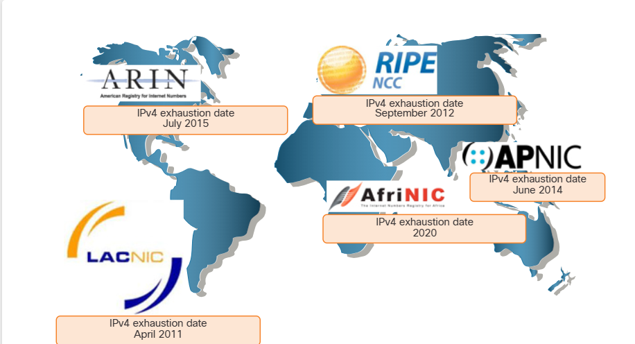

IPv4 has a theoretical maximum of 4.3 billion addresses. Private addresses in combination with Network Address Translation (NAT) have been instrumental in slowing the depletion of IPv4 address space. However, NAT is problematic for many applications, creates latency, and has limitations that severely impede peer-to-peer communications.

With the ever-increasing number of mobile devices, mobile providers have been leading the way with the transition to IPv6. The top two mobile providers in the United States report that over 90% of their traffic is over IPv6.

Most top ISPs and content providers such as YouTube, Facebook, and NetFlix, have also made the transition. Many companies like Microsoft, Facebook, and LinkedIn are transitioning to IPv6-only internally. In 2018, broadband ISP Comcast reported a deployment of over 65% and British Sky Broadcasting over 86%.

### Internet of Things

The internet of today is significantly different than the internet of past decades. The internet of today is more than email, web pages, and file transfers between computers. The evolving internet is becoming an Internet of Things (IoT). No longer will the only devices accessing the internet be computers, tablets, and smartphones. The sensor-equipped, internet-ready devices of tomorrow will include everything from automobiles and biomedical devices, to household appliances and natural ecosystems.

With an increasing internet population, a limited IPv4 address space, issues with NAT and the loT, the time has come to begin the transition to IPv6.

## 12.1.2 IPv4 and IPv6 Coexistence

There is no specific date to move to IPv6. Both IPv4 and IPv6 will coexist in the near future and the transition will take several years. The IETF has created various protocols and tools to help network administrators migrate their networks to IPv6. The migration techniques can be divided into three categories:

### Dual Stack 

Dual stack allows IPv4 and IPv6 to coexist on the same network segment. Dual stack devices run both IPv4 and IPv6 protocol stacks simultaneously. Known as native IPv6, this means the customer network has an IPv6 connection to their ISP and is able to access content found on the internet over IPv6.

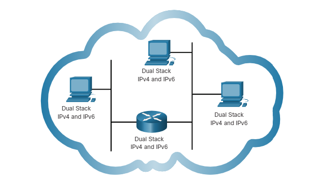

### Tunneling 

Tunneling is a method of transporting an IPv6 packet over an IPv4 network. The IPv6 packet is encapsulated inside an IPv4 packet, similar to other types of data.

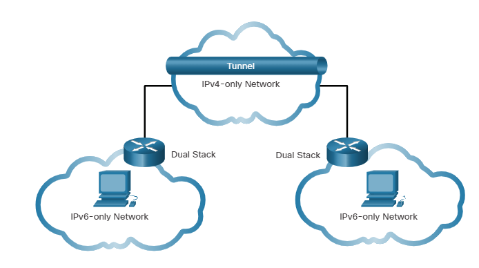

### Translation 

Network Address Translation 64 (NAT64) allows IPv6-enabled devices to communicate with IPv4-enabled devices using a translation technique similar to NAT for IPv4. An IPv6 packet is translated to an IPv4 packet and an IPv4 packet is translated to an IPv6 packet.

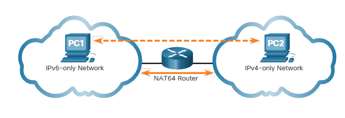

Note: Tunneling and translation are for transitioning to native IPv6 and should only be used where needed. The goal should be native IPv6 communications from source to destination.

# 12.2 IPv6 Address Representation 

## 12.2.1 IPv6 Addressing Formats

The first step to learning about IPv6 in networks is to understand the way an IPv6 address is written and formatted. IPv6 addresses are much larger than IPv4 addresses, which is why we are unlikely to run out of them.

IPv6 addresses are 128 bits in length and written as a string of hexadecimal values. Every four bits is represented by a single hexadecimal digit; for a total of 32 hexadecimal values, as shown in the figure. IPv6 addresses are not case-sensitive and can be written in either lowercase or uppercase.

### 16-bit Segments or Hextets

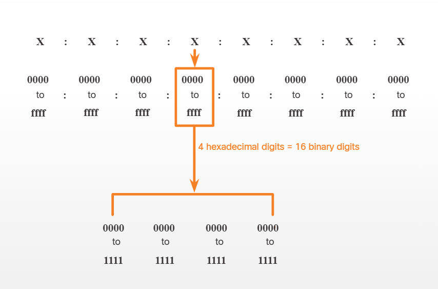

### Preferred Format

The previous figure also shows that the preferred format for writing an IPv6 address is x:x:x:x:x:x:x:x, with each "x" consisting of four hexadecimal values. The term octet refers to the eight bits of an IPv4 address. In IPv6, a hextet is the unofficial term used to refer to a segment of 16 bits, or four hexadecimal values. Each "x" is a single hextet which is 16 bits or four hexadecimal digits.

Preferred format means that you write IPv6 address using all 32 hexadecimal digits. It does not necessarily mean that it is the ideal method for representing the IPv6 address. In this module, you will see two rules that help to reduce the number of digits needed to represent an IPv6 address.

These are examples of IPv6 addresses in the preferred format.
```
2001: 0db8 : 0000 : 1111 : 0000 : 0000 : 0000: 0200
2001 : 0db8 : 0000 : 00a3 : abcd : 0000 : 0000 : 1234
2001 : 0db8 : 000a : 0001 : c012 : 9aff : fe9a : 19ac
2001 : 0db8 : aaaa : 0001 : 0000 : 0000 : 0000 : 0000
fe80 : 0000 : 0000 : 0000 : 0123 : 4567 : 89ab : cdef
fe80 : 0000 : 0000 : 0000 : 0000 : 0000 : 0000 : 0001
fe80 : 0000 : 0000 : c012 : 9aff : fe9a : 19ac
fe80 : 0000 : 0000 : 0000 : 0123 : 4567 : 89ab : cdef
0000 : 0000 : 0000 : 0000 : 0000 : 0000 : 0000 : 0001
0000 : 0000 : 0000 : 0000 : 0000 : 0000 : 0000 : 0000
```
## 12.2.2 Rule 1 - Omit Leading Zeros

The first rule to help reduce the notation of IPv6 addresses is to omit any leading Os (zeros) in any hextet. Here are four examples of ways to omit leading zeros:
- 01ab can be represented as lab
- 09f0 can be represented as 9f0
- 0a00 can be represented as a00
- 00ab can be represented as ab

This rule only applies to leading Os, NOT to trailing Os, otherwise the address would be ambiguous. For example, the hextet "abc" could be either "0abc" or "abc0", but these do not represent the same value.

### Omitting Leading Os

| Type | Format |
|---|---|
| Preferred | 2001: @db8 0000 1111 0000 0000 0000 0200 |
| No leading Os | 2001 db8 : 1111 :0:0:0: 200 |
| Preferred | 2001: @db8 0000 0023 abee Babe 88ab: 1234 |
| No leading Os | 2001 db88a3 abee abe ab 1234 |
| Preferred | 2001: @db8 000 0001 012 90ff fo98: 0001 |
| No leading Os | 2001 db8a1c012: 90ff fo98 1 |
| Preferred | 2001: @db8aaaa: 0001 0000 0000 0000 0000 |
| No leading Os | 2001 db8aaaa: 1:0:0:0:0 |
| Preferred | fa88: 0000:0000:0000: 0123456789abcdef |
| No leading Os | fa88 8:00:1234567 89ab: cdef |
| Preferred | fa88: 0000 0000 0000 0000 0000 0000 0001 |
| No leading Os | fa88: 8:0:0:0:0:0:1 |
| Preferred | 0000 0000 0000 0000 0000 0000 0000 0001 |
| No leading Os | 0:0:0:0:0:0:0:1 |
| Preferred | 0000 0000 0000 0000 0000 0000 0000 0000 |
| No leading Os | 0:0:0:0:0:0:0:0 |

## 12.2.3 Rule 2- Double Colon

The second rule to help reduce the notation of IPv6 addresses is that a double colon (::) can replace any single, contiguous string of one or more 16-bit hextets consisting of all zeros. For example, 2001:db8:cafe:1:0:0:0:1 (leading Os omitted) could be represented as 2001:db8:cafe:1::1. The double colon (::) is used in place of the three all-0 hextets (0:0:0).

The double colon (::) can only be used once within an address, otherwise there would be more than one possible resulting address. When used with the omitting leading Os technique, the notation of IPv6 address can often be greatly reduced. This is commonly known as the compressed format.

Here is an example of the incorrect use of the double colon: 2001:db8::abcd::1234. The double colon is used twice in the example above. Here are the possible expansions of this incorrect compressed format address:
- 2001:db8::abcd:0000:0000:1234
- 2001:db8::abcd:0000:0000:0000:1234
- 2001:db8:0000:abcd::1234
- 2001:db8:0000:0000:abcd::1234
If an address has more than one contiguous string of all-0 hextets, best practice is to use the double colon (::) on the longest string. If the strings are equal, the first string should use the double colon (::).

### Omitting Leading Os and All O Segments

| Type | Format |
|---|---|
| Preferred | 2001:db8:0000:1111:0000:0000:0000:0200 |
| Compressed/spaces | 2001:db8::1111:200 |
| Compressed | 2001:db8:0:1111::200 |
| Preferred | 2001:db8:0000:0000:25ab:0000:0000:0000 |
| Compressed/spaces | 2001:db8::0:25ab:: |
| Compressed | 2001:db8:0:0:25ab:: |
| Preferred | 2001:db8:2022:0001:0001:0001:0001:0001 |
| Compressed/spaces | 2001:db8:2022::5:11 |
| Compressed | 2001:db8:2022:5:11 |
| Preferred | fe80::0000:0000:0000:0123:4567:7fab:cdef |
| Compressed/spaces | fe80::123:4567:7fab:cdef |
| Compressed | fe80::123:4567:7fab:cdef |
| Preferred | 0000:0000:0000:0000:0000:0000:0000:0001 |
| Compressed/spaces | ::1 |
| Compressed | ::1 |
| Preferred | 0000:0000:0000:0000:0000:0000:0000:0000 |
| Compressed/spaces | :: |
| Compressed | :: |
| Preferred | 0000:0000:0000:0000:0000:0000:0000:0000 |
| Compressed/spaces | :: |
| Compressed | :: |

# 12.3 IPv6 Address Types 

## 12.3.1 Unicast, Multicast, Anycast

As with IPv4, there are different types of IPv6 addresses. In fact, there are three broad categories of IPv6 addresses:
- Unicast - An IPv6 unicast address uniquely identifies an interface on an IPv6-enabled device.
- Multicast - An IPv6 multicast address is used to send a single IPv6 packet to multiple destinations.
- Anycast - An IPv6 anycast address is any IPv6 unicast address that can be assigned to multiple devices. A packet sent to an anycast address is routed to the nearest device having that address. Anycast addresses are beyond the scope of this course.

Unlike IPv4, IPv6 does not have a broadcast address. However, there is an IPv6 all-nodes multicast address that essentially gives the same result.

## 12.3.2 IPv6 Prefix Length

The prefix, or network portion, of an IPv4 address can be identified by a dotted-decimal subnet mask or prefix length (slash notation). For example, an IPv4 address of 192.168.1.10 with dotted-decimal subnet mask 255.255.255.0 is equivalent to 192.168.1.10/24.

In IPv6 it is only called the prefix length. IPv6 does not use the dotted-decimal subnet mask notation. Like IPv4, the prefix length is represented in slash notation and is used to indicate the network portion of an IPv6 address.

The prefix length can range from 0 to 128. The recommended IPv6 prefix length for LANs and most other types of networks is /64, as shown in the figure.

### IPv6 Prefix Length

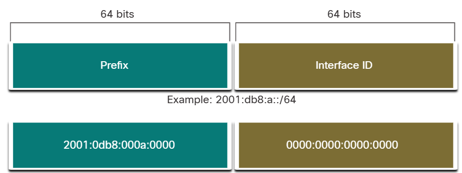

The prefix or network portion of the address is 64 bits in length, leaving another 64 bits for the interface ID (host portion) of the address.

It is strongly recommended to use a 64-bit Interface ID for most networks. This is because stateless address autoconfiguration (SLAAC) uses 64 bits for the Interface ID. It also makes subnetting easier to create and manage.

## 12.3.3 Types of IPv6 Unicast Addresses

An IPv6 unicast address uniquely identifies an interface on an IPv6-enabled device. A packet sent to a unicast address is received by the interface which is assigned that address. Similar to IPv4, a source IPv6 address must be a unicast address. The destination IPv6 address can be either a unicast or a multicast address. The figure shows the different types of IPv6 unicast addresses.

### IPv6 Unicast Addresses

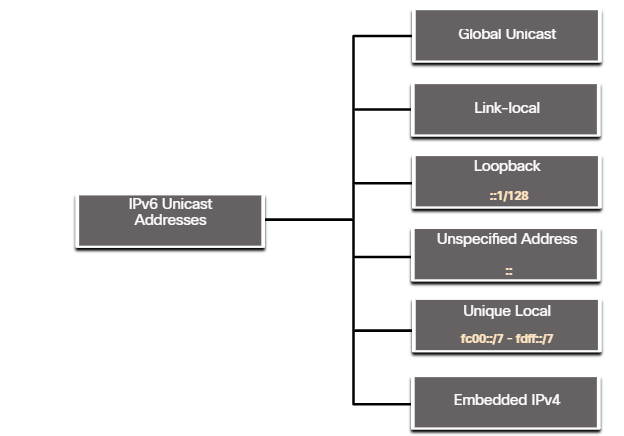

Unlike IPv4 devices that have only a single address, IPv6 addresses typically have two unicast addresses:
- **Global Unicast Address (GUA)** - This is similar to a public IPv4 address. These are globally unique, internet-routable addresses. GUAs can be configured statically or assigned dynamically.
- **Link-local Address (LLA)** - This is required for every IPv6-enabled device. LLAs are used to communicate with other devices on the same local link. With IPv6, the term link refers to a subnet. LLAs are confined to a single link. Their uniqueness must only be confirmed on that link because they are not routable beyond the link. In other words, routers will not forward packets with a link- local source or destination address.

## 12.3.4 A Note About the Unique Local Address

Unique local addresses (range fc00::/7 to fdff::/7) are not yet commonly implemented. Therefore, this module only covers GUA and LLA configuration. However, unique local addresses may eventually be used to address devices that should not be accessible from the outside, such as internal servers and printers.

The IPv6 unique local addresses have some similarity to RFC 1918 private addresses for IPv4, but there are significant differences:
- Unique local addresses are used for local addressing within a site or between a limited number of sites.
- Unique local addresses can be used for devices that will never need to access another network.
- Unique local addresses are not globally routed or translated to a global IPv6 address.

Note: Many sites also use the private nature of RFC 1918 addresses to attempt to secure or hide their network from potential security risks. However, this was never the intended use of these technologies, and the IETF has always recommended that sites take the proper security precautions on their internet-facing router.

## 12.3.5 IPv6 GUA

IPv6 global unicast addresses (GUAs) are globally unique and routable on the IPv6 internet. These addresses are equivalent to public IPv4 addresses. The Internet Committee for Assigned Names and Numbers (ICANN), the operator for IANA, allocates IPv6 address blocks to the five RIRs. Currently, only GUAs with the first three bits of 001 or 2000::/3 are being assigned, as shown in the figure.

The figure shows the range of values for the first hextet where the first hexadecimal digit for currently available GUAs begins with a 2 or a 3. This is only 1/8th of the total available IPv6 address space, excluding only a very small portion for other types of unicast and multicast addresses.

Note: The 2001:db8::/32 address has been reserved for documentation purposes, including use in examples.

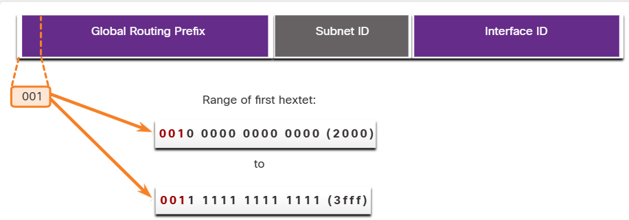

The next figure shows the structure and range of a GUA.

### IPv6 Address With a /48 Global Routing Prefix and /64 Prefix

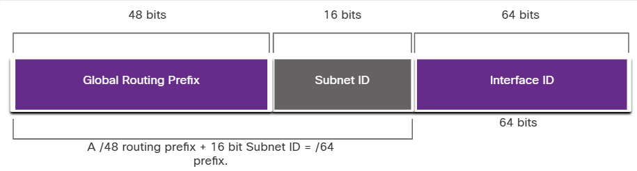

A GUA has three parts:
- Global Routing Prefix
- Subnet ID
- Interface ID

## 12.3.6 IPv6 GUA Structure

### Global Routing Prefix

The global routing prefix is the prefix, or network, portion of the address that is assigned by the provider, such as an ISP, to a customer or site. For example, it is common for ISPs to assign a /48 global routing prefix to its customers. The global routing prefix will usually vary depending on the policies of the ISP.

The previous figure shows a GUA using a /48 global routing prefix. /48 prefixes are a common global routing prefix that is assigned and will be used in most of the examples throughout this course.

For example, the IPv6 address 2001:db8:acad::/48 has a global routing prefix that indicates that the first 48 bits (3 hextets) (2001:db8:acad) is how the ISP knows of this prefix (network). The double colon (::) following the /48 prefix length means the rest of the address contains all Os. The size of the global routing prefix determines the size of the subnet ID.

### Subnet ID

The Subnet ID field is the area between the Global Routing Prefix and the Interface ID. Unlike IPv4 where you must borrow bits from the host portion to create subnets, IPv6 was designed with subnetting in mind. The Subnet ID is used by an organization to identify subnets within its site. The larger the subnet ID, the more subnets available.

Note: Many organizations are receiving a /32 global routing prefix. Using the recommended /64 prefix in order to create a 64-bit Interface ID, leaves a 32 bit Subnet ID. This means an organization with a /32 global routing prefix and a 32-bit Subnet ID will have 4.3 billion subnets, each with 18 quintillion devices per subnet. That is as many subnets as there are public IPv4 addresses!

The IPv6 address in the previous figure has a /48 Global Routing Prefix, which is common among many enterprise networks. This makes it especially easy to examine the different parts of the address. Using a typical /64 prefix length, the first four hextets are for the network portion of the address, with the fourth hextet indicating the Subnet ID. The remaining four hextets are for the Interface ID.

### Interface ID

The IPv6 interface ID is equivalent to the host portion of an IPv4 address. The term Interface ID is used because a single host may have multiple interfaces, each having one or more IPv6 addresses. The figure shows an example of the structure of an IPv6 GUA. It is strongly recommended that in most cases /64 subnets should be used, which creates a 64-bit interface ID. A 64-bit interface ID allows for 18 quintillion devices or hosts per subnet.

A /64 subnet or prefix (Global Routing Prefix + Subnet ID) leaves 64 bits for the interface ID. This is recommended to allow SLAAC- enabled devices to create their own 64-bit interface ID. It also makes developing an IPv6 addressing plan simple and effective.

Note: Unlike IPv4, in IPv6, the all-0s and all-1s host addresses can be assigned to a device. The all-1s address can be used because broadcast addresses are not used within IPv6. The all-0s address can also be used, but is reserved as a Subnet-Router anycast address, and should be assigned only to routers.

## 12.3.7 IPv6 LLA

An IPv6 link-local address (LLA) enables a device to communicate with other IPv6-enabled devices on the same link and only on that link (subnet). Packets with a source or destination LLA cannot be routed beyond the link from which the packet originated.

The GUA is not a requirement. However, every IPv6-enabled network interface must have an LLA. If an LLA is not configured manually on an interface, the device will automatically create its own without communicating with a DHCP server. IPv6-enabled hosts create an IPv6 LLA even if the device has not been assigned a global unicast IPv6 address. This allows IPv6- enabled devices to communicate with other IPv6-enabled devices on the same subnet. This includes communication with the default gateway (router).

IPv6 LLAs are in the fe80::/10 range. The /10 indicates that the first 10 bits are 1111 1110 10xx xxxx. The first hextet has a range of 1111 1110 1000 0000 (fe80) to 1111 1110 1011 1111 (febf).

The figure shows an example of communication using IPv6 LLAS. The PC is able to communicate directly with the printer using the LLAS.

### IPv6 Link-Local Communications

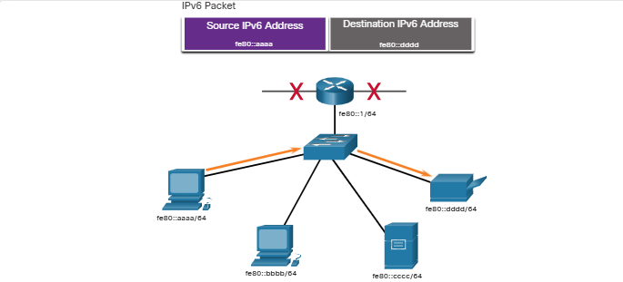

The next figure shows some of the uses for IPv6 LLAs.


1. Routers use the LLA of neighbor routers to send routing updates.
2. Hosts use the LLA of a local router as the default-gateway.

Note: Typically, it is the LLA of the router, and not the GUA, that is used as the default gateway for other devices on the link.

There are two ways that a device can obtain an LLA:
- **Statically** - This means the device has been manually configured.
- **Dynamically** - This means the device creates its own interface ID by using randomly generated values or using the Extended Unique Identifier (EUI) method, which uses the client MAC address along with additional bits.

# 12.4 GUA and LLA Static Configuration 

# 12.4.1 Static GUA Configuration on a Router

As you learned in the previous topic, IPv6 GUAs are the same as public IPv4 addresses. They are globally unique and routable on the IPv6 internet. An IPv6 LLA lets two IPv6-enabled devices communicate with each other on the same link (subnet). It is easy to statically configure IPv6 GUAs and LLAs on routers to help you create an IPv6 network. This topic teaches you how to do just that!

Most IPv6 configuration and verification commands in the Cisco IOS are similar to their IPv4 counterparts. In many cases, the only difference is the use of **ipv6** in place of **ip** within the commands.

For example, the Cisco IOS command to configure an IPv4 address on an interface is *ip address ip-address subnet-mask*. In contrast, the command to configure an IPv6 GUA on an interface is *ipv6 address ipv6-address/prefix-length*.

Notice that there is no space between *ipv6-address* and *prefix-length*.

The example configuration uses the topology shown in the figure and these IPv6 subnets:

- 2001:db8:acad:1::/64
- 2001:db8:acad:2::/64
- 2001:db8:acad:3::/64

### Example Topology

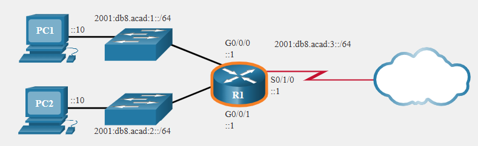

The example shows the commands required to configure the IPv6 GUA on GigabitEthernet 0/0/0, GigabitEthernet 0/0/1, and the Serial 0/1/0 interface of R1.

### IPv6 GUA Configuration on Router R1

```
R1(config)# interface gigabitethernet 0/0/0
R1(config-if)# ipv6 address 2001:db8:acad:1::1/64
R1(config-if)# no shutdown
R1(config-if)# exit
R1(config)# interface gigabitethernet 0/0/1
R1(config-if)# ipv6 address 2001:db8:acad:2::1/64
R1(config-if)# no shutdown
R1(config-if)# exit
R1(config)# interface serial 0/1/0
R1(config-if)# ipv6 address 2001:db8:acad:3::1/64
R1(config-if)# no shutdown
```

## 12.4.2 Static GUA Configuration on a Windows Host

Manually configuring the IPv6 address on a host is similar to configuring an IPv4 address.

As shown in the figure, the default gateway address configured for PC1 is 2001:db8:acad:1::1. This is the GUA of the R1 GigabitEthernet interface on the same network. Alternatively, the default gateway address can be configured to match the LLA of the GigabitEthernet interface. Using the LLA of the router as the default gateway address is considered best practice. Either configuration will work.

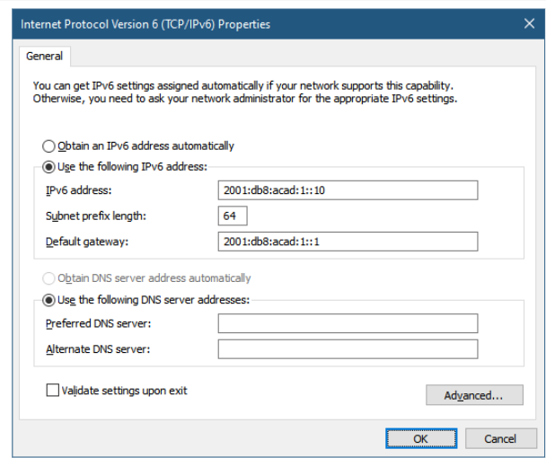

Just as with IPv4, configuring static addresses on clients does not scale to larger environments. For this reason, most network administrators in an IPv6 network will enable dynamic assignment of IPv6 addresses.

There are two ways in which a device can obtain an IPv6 GUA automatically:
- Stateless Address Autoconfiguration (SLAAC)
- Stateful DHCPv6

SLAAC and DHCPv6 are covered in the next topic.

**Note:** When DHCPv6 or SLAAC is used, the LLA of the router will automatically be specified as the default gateway address.

## 12.4.3 Static Configuration of a Link-Local Unicast Address

Configuring the LLA manually lets you create an address that is recognizable and easier to remember. Typically, it is only necessary to create recognizable LLAs on routers. This is beneficial because router LLAs are used as default gateway addresses and in routing advertisement messages.

LLAs can be configured manually using the **ipv6 address ipv6-link-local-address link-local** command. When an address begins with this hextet within the range of fe80 to febf, the **link-local** parameter must follow the address.

The figure shows an example topology with LLAs on each interface.

### Example Topology with LLAs

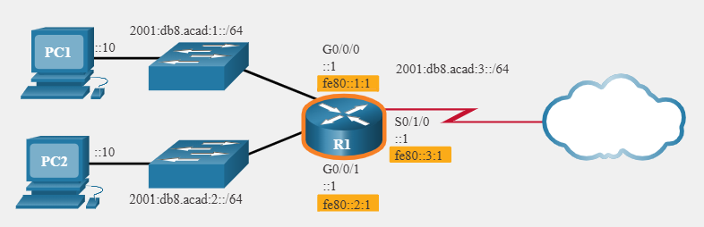

The example shows the configuration of an LLA on router R1.
```
R1(config)# interface gigabitethernet 0/0/0
R1(config-if)# ipv6 address fe80::1:1 link-local
R1(config-if)# exit
R1(config)# interface gigabitethernet 0/0/1
R1(config-if)# ipv6 address fe80::2:1 link-local
R1(config-if)# exit
R1(config)# interface serial 0/1/0
R1(config-if)# ipv6 address fe80::3:1 link-local
R1(config-if)# exit
```

Statically configured LLAs are used to make them more easily recognizable as belonging to router R1. In this example, all the interfaces of router R1 have been configured with an LLA that begins with fe80::n:1.

Note: The exact same LLA could be configured on each link as long as it is unique on that link. This is because LLAs only have to be unique on that link. However, common practice is to create a different LLA on each interface of the router to make it easy to identify the router and the specific interface.

# 12.5 Dynamic Addressing for IPv6 GUAs

## 12.5.1 RS and RA Messages

If you do not want to statically configure IPv6 GUAs, no need to worry. Most devices obtain their IPv6 GUAs dynamically. This topic explains how this process works using Router Advertisement (RA) and Router Solicitation (RS) messages. This topic gets rather technical, but when you understand the difference between the three methods that a router advertisement can use, as well as how the EUI-64 process for creating an interface ID differs from a randomly generated process, you will have made a huge leap in your IPv6 expertise!

For the GUA, a device obtains the address dynamically through Internet Control Message Protocol version 6 (ICMPv6) messages. IPv6 routers periodically send out ICMPv6 RA messages, every 200 seconds, to all IPv6-enabled devices on the network. An RA message will also be sent in response to a host sending an ICMPv6 RS message, which is a request for an RA message. Both messages are shown in the figure.

### ICMPv6 RS and RA Messages

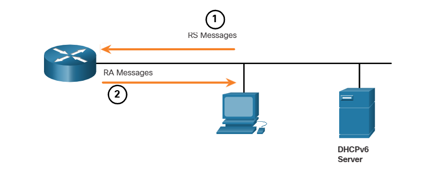

1. RS messages are sent to all IPv6 routers by hosts requesting addressing information.
2. RA messages are sent to all IPv6 nodes. If Method 1 (SLAAC only) is used, the RA includes network prefix, prefix-length, and default-gateway information.

RA messages are on IPv6 router Ethernet interfaces. The router must be enabled for IPv6 routing, which is not enabled by default. To enable a router as an IPv6 router, the ipv6 unicast-routing global configuration command must be used.

The ICMPv6 RA message is a suggestion to a device on how to obtain an IPv6 GUA. The ultimate decision is up to the device operating system. The ICMPv6 RA message includes the following:

-   Network prefix and prefix length - This tells the device which network it belongs to.
-   Default gateway address - This is an IPv6 LLA, the source IPv6 address of the RA message.
-   DNS addresses and domain name - These are the addresses of DNS servers and a domain name.

There are three methods for RA messages:

-   Method 1: SLAAC - "I have everything you need including the prefix, prefix length, and default gateway address."
-   Method 2: SLAAC with a stateless DHCPv6 server - "Here is my information but you need to get other information such as DNS addresses from a stateless DHCPv6 server."
-   Method 3: Stateful DHCPv6 (no SLAAC) - "I can give you your default gateway address. You need to ask a stateful DHCPv6 server for all your other information."

## 12.5.2 Method 1 - SLAAC

SLAAC is a method that allows a device to create its own GUA without the services of DHCPv6. Using SLAAC, devices rely on the ICMPv6 RA messages of the local router to obtain the necessary information.

By default, the RA message suggests that the receiving device use the information in the RA message to create its own IPv6 GUA and all other necessary information. The services of a DHCPv6 server are not required.

SLAAC is stateless, which means there is no central server (for example, a stateful DHCPv6 server) allocating GUAs and keeping a list of devices and their addresses. With SLAAC, the client device uses the information in the RA message to create its own GUA. As shown in the figure, the two parts of the address are created as follows:
- Prefix - This is advertised in the RA message.
- Interface ID - This uses the EUI-64 process or by generating a random 64-bit number, depending on the device operating system.

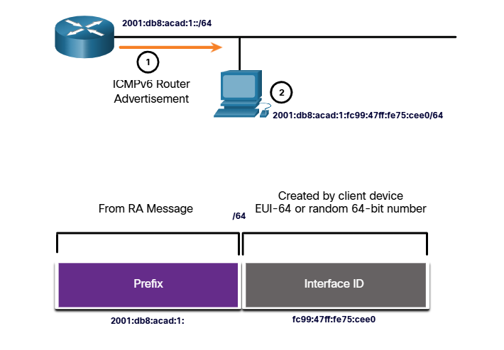

1. The router sends an RA message with the prefix for the local link.
2. The PC uses SLAAC to obtain a prefix from the RA message and creates its own Interface ID.

## 12.5.3 Method 2 - SLAAC and Stateless DHCPv6

A router interface can be configured to send a router advertisement using SLAAC and stateless DHCPv6.

As shown in the figure, with this method, the RA message suggests devices use the following:

- SLAAC to create its own IPv6 GUA
- The router LLA, which is the RA source IPv6 address, as the default gateway address
- A stateless DHCPv6 server to obtain other information such as a DNS server address and a domain name

**Note:** A stateless DHCPv6 server distributes DNS server addresses and domain names. It does not allocate GUAs.

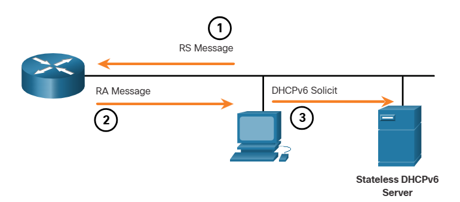

1. The PC sends an RS to all IPv6 routers, "I need addressing information."
2. The router sends an RA message to all IPv6 nodes with Method 2 (SLAAC and DHCPv6) specified. "Here is your prefix, prefix-length, and default gateway information. But you will need to get DNS information from a DHCPv6 server."
3. The PC sends a DHCPv6 Solicit message to all DHCPv6 servers. "I used SLAAC to create my IPv6 address and get my default gateway address, but I need other information from a stateless DHCPv6 server."

## 12.5.4 Method 3 - Stateful DHCPv6

A router interface can be configured to send an RA using stateful DHCPv6 only. Stateful DHCPv6 is similar to DHCP for IPv4. A device can automatically receive its addressing information including a GUA, prefix length, and the addresses of DNS servers from a stateful DHCPv6 server.

As shown in the figure, with this method, the RA message suggests devices use the following:
- The router LLA, which is the RA source IPv6 address, for the default gateway address.
- A stateful DHCPv6 server to obtain a GUA, DNS server address, domain name and other necessary information.

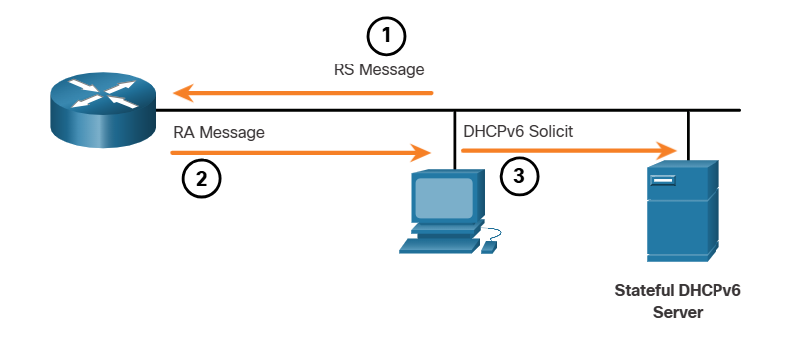

1. The PC sends an RS to all IPv6 routers, "I need addressing information."
2. The router sends an RA message to all IPv6 nodes with Method 3 (Stateful DHCPv6) specified, "I am your default gateway, but you need to ask a stateful DHCPv6 server for your IPv6 address and other addressing information."
3. The PC sends a DHCPv6 Solicit message to all DHCPv6 servers, "I received my default gateway address from the RA message, but I need an IPv6 address and all other addressing information from a stateful DHCPv6 server."

A stateful DHCPv6 server allocates and maintains a list of which device receives which IPv6 address. DHCP for IPv4 is stateful.

**Note:** The default gateway address can only be obtained dynamically from the RA message. The stateless or stateful DHCPv6 server does not provide the default gateway address.

## 12.5.5 EUI-64 Process vs. Randomly Generated

When the RA message is either SLAAC or SLAAC with stateless DHCPv6, the client must generate its own interface ID. The client knows the prefix portion of the address from the RA message, but must create its own interface ID. The interface ID can be created using the EUI-64 process or a randomly generated 64-bit number, as shown in the figure.

### Dynamically Creating an Interface ID

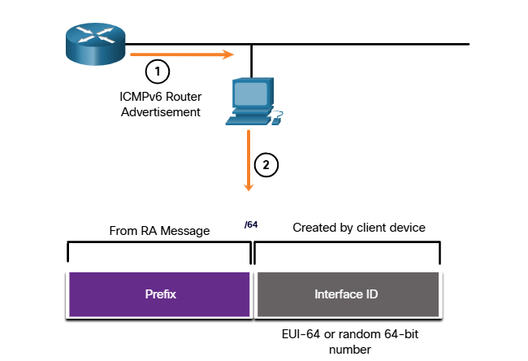

1. The router sends an RA message.
2. The PC uses the prefix in the RA message and uses either EUI-64 or a random 64-bit number to generate an interface ID.

## 12.5.6 EUI-64 Process

IEEE defined the Extended Unique Identifier (EUI) or modified EUI-64 process. This process uses the 48-bit Ethernet MAC address of a client, and inserts another 16 bits in the middle of the 48-bit MAC address to create a 64-bit interface ID.

Ethernet MAC addresses are usually represented in hexadecimal and are made up of two parts:
- Organizationally Unique Identifier (OUI) - The OUI is a 24-bit (6 hexadecimal digits) vendor code assigned by IEEE.
- Device Identifier - The device identifier is a unique 24-bit (6 hexadecimal digits) value within a common OUI. An EUI-64 Interface ID is represented in binary and is made up of three parts:
- 24-bit OUI from the client MAC address, but the 7th bit (the Universally/Locally (U/L) bit) is reversed. This means that if the 7th bit is a 0, it becomes a 1, and vice versa.
- The inserted 16-bit value fffe (in hexadecimal).
- 24-bit Device Identifier from the client MAC address.

The EUI-64 process is illustrated in the figure, using the R1 GigabitEthernet MAC address of fc99:4775:cee0.

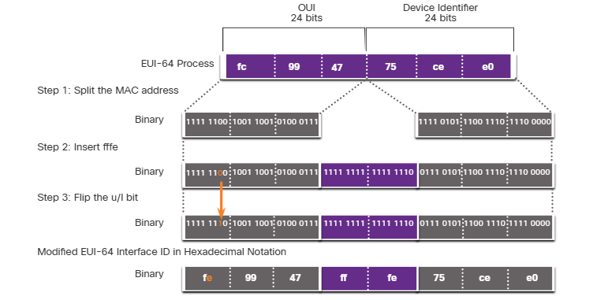

Step 1: Divide the MAC address between the OUI and device identifier.
Step 2: Insert the hexadecimal value fffe, which in binary is: 1111 1111 1111 1110.
Step 3: Convert the first 2 hexadecimal values of the OUI to binary and flip the U/L bit (bit 7). In this example, the 0 in bit 7 is changed to a 1.

The result is an EUI-64 generated interface ID of fe99:47ff:fe75:cee0.

Note: The use of the U/L bit, and the reasons for reversing its value, are discussed in RFC 5342.

The example output for the ipconfig command shows the IPv6 GUA being dynamically created using SLAAC and the EUI-64 process. An easy way to identify that an address was probably created using EUI-64 is the fffe located in the middle of the interface ID.

The advantage of EUI-64 is that the Ethernet MAC address can be used to determine the interface ID. It also allows network administrators to easily track an IPv6 address to an end-device using the unique MAC address. However, this has caused privacy concerns among many users who worried that their packets could be traced to the actual physical computer. Due to these concerns, a randomly generated interface ID may be used instead.

### EUI-64 Generated Interface ID
```
C:\> ipconfig
Windows IP Configuration
Ethernet adapter Local Area Connection:
Connection-specific DNS Suffix . . . . . . . :
IPv6 Address. . . . . . . . . . . . . . . : 2001:db8:acad:1:fc99:47ff:fe75:cee0
Link-local IPv6 Address . . . . . . . . . . : fe80::fc99:47ff:fe75:cee0
Default Gateway . . . . . . . . . . . . . : fe80::1
C:\>
```

## 12.5.7 Randomly Generated Interface IDs

Depending upon the operating system, a device may use a randomly generated interface ID instead of using the MAC address and the EUI-64 process. Beginning with Windows Vista, Windows uses a randomly generated interface ID instead of one created with EUI-64. Windows XP and previous Windows operating systems used EUI-64.

After the interface ID is established, either through the EUI-64 process or through random generation, it can be combined with an IPv6 prefix in the RA message to create a GUA, as shown in the figure.

### Random 64-Bit Generated Interface ID
```
C:\> ipconfig
Windows IP Configuration
Ethernet adapter Local Area Connection:
Connection-specific DNS Suffix
IPv6 Address.
Link-local IPv6 Address
Default Gateway
C:\>
:
: 2001:db8:acad:1:50a5:8a35:a5bb:66e1
: fe80::50a5:8a35:a5bb:66e1
: fe80::1
```
Note: To ensure the uniqueness of any IPv6 unicast address, the client may use a process known as Duplicate Address Detection (DAD).

This is similar to an ARP request for its own address. If there is no reply, then the address is unique.

# 12.6 Dynamic Addressing for Ipv6 LLAs

# 12.6.1 Dynamic LLAs

All IPv6 devices must have an IPv6 LLA. Like IPv6 GUAs, you can also create LLAs dynamically. Regardless of how you create your LLAs (and your GUAs), it is important that you verify all IPv6 address configuration. This topic explains dynamically generated LLAs and IPv6 configuration verification.

The figure shows the LLA is dynamically created using the fe80::/10 prefix and the interface ID using the EUI-64 process, or a randomly generated 64-bit number.

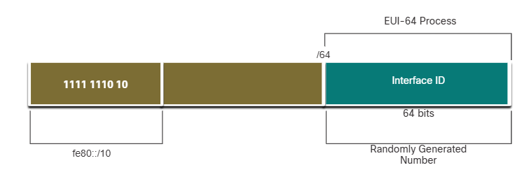

## 12.6.2 Dynamic LLAs on Windows

Operating systems, such as Windows, will typically use the same method for both a SLAAC-created GUA and a dynamically assigned LLA. See the highlighted areas in the following examples that were shown previously.

### EUI-64 Generated Interface ID

```
C:\> ipconfig
Windows IP Configuration
Ethernet adapter Local Area Connection:
Connection-specific DNS Suffix . . . . . . . . . . . :
IPv6 Address. . . . . . . . . . . . . . . . . . . : 2001:db8:acad:1:fc99:47ff:fe75:cee0
Link-local IPv6 Address . . . . . . . . . . . . . : fe80::fc99:47ff:fe75:cee0
Default Gateway . . . . . . . . . . . . . . . . . : fe80::1
C:\>
```

### Random 64-Bit Generated Interface ID

```
C:\> ipconfig
Windows IP Configuration
Ethernet adapter Local Area Connection:
Connection-specific DNS Suffix . :
IPv6 Address. . . . . . . . . . . . . . . . . . . . . . . . : 2001:db8:acad:1:50a5:8a35:a5bb:66e1
Link-local IPv6 Address . . . . . . . . . . . . . . . . . : fe80::50a5:8a35:a5bb:66e1
Default Gateway . . . . . . . . . . . . . . . . . . . . . : fe80::1
C:\>
```

## 12.6.3 Dynamic LLAs on Cisco Routers
Cisco routers automatically create an IPv6 LLA whenever a GUA is assigned to the interface. By default, Cisco IOS routers use EUI-64 to generate the interface ID for all LLAs on IPv6 interfaces. For serial interfaces, the router will use the MAC address of an Ethernet interface. Recall that an LLA must be unique only on that link or network. However, a drawback to using the dynamically assigned LLA is its long interface ID, which makes it challenging to identify and remember assigned addresses. The example displays the MAC address on the GigabitEthernet 0/0/0 interface of router R1. This address is used to dynamically create the LLA on the same interface, and also for the Serial 0/1/0 interface.

To make it easier to recognize and remember these addresses on routers, it is common to statically configure IPv6 LLAs on routers.

# IPv6 LLA Using EUI-64 on Router R1

```
R1# show interface gigabitEthernet 0/0/0
GigabitEthernet0/0/0 is up, line protocol is up
    Hardware is ISR4221-2x1GE, address is 7079.b392.3640 (bia 7079.b392.3640)
(Output omitted)
R1# show ipv6 interface brief
GigabitEthernet0/0/0 [up/up]
    FE80::7279:B3FF:FE92:3640
    2001:DB8:ACAD:1::1
GigabitEthernet0/0/1 [up/up]
    FE80::7279:B3FF:FE92:3641
    2001:DB8:ACAD:2::1
Serial0/1/0 [up/up]
    FE80::7279:B3FF:FE92:3640
    2001:DB8:ACAD:3::1
Serial0/1/1 [down/down]
    unassigned
R1#
```

## 12.6.4 Verify IPv6 Address Configuration

The figure shows the example topology.

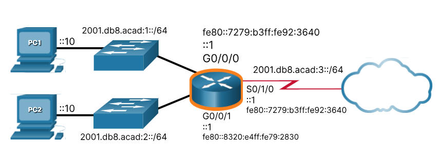

### show ipv6 interface brief

The show ipv6 interface brief command displays the IPv6 address of the Ethernet interfaces. EUI-64 uses this MAC address to generate the interface ID for the LLA. Additionally, the show ipv6 interface brief command displays abbreviated output for each of the interfaces. The [up/up] output on the same line as the interface indicates the Layer 1/Layer 2 interface state. This is the same as the Status and Protocol columns in the equivalent IPv4 command.

Notice that each interface has two IPv6 addresses. The second address for each interface is the GUA that was configured. The first address, the one that begins with fe80, is the link-local unicast address for the interface. Recall that the LLA is automatically added to the interface when a GUA is assigned.

Also, notice that the R1 Serial 0/1/0 LLA is the same as its GigabitEthernet 0/0/0 interface. Serial interfaces do not have Ethernet MAC addresses, so Cisco IOS uses the MAC address of the first available Ethernet interface. This is possible because link-local interfaces only have to be unique on that link.

## The show ipv6 interface brief Command on R1

```
R1# show ipv6 interface brief
GigabitEthernet0/0/0 [up/up]
    FE80::7279:b3ff:fe92:3640
    2001:DB8:ACAD:1::1
GigabitEthernet0/0/1 [up/up]
    FE80::8320:e4ff:fe79:2830
    2001:DB8:ACAD:2::1
Serial0/1/0 [up/up]
    FE80::7279:b3ff:fe92:3640
    2001:DB8:ACAD:3::1
Serial0/1/1 [down/down]
    unassigned
R1#
```

### show ipv6 route

As shown in the example, the show ipv6 route command can be used to verify that IPv6 networks and specific IPv6 interface addresses have been installed in the IPv6 routing table. The show ipv6 route command will only display IPv6 networks, not IPv4 networks.

Within the route table, a C next to a route indicates that this is a directly connected network. When the router interface is configured with a GUA and is in the "up/up" state, the IPv6 prefix and prefix length is added to the IPv6 routing table as a connected route.

Note: The L indicates a local route, the specific IPv6 address assigned to the interface. This is not an LLA. LLAs are not included in the routing table of the router because they are not routable addresses.

The IPv6 GUA configured on the interface is also installed in the routing table as a local route. The local route has a /128 prefix. Local routes are used by the routing table to efficiently process packets with a destination address of the router interface address.

#### The show ipv6 route Command on R1

```
R1# show ipv6 route
IPv6 Routing Table - default - 7 entries
Codes: C Connected, L Local, S Static, U Per-user Static route

C 2001:DB8:ACAD:1::/64 [0/0]
    via GigabitEthernet0/0/0, directly connected
L 2001:DB8:ACAD:1::1/128 [0/0]
    via GigabitEthernet0/0/0, receive
C 2001:DB8:ACAD:2::/64 [0/0]
    via GigabitEthernet0/0/1, directly connected
L 2001:DB8:ACAD:2::1/128 [0/0]
    via GigabitEthernet0/0/1, receive
C 2001:DB8:ACAD:3::/64 [0/0]
    via Serial0/1/0, directly connected
L 2001:DB8:ACAD:3::1/128 [0/0]
    via Serial0/1/0, receive
L FF00::/8 [0/0]
    via Nullo, receive
R1#
```

### ping

The ping command for IPv6 is identical to the command used with IPv4, except that an IPv6 address is used. As shown in the example, the command is used to verify Layer 3 connectivity between R1 and PC1. When pinging an LLA from a router, Cisco IOS will prompt the user for the exit interface. Because the destination LLA can be on one or more of its links or networks, the router needs to know which interface to send the ping to.

#### The ping Command on R1

```
R1# ping 2001:db8:acad:1::10
Type escape sequence to abort.
Sending 5, 100-byte ICMP Echos to 2001:DB8:ACAD:1::10, timeout is 2 seconds:
!!!!!
Success rate is 100 percent (5/5), round-trip min/avg/max = 1/1/1 ms
R1#
```

# 12.7 IPv6 Multicast Addresses

## 12.7.1 Assigned IPv6 Multicast Addresses

Earlier in this module, you learned that there are three broad categories of IPv6 addresses: unicast, anycast, and multicast. This topic goes into more detail about multicast addresses.

IPv6 multicast addresses are similar to IPv4 multicast addresses. Recall that a multicast address is used to send a single packet to one or more destinations (multicast group). IPv6 multicast addresses have the prefix ff00::/8.

Note: Multicast addresses can only be destination addresses and not source addresses. There are two types of IPv6 multicast addresses:
- Well-known multicast addresses
- Solicited node multicast addresses

## 12.7.2 Well-Known IPv6 Multicast Addresses

Well-known IPv6 multicast addresses are assigned. Assigned multicast addresses are reserved multicast addresses for predefined groups of devices. An assigned multicast address is a single address used to reach a group of devices running a common protocol or service. Assigned multicast addresses are used in context with specific protocols such as DHCPv6.

These are two common IPv6 assigned multicast groups:

-   **ff02::1 All-nodes multicast group** - This is a multicast group that all IPv6-enabled devices join. A packet sent to this group is received and processed by all IPv6 interfaces on the link or network. This has the same effect as a broadcast address in IPv4. The figure shows an example of communication using the all-nodes multicast address. An IPv6 router sends ICMPv6 RA messages to the all-node multicast group.
-   **ff02::2 All-routers multicast group** - This is a multicast group that all IPv6 routers join. A router becomes a member of this group when it is enabled as an IPv6 router with the *ipv6 unicast-routing* global configuration command. A packet sent to this group is received and processed by all IPv6 routers on the link or network.

### IPv6 All-Nodes Multicast: RA Message

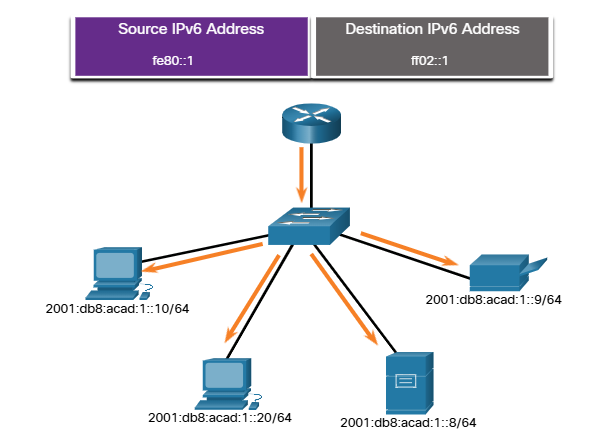

IPv6-enabled devices send ICMPv6 RS messages to the all-routers multicast address. The RS message requests an RA message from the IPv6 router to assist the device in its address configuration. The IPv6 router responds with an RA message, as shown.

## 12.7.3 Solicited-Node IPv6 Multicast Addresses
A solicited-node multicast address is similar to the all-nodes multicast address. The advantage of a solicited-node multicast address is that it is mapped to a special Ethernet multicast address. This allows the Ethernet NIC to filter the frame by examining the destination MAC address without sending it to the IPv6 process to see if the device is the intended target of the IPv6 packet.

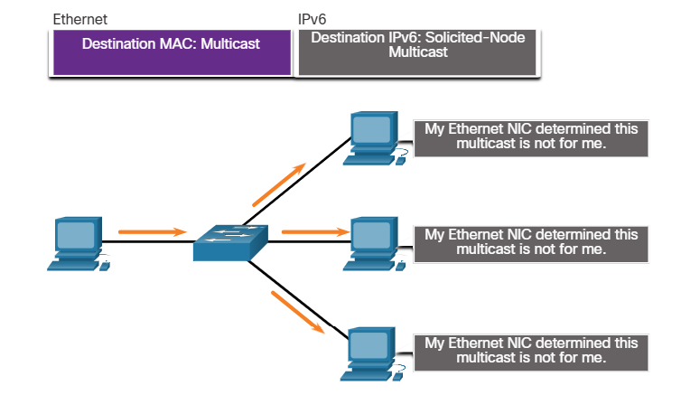

# 12.8 Subnet an IPv6 Network 

## 12.8.1 Subnet Using the Subnet ID

The introduction to this module mentioned subnetting an IPv6 network. It also said that you might discover that it is a bit easier than subnetting an IPv4 network. You are about to find out!

Recall that with IPv4, we must borrow bits from the host portion to create subnets. This is because subnetting was an afterthought with IPv4. However, IPv6 was designed with subnetting in mind. A separate subnet ID field in the IPv6 GUA is used to create subnets. As shown in the figure, the subnet ID field is the area between the Global Routing Prefix and the interface ID.

### GUA with a 16-bit Subnet ID

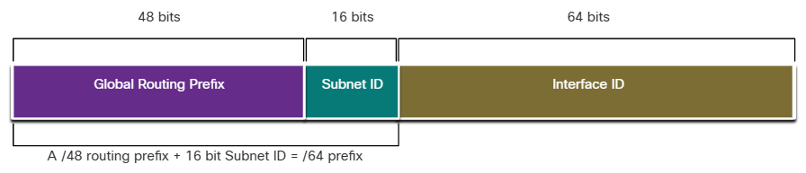

The benefit of a 128-bit address is that it can support more than enough subnets and hosts per subnet, for each network. Address conservation is not an issue. For example, if the global routing prefix is a /48, and using a typical 64 bits for the interface ID, this will create a 16-bit subnet ID:
- 16-bit subnet ID - Creates up to 65,536 subnets.
- 64-bit interface ID - Supports up to 18 quintillion host IPv6 addresses per subnet (i.e., 18,000,000,000,000,000,000).

**Note:** Subnetting into the 64-bit interface ID (or host portion) is also possible but it is rarely required.

IPv6 subnetting is also easier to implement than IPv4, because there is no conversion to binary required. To determine the next available subnet, just count up in hexadecimal.

## 12.8.2 IPv6 Subnetting Example

For example, assume an organization has been assigned the 2001:db8:acad::/48 global routing prefix with a 16 bit subnet ID. This would allow the organization to create 65,536 /64 subnets, as shown in the figure. Notice how the global routing prefix is the same for all subnets. Only the subnet ID hextet is incremented in hexadecimal for each subnet. Subnetting using a 16-bit Subnet ID

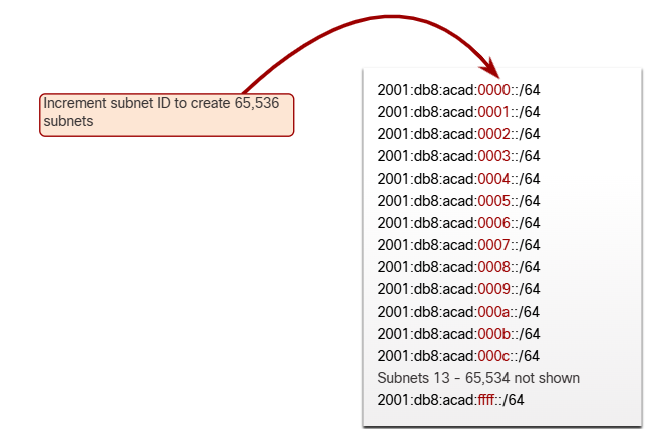

## 12.8.3 IPv6 Subnet Allocation

With over 65,536 subnets to choose from, the task of the network administrator becomes one of designing a logical scheme to address the network.

As shown in the figure, the example topology requires five subnets, one for each LAN as well as for the serial link between R1 and R2. Unlike the example for IPv4, with IPv6 the serial link subnet will have the same prefix length as the LANs. Although this may seem to "waste" addresses, address conservation is not a concern when using IPv6.

### Example Topology

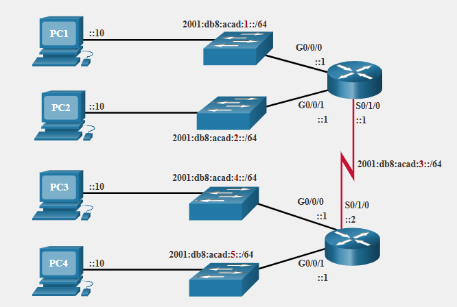

As shown in the next figure, the five IPv6 subnets were allocated, with the subnet ID field 0001 through 0005 used for this example. Each /64 subnet will provide more addresses than will ever be needed.

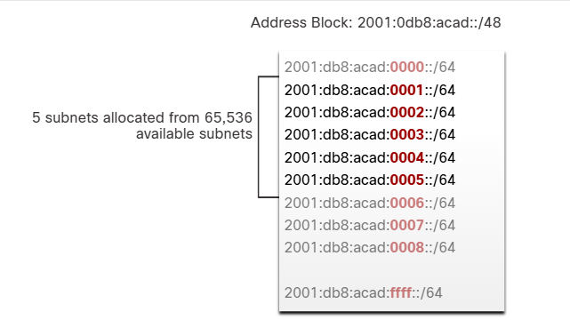

## 12.8.4 Router Configured with IPv6 Subnets

Similar to configuring IPv4, the example shows that each of the router interfaces has been configured to be on a different IPv6 subnet.

### IPv6 Address Configuration on Router R1

```
R1(config)# interface gigabitethernet 0/0/0
R1(config-if)# ipv6 address 2001:db8:acad:1::1/64
R1(config-if)# no shutdown
R1(config-if)# exit
R1(config)# interface gigabitethernet 0/0/1
R1(config-if)# ipv6 address 2001:db8:acad:2::1/64
R1(config-if)# no shutdown
R1(config-if)# exit
R1(config)# interface serial 0/1/0
R1(config-if)# ipv6 address 2001:db8:acad:3::1/64
R1(config-if)# no shutdown
```
