# Module 14: Transport Layer

# 14.1 Transportation of Data

## 14.1.1 Role of the Transport Layer 

Application layer programs generate data that must be exchanged between source and destination hosts. The transport layer is responsible for logical communications between applications running on different hosts. This may include services such as establishing a temporary session between two hosts and the reliable transmission of information for an application. As shown in the figure, the transport layer is the link between the application layer and the lower layers that are responsible for network transmission.

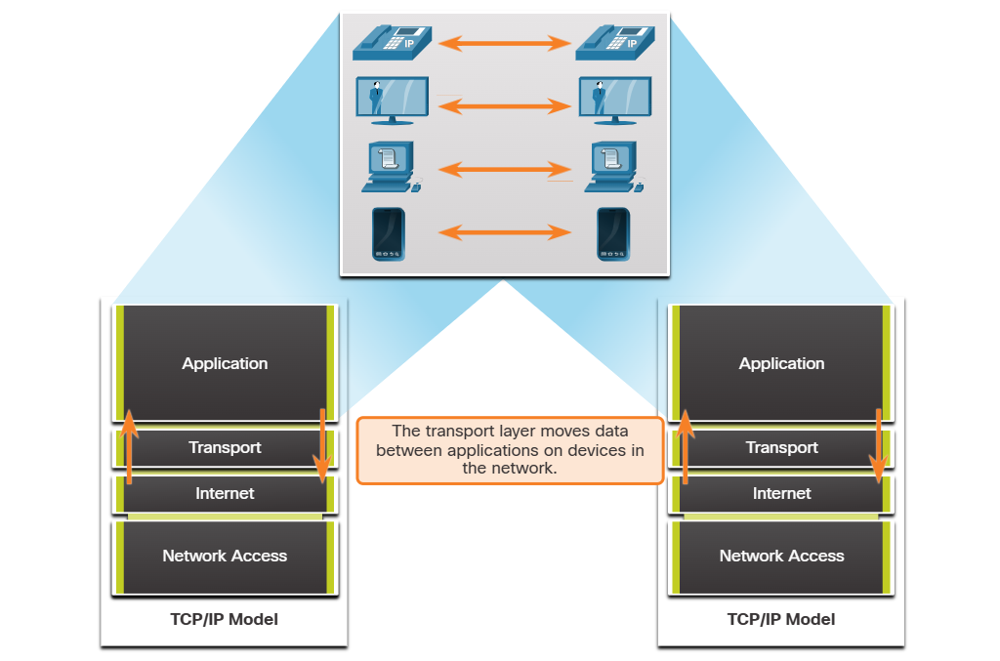

The transport layer has no knowledge of the destination host type, the type of media over which the data must travel, the path taken by the data, the congestion on a link, or the size of the network. The transport layer includes two protocols:
- Transmission Control Protocol (TCP)
- User Datagram Protocol (UDP)

## 14.1.2 Transport Layer Responsibilities

The transport layer has many responsibilities.

Tracking Individual Conversations

### Tracking Individual Conversations

At the transport layer, each set of data flowing between a source application and a destination application is known as a conversation and is tracked separately. It is the responsibility of the transport layer to maintain and track these multiple conversations.

As illustrated in the figure, a host may have multiple applications that are communicating across the network simultaneously.

Most networks have a limitation on the amount of data that can be included in a single packet. Therefore, data must be divided into manageable pieces.

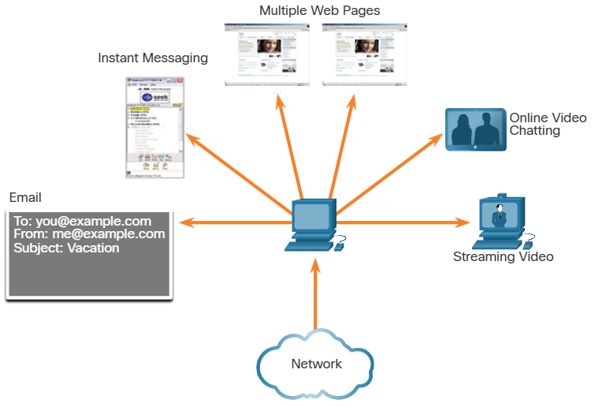

### Segmenting Data and Reassembling Segments

It is the transport layer responsibility to divide the application data into appropriately sized blocks. Depending on the transport layer protocol used, the transport layer blocks are called either segments or datagrams. The figure illustrates the transport layer using different blocks for each conversation.

The transport layer divides the data into smaller blocks (i.e., segments or datagrams) that are easier to manage and transport.

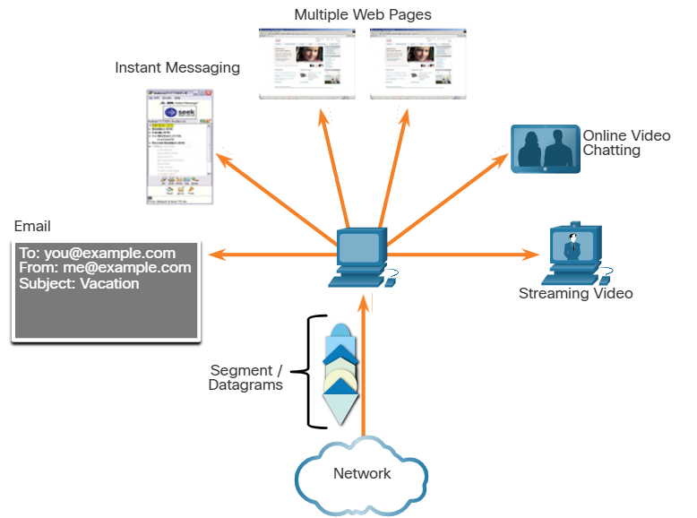

### Add Header Information

The transport layer protocol also adds header information containing binary data organized into several fields to each block of data.

It is the values in these fields that enable various transport layer protocols to perform different functions in managing data communication.

For instance, the header information is used by the receiving host to reassemble the blocks of data into a complete data stream for the receiving application layer program.

The transport layer ensures that even with multiple application running on a device, all applications receive the correct data.

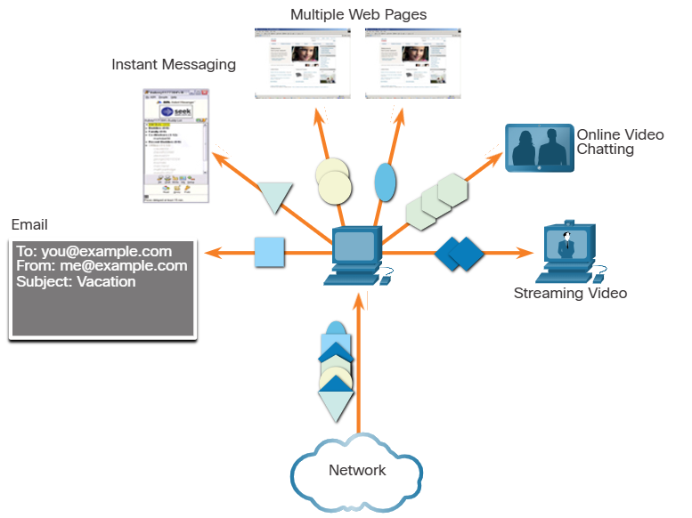

### Identifying the Applications

The transport layer must be able to separate and manage multiple communications with different transport requirement needs. To pass data streams to the proper applications, the transport layer identifies the target application using an identifier called a port number. As illustrated in the figure, each software process that needs to access the network is assigned a port number unique to that host.

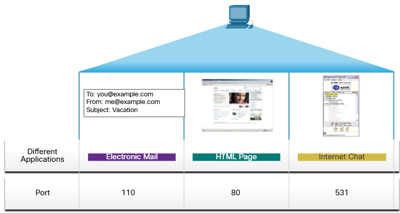

### Conversation Multiplexing

Sending some types of data (e.g., a streaming video) across a network, as one complete communication stream, can consume all the available bandwidth. This would prevent other communication conversations from occurring at the same time. It would also make error recovery and retransmission of damaged data difficult.

As shown in the figure, the transport layer uses segmentation and multiplexing to enable different communication conversations to be interleaved on the same network.

Error checking can be performed on the data in the segment, to determine if the segment was altered during transmission.

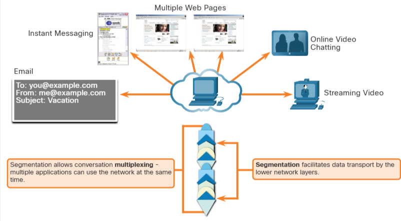

## 14.1.3 Transport Layer Protocols

IP is concerned only with the structure, addressing, and routing of packets. IP does not specify how the delivery or transportation of the packets takes place.

Transport layer protocols specify how to transfer messages between hosts, and are responsible for managing reliability requirements of a conversation. The transport layer includes the TCP and UDP protocols.

Different applications have different transport reliability requirements. Therefore, TCP/IP provides two transport layer protocols, as shown in the figure.

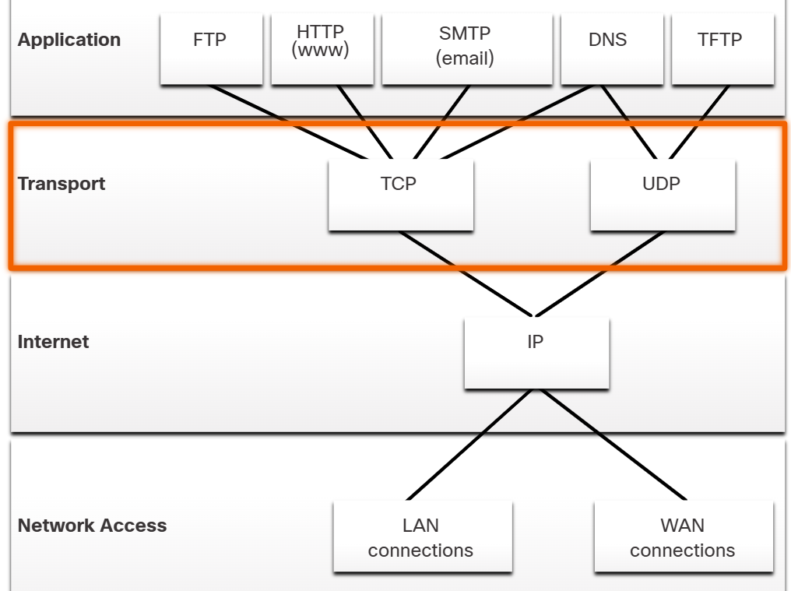

## 14.1.4 Transmission Control Protocol (TCP)

IP is concerned only with the structure, addressing, and routing of packets, from original sender to final destination. IP is not responsible for guaranteeing delivery or determining whether a connection between the sender and receiver needs to be established.

TCP is considered a reliable, full-featured transport layer protocol, which ensures that all of the data arrives at the destination. TCP includes fields which ensure the delivery of the application data. These fields require additional processing by the sending and receiving hosts.

Note: TCP divides data into segments.

TCP transport is analogous to sending packages that are tracked from source to destination. If a shipping order is broken up into several packages, a customer can check online to see the order of the delivery. TCP provides reliability and flow control using these basic operations:
- Number and track data segments transmitted to a specific host from a specific application
- Acknowledge received data
- Retransmit any unacknowledged data after a certain amount of time
- Sequence data that might arrive in wrong order
- Send data at an efficient rate that is acceptable by the receiver

In order to maintain the state of a conversation and track the information, TCP must first establish a connection between the sender and the receiver. This is why TCP is known as a connection-oriented protocol.

## 14.1.5 User Datagram Protocol (UDP)

UDP is a simpler transport layer protocol than TCP. It does not provide reliability and flow control, which means it requires fewer header fields. Because the sender and the receiver UDP processes do not have to manage reliability and flow control, this means UDP datagrams can be processed faster than TCP segments. UDP provides the basic functions for delivering datagrams between the appropriate applications, with very little overhead and data checking.

**Note:** UDP divides data into datagrams that are also referred to as segments.

UDP is a connectionless protocol. Because UDP does not provide reliability or flow control, it does not require an established connection. Because UDP does not track information sent or received between the client and server, UDP is also known as a stateless protocol.

UDP is also known as a best-effort delivery protocol because there is no acknowledgment that the data is received at the destination. With UDP, there are no transport layer processes that inform the sender of a successful delivery.

UDP is like placing a regular, nonregistered, letter in the mail. The sender of the letter is not aware of the availability of the receiver to receive the letter. Nor is the post office responsible for tracking the letter or informing the sender if the letter does not arrive at the final destination.

## 14.1.6 The Right Transport Layer Protocol for the Right Application

Some applications can tolerate some data loss during transmission over the network, but delays in transmission are unacceptable. For these applications, UDP is the better choice because it requires less network overhead. UDP is preferable for applications such as Voice over IP (VoIP). Acknowledgments and retransmission would slow down delivery and make the voice conversation unacceptable.

UDP is also used by request-and-reply applications where the data is minimal, and retransmission can be done quickly. For example, Domain Name System (DNS) uses UDP for this type of transaction. The client requests IPv4 and IPv6 addresses for a known domain name from a DNS server. If the client does not receive a response in a predetermined amount of time, it simply sends the request again.

For example, if one or two segments of a live video stream fail to arrive, it creates a momentary disruption in the stream. This may appear as distortion in the image or sound, but may not be noticeable to the user. If the destination device had to account for lost data, the stream could be delayed while waiting for retransmissions, therefore causing the image or sound to be greatly degraded. In this case, it is better to render the best media possible with the segments received, and forego reliability.

For other applications it is important that all the data arrives and that it can be processed in its proper sequence. For these types of applications, TCP is used as the transport protocol. For example, applications such as databases, web browsers, and email clients, require that all data that is sent arrives at the destination in its original condition. Any missing data could corrupt a communication, making it either incomplete or unreadable. For example, it is important when accessing banking information over the web to make sure all the information is sent and received correctly.

Application developers must choose which transport protocol type is appropriate based on the requirements of the applications. Video may be sent over TCP or UDP. Applications that stream stored audio and video typically use TCP. The application uses TCP to perform buffering, bandwidth probing, and congestion control, in order to better control the user experience.

Real-time video and voice usually use UDP, but may also use TCP, or both UDP and TCP. A video conferencing application may use UDP by default, but because many firewalls block UDP, the application can also be sent over TCP.

Applications that stream stored audio and video use TCP. For example, if your network suddenly cannot support the bandwidth needed to watch an on-demand movie, the application pauses the playback. During the pause, you might see a "buffering..." message while TCP works to re-establish the stream. When all the segments are in order and a minimum level of bandwidth is restored, your TCP session resumes, and the movie resumes playing.

The figure summarizes differences between UDP and TCP.

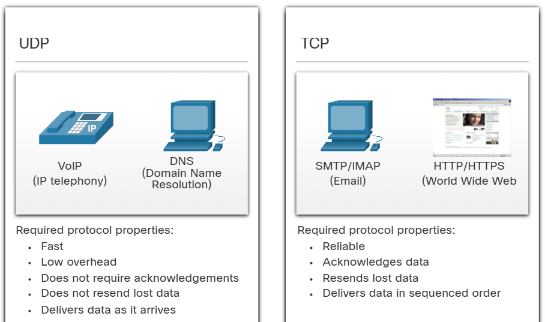

# 14.2 TCP Overview 

# 14.2.1 TCP Features

In the previous topic, you learned that TCP and UDP are the two transport layer protocols. This topic gives more details about what TCP does and when it is a good idea to use it instead of UDP.

To understand the differences between TCP and UDP, it is important to understand how each protocol implements specific reliability features and how each protocol tracks conversations.

In addition to supporting the basic functions of data segmentation and reassembly, TCP also provides the following services:

-   **Establishes a Session** - TCP is a connection-oriented protocol that negotiates and establishes a permanent connection (or session) between source and destination devices prior to forwarding any traffic. Through session establishment, the devices negotiate the amount of traffic that can be forwarded at a given time, and the communication data between the two can be closely managed.
-   **Ensures Reliable Delivery** - For many reasons, it is possible for a segment to become corrupted or lost completely, as it is transmitted over the network. TCP ensures that each segment that is sent by the source arrives at the destination.
-   **Provides Same-Order Delivery** - Because networks may provide multiple routes that can have different transmission rates, data can arrive in the wrong order. By numbering and sequencing the segments, TCP ensures segments are reassembled into the proper order.
-   **Supports Flow Control** - Network hosts have limited resources (i.e., memory and processing power). When TCP is aware that these resources are overtaxed, it can request that the sending application reduce the rate of data flow. This is done by TCP regulating the amount of data the source transmits. Flow control can prevent the need for retransmission of the data when the resources of the receiving host are overwhelmed.

For more information on TCP, search the internet for the RFC 793.

## 14.2.2 TCP Header

TCP is a stateful protocol which means it keeps track of the state of the communication session. To track the state of a session, TCP records which information it has sent and which information has been acknowledged. The stateful session begins with the session establishment and ends with the session termination.

A TCP segment adds 20 bytes (i.e., 160 bits) of overhead when encapsulating the application layer data. The figure shows the fields in a TCP header.

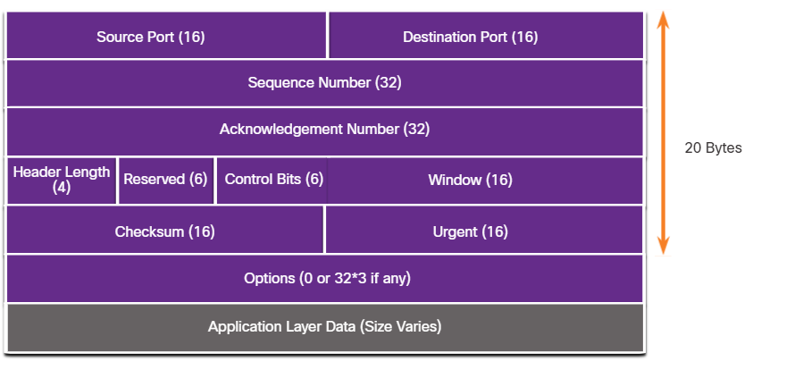

## 14.2.3 TCP Header Fields

The table identifies and describes the ten fields in a TCP header.

| TCP Header Field | Description |
|---|---|
| Source Port | A 16-bit field used to identify the source application by port number. |
| Destination Port | A 16-bit field used to identify the destination application by port number. |
| Sequence Number | A 32-bit field used for data reassembly purposes. |
| Acknowledgment Number | A 32-bit field used to indicate that data has been received and the next byte expected from the source. |
| Header Length | A 4-bit field known as "data offset" that indicates the length of the TCP segment header. |
| Reserved | A 6-bit field that is reserved for future use. |
| Control bits | A 6-bit field that includes bit codes, or flags, which indicate the purpose and function of the TCP segment. |
| Window size | A 16-bit field used to indicate the number of bytes that can be accepted at one time. |
| Checksum | A 16-bit field used for error checking of the segment header and data. |
| Urgent | A 16-bit field used to indicate if the contained data is urgent. |

## 14.2.4 Applications that use TCP

TCP is a good example of how the different layers of the TCP/IP protocol suite have specific roles. TCP handles all tasks associated with dividing the data stream into segments, providing reliability, controlling data flow, and reordering segments. TCP frees the application from having to manage any of these tasks. Applications, like those shown in the figure, can simply send the data stream to the transport layer and use the services of TCP.

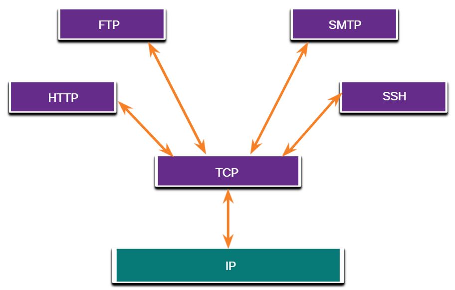

# 14.3 UDP Overview 

## 14.3.1 UDP Features

This topic will cover UDP, what it does, and when it is a good idea to use it instead of TCP. UDP is a best-effort transport protocol. UDP is a lightweight transport protocol that offers the same data segmentation and reassembly as TCP, but without TCP reliability and flow control.

UDP is such a simple protocol that it is usually described in terms of what it does not do compared to TCP.

UDP features include the following:
-   Data is reconstructed in the order that it is received.
-   Any segments that are lost are not resent.
-   There is no session establishment.
-   The sending is not informed about resource availability.

For more information on UDP, search the internet for the RFC.

## 14.3.2 UDP Header

UDP is a stateless protocol, meaning neither the client, nor the server, tracks the state of the communication session. If reliability is required when using UDP as the transport protocol, it must be handled by the application.

One of the most important requirements for delivering live video and voice over the network is that the data continues to flow quickly. Live video and voice applications can tolerate some data loss with minimal or no noticeable effect, and are perfectly suited to UDP.

The blocks of communication in UDP are called datagrams, or segments. These datagrams are sent as best effort by the transport layer protocol.

The UDP header is far simpler than the TCP header because it only has four fields and requires 8 bytes (i.e., 64 bits). The figure shows the fields in a UDP header.

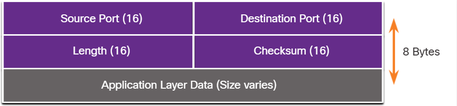

## 14.3.3 UDP Header Fields

The table identifies and describes the four fields in a UDP header.

| UDP Header Field | Description |
|---|---|
| Source Port | A 16-bit field used to identify the source application by port number. |
| Destination Port | A 16-bit field used to identify the destination application by port number. |
| Length | A 16-bit field that indicates the length of the UDP datagram header. |
| Checksum | A 16-bit field used for error checking of the datagram header and data. |

## 14.3.4 Applications that use UDP

There are three types of applications that are best suited for UDP:
-   **Live video and multimedia applications** - These applications can tolerate some data loss, but require little or no delay. Examples include VoIP and live streaming video.
-   **Simple request and reply applications** - Applications with simple transactions where a host sends a request and may or may not receive a reply. Examples include DNS and DHCP.
-   **Applications that handle reliability themselves** - Unidirectional communications where flow control, error detection, acknowledgments, and error recovery is not required, or can be handled by the application. Examples include SNMP and TFTP.

The figure identifies applications that require UDP.

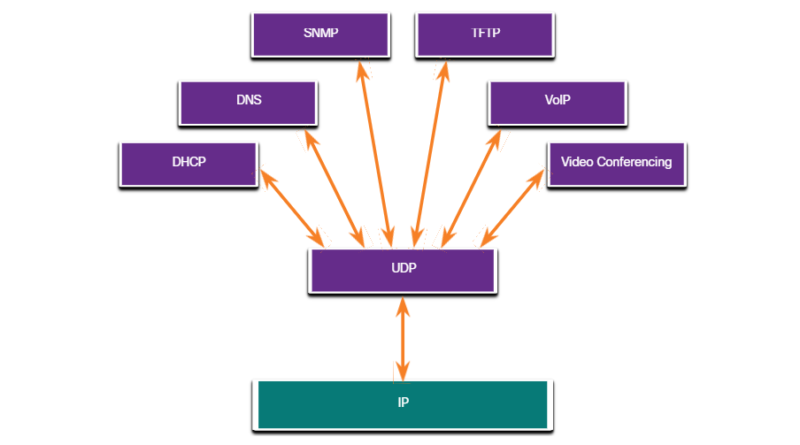

Although DNS and SNMP use UDP by default, both can also use TCP. DNS will use TCP if the DNS request or DNS response is more than 512 bytes, such as when a DNS response includes many name resolutions. Similarly, under some situations the network administrator may want to configure SNMP to use TCP.

# 14.4 Port Numbers 

## 14.4.1 Multiple Separate Communications

As you have learned, there are some situations in which TCP is the right protocol for the job, and other situations in which UDP should be used. No matter what type of data is being transported, both TCP and UDP use port numbers.

The TCP and UDP transport layer protocols use port numbers to manage multiple, simultaneous conversations. As shown in the figure, the TCP and UDP header fields identify a source and destination application port number.


The source port number is associated with the originating application on the local host whereas the destination port number is associated with the destination application on the remote host. For instance, assume a host is initiating a web page request from a web server. When the host initiates the web page request, the source port number is dynamically generated by the host to uniquely identify the conversation. Each request generated by a host will use a different dynamically created source port number. This process allows multiple conversations to occur simultaneously.

In the request, the destination port number is what identifies the type of service being requested of the destination web server.. For example, when a client specifies port 80 in the destination port, the server that receives the message knows that web services are being requested.

A server can offer more than one service simultaneously such as web services on port 80 while it offers File Transfer Protocol (FTP) connection establishment on port 21.

## 14.4.2 Socket Pairs

The source and destination ports are placed within the segment. The segments are then encapsulated within an IP packet. The IP packet contains the IP address of the source and destination. The combination of the source IP address and source port number, or the destination IP address and destination port number is known as a socket. In the example in the figure, the PC is simultaneously requesting FTP and web services from the destination server.

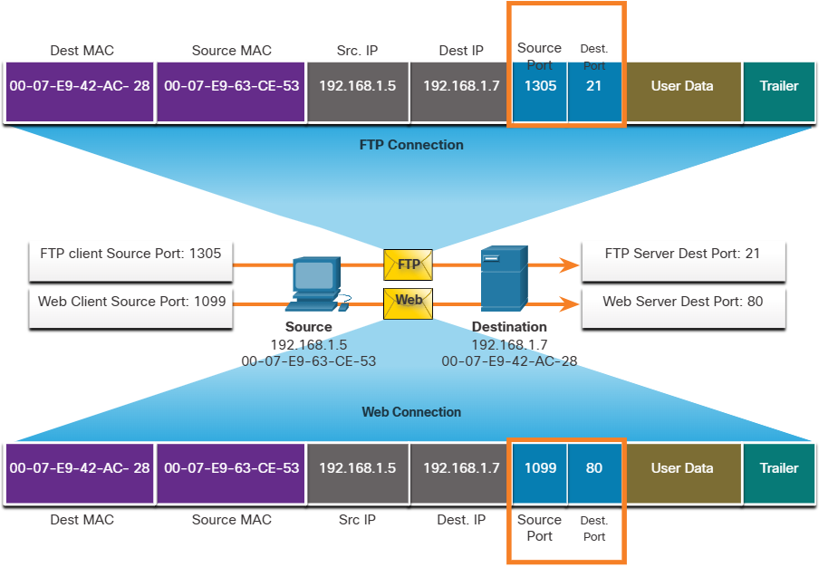

In the example, the FTP request generated by the PC includes the Layer 2 MAC addresses and the Layer 3 IP addresses. The request also identifies the source port number 1305 (i.e., dynamically generated by the host) and destination port, identifying the FTP services on port 21. The host also has requested a web page from the server using the same Layer 2 and Layer 3 addresses. However, it is using the source port number 1099 (i.e., dynamically generated by the host) and destination port identifying the web service on port 80.

The socket is used to identify the server and service being requested by the client. A client socket might look like this, with 1099 representing the source port number: 192.168.1.5:1099

The socket on a web server might be 192.168.1.7:80

Together, these two sockets combine to form a socket pair. 192.168.1.5:1099, 192.168.1.7:80

Sockets enable multiple processes, running on a client, to distinguish themselves from each other, and multiple connections to a server process to be distinguished from each other.

The source port number acts as a return address for the requesting application. The transport layer keeps track of this port and the application that initiated the request so that when a response is returned, it can be forwarded to the correct application.

## 14.4.3 Port Number Groups

The Internet Assigned Numbers Authority (IANA) is the standards organization responsible for assigning various addressing standards, including the 16-bit port numbers. The 16 bits used to identify the source and destination port numbers provides a range of ports from 0 through 65535.

The IANA has divided the range of numbers into the following three port groups.

| Port Group | Number
Range | Description |
|---|---|---|
| Well-known Ports | 0 to 1,023 | - These port numbers are reserved for common or popular services and applications
such as web browsers, email clients, and remote access clients.
- Defined well-known ports for common server applications enables clients to easily
identify the associated service required. |
| Registered Ports | 1,024 to
49,151 | - These port numbers are assigned by IANA to a requesting entity to use with specific
processes or applications.
- These processes are primarily individual applications that a user has chosen to install,
rather than common applications that would receive a well-known port number.
- For example, Cisco has registered port 1812 for its RADIUS server authentication
process. |
| Private and/or
Dynamic Ports | 49,152 to
65,535 | - These ports are also known as ephemeral ports.
- The client's OS usually assign port numbers dynamically when a connection to a
service is initiated.
- The dynamic port is then used to identify the client application during communication. |

Note: Some client operating systems may use registered port numbers instead of dynamic port numbers for assigning source ports.

The table displays some common well-known port numbers and their associated applications.

### Well-Known Port Numbers

| Port Number | Protocol | Application |
|---|---|---|
| 20 | TCP | File Transfer Protocol (FTP) - Data |
| 21 | TCP | File Transfer Protocol (FTP) - Control |
| 22 | TCP | Secure Shell (SSH) |
| 23 | TCP | Telnet |
| 25 | TCP | Simple Mail Transfer Protocol (SMTP) |
| 53 | UDP, TCP | Domain Name System (DNS) |
| 67 | UDP | Dynamic Host Configuration Protocol (DHCP) - Server |
| 68 | UDP | Dynamic Host Configuration Protocol - Client |
| 69 | UDP | Trivial File Transfer Protocol (TFTP) |
| 80 | TCP | Hypertext Transfer Protocol (HTTP) |
| 110 | TCP | Post Office Protocol version 3 (POP3) |
| 143 | TCP | Internet Message Access Protocol (IMAP) |
| 161 | UDP | Simple Network Management Protocol (SNMP) |
| 443 | TCP | Hypertext Transfer Protocol Secure (HTTPS) |

Some applications may use both TCP and UDP. For example, DNS uses UDP when clients send requests to a DNS server. However, communication between two DNS servers always uses TCP.

Search the IANA website for port registry to view the full list of port numbers and associated applications.

## 14.4.4 The netstat Command

Unexplained TCP connections can pose a major security threat. They can indicate that something or someone is connected to the local host. Sometimes it is necessary to know which active TCP connections are open and running on a networked host. Netstat is an important network utility that can be used to verify those connections. As shown below, enter the command netstat to list the protocols in use, the local address and port numbers, the foreign address and port numbers, and the connection state.

```
C:\> netstat
Active Connections
Proto Local Address          Foreign Address          State
TCP   192.168.1.124:3126     192.168.0.2:netbios-ssn  ESTABLISHED
TCP   192.168.1.124:3158     207.138.126.152:http     ESTABLISHED
TCP   192.168.1.124:3159     207.138.126.169:http     ESTABLISHED
TCP   192.168.1.124:3160     207.138.126.169:http     ESTABLISHED
TCP   192.168.1.124:3161     sc.msn.com:http          ESTABLISHED
TCP   192.168.1.124:3166     www.cisco.com:http       ESTABLISHED
(output omitted)
C:\>
```

By default, the netstat command will attempt to resolve IP addresses to domain names and port numbers to well-known applications.

The -n option can be used to display IP addresses and port numbers in their numerical form.

# 14.5 TCP Communication Process

# 14.5.1 TCP Server Processes

You already know the fundamentals of TCP. Understanding the role of port numbers will help you to grasp the details of the TCP communication process. In this topic, you will also learn about the TCP three-way handshake and session termination processes.

Each application process running on a server is configured to use a port number. The port number is either automatically assigned or configured manually by a system administrator.

An individual server cannot have two services assigned to the same port number within the same transport layer services. For example, a host running a web server application and a file transfer application cannot have both configured to use the same port, such as TCP port 80.

An active server application assigned to a specific port is considered open, which means that the transport layer accepts, and processes segments addressed to that port. Any incoming client request addressed to the correct socket is accepted, and the data is passed to the server application. There can be many ports open simultaneously on a server, one for each active server application.


### Clients Sending TCP Requests

Client 1 is requesting web services and Client 2 is requesting email service of the same sever.

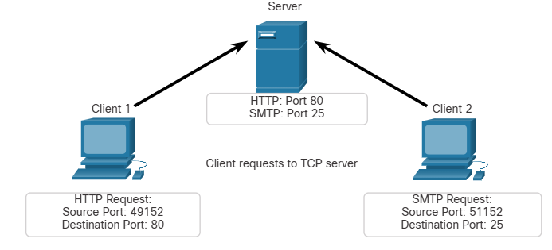

### Request Destination Ports

Client 1 is requesting web services using well-known destination port 80 (HTTP) and Client 2 is requesting email service using well- known port 25 (SMTP).

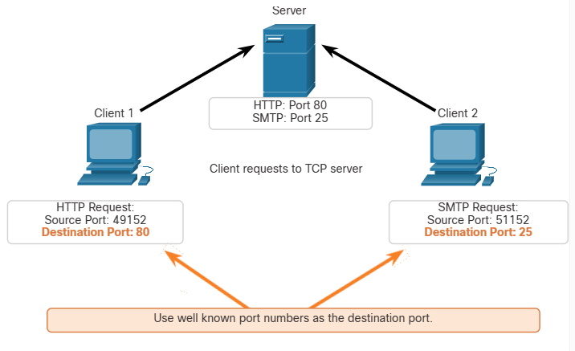

### Request Source Ports

Client requests dynamically generate a source port number. In this case, Client 1 is using source port 49152 and Client 2 is using source port 51152.

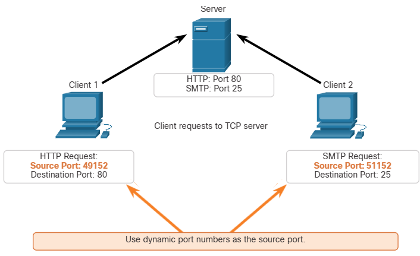

### Response Destination Ports

When the server responds to the client requests, it reverses the destination and source ports of the initial request. Notice that the Server response to the web request now has destination port 49152 and the email response now has destination port 51152.

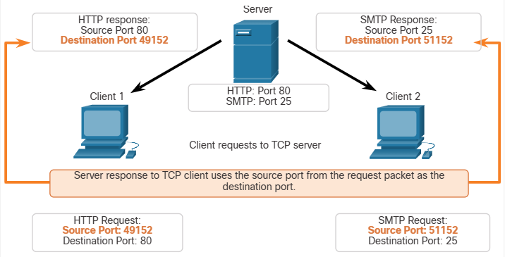

### Response Source Ports

The source port in the server response is the original destination port in the initial requests.

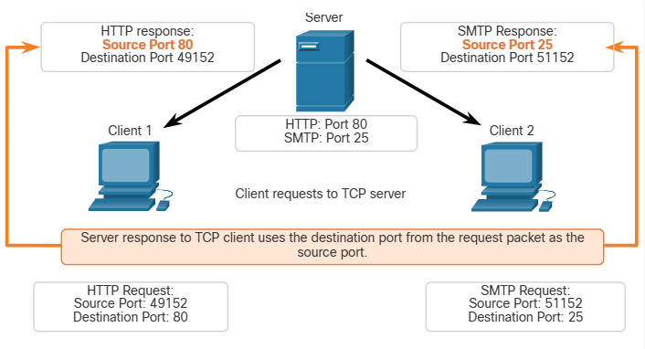

## 14.5.2 TCP Connection Establishment

In some cultures, when two persons meet, they often greet each other by shaking hands. Both parties understand the act of shaking hands as a signal for a friendly greeting. Connections on the network are similar. In TCP connections, the host client establishes the connection with the server using the three-way handshake process.

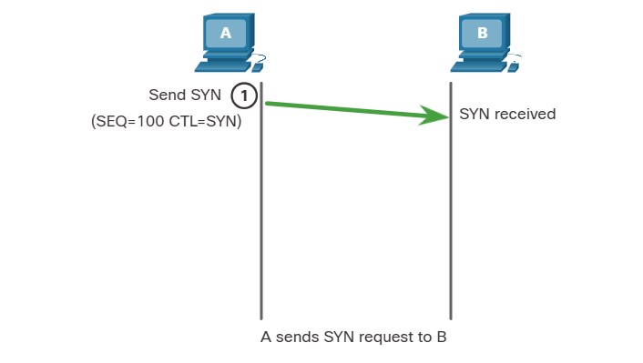

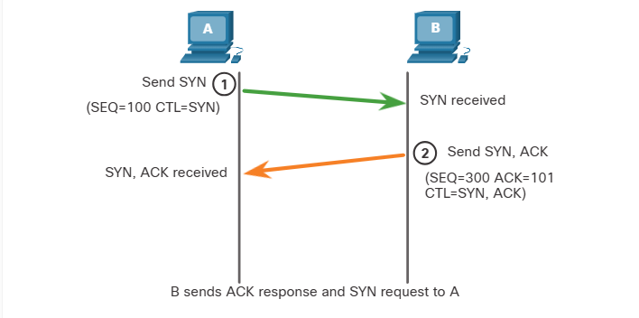

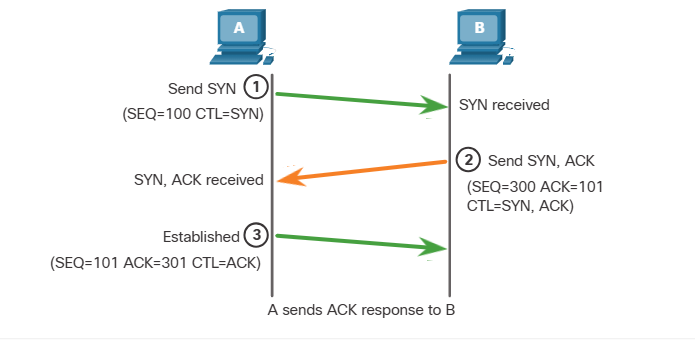

The three-way handshake validates that the destination host is available to communicate. In this example, host A has validated that host B is available.

## 14.5.3 Session Termination

To close a connection, the Finish (FIN) control flag must be set in the segment header. To end each one-way TCP session, a two-way handshake, consisting of a FIN segment and an Acknowledgment (ACK) segment, is used. Therefore, to terminate a single conversation supported by TCP, four exchanges are needed to end both sessions. Either the client or the server can initiate the termination.

In the example, the terms client and server are used as a reference for simplicity, but any two hosts that have an open session can initiate the termination process.

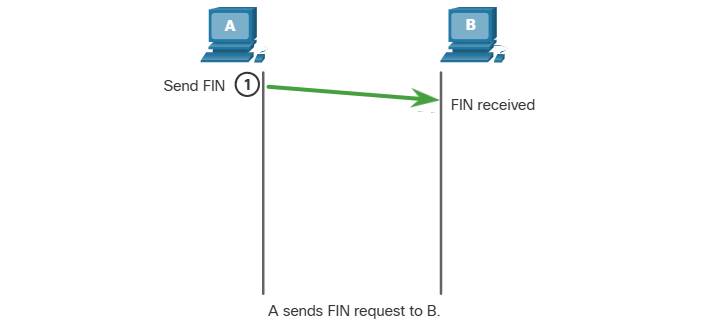


## 14.5.4 TCP Three-way Handshake Analysis

Hosts maintain state, track each data segment within a session, and exchange information about what data is received using the information in the TCP header. TCP is a full-duplex protocol, where each connection represents two one-way communication sessions. To establish the connection, the hosts perform a three-way handshake. As shown in the figure, control bits in the TCP header indicate the progress and status of the connection.

These are the functions of the three-way handshake:
- It establishes that the destination device is present on the network.
- It verifies that the destination device has an active service and is accepting requests on the destination port number that the initiating client intends to use.
- It informs the destination device that the source client intends to establish a communication session on that port number.

After the communication is completed the sessions are closed, and the connection is terminated. The connection and session mechanisms enable TCP reliability function.

### Control Bits Field

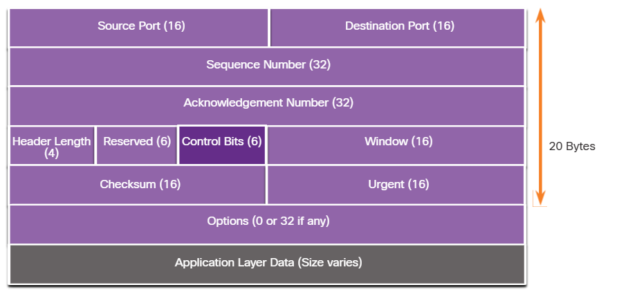

The six bits in the Control Bits field of the TCP segment header are also known as flags. A flag is a bit that is set to either on or off. The six control bits flags are as follows:
- URG - Urgent pointer field significant
- ACK - Acknowledgment flag used in connection establishment and session termination
- PSH - Push function
- RST - Reset the connection when an error or timeout occurs
- SYN - Synchronize sequence numbers used in connection establishment
- FIN - No more data from sender and used in session termination

Search the internet to learn more about the PSH and URG flags.

# 14.6 Reliability and Flow Control 

## 14.6.1 TCP Reliability - Guaranteed and Ordered Delivery

The reason that TCP is the better protocol for some applications is because, unlike UDP, it resends dropped packets and numbers packets to indicate their proper order before delivery. TCP can also help maintain the flow of packets so that devices do not become overloaded. This topic covers these features of TCP in detail.

There may be times when TCP segments do not arrive at their destination. Other times, the TCP segments might arrive out of order. For the original message to be understood by the recipient, all the data must be received and the data in these segments must be reassembled into the original order. Sequence numbers are assigned in the header of each packet to achieve this goal. The sequence number represents the first data byte of the TCP segment.

During session setup, an initial sequence number (ISN) is set. This ISN represents the starting value of the bytes that are transmitted to the receiving application. As data is transmitted during the session, the sequence number is incremented by the number of bytes that have been transmitted. This data byte tracking enables each segment to be uniquely identified and acknowledged. Missing segments can then be identified.

The ISN does not begin at one but is effectively a random number. This is to prevent certain types of malicious attacks. For simplicity, we will use an ISN of 1 for the examples in this chapter.

Segment sequence numbers indicate how to reassemble and reorder received segments, as shown in the figure.

### TCP Segments Are Reordered at the Destination

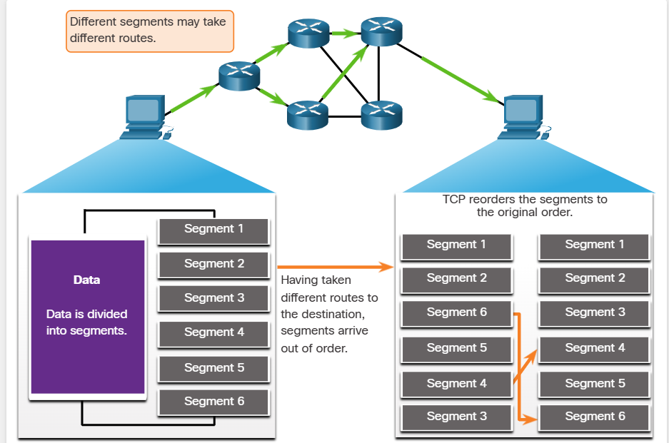

The receiving TCP process places the data from a segment into a receiving buffer. Segments are then placed in the proper sequence order and passed to the application layer when reassembled. Any segments that arrive with sequence numbers that are out of order are held for later processing. Then, when the segments with the missing bytes arrive, these segments are processed in order.

## 14.6.3 TCP Reliability – Data Loss and Retransmission

No matter how well designed a network is, data loss occasionally occurs. TCP provides methods of managing these segment losses. Among these is a mechanism to retransmit segments for unacknowledged data.

The sequence (SEQ) number and acknowledgement (ACK) number are used together to confirm receipt of the bytes of data contained in the transmitted segments. The SEQ number identifies the first byte of data in the segment being transmitted. TCP uses the ACK number sent back to the source to indicate the next byte that the receiver expects to receive. This is called expectational acknowledgement.

Prior to later enhancements, TCP could only acknowledge the next byte expected. For example, in the figure, using segment numbers for simplicity, host A sends segments 1 through 10 to host B. If all the segments arrive except for segments 3 and 4, host B would reply with acknowledgment specifying that the next segment expected is segment 3. Host A has no idea if any other segments arrived or not. Host

A would, therefore, resend segments 3 through 10. If all the resent segments arrived successfully, segments 5 through 10 would be duplicates. This can lead to delays, congestion, and inefficiencies.

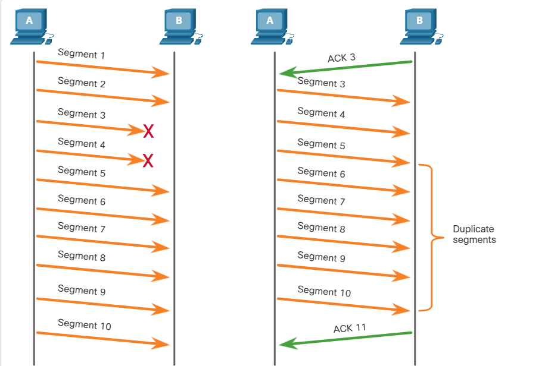

Host operating systems today typically employ an optional TCP feature called selective acknowledgment (SACK), negotiated during the three-way handshake. If both hosts support SACK, the receiver can explicitly acknowledge which segments (bytes) were received including any discontinuous segments. The sending host would therefore only need to retransmit the missing data. For example, in the next figure, again using segment numbers for simplicity, host A sends segments 1 through 10 to host B. If all the segments arrive except for segments 3 and 4, host B can acknowledge that it has received segments 1 and 2 (ACK 3), and selectively acknowledge segments 5 through 10 (SACK 5-10). Host A would only need to resend segments 3 and 4.

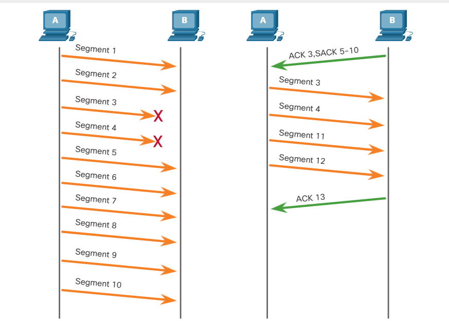

Note: TCP typically sends ACKs for every other packet, but other factors beyond the scope of this topic may alter this behavior. TCP uses timers to know how long to wait before resending a segment. In the figure, play the video and click the link to download the PDF file. The video and PDF file examine TCP data loss and retransmission.

## 14.6.5 TCP Flow Control - Window Size and Acknowledgments

TCP also provides mechanisms for flow control. Flow control is the amount of data that the destination can receive and process reliably. Flow control helps maintain the reliability of TCP transmission by adjusting the rate of data flow between source and destination for a given session. To accomplish this, the TCP header includes a 16-bit field called the window size.

The figure shows an example of window size and acknowledgments.

### TCP Window Size Example 

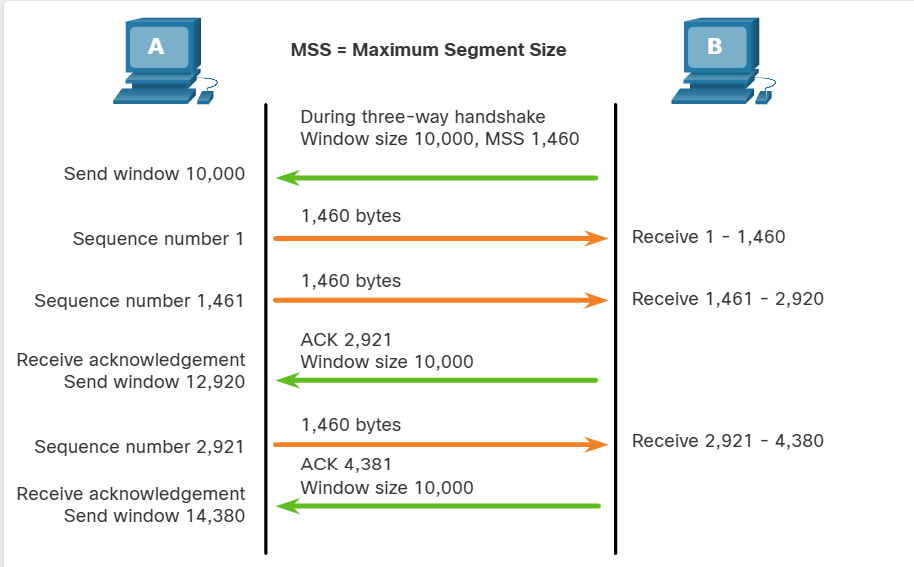

The window size determines the number of bytes that can be sent before expecting an acknowledgment. The acknowledgment number is the number of the next expected byte.

The window size is the number of bytes that the destination device of a TCP session can accept and process at one time. In this example, the PC B initial window size for the TCP session is 10,000 bytes. Starting with the first byte, byte number 1, the last byte PC A can send without receiving an acknowledgment is byte 10,000. This is known as the send window of PC A. The window size is included in every TCP segment so the destination can modify the window size at any time depending on buffer availability.

The initial window size is agreed upon when the TCP session is established during the three-way handshake. The source device must limit the number of bytes sent to the destination device based on the window size of the destination. Only after the source device receives an acknowledgment that the bytes have been received, can it continue sending more data for the session. Typically, the destination will not wait for all the bytes for its window size to be received before replying with an acknowledgment. As the bytes are received and processed, the destination will send acknowledgments to inform the source that it can continue to send additional bytes.

For example, it is typical that PC B would not wait until all 10,000 bytes have been received before sending an acknowledgment. This means PC A can adjust its send window as it receives acknowledgments from PC B. As shown in the figure, when PC A receives an acknowledgment with the acknowledgment number 2,921, which is the next expected byte. The PC A send window will increment 2,920 bytes. This changes the send window from 10,000 bytes to 12,920. PC A can now continue to send up to another 10,000 bytes to PC B as long as it does not send more than its new send window at 12,920.

A destination sending acknowledgments as it processes bytes received, and the continual adjustment of the source send window, is known as sliding windows. In the previous example, the send window of PC A increments or slides over another 2,921 bytes from 10,000 to 12,920.

If the availability of the destination's buffer space decreases, it may reduce its window size to inform the source to reduce the number of bytes it should send without receiving an acknowledgment.

Note: Devices today use the sliding windows protocol. The receiver typically sends an acknowledgment after every two segments it receives. The number of segments received before being acknowledged may vary. The advantage of sliding windows is that it allows the sender to continuously transmit segments, as long as the receiver is acknowledging previous segments. The details of sliding windows are beyond the scope of this course.

## 14.6.6 TCP Flow Control – Maximum Segment Size (MSS)

In the figure, the source is transmitting 1,460 bytes of data within each TCP segment. This is typically the Maximum Segment Size (MSS) that the destination device can receive. The MSS is part of the options field in the TCP header that specifies the largest amount of data, in bytes, that a device can receive in a single TCP segment. The MSS size does not include the TCP header. The MSS is typically included during the three-way handshake.

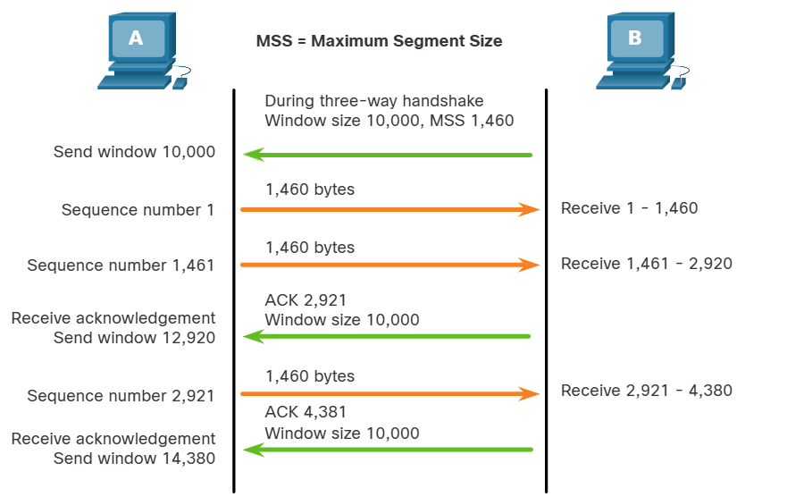

A common MSS is 1,460 bytes when using IPv4. A host determines the value of its MSS field by subtracting the IP and TCP headers from the Ethernet maximum transmission unit (MTU). On an Ethernet interface, the default MTU is 1500 bytes. Subtracting the IPv4 header of 20 bytes and the TCP header of 20 bytes, the default MSS size will be 1460 bytes, as shown in the figure.

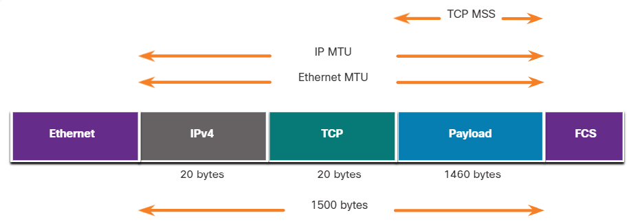

## 14.6.7 TCP Flow Control - Congestion Avoidance

When congestion occurs on a network, it results in packets being discarded by the overloaded router. When packets containing TCP segments do not reach their destination, they are left unacknowledged. By determining the rate at which TCP segments are sent but not acknowledged, the source can assume a certain level of network congestion.

Whenever there is congestion, retransmission of lost TCP segments from the source will occur. If the retransmission is not properly controlled, the additional retransmission of the TCP segments can make the congestion even worse. Not only are new packets with TCP segments introduced into the network, but the feedback effect of the retransmitted TCP segments that were lost will also add to the congestion. To avoid and control congestion, TCP employs several congestion handling mechanisms, timers, and algorithms.

If the source determines that the TCP segments are either not being acknowledged or not acknowledged in a timely manner, then it can reduce the number of bytes it sends before receiving an acknowledgment. As illustrated in the figure, PC A senses there is congestion and therefore, reduces the number of bytes it sends before receiving an acknowledgment from PC B.

## TCP Congestion Control

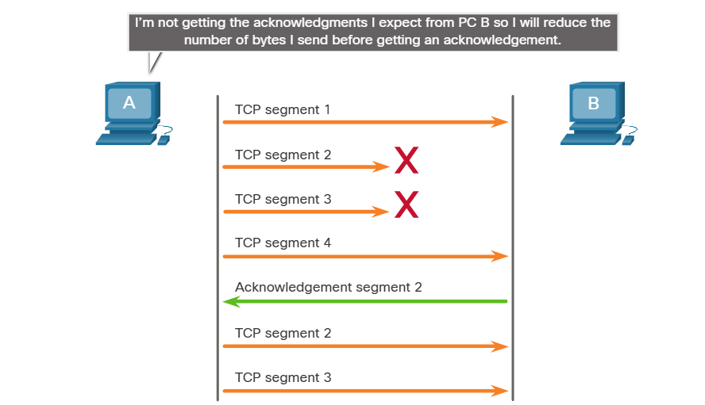

Acknowledgment numbers are for the next expected byte and not for a segment. The segment numbers used are simplified for illustration purposes.

Notice that it is the source that is reducing the number of unacknowledged bytes it sends and not the window size determined by the destination.

Note: Explanations of actual congestion handling mechanisms, timers, and algorithms are beyond the scope of this course.

# 14.7 UDP Communication 

## 14.7.1 UDP Low Overhead versus Reliability

As explained before, UDP is perfect for communications that need to be fast, like VoIP. This topic explains in detail why UDP is perfect for some types of transmissions. As shown in the figure, UDP does not establish a connection. UDP provides low overhead data transport because it has a small datagram header and no network management traffic.

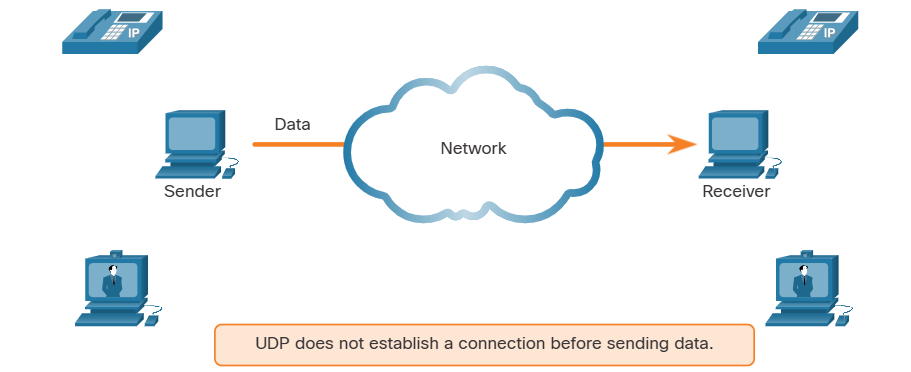

## 14.7.2 UDP Datagram Reassembly

Like segments with TCP, when UDP datagrams are sent to a destination, they often take different paths and arrive in the wrong order. UDP does not track sequence numbers the way TCP does. UDP has no way to reorder the datagrams into their transmission order, as shown in the figure.

Therefore, UDP simply reassembles the data in the order that it was received and forwards it to the application. If the data sequence is important to the application, the application must identify the proper sequence and determine how the data should be processed.

### UDP: Connectionless and Unreliable

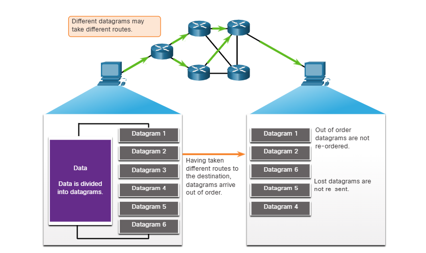

## 14.7.3 UDP Server Processes and Requests

Like TCP-based applications, UDP-based server applications are assigned well-known or registered port numbers, as shown in the figure. When these applications or processes are running on a server, they accept the data matched with the assigned port number. When UDP receives a datagram destined for one of these ports, it forwards the application data to the appropriate application based on its port number.

### UDP Server Listening for Requests

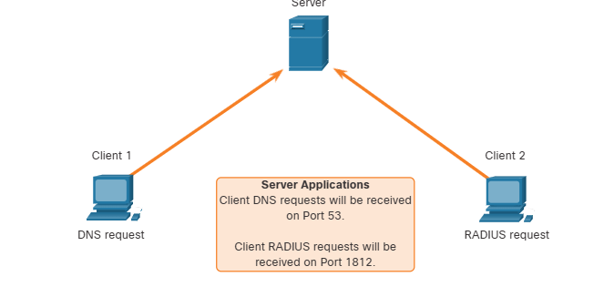

Note: The Remote Authentication Dial-in User Service (RADIUS) server shown in the figure provides authentication, authorization, and accounting services to manage user access. The operation of RADIUS is beyond the scope for this course.

## 14.7.4 UDP Client Processes

As with TCP, client-server communication is initiated by a client application that requests data from a server process. The UDP client process dynamically selects a port number from the range of port numbers and uses this as the source port for the conversation. The destination port is usually the well-known or registered port number assigned to the server process.

After a client has selected the source and destination ports, the same pair of ports are used in the header of all datagrams in the transaction. For the data returning to the client from the server, the source and destination port numbers in the datagram header are reversed.

### Clients Sending UDP Requests

Client 1 is sending a DNS request while Client 2 is requesting RADIUS authentication services of the same server.

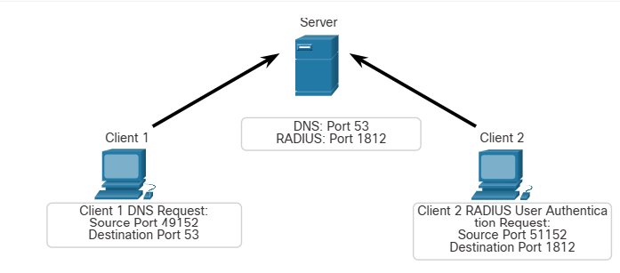

### UDP Request Destination Ports 

Client 1 is sending a DNS request using the well-known destination port 53 while Client 2 is requesting RADIUS authentication services using the registered destination port 1812.

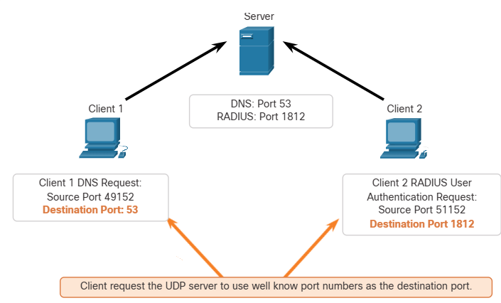

### UDP Request Source Ports

The requests of the clients dynamically generate source port numbers. In this case, Client 1 is using source port 49152 and Client 2 is using source port 51152.

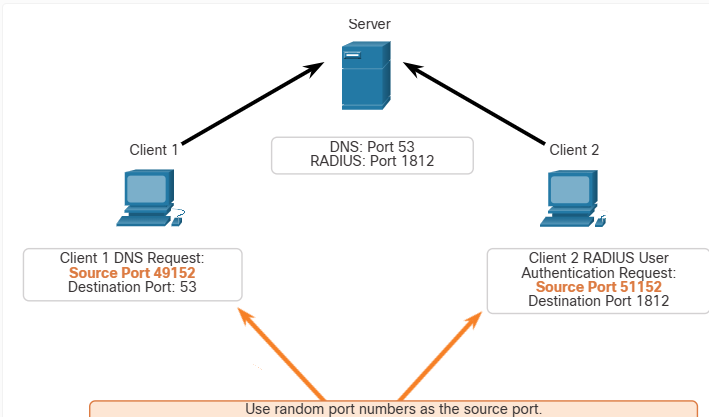

### UDP Response Destination 

When the server responds to the client requests, it reverses the destination and source ports of the initial request. In the Server response to the DNS request is now destination port 49152 and the RADIUS authentication response is now destination port 51152.

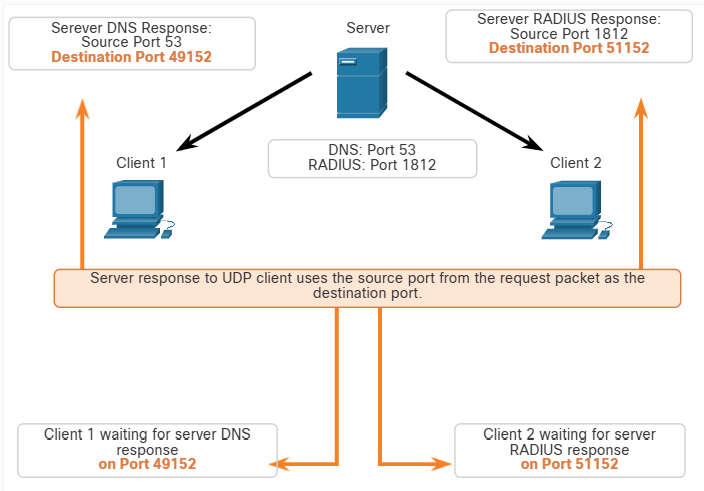

### UDP Response Source Ports

The source ports in the server response are the original destination ports in the initial requests.

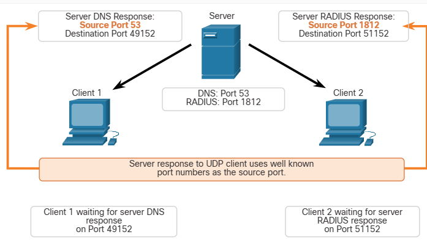
