# Module 15: Application Layer 

# 15.1 Application, Presentation, and Session 

## 15.1.1 Application Layer

In the OSI and the TCP/IP models, the application layer is the closest layer to the end user. As shown in the figure, it is the layer that provides the interface between the applications used to communicate, and the underlying network over which messages are transmitted. Application layer protocols are used to exchange data between programs running on the source and destination hosts.

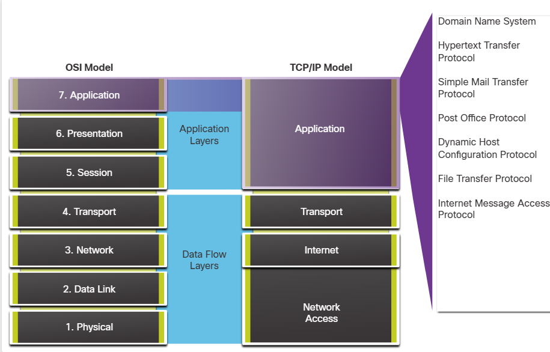


Based on the TCP/IP model, the upper three layers of the OSI model (application, presentation, and session) define functions of the TCP/IP application layer. There are many application layer protocols, and new protocols are always being developed. Some of the most widely known application layer protocols include Hypertext Transfer Protocol (HTTP), File Transfer Protocol (FTP), Trivial File Transfer Protocol (TFTP), Internet Message Access Protocol (IMAP), and Domain Name System (DNS) protocol.


## 15.1.2 Presentation and Session Layer

### Presentation Layer

The presentation layer has three primary functions:
-   Formatting, or presenting, data at the source device into a compatible format for receipt by the destination device.
-   Compressing data in a way that can be decompressed by the destination device.
-   Encrypting data for transmission and decrypting data upon receipt.

As shown in the figure, the presentation layer formats data for the application layer, and it sets standards for file formats. Some well- known standards for video include Matroska Video (MKV), Motion Picture Experts Group (MPG), and QuickTime Video (MOV). Some well- known graphic image formats are Graphics Interchange Format (GIF), Joint Photographic Experts Group (JPG), and Portable Network Graphics (PNG) format.

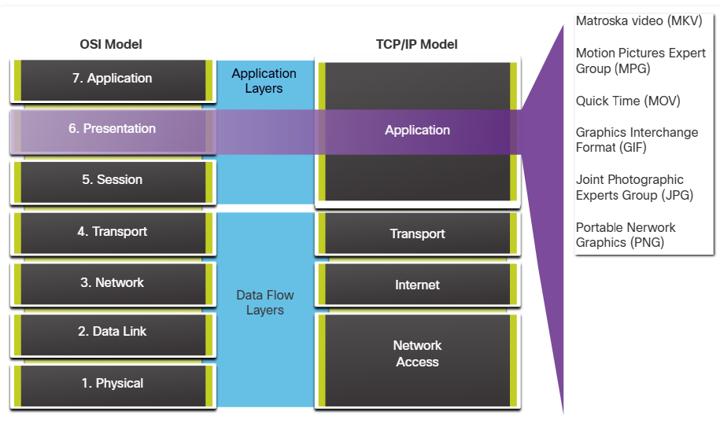


## Session Layer

As the name implies, functions at the session layer create and maintain dialogs between source and destination applications. The session layer handles the exchange of information to initiate dialogs, keep them active, and to restart sessions that are disrupted or idle for a long period of time.

## 15.1.3 TCP/IP Application Layer Protocols

The TCP/IP application protocols specify the format and control information necessary for many common internet communication functions. Application layer protocols are used by both the source and destination devices during a communication session. For the communications to be successful, the application layer protocols that are implemented on the source and destination host must be compatible.

### Name System 

DNS - Domain Name System (or Service)
- TCP, UDP 53
- Translates domain names, such as cisco.com, into IP addresses.

### Host Config 

BOOTP - Bootstrap Protocol
- UDP client 68, server 67
- Enables a diskless workstation to discover its own IP address, the IP address of a BOOTP server on the network, and a file to be loaded into memory to boot the machine
- BOOTP is being superseded by DHCP

DHCP - Dynamic Host Configuration Protocol
- UDP client 68, server 67
- Dynamically assigns IP addresses to be re-used when no longer needed

### Email
SMTP - Simple Mail Transfer Protocol
- TCP 25
- Enables clients to send email to a mail server
- Enables servers to send email to other servers 

POP3 - Post Office Protocol
- TCP 110
- Enables clients to retrieve email from a mail server
- Downloads the email to the local mail application of the client 

IMAP - Internet Message Access Protocol
- TCP 143
- Enables clients to access email stored on a mail server
- Maintains email on the server

### File Transfer
FTP - File Transfer Protocol
- TCP 20 to 21
- Sets rules that enable a user on one host to access and transfer files to and from another host over a network
- FTP is a reliable, connection-oriented, and acknowledged file delivery protocol 

TFTP - Trivial File Transfer Protocol
- UDP client 69
- A simple, connectionless file transfer protocol with best-effort, unacknowledged file delivery
- It uses less overhead than FTP

### Web
HTTP - Hypertext Transfer Protocol
- TCP 80, 8080
- A set of rules for exchanging text, graphic images, sound, video, and other multimedia files on the World Wide Web 

HTTPS - HTTP Secure
- TCP, UDP 443
- The browser uses encryption to secure HTTP communications
- Authenticates the website to which you are connecting your browser

# 15.2 Peer-to-Peer

# 15.2.1 Client-Server Model

In the previous topic, you learned that TCP/IP application layer protocols implemented on both the source and destination host must be compatible. In this topic you will learn about the client/server model and the processes used, which are in the application layer. The same is true for a peer-to-peer network. In the client/server model, the device requesting the information is called a client and the device responding to the request is called a server. The client is a hardware/software combination that people use to directly access the resources that are stored on the server.

Client and server processes are considered to be in the application layer. The client begins the exchange by requesting data from the server, which responds by sending one or more streams of data to the client. Application layer protocols describe the format of the requests and responses between clients and servers. In addition to the actual data transfer, this exchange may also require user authentication and the identification of a data file to be transferred.

One example of a client/server network is using the email service of an ISP to send, receive, and store email. The email client on a home computer issues a request to the email server of the ISP for any unread mail. The server responds by sending the requested email to the client. Data transfer from a client to a server is referred to as an upload and data from a server to a client as a download.

As shown in the figure, files are downloaded from the server to the client.

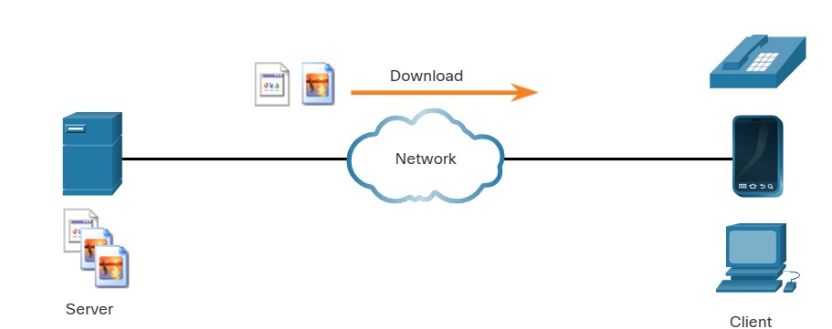

## 15.2.2 Peer-to-Peer Networks

In the peer-to-peer (P2P) networking model, the data is accessed from a peer device without the use of a dedicated server. The P2P network model involves two parts: P2P networks and P2P applications. Both parts have similar features, but in practice work quite differently.

In a P2P network, two or more computers are connected via a network and can share resources (such as printers and files) without having a dedicated server. Every connected end device (known as a peer) can function as both a server and a client. One computer might assume the role of server for one transaction while simultaneously serving as a client for another. The roles of client and server are set on a per request basis.

In addition to sharing files, a network such as this one would allow users to enable networked games or share an internet connection. In a peer-to-peer exchange, both devices are considered equal in the communication process. Peer 1 has files that are shared with Peer 2 and can access the shared printer that is directly connected to Peer 2 to print files. Peer 2 is sharing the directly connected printer with Peer 1 while accessing the shared files on Peer 1, as shown in the figure.

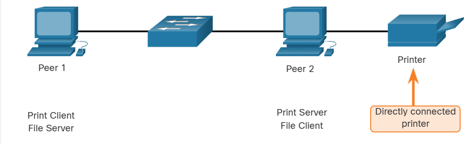

## 15.2.3 Peer-to-Peer Applications

A P2P application allows a device to act as both a client and a server within the same communication, as shown in the figure. In this model, every client is a server and every server is a client. P2P applications require that each end device provide a user interface and run a background service.

Some P2P applications use a hybrid system where resource sharing is decentralized, but the indexes that point to resource locations are stored in a centralized directory. In a hybrid system, each peer accesses an index server to get the location of a resource stored on another peer.

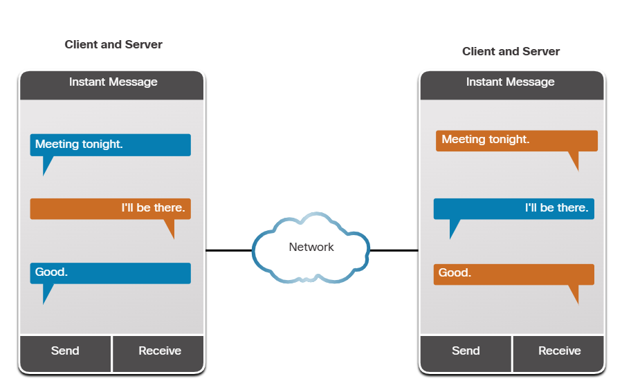

Both clients can simultaneously send and receive messages.

## 15.2.4 Common P2P Applications

With P2P applications, each computer in the network that is running the application can act as a client or a server for the other computers in the network that are also running the application. Common P2P networks include the following:
- BitTorrent
- Direct Connect
- eDonkey
- Freenet
Some P2P applications are based on the Gnutella protocol, where each user shares whole files with other users. As shown in the figure, Gnutella-compatible client software allows users to connect to Gnutella services over the internet, and to locate and access resources shared by other Gnutella peers. Many Gnutella client applications are available, including µTorrent, BitComet, DC++, Deluge, and emule.

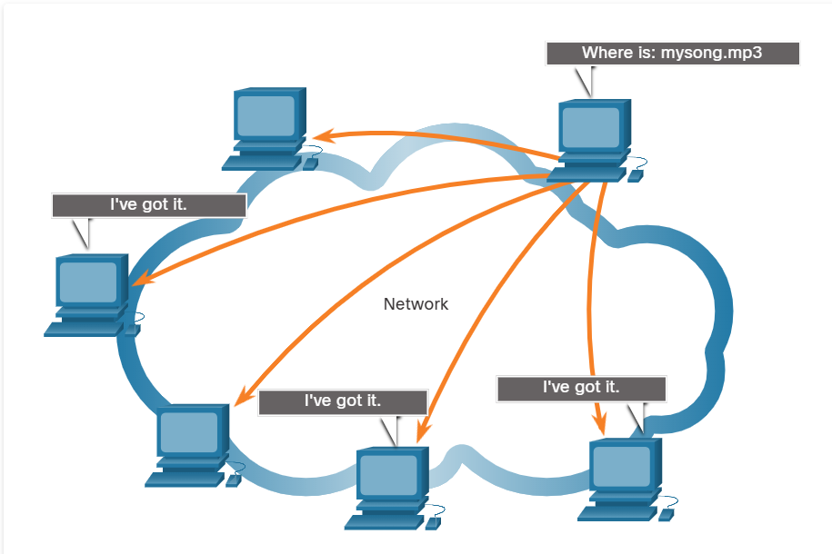

Gnutella P2P applications search for shared resources on multiple peers. Many P2P applications allow users to share pieces of many files with each other at the same time. Clients use a torrent file to locate other users who have pieces that they need so that they can then connect directly to them. This file also contains information about tracker computers that keep track of which users have specific pieces of certain files. Clients ask for pieces from multiple users at the same time. This is known as a swarm and the technology is called BitTorrent. BitTorrent has its own client. But there are many other BitTorrent clients including uTorrent, Deluge, and qBittorrent.

Note: Any type of file can be shared between users. Many of these files are copyrighted, meaning that only the creator has the right to use and distribute them. It is against the law to download or distribute copyrighted files without permission from the copyright holder. Copyright violation can result in criminal charges and civil lawsuits.

# 15.3 Web and Email Protocols 

## 15.3.1 Hypertext Transfer Protocol and Hypertext Markup Language

There are application layer-specific protocols that are designed for common uses such as web browsing and email. The first topic gave you an overview of these protocols. This topic goes into more detail.

When a web address or Uniform Resource Locator (URL) is typed into a web browser, the web browser establishes a connection to the web service. The web service is running on the server that is using the HTTP protocol. URLs and Uniform Resource Identifiers (URIs) are the names most people associate with web addresses.

To better understand how the web browser and web server interact, examine how a web page is opened in a browser. For this example, use the http://www.cisco.com/index.html URL.

### Step 1
The browser interprets the three parts of the URL:
- http (the protocol or scheme)
- www.cisco.com (the server name)
- index.html (the specific filename requested)

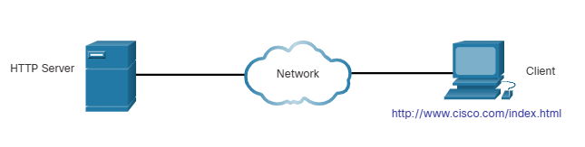

### Step 2
The browser then checks with a name server to convert www.cisco.com into a numeric IP address, which it uses to connect to the server. The client initiates an HTTP request to a server by sending a GET request to the server and asks for the index.html file.

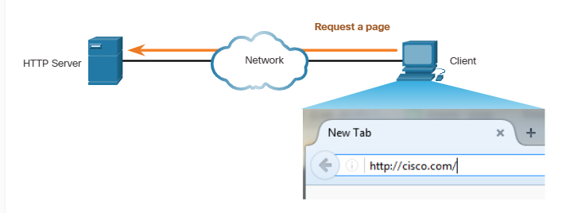

### Step 3
In response to the request, the server sends the HTML code for this web page to the browser.

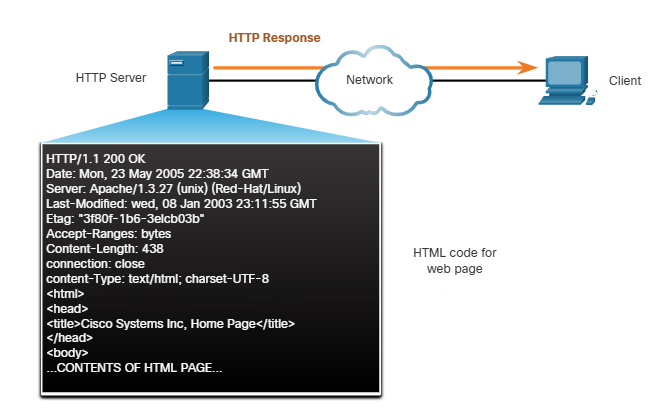

### Step 4
The browser deciphers the HTML code and formats the page for the browser window.

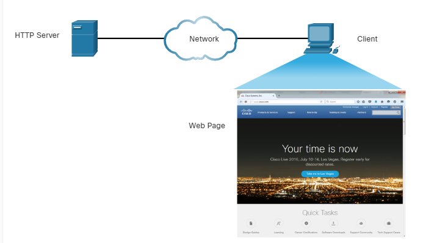

## 15.3.2 HTTP and HTTPS

HTTP is a request/response protocol. When a client, typically a web browser, sends a request to a web server, HTTP specifies the message types used for that communication. The three common message types are GET (see figure), POST, and PUT:

-   **GET** - This is a client request for data. A client (web browser) sends the GET message to the web server to request HTML pages.
-   **POST** - This uploads data files to the web server, such as form data.
-   **PUT** - This uploads resources or content to the web server, such as an image.

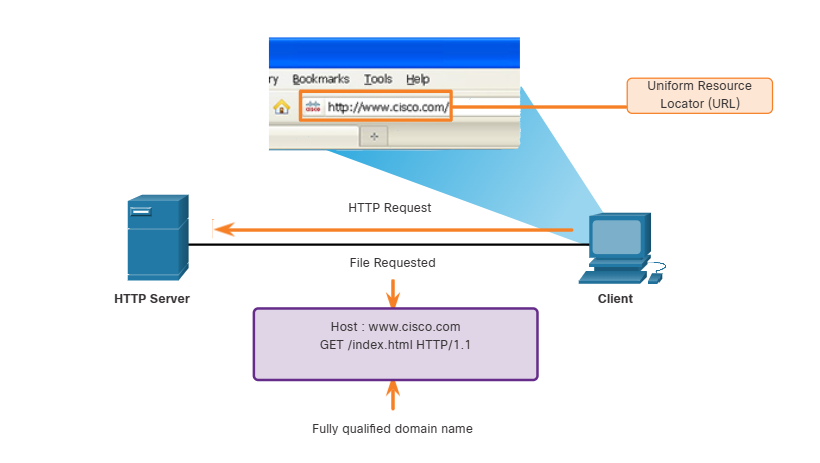

Although HTTP is remarkably flexible, it is not a secure protocol. The request messages send information to the server in plaintext that can be intercepted and read. The server responses, typically HTML pages, are also unencrypted.

For secure communication across the internet, the HTTP Secure (HTTPS) protocol is used. HTTPS uses authentication and encryption to secure data as it travels between the client and server. HTTPS uses the same client request-server response process as HTTP, but the data stream is encrypted with Transport Layer Security (TLS) or its predecessor Secure Socket Layer (SSL) before being transported across the network.

## 15.3.3 Email Protocols

One of the primary services offered by an ISP is email hosting. To run on a computer or other end device, email requires several applications and services, as shown in the figure. Email is a store-and-forward method of sending, storing, and retrieving electronic messages across a network. Email messages are stored in databases on mail servers.

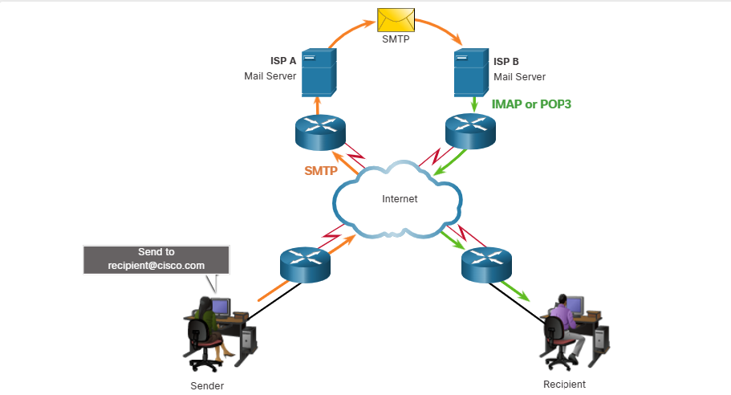

Email clients communicate with mail servers to send and receive email. Mail servers communicate with other mail servers to transport messages from one domain to another. An email client does not communicate directly with another email client when sending email. Instead, both clients rely on the mail server to transport messages.

Email supports three separate protocols for operation: Simple Mail Transfer Protocol (SMTP), Post Office Protocol (POP), and IMAP. The application layer process that sends mail uses SMTP. A client retrieves email using one of the two application layer protocols: POP or IMAP.

## 15.3.4 SMTP, POP, and IMAP

### SMTP

SMTP message formats require a message header and a message body. Although the message body can contain any amount of text, the message header must have a properly formatted recipient email address and a sender address.

When a client sends email, the client SMTP process connects with a server SMTP process on well-known port 25. After the connection is made, the client attempts to send the email to the server across the connection. When the server receives the message, it either places the message in a local account, if the recipient is local, or forwards the message to another mail server for delivery.

The destination email server may not be online, or may be busy, when email messages are sent. Therefore, SMTP spools messages to be sent at a later time. Periodically, the server checks the queue for messages and attempts to send them again. If the message is still not delivered after a predetermined expiration time, it is returned to the sender as undeliverable.

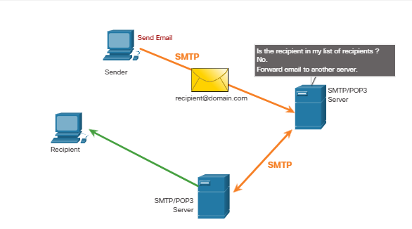

### POP

POP is used by an application to retrieve mail from a mail server. With POP, mail is downloaded from the server to the client and then deleted on the server. This is the default operation of POP.

The server starts the POP service by passively listening on TCP port 110 for client connection requests. When a client wants to make use of the service, it sends a request to establish a TCP connection with the server, as shown in the figure. When the connection is established, the POP server sends a greeting. The client and POP server then exchange commands and responses until the connection is closed or aborted.

With POP, email messages are downloaded to the client and removed from the server, so there is no centralized location where email messages are kept. Because POP does not store messages, it is not recommended for a small business that needs a centralized backup solution.

POP3 is the most commonly used version.

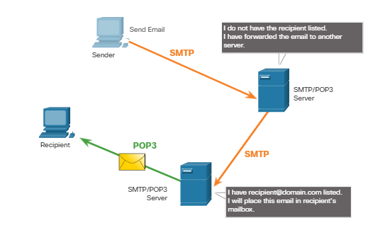

### IMAP

IMAP is another protocol that describes a method to retrieve email messages. Unlike POP, when the user connects to an IMAP- capable server, copies of the messages are downloaded to the client application, as shown in the figure. The original messages are kept on the server until manually deleted. Users view copies of the messages in their email client software.

Users can create a file hierarchy on the server to organize and store mail. That file structure is duplicated on the email client as well. When a user decides to delete a message, the server synchronizes that action and deletes the message from the server.

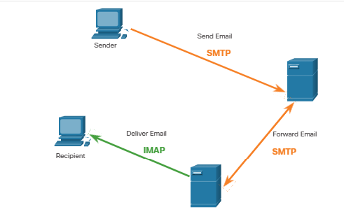

# 15.4 IP Addressing Services 

## 15.4.1 Domain Name System

There are other application layer-specific protocols that were designed to make it easier to obtain addresses for network devices. These services are essential because it would be very time consuming to remember IP addresses instead of URLs or manually configure all of the devices in a medium to large network. The first topic in this module gave you an overview of these protocols. This topic goes into more detail about the IP addressing services, DNS and DHCP.

In data networks, devices are labeled with numeric IP addresses to send and receive data over networks. Domain names were created to convert the numeric address into a simple, recognizable name.

On the internet, fully-qualified domain names (FQDNs), such as http://www.cisco.com, are much easier for people to remember than 198.133.219.25, which is the actual numeric address for this server. If Cisco decides to change the numeric address of www.cisco.com, it is transparent to the user because the domain name remains the same. The new address is simply linked to the existing domain name and connectivity is maintained.

The DNS protocol defines an automated service that matches resource names with the required numeric network address. It includes the format for queries, responses, and data. The DNS protocol communications use a single format called a message. This message format is used for all types of client queries and server responses, error messages, and the transfer of resource record information between servers.

### Step 1 

The user types an FQDN into a browser application Address field.

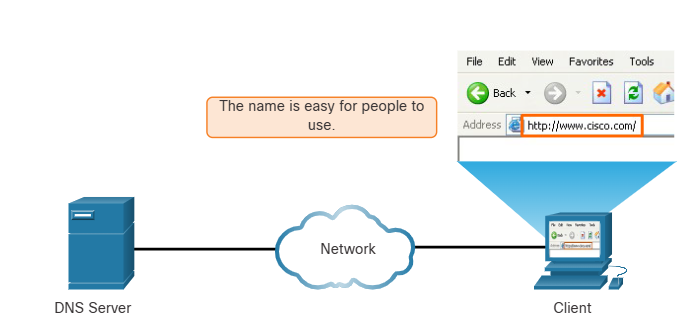

### Step 2

A DNS query is sent to the designated DNS server for the client computer.

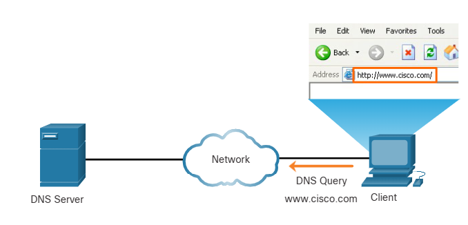

### Step 3

The DNS server matches the FQDN with its IP address.

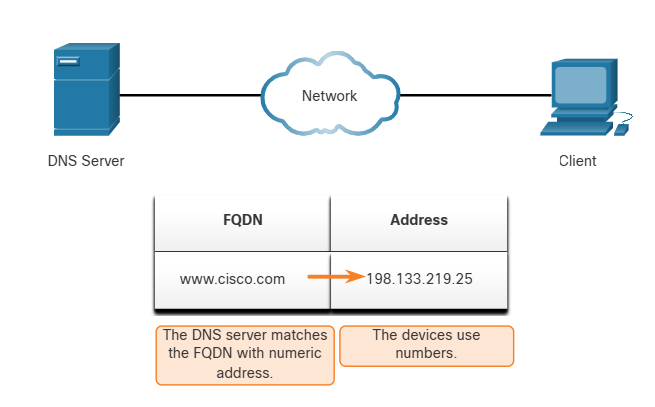

### Step 4 

The DNS query response is sent back to the client with the IP address for the FQDN.

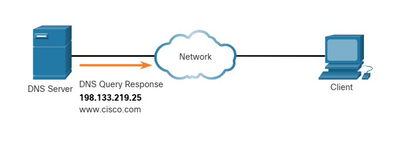

### Step 5

The client computer uses the IP address to make requests of the server.

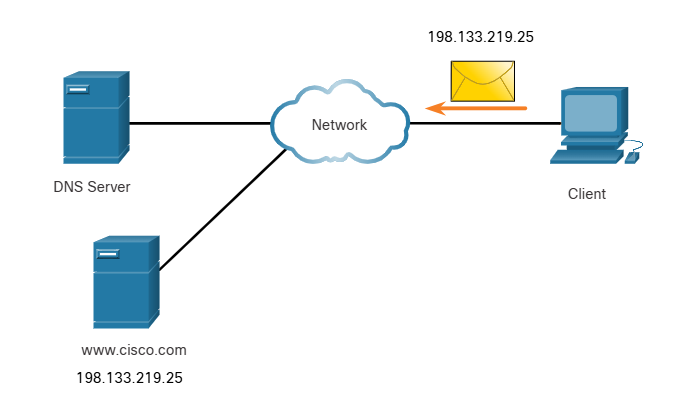

## 15.4.2 DNS Message Format

The DNS server stores different types of resource records that are used to resolve names. These records contain the name, address, and type of record. Some of these record types are as follows:
-   A - An end device IPv4 address
-   NS - An authoritative name server
-   AAAA - An end device IPv6 address (pronounced quad-A)
-   MX - A mail exchange record

When a client makes a query, the server DNS process first looks at its own records to resolve the name. If it is unable to resolve the name by using its stored records, it contacts other servers to resolve the name. After a match is found and returned to the original requesting server, the server temporarily stores the numbered address in the event that the same name is requested again.

The DNS client service on Windows PCs also stores previously resolved names in memory. The `ipconfig /displaydns` command displays all of the cached DNS entries.

As shown in the table, DNS uses the same message format between servers, consisting of a question, answer, authority, and additional information for all types of client queries and server responses, error messages, and transfer of resource record information.

| DNS message section | Description                                     |
| :------------------ | :---------------------------------------------- |
| Question            | The question for the name server                |
| Answer              | Resource Records answering the question         |
| Authority           | Resource Records pointing toward an authority   |
| Additional          | Resource Records holding additional information |

## 15.4.3 DNS Hierarchy

The DNS protocol uses a hierarchical system to create a database to provide name resolution, as shown in the figure. DNS uses domain names to form the hierarchy.

The naming structure is broken down into small, manageable zones. Each DNS server maintains a specific database file and is only responsible for managing name-to-IP mappings for that small portion of the entire DNS structure. When a DNS server receives a request for a name translation that is not within its DNS zone, the DNS server forwards the request to another DNS server within the proper zone for translation. DNS is scalable because hostname resolution is spread across multiple servers.

The different top-level domains represent either the type of organization or the country of origin. Examples of top-level domains are the following:
- .com - a business or industry
- .org - a non-profit organization
- .au - Australia
- .co - Colombia

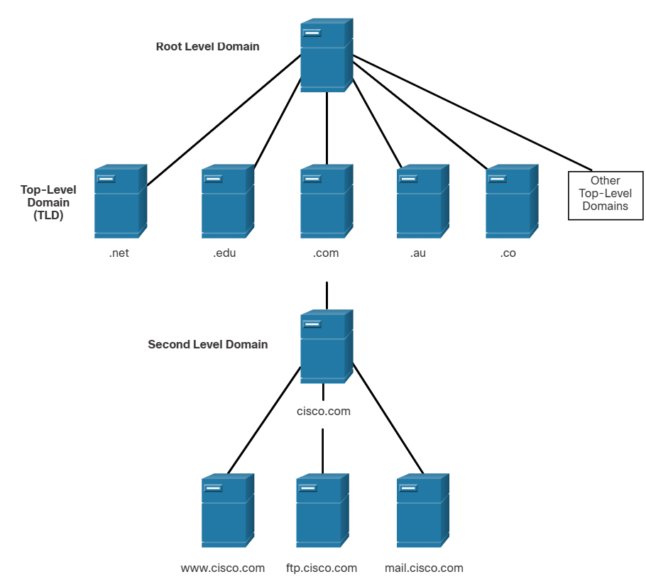

## 15.4.4 The nslookup Command

When configuring a network device, one or more DNS Server addresses are provided that the DNS client can use for name resolution. Usually the ISP provides the addresses to use for the DNS servers. When a user application requests to connect to a remote device by name, the requesting DNS client queries the name server to resolve the name to a numeric address.

Computer operating systems also have a utility called Nslookup that allows the user to manually query the name servers to resolve a given host name. This utility can also be used to troubleshoot name resolution issues and to verify the current status of the name servers.

In this figure, when the nslookup command is issued, the default DNS server configured for your host is displayed. The name of a host or domain can be entered at the nslookup prompt. The Nslookup utility has many options available for extensive testing and verification of the DNS process.

```
C:\Users> nslookup
Default Server: dns-sj.cisco.com
Address: 171.70.168.183
> www.cisco.com
Server: dns-sj.cisco.com
Address: 171.70.168.183
Name: origin-www.cisco.com
Addresses: 2001:420:1101:1::a
    173.37.145.84
Aliases: www.cisco.com
> cisco.netacad.net
Server: dns-sj.cisco.com
Address: 171.70.168.183
Name: cisco.netacad.net
Address: 72.163.6.223
>
```

## 15.4.6 Dynamic Host Configuration Protocol

The Dynamic Host Configuration Protocol (DHCP) for IPv4 service automates the assignment of IPv4 addresses, subnet masks, gateways, and other IPv4 networking parameters. This is referred to as dynamic addressing. The alternative to dynamic addressing is static addressing. When using static addressing, the network administrator manually enters IP address information on hosts.

When a host connects to the network, the DHCP server is contacted, and an address is requested. The DHCP server chooses an address from a configured range of addresses called a pool and assigns (leases) it to the host.

On larger networks, or where the user population changes frequently, DHCP is preferred for address assignment. New users may arrive and need connections; others may have new computers that must be connected. Rather than use static addressing for each connection, it is more efficient to have IPv4 addresses assigned automatically using DHCP.

DHCP can allocate IP addresses for a configurable period of time, called a lease period. The lease period is an important DHCP setting, When the lease period expires or the DHCP server gets a DHCPRELEASE message the address is returned to the DHCP pool for reuse.

Users can freely move from location to location and easily re-establish network connections through DHCP. As the figure shows, various types of devices can be DHCP servers. The DHCP server in most medium-to-large networks is usually a local, dedicated PC-based server. With home networks, the DHCP server is usually located on the local router that connects the home network to the ISP.

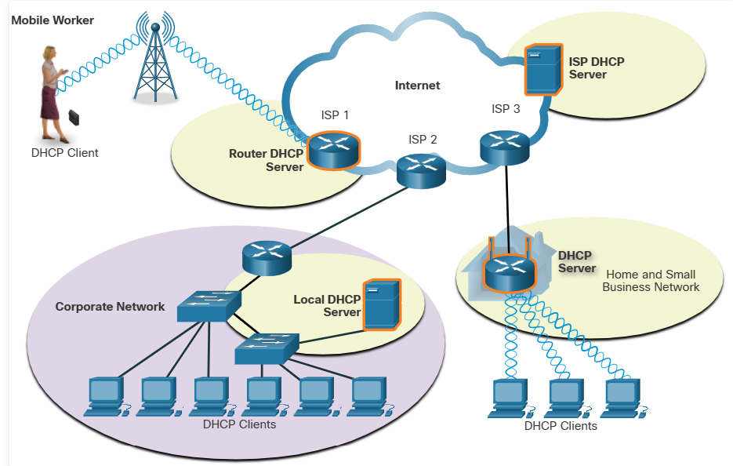

Many networks use both DHCP and static addressing. DHCP is used for general purpose hosts, such as end user devices. Static addressing is used for network devices, such as gateway routers, switches, servers, and printers.

DHCP for IPv6 (DHCPv6) provides similar services for IPv6 clients. One important difference is that DHCPv6 does not provide a default gateway address. This can only be obtained dynamically from the Router Advertisement message of the router.

## 15.4.7 DHCP Operation

As shown in the figure, when an IPv4, DHCP-configured device boots up or connects to the network, the client broadcasts a DHCP discover (DHCPDISCOVER) message to identify any available DHCP servers on the network. A DHCP server replies with a DHCP offer (DHCPOFFER) message, which offers a lease to the client. The offer message contains the IPv4 address and subnet mask to be assigned, the IPv4 address of the DNS server, and the IPv4 address of the default gateway. The lease offer also includes the duration of the lease.

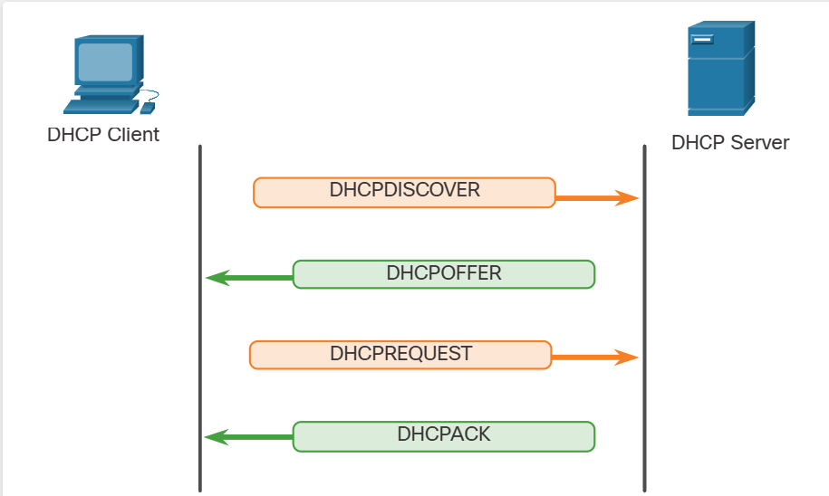

The client may receive multiple DHCPOFFER messages if there is more than one DHCP server on the local network. Therefore, it must choose between them, and sends a DHCP request (DHCPREQUEST) message that identifies the explicit server and lease offer that the client is accepting. A client may also choose to request an address that it had previously been allocated by the server.

Assuming that the IPv4 address requested by the client, or offered by the server, is still available, the server returns a DHCP acknowledgment (DHCPACK) message that acknowledges to the client that the lease has been finalized. If the offer is no longer valid, then the selected server responds with a DHCP negative acknowledgment (DHCPNAK) message. If a DHCPNAK message is returned, then the selection process must begin again with a new DHCPDISCOVER message being transmitted. After the client has the lease, it must be renewed prior to the lease expiration through another DHCPREQUEST message.

The DHCP server ensures that all IP addresses are unique (the same IP address cannot be assigned to two different network devices simultaneously). Most ISPs use DHCP to allocate addresses to their customers. DHCPv6 has a set of messages that is similar to those for DHCPv4. The DHCPv6 messages are SOLICIT, ADVERTISE, INFORMATION REQUEST, and REPLY.

# 15.5 File Sharing Services 

## 15.5.1 File Transfer Protocol

As you learned in previous topics, in the client/server model, the client can upload data to a server, and download data from a server, if both devices are using a file transfer protocol (FTP). Like HTTP, email, and addressing protocols, FTP is commonly used application layer protocol. This topic discusses FTP in more detail.

FTP was developed to allow for data transfers between a client and a server. An FTP client is an application which runs on a computer that is being used to push and pull data from an FTP server.

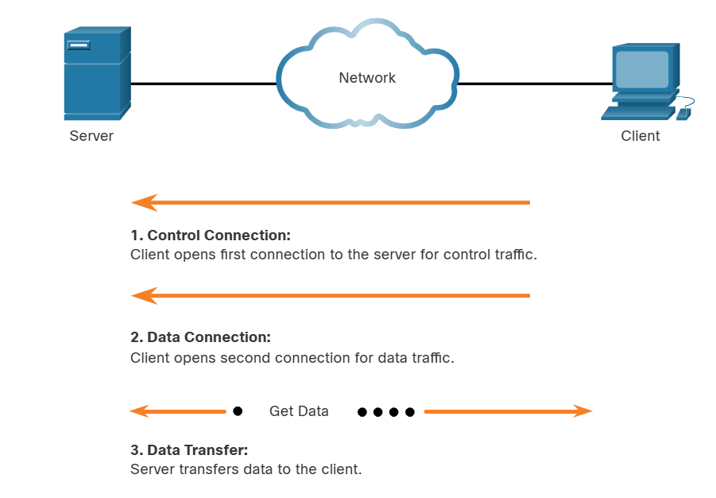

Based on commands sent across the control connection, data can be downloaded from the server or uploaded from the client. The client establishes the first connection to the server for control traffic using TCP port 21. The traffic consists of client commands and server replies.

The client establishes the second connection to the server for the actual data transfer using TCP port 20. This connection is created every time there is data to be transferred.

The data transfer can happen in either direction. The client can download (pull) data from the server, or the client can upload (push) data to the server.

## 15.5.2 Server Message Block

The Server Message Block (SMB) is a client/server file sharing protocol that describes the structure of shared network resources, such as directories, files, printers, and serial ports. It is a request-response protocol. All SMB messages share a common format. This format uses a fixed-sized header, followed by a variable-sized parameter and data component.

Here are three functions of SMB messages:
- Start, authenticate, and terminate sessions.
- Control file and printer access.
- Allow an application to send or receive messages to or from another device.

SMB file-sharing and print services have become the mainstay of Microsoft networking. With the introduction of the Windows 2000 software series, Microsoft changed the underlying structure for using SMB. In previous versions of Microsoft products, the SMB services used a non-TCP/IP protocol to implement name resolution. Beginning with Windows 2000, all subsequent Microsoft products use DNS naming, which allows TCP/IP protocols to directly support SMB resource sharing, as shown in the figure.

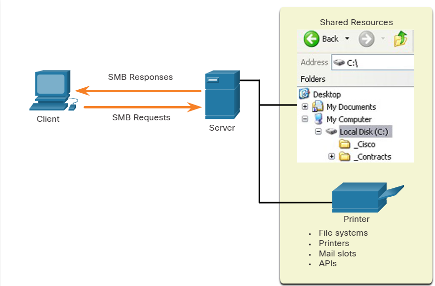

SMB is a client/server, request-response protocol. Servers can make their own resources available to clients on the network.

The SMB file exchange process between Windows PCs is shown in the next figure.

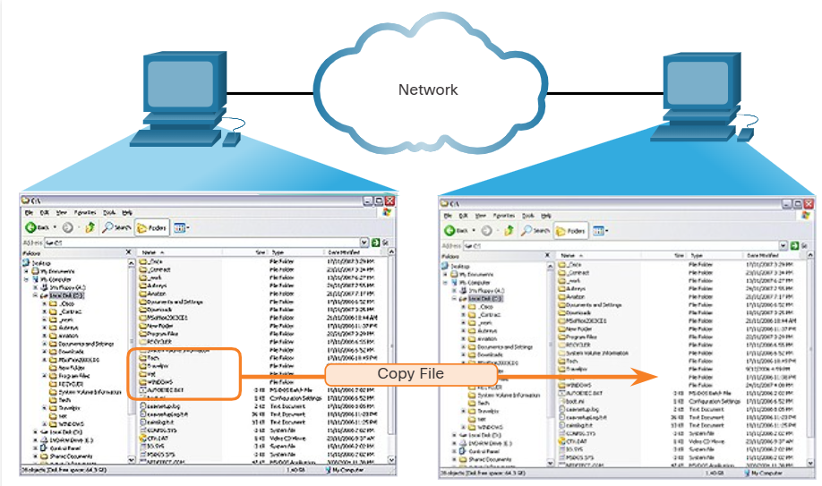

A file may be copied from PC to PC with Windows Explorer using the SMB protocol.

Unlike the file sharing supported by FTP, clients establish a long-term connection to servers. After the connection is established, the user of the client can access the resources on the server as though the resource is local to the client host. The LINUX and UNIX operating systems also provide a method of sharing resources with Microsoft networks by using a version of SMB called SAMBA. The Apple Macintosh operating systems also support resource sharing by using the SMB protocol.


