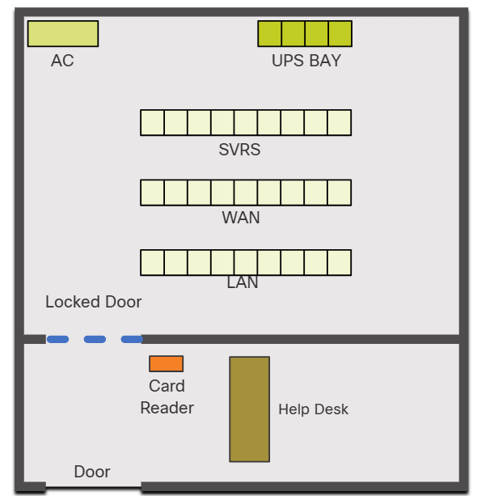
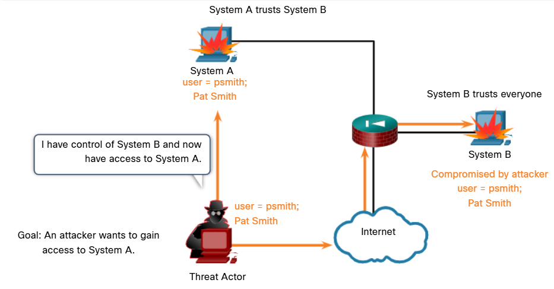
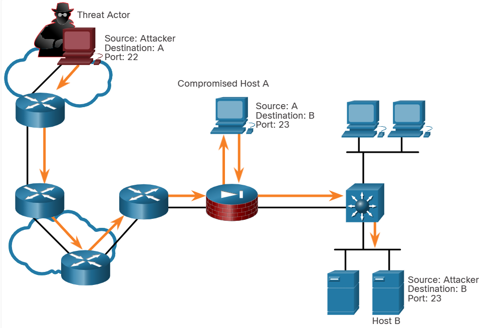
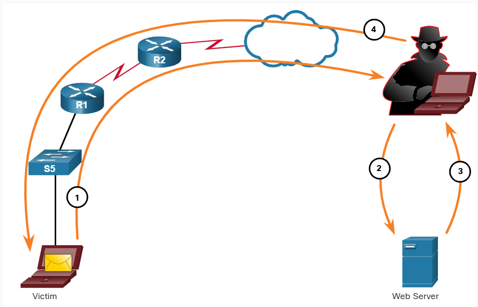
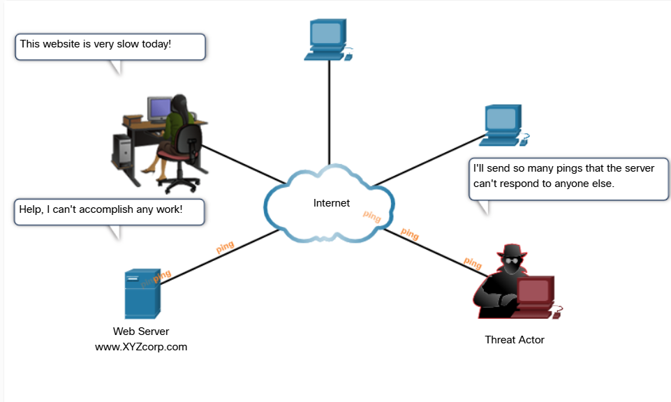
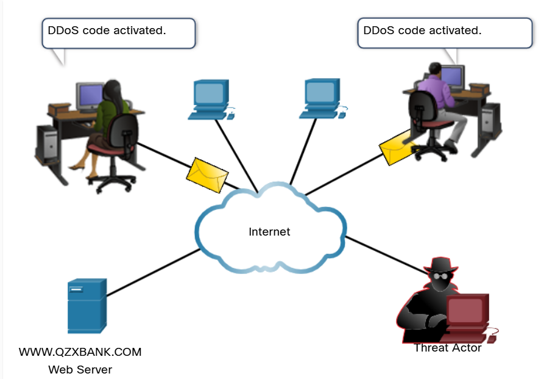
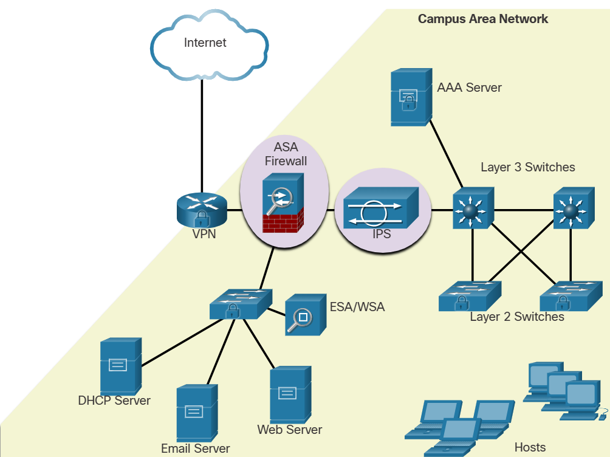
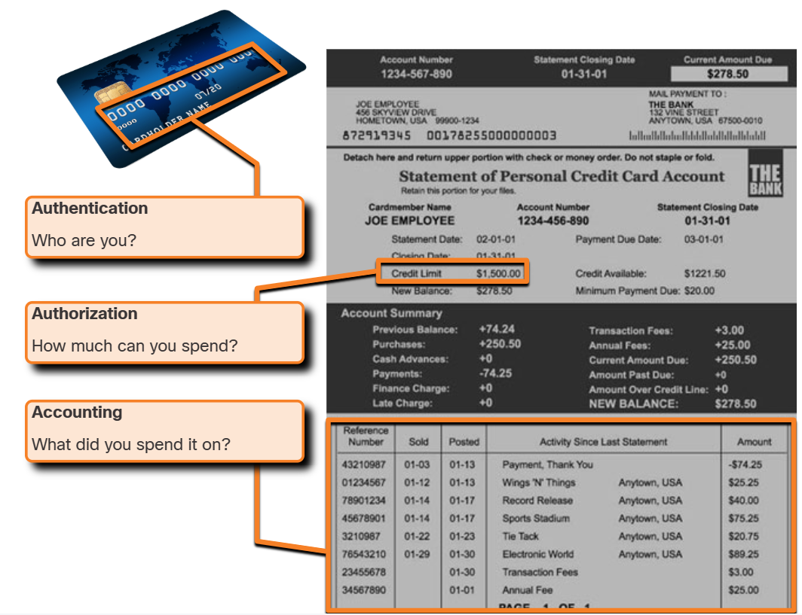
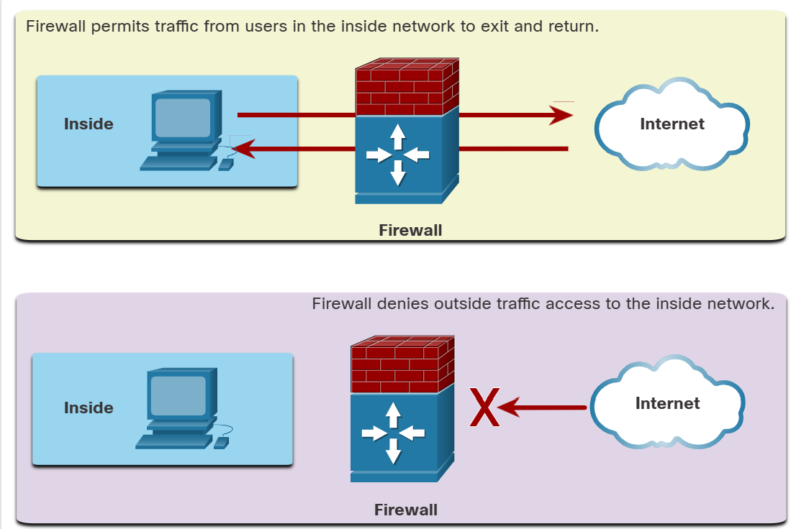
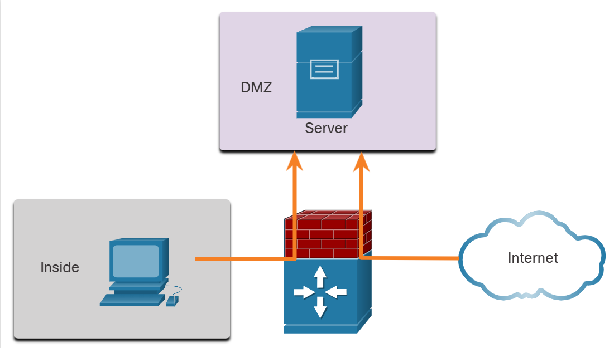

# Module 16: Network Security Fundamentals

# 16.1 Security Threats and Vulnerabilities 

## 16.1.1 Types of Threats

Wired and wireless computer networks are essential to everyday activities. Individuals and organizations depend on their computers and networks. Intrusion by an unauthorized person can result in costly network outages and loss of work. Attacks on a network can be devastating and can result in a loss of time and money due to damage, or theft of important information or assets.

Intruders can gain access to a network through software vulnerabilities, hardware attacks, or through guessing someone's username and password. Intruders who gain access by modifying software or exploiting software vulnerabilities are called threat actors.

After the threat actor gains access to the network, four types of threats may arise.

### Information Theft 
Information theft is breaking into a computer to obtain confidential information. Information can be used or sold for various purposes such as when someone is stealing proprietary information of an organization, like research and development data.

### Data Loss and Manipulation
Data loss and manipulation is breaking into a computer to destroy or alter data records. An example of data loss is a threat actor
sending a virus that reformats a computer hard drive. An example of data manipulation is breaking into a records system to change
information, such as the price of an item.

### Identity Theft
Identity theft is a form of information theft where personal information is stolen for the purpose of taking over the identity of someone. Using this information, a threat actor can obtain legal documents, apply for credit, and make unauthorized online purchases. Identify theft is a growing problem costing billions of dollars per year.

### Disruption of Service
Disruption of service is preventing legitimate users from accessing services to which they are entitled. Examples include denial of service (DoS) attacks on servers, network devices, or network communications links.

## 16.1.2 Types of Vulnerabilities

Vulnerability is the degree of weakness in a network or a device. Some degree of vulnerability is inherent in routers, switches, desktops, servers, and even security devices. Typically, the network devices under attack are the endpoints, such as servers and desktop computers.

There are three primary vulnerabilities or weaknesses: technological, configuration, and security policy. All three of these sources of vulnerabilities can leave a network or device open to various attacks, including malicious code attacks and network attacks.

### Technological Vulnerabilities

| Vulnerability | Description |
|---|---|
| TCP/IP Protocol<br>Weakness | • Hypertext Transfer Protocol (HTTP), File Transfer Protocol (FTP), and Internet Control Message<br>Protocol (ICMP) are inherently insecure.<br>• Simple Network Management Protocol (SNMP) and Simple Mail Transfer Protocol (SMTP) are<br>related to the inherently insecure structure upon which TCP was designed. |
| Operating System<br>Weakness | • Each operating system has security problems what must be addressed.<br>• UNIX, Linux, Mac OS, Mac OS X, Windows Server 2012, Windows 7, Windows 8<br>• They are documented in the Computer Emergency Response Team (CERT) archives at<br>http://www.cert.org |
| Network Equipment<br>Weakness | Various types of network equipment, such as routers, firewalls, and switches have security weaknesses<br>that must be recognized and protected against. Their weaknesses include password protection, lack of<br>authentication, routing protocols, and firewall holes. |

### Configuration Vulnerabilities

| Vulnerability | Description |
|---|---|
| Unsecured user accounts | User account information may be transmitted insecurely across the network, exposing usernames and passwords to threat actors. |
| System accounts with easily guessed passwords | This common problem is the result of poorly created user passwords. |
| Misconfigured internet services | Turning on JavaScript in web browsers enables attacks by way of JavaScript controlled by threat actors when accessing untrusted sites. Other potential sources of weaknesses include misconfigured terminal services, FTP, or web servers (e.g., Microsoft Internet Information Services (IIS), and Apache HTTP Server. |
| Unsecured default settings within products | Many products have default settings that create or enable holes in security. |
| Misconfigured network equipment | Misconfigurations of the equipment itself can cause significant security problems. For example, misconfigured access lists, routing protocols, or SNMP community strings can create or enable holes in security. |

### Policy Vulnerabilities

| Vulnerability | Description |
|---|---|
| Lack of written security policy | A security policy cannot be consistently applied or enforced if it is not written down. |
| Politics | Political battles and turf wars can make it difficult to implement a consistent security policy. |
| Lack of authentication continuity | Poorly chosen, easily cracked, or default passwords can allow unauthorized access to the network. |
| Logical access controls not applied | Inadequate monitoring and auditing allow attacks and unauthorized use to continue, wasting company resources. This could result in legal action or termination against IT technicians, IT management, or even company leadership that allows these unsafe conditions to persist. |
| Software and hardware installation and changes do not follow policy | Unauthorized changes to the network topology or installation of unapproved application create or enable holes in security. |
| Disaster recovery plan is nonexistent | The lack of a disaster recovery plan allows chaos, panic, and confusion to occur when a natural disaster occurs or a threat actor attacks the enterprise. |

## 16.1.3 Physical Security

An equally important vulnerable area of the network to consider is the physical security of devices. If network resources can be physically compromised, a threat actor can deny the use of network resources.

The four classes of physical threats are as follows:

-   **Hardware threats** - This includes physical damage to servers, routers, switches, cabling plant, and workstations.
-   **Environmental threats** - This includes temperature extremes (too hot or too cold) or humidity extremes (too wet or too dry).
-   **Electrical threats** - This includes voltage spikes, insufficient supply voltage (brownouts), unconditioned power (noise), and total power loss.
-   **Maintenance threats** - This includes poor handling of key electrical components (electrostatic discharge), lack of critical spare parts, poor cabling, and poor labeling.

A good plan for physical security must be created and implemented to address these issues. The figure shows an example of physical security plan.

### Plan Physical Security to Limit Damage to Equipment 



- Secure computer room.
- Implement physical security to limit damage to the equipment.

Step 1. Lock up equipment and prevent unauthorized access from the doors, ceiling, raised floor, windows, ducts, and vents.
Step 2. Monitor and control closet entry with electronic logs.
Step 3. Use security cameras.

# 16.2 Network Attacks 

## 16.2.1 Types of Malware

The previous topic explained the types of network threats and the vulnerabilities that make threats possible. This topic goes into more
detail about how threat actors gain access to network or restrict authorized users from having access.

Malware is short for malicious software. It is code or software specifically designed to damage, disrupt, steal, or inflict "bad" or
illegitimate action on data, hosts, or networks. Viruses, worms, and Trojan horses are types of malware.

### Viruses

A computer virus is a type of malware that propagates by inserting a copy of itself into, and becoming part of, another program. It spreads from one computer to another, leaving infections as it travels. Viruses can range in severity from causing mildly annoying effects, to damaging data or software and causing denial of service (DoS) conditions. Almost all viruses are attached to an executable file, which means the virus may exist on a system but will not be active or able to spread until a user runs or opens the malicious host file or program. When the host code is executed, the viral code is executed as well. Normally, the host program keeps functioning after the virus infects it. However, some viruses overwrite other programs with copies of themselves, which destroys the host program altogether. Viruses spread when the software or document they are attached to is transferred from one computer to another using the network, a disk, file sharing, or infected email attachments.

### Worms

Computer worms are similar to viruses in that they replicate functional copies of themselves and can cause the same type of damage. In contrast to viruses, which require the spreading of an infected host file, worms are standalone software and do not require a host program or human help to propagate. A worm does not need to attach to a program to infect a host and enter a computer through a vulnerability in the system. Worms take advantage of system features to travel through the network unaided. 

### Trojan Horses

A Trojan horse is another type of malware named after the wooden horse the Greeks used to infiltrate Troy. It is a harmful piece of software that looks legitimate. Users are typically tricked into loading and executing it on their systems. After it is activated, it can achieve any number of attacks on the host, from irritating the user (with excessive pop-up windows or changing the desktop) to damaging the host (deleting files, stealing data, or activating and spreading other malware, such as viruses). Trojan horses are also known to create back doors to give malicious users access to the system. Unlike viruses and worms, Trojan horses do not reproduce by infecting other files. Trojan horses must spread through user interaction such as opening an email attachment or downloading and running a file from the internet.

## 16.2.2 Reconnaissance Attacks

In addition to malicious code attacks, it is also possible for networks to fall prey to various network attacks. Network attacks can be classified into three major categories:

-   **Reconnaissance attacks**- The discovery and mapping of systems, services, or vulnerabilities.
-   **Access attacks**- The unauthorized manipulation of data, system access, or user privileges.
-   **Denial of service**- The disabling or corruption of networks, systems, or services.

For reconnaissance attacks, external threat actors can use internet tools, such as the **nslookup** and **whois** utilities, to easily determine the IP address space assigned to a given corporation or entity. After the IP address space is determined, a threat actor can then ping the publicly available IP addresses to identify the addresses that are active. To help automate this step, a threat actor may use a ping sweep tool, such as **fping** or **gping**. This systematically pings all network addresses in a given range or subnet. This is similar to going through a section of a telephone book and calling each number to see who answers.

### Internet Queries
The threat actor is looking for initial information about a target. Various tools can be used, including Google search, the websites of organizations, whois, and more.

### Ping Sweeps 
The threat actor initiates a ping sweep to determine which IP addresses are active.

### Port Scans 
A threat actor performs a port scan on the discovered active IP addresses to see which ports are open or closed.

## 16.2.3 Access Attacks

Access attacks exploit known vulnerabilities in authentication services, FTP services, and web services to gain entry to web accounts, confidential databases, and other sensitive information. An access attack allows individuals to gain unauthorized access to information that they have no right to view. Access attacks can be classified into four types: password attacks, trust exploitation, port redirection, and man-in-the middle.

### Password Attacks

Threat actors can implement password attacks using several different methods:

- Brute-force attacks
- Trojan horse attacks
- Packet sniffers

### Trust Exploitation
In a trust exploitation attack, a threat actor uses unauthorized privileges to gain access to a system, possibly compromising the target. Click Play in the figure to view an example of trust exploitation. In the animation, System A trusts System B. System B trusts everyone. The threat actor wants to gain access to System A. Therefore, the threat actor compromises System B first and then can use System B to attack System A.



### Port Redirection

In a port redirection attack, a threat actor uses a compromised system as a base for attacks against other targets. The example in the figure shows a threat actor using SSH (port 22) to connect to a compromised host A. Host A is trusted by host B and, therefore, the threat actor can use Telnet (port 23) to access it.



### Man-in-the-Middle
In a man-in-the-middle attack, the threat actor is positioned in between two legitimate entities in order to read or modify the data that passes between the two parties. The figure displays an example of a man-in-the-middle attack.



Step 1. When a victim requests a web page, the request is directed to the threat actor's computer.

Step 2. The threat actor's computer receives the request and retrieves the real page from the legitimate website.

Step 3. The threat actor can alter the legitimate web page and make changes to the data.

Step 4. The threat actor forwards the requested page to the victim.

## 16.2.4 Denial of Service Attacks

Denial of service (DoS) attacks are the most publicized form of attack and among the most difficult to eliminate. However, because of their ease of implementation and potentially significant damage, DoS attacks deserve special attention from security administrators.

DoS attacks take many forms. Ultimately, they prevent authorized people from using a service by consuming system resources. To help prevent DoS attacks it is important to stay up to date with the latest security updates for operating systems and applications.

## DoS Attack

DoS attacks are a major risk because they interrupt communication and cause significant loss of time and money. These attacks are relatively simple to conduct, even by an unskilled threat actor.



## DDoS Attack

A DDoS is similar to a DoS attack, but it originates from multiple, coordinated sources. For example, a threat actor builds a network of infected hosts, known as zombies. A network of zombies is called a botnet. The threat actor uses a command and control (CnC) program to instruct the botnet of zombies to carry out a DDoS attack.



# 16.3 Network Attack Mitigations 

## 16.3.1 The Defense-in-Depth Approach

Now that you know more about how threat actors can break into networks, you need to understand what to do to prevent this unauthorized access. This topic details several actions you can take to make your network more secure.

To mitigate network attacks, you must first secure devices including routers, switches, servers, and hosts. Most organizations employ a defense-in-depth approach (also known as a layered approach) to security. This requires a combination of networking devices and services working in tandem.

Consider the network in the figure. There are several security devices and services that have been implemented to protect its users and assets against TCP/IP threats.

All network devices including the router and switches are also hardened as indicated by the combination locks on their respective icons. This indicates that they have been secured to prevent threat actors from gaining access and tampering with the devices.



Several security devices and services are implemented to protect an organization's users and assets against TCP/IP threats.
- **VPN** - A router is used to provide secure VPN services with corporate sites and remote access support for remote users using secure encrypted tunnels.
- **ASA Firewall** - This dedicated device provides stateful firewall services. It ensures that internal traffic can go out and come back, but external traffic cannot initiate connections to inside hosts.
- **IPS** - An intrusion prevention system (IPS) monitors incoming and outgoing traffic looking for malware, network attack signatures, and more. If it recognizes a threat, it can immediately stop it.
- **ESA/WSA** - The email security appliance (ESA) filters spam and suspicious emails. The web security appliance (WSA) filters known and suspicious internet malware sites.
- **AAA Server** - This server contains a secure database of who is authorized to access and manage network devices. Network devices authenticate administrative users using this database.

## 16.3.2 Keep Backups

Backing up device configurations and data is one of the most effective ways of protecting against data loss. A data backup stores a copy of the information on a computer to removable backup media that can be kept in a safe place. Infrastructure devices should have backups of configuration files and IOS images on an FTP or similar file server. If the computer or a router hardware fails, the data or configuration can be restored using the backup copy.

Backups should be performed on a regular basis as identified in the security policy. Data backups are usually stored offsite to protect the backup media if anything happens to the main facility. Windows hosts have a backup and restore utility. It is important for users to back up their data to another drive, or to a cloud-based storage provider.

The table shows backup considerations and their descriptions.

| Consideration | Description |
|---|---|
| Frequency | • Perform backups on a regular basis as identified in the security policy. <br> • Full backups can be time-consuming, therefore perform monthly or weekly backups with frequent partial <br> backups of changed files. |
| Validation | • Always validate backups to ensure the integrity of the data and validate the file restoration procedures. |
| Storage | • Backups should be transported to an approved offsite storage location on a daily, weekly, or monthly <br> rotation, as required by the security policy. |
| Security | • Backups should be protected using strong passwords. The password is required to restore the data. |

## 16.3.3 Upgrade, Update, and Patch

Keeping up to date with the latest developments can lead to a more effective defense against network attacks. As new malware is released, enterprises need to keep current with the latest versions of antivirus software.

The most effective way to mitigate a worm attack is to download security updates from the operating system vendor and patch all vulnerable systems. Administering numerous systems involves the creation of a standard software image (operating system and accredited applications that are authorized for use on client systems) that is deployed on new or upgraded systems. However, security requirements change, and already deployed systems may need to have updated security patches installed.

One solution to the management of critical security patches is to make sure all end systems automatically download updates, as shown for Windows 10 in the figure. Security patches are automatically downloaded and installed without user intervention.

## 16.3.4 Authentication, Authorization, and Accounting

All network devices should be securely configured to provide only authorized individuals with access. Authentication, authorization, and accounting (AAA, or "triple A") network security services provide the primary framework to set up access control on network devices.

AAA is a way to control who is permitted to access a network (authenticate), what actions they perform while accessing the network (authorize), and making a record of what was done while they are there (accounting).

The concept of AAA is similar to the use of a credit card. The credit card identifies who can use it, how much that user can spend, and keeps account of what items the user spent money on, as shown in the figure.



## 16.3.5 Firewalls

A firewall is one of the most effective security tools available for protecting users from external threats. A firewall protects computers and networks by preventing undesirable traffic from entering internal networks.

Network firewalls reside between two or more networks, control the traffic between them, and help prevent unauthorized access. For example, the top topology in the figure illustrates how the firewall enables traffic from an internal network host to exit the network and return to the inside network. The bottom topology illustrates how traffic initiated by the outside network (i.e., the internet) is denied access to the internal network.

### Firewall Operation



A firewall could allow outside users controlled access to specific services. For example, servers accessible to outside users are usually located on a special network referred to as the demilitarized zone (DMZ), as shown in the figure. The DMZ enables a network administrator to apply specific policies for hosts connected to that network.

### Firewall Topology with DMZ



## 16.3.6 Types of Firewalls

Firewall products come packaged in various forms. These products use different techniques for determining what will be permitted or denied access to a network. They include the following:
- Packet filtering - Prevents or allows access based on IP or MAC addresses
- Application filtering - Prevents or allows access by specific application types based on port numbers
- URL filtering - Prevents or allows access to websites based on specific URLs or keywords
- Stateful packet inspection (SPI) - Incoming packets must be legitimate responses to requests from internal hosts. Unsolicited packets are blocked unless permitted specifically. SPI can also include the capability to recognize and filter out specific types of attacks, such as denial of service (DoS)

## 16.3.7 Endpoint Security

An endpoint, or host, is an individual computer system or device that acts as a network client. Common endpoints are laptops, desktops, servers, smartphones, and tablets. Securing endpoint devices is one of the most challenging jobs of a network administrator because it involves human nature. A company must have well-documented policies in place and employees must be aware of these rules. Employees need to be trained on proper use of the network. Policies often include the use of antivirus software and host intrusion prevention. More comprehensive endpoint security solutions rely on network access control.

# 16.4 Device Security 

## 16.4.1 Cisco AutoSecure

One area of networks that requires special attention to maintain security is the devices. You probably already have a password for your computer, smart phone, or tablet. Is it as strong as it could be? Are you using other tools to enhance the security of your devices? This topic tells you how.

The security settings are set to the default values when a new operating system is installed on a device. In most cases, this level of security is inadequate. For Cisco routers, the Cisco AutoSecure feature can be used to assist securing the system, as shown in the example.

```
Router# auto secure
            --- AutoSecure Configuration ---
*** AutoSecure configuration enhances the security of
the router but it will not make router absolutely secure
from all security attacks ***
```

In addition, there are some simple steps that should be taken that apply to most operating systems:

-   Default usernames and passwords should be changed immediately.
-   Access to system resources should be restricted to only the individuals that are authorized to use those resources.
-   Any unnecessary services and applications should be turned off and uninstalled when possible.

Often, devices shipped from the manufacturer have been sitting in a warehouse for a period of time and do not have the most up-to-date patches installed. It is important to update any software and install any security patches prior to implementation.

## 16.4.2 Passwords

To protect network devices, it is important to use strong passwords. Here are standard guidelines to follow:

- Use a password length of at least eight characters, preferably 10 or more characters. A longer password is a more secure password.
- Make passwords complex. Include a mix of uppercase and lowercase letters, numbers, symbols, and spaces, if allowed.
- Avoid passwords based on repetition, common dictionary words, letter or number sequences, usernames, relative or pet names, biographical information, such as birthdates, ID numbers, ancestor names, or other easily identifiable pieces of information.
- Deliberately misspell a password. For example, Smith = Smyth = 5mYth or Security = 5ecur1ty.
- Change passwords often. If a password is unknowingly compromised, the window of opportunity for the threat actor to use the password is limited.
- Do not write passwords down and leave them in obvious places such as on the desk or monitor.

The tables show examples of strong and weak passwords.

### Weak Passwords

| Weak Password | Why it is Weak |
|---|---|
| secret | Simple dictionary password |
| smith | Maiden name of mother |
| toyota | Make of a car |
| bob1967 | Name and birthday of the user |
| Blueleaf23 | Simple words and numbers |

### Strong Passwords

| Strong Password | Why it is Strong |
|---|---|
| b67n42d39c | Combines alphanumeric characters |
| 12^h u4@1p7 | Combines alphanumeric characters, symbols, and includes a space |

On Cisco routers, leading spaces are ignored for passwords, but spaces after the first character are not. Therefore, one method to create a strong password is to use the space bar and create a phrase made of many words. This is called a passphrase. A passphrase is often easier to remember than a simple password. It is also longer and harder to guess.

## 16.4.3 Additional Password Security

Strong passwords are only useful if they are secret. There are several steps that can be taken to help ensure that passwords remain secret on a Cisco router and switch including these:

-   Encrypting all plaintext passwords
-   Setting a minimum acceptable password length
-   Deterring brute-force password guessing attacks
-   Disabling an inactive privileged EXEC mode access after a specified amount of time.

As shown in the sample configuration in the figure, the `service password-encryption` global configuration command prevents unauthorized individuals from viewing plaintext passwords in the configuration file. This command encrypts all plaintext passwords. Notice in the example, that the password "cisco" has been encrypted as "03095A0F034F".

To ensure that all configured passwords are a minimum of a specified length, use the `security passwords min-length length` command in global configuration mode. In the figure, any new password configured would have to have a minimum length of eight characters.

Threat actors may use password cracking software to conduct a brute-force attack on a network device. This attack continuously attempts to guess the valid passwords until one works. Use the `login block-for #attempts #within #` global configuration command to deter this type of attack. In the figure for example, the `login block-for 120 attempts 3 within 60` command will block vty login attempts for 120 seconds if there are three failed login attempts within 60 seconds.

Network administrators can become distracted and accidently leave a privileged EXEC mode session open on a terminal. This could enable an internal threat actor access to change or erase the device configuration.

By default, Cisco routers will logout an EXEC session after 10 minutes of inactivity. However, you can reduce this setting using the exec- timeout minutes seconds line configuration command. This command can be applied online console, auxiliary, and vty lines. In the figure, we are telling the Cisco device to automatically disconnect an inactive user on a vty line after the user has been idle for 5 minutes and 30 seconds.

```
R1(config)# service password-encryption
R1(config)# security passwords min-length 8
R1(config)# login block-for 120 attempts 3 within 60
R1(config)# line vty 0 4
R1(config-line)# password cisco123
R1(config-line)# exec-timeout 5 30
R1(config-line)# transport input ssh
R1(config-line)# end
R1#
R1# show running-config | section line vty
line vty 0 4
password 7 094F471A1A0A
exec-timeout 5 30
login
transport input ssh
R1#
```

## 16.4.4 Enable SSH

Telnet simplifies remote device access, but it is not secure. Data contained within a Telnet packet is transmitted unencrypted. For this reason, it is highly recommended to enable Secure Shell (SSH) on devices for secure remote access.

It is possible to configure a Cisco device to support SSH using the following six steps:


Step 1. Configure a unique device hostname. A device must have a unique hostname other than the default.

Step 2. Configure the IP domain name. Configure the IP domain name of the network by using the global configuration mode command ip domain name name.

Step 3. Generate a key to encrypt SSH traffic. SSH encrypts traffic between source and destination. However, to do so, a unique authentication key must be generated by using the global configuration command crypto key generate rsa general-keys modulus bits. The modulus bits determines the size of the key and can be configured from 360 bits to 2048 bits. The larger the bit value, the more secure the key. However, larger bit values also take longer to encrypt and decrypt information. The minimum recommended modulus length is 1024 bits.

Step 4. Verify or create a local database entry. Create a local database username entry using the username global configuration command. In the example, the parameter secret is used so that the password will be encrypted using MD5.

Step 5. Authenticate against the local database. Use the login local line configuration command to authenticate the vty line against the local database.

Step 6. Enable vty inbound SSH sessions. By default, no input session is allowed on vty lines. You can specify multiple input protocols including Telnet and SSH using the transport input {ssh | telnet} command.

As shown in the example, router R1 is configured in the span.com domain. This information is used along with the bit value specified in the crypto key generate rsa general-keys modulus command to create an encryption key.

Next, a local database entry for a user named Bob is created. Finally, the vty lines are configured to authenticate against the local database and to only accept incoming SSH sessions.

```
Router# configure terminal
Router(config)# hostname R1
R1(config)# ip domain name span.com
R1(config)# crypto key generate rsa general-keys modulus 1024
The name for the keys will be: Rl.span.com % The key modulus size is 1024 bits
% Generating 1024 bit RSA keys, keys will be non-exportable... [OK]
Dec 13 16:19:12.079: %SSH-5-ENABLED: SSH 1.99 has been enabled
R1(config)#
R1(config)# username Bob secret cisco
R1(config)# line vty 0 4
R1(config-line)# login local
R1(config-line)# transport input ssh
R1(config-line)# exit
R1(config)#
```

## 16.4.5 Disable Unused Services

Cisco routers and switches start with a list of active services that may or may not be required in your network. Disable any unused services to preserve system resources, such as CPU cycles and RAM, and prevent threat actors from exploiting these services. The type of services that are on by default will vary depending on the IOS version. For example, IOS-XE typically will have only HTTPS and DHCP ports open. You can verify this with the **show ip ports all** command, as shown in the example.

```
Router# show ip ports all
Proto Local Address          Foreign Address             State           PID/Program Name
TCB      Local Address           Foreign Address             (state)
tcp :::443                  :::*                        LISTEN          309/[IOS]HTTP CORE
tcp *:443                   *:*                         LISTEN          309/[IOS]HTTP CORE
udp *:67                     0.0.0.0:0                                  387/[IOS] DHCPD Receive
Router#
```

IOS versions prior to IOS-XE use the show control-plane host open-ports command. We mention this command because you may see it on older devices. The output is similar. However, notice that this older router has an insecure HTTP server and Telnet running. Both of these services should be disabled. As shown in the example, disable HTTP with the no ip http server global configuration command. Disable Telnet by specifying only SSH in the line configuration command, transport input ssh.


```
Router# show control-plane host open-ports
Active internet connections (servers and established)
Prot         Local Address   Foreign Address                Service     State
tcp              *:23                *:0                     Telnet      LISTEN
tcp              *:80                *:0                     HTTP CORE   LISTEN
udp              *:67                *:0                 DHCPD Receive   LISTEN
Router# configure terminal
Router(config)# no ip http server
Router(config)# line vty 0 15
Router(config-line)# transport input ssh
```
