# Module 17: Build a Small Network

# 17.1 Devices in a Small Network

## 17.1.1 Small Network Topologies

The majority of businesses are small; therefore, it is not surprising that the majority of business networks are also small.

A small network design is usually simple. The number and type of devices included are significantly reduced compared to that of a larger network.

For instance, refer to the sample small-business network shown in the figure.

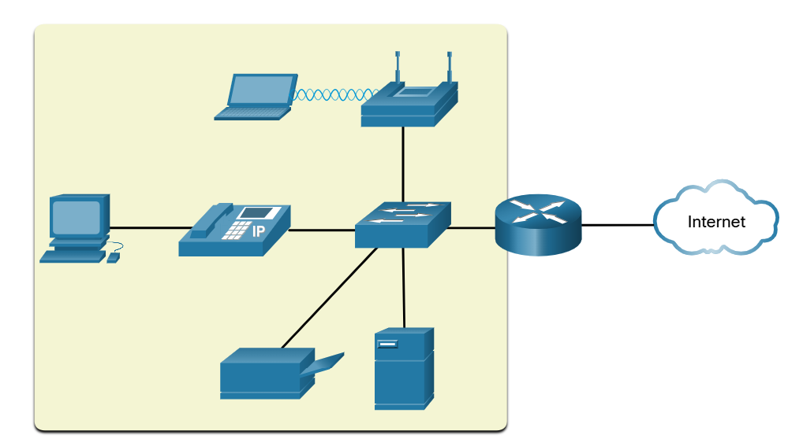

This small network requires a router, a switch, and a wireless access point to connect wired and wireless users, an IP phone, a printer, and a server. Small networks typically have a single WAN connection provided by DSL, cable, or an Ethernet connection. Large networks require an IT department to maintain, secure, and troubleshoot network devices and to protect organizational data. Managing a small network requires many of the same skills as those required for managing a larger one. Small networks are managed by a local IT technician or by a contracted professional.

## 17.1.2 Device Selection for a Small Network

Like large networks, small networks require planning and design to meet user requirements. Planning ensures that all requirements, cost factors, and deployment options are given due consideration.

One of the first design considerations is the type of intermediary devices to use to support the network.

### Cost
The cost of a switch or router is determined by its capacity and features. This includes the number and types of ports available and the backplane speed. Other factors that influence the cost are network management capabilities, embedded security technologies, and optional advanced switching technologies. The expense of cable runs required to connect every device on the network must also be considered. Another key element affecting cost considerations is the amount of redundancy to incorporate into the network.

### Speed and Types of Ports/Interfaces
Choosing the number and type of ports on a router or switch is a critical decision. Newer computers have built-in 1 Gbps NICs. Some servers may even have 10 Gbps ports. Although it is more expensive, choosing Layer 2 devices that can accommodate increased speeds allows the network to evolve without replacing central devices.

### Expandability
Networking devices are available in fixed and modular physical configurations. Fixed configuration devices have a specific number and type of ports or interfaces and cannot be expanded. Modular devices have expansion slots to add new modules as requirements evolve. Switches are available with additional ports for high-speed uplinks. Routers can be used to connect different types of networks. Care must be taken to select the appropriate modules and interfaces for the specific media.

### Operating System Features and Services
Network devices must have operating systems that can support the organizations requirements such as the following:
- Layer 3 switching
- Network Address Translation (NAT)
- Dynamic Host Configuration Protocol (DHCP)
- Security
- Quality of service (QoS)
- Voice over IP (VoIP)

## 17.1.3 IP Addressing for a Small Network

When implementing a network, create an IP addressing scheme and use it. All hosts and devices within an internetwork must have a unique address.

Devices that will factor into the IP addressing scheme include the following:

- End user devices - The number and type of connection (i.e., wired, wireless, remote access)
- Servers and peripherals devices (e.g., printers and security cameras)
- Intermediary devices including switches and access points

It is recommended that you plan, document, and maintain an IP addressing scheme based on device type. The use of a planned IP addressing scheme makes it easier to identify a type of device and to troubleshoot problems, as for instance, when troubleshooting network traffic issues with a protocol analyzer.

For example, refer to the topology of a small to medium sized organization in the figure.

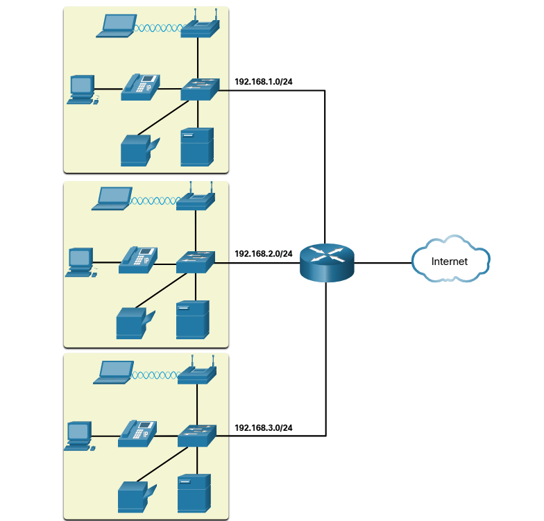

The organization requires three user LANs (i.e., 192.168.1.0/24, 192.168.2.0/24, and 192.168.3.0/24). The organization has decided to implement a consistent IP addressing scheme for each 192.168.x.0/24 LAN using the following plan:

| Device Type | Assignable IP Address Range | Summarized as ... |
|---|---|---|
| Default gateway (Router) | 192.168.x.1 - 192.168.x.2 | 192.168.x.0/30 |
| Switches (max 2) | 192.168.x.5 - 192.168.x.6 | 192.168.x.4/30 |
| Access points (max 6) | 192.168.x.9 - 192.168.x.14 | 192.168.x.8/29 |
| Servers (max 6) | 192.168.x.17 - 192.168.x.22 | 192.168.x.16/29 |
| Printers (max 6) | 192.168.x.25 - 192.168.x.30 | 192.168.x.24/29 |
| IP Phones (max 6) | 192.168.x.33 - 192.168.x.38 | 192.168.x.32/29 |
| Wired devices (max 62) | 192.168.x.65 - 192.168.x.126 | 192.168.x.64/26 |
| Wireless devices (max 62) | 192.168.x.193 - 192.168.x.254 | 192.168.x.192/26 |

The figure displays an example of the 192.168.2.0/24 network devices with assigned IP addresses using the predefined IP addressing scheme.

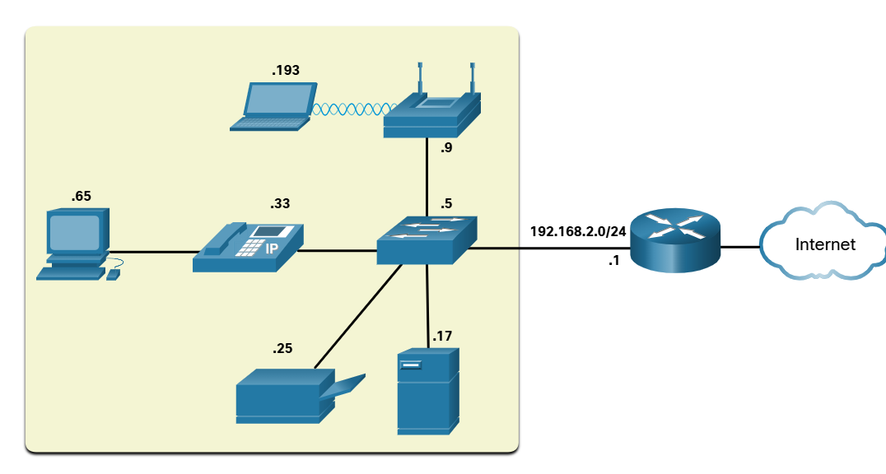

For instance, the default gateway IP address is 192.168.2.1/24, the switch is 192.168.2.5/24, the server is 192.168.2.17/24, etc.. Notice that the assignable IP address ranges were deliberately allocated on subnetnetwork boundaries to simplify summarizing the group type. For instance, assume another switch with IP address 192.168.2.6 is added to the network. To identify all switches in a network policy, the administrator could specify the summarized network address 192.168.x.4/30.

## 17.1.4 Redundancy in a Small Network

Another important part of network design is reliability. Even small businesses often rely heavily on their network for business operation. A failure of the network can be very costly.

In order to maintain a high degree of reliability, *redundancy* is required in the network design. Redundancy helps to eliminate single points of failure.

There are many ways to accomplish redundancy in a network. Redundancy can be accomplished by installing duplicate equipment, but it can also be accomplished by supplying duplicate network links for critical areas, as shown in the figure.

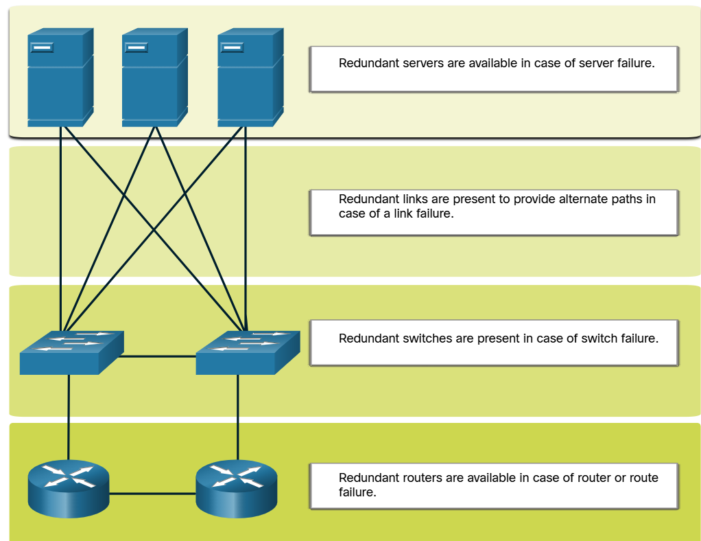

Small networks typically provide a single exit point toward the internet via one or more default gateways. If the router fails, the entire network loses connectivity to the internet. For this reason, it may be advisable for a small business to pay for a second service provider as backup.

## 17.1.5 Traffic Management

The goal for a good network design, even for a small network, is to enhance the productivity of the employees and minimize network downtime. The network administrator should consider the various types of traffic and their treatment in the network design.

The routers and switches in a small network should be configured to support real-time traffic, such as voice and video, in an appropriate manner relative to other data traffic. In fact, a good network design will implement quality of service (QoS) to classify traffic carefully according to priority during times of congestion, as shown in the figure.

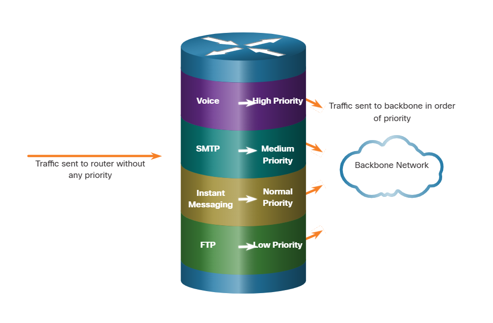

Priority queuing has four queues. The high-priority queue is always emptied first.

# 17.2 Small Network Applications and Protocols 

## 17.2.1 Common Applications

The previous topic discussed the components of a small network, as well as some of the design considerations. These considerations are necessary when you are just setting up a network. After you have set it up, your network still needs certain types of applications and protocols in order to work.

The network is only as useful as the applications that are on it. There are two forms of software programs or processes that provide access to the network: network applications and application layer services.

### Network Applications

Applications are the software programs used to communicate over the network. Some end-user applications are network-aware, meaning that they implement application layer protocols and are able to communicate directly with the lower layers of the protocol stack. Email clients and web browsers are examples of this type of application.

### Application Layer Services

 Otherprograms may need the assistance of application layer services to use network resources like file transfer or network print spooling. Though transparent to an employee, these services are the programs that interface with the network and prepare the data for transfer. Different types of data, whether text, graphics or video, require different network services to ensure that they are properly prepared for processing by the functions occurring at the lower layers of the OSI model.

Each application or network service uses protocols, which define the standards and data formats to be used. Without protocols, the data network would not have a common way to format and direct data. In order to understand the function of various network services, it is necessary to become familiar with the underlying protocols that govern their operation.

Use the Task Manager to view the current applications, processes, and services running on a Windows PC, as shown in the figure.

## 17.2.2 Common Protocols

Most of a technician's work, in either a small or a large network, will in some way be involved with network protocols. Network protocols support the applications and services used by employees in a small network.

Network administrators commonly require access to network devices and servers. The two most common remote access solutions are Telnet and Secure Shell (SSH). SSH service is a secure alternative to Telnet. When connected, administrators can access the SSH server device as though they were logged in locally.

SSH is used to establish a secure remote access connection between an SSH client and other SSH-enabled devices:

-   **Network device** - The network device (e.g., router, switch, access point, etc.) must support SSH to provide remote access SSH server services to clients.
-   **Server** - The server (e.g., web server, email server, etc.) must support remote access SSH server services to clients.

Network administrators must also support common network servers and their required related network protocols, as shown in the figure.

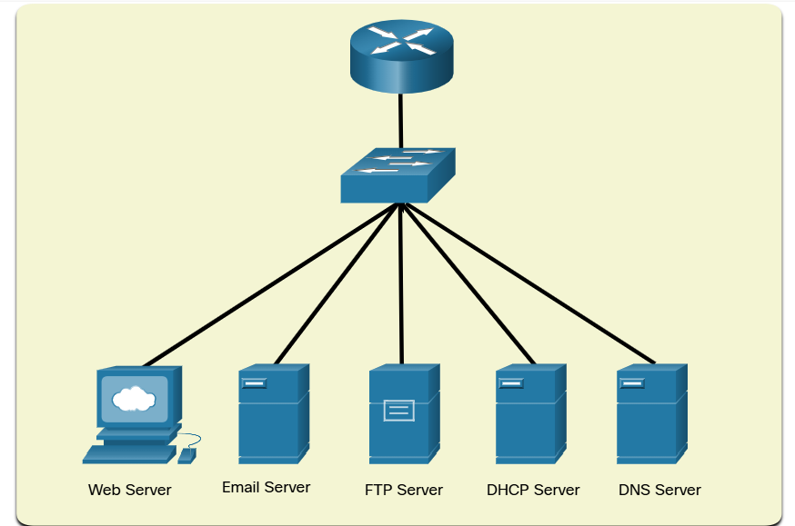

### Web Server
- Web clients and web servers exchange web traffic using the Hypertext Transfer Protocol (HTTP).
- Hypertext Transfer Protocol Secure (HTTPS) is used for secure web communication.

### Email Server
- Email servers and clients use Simple Mail Transfer Protocol (SMTP) to send emails.
- Email clients use Post Office Protocol (POP3) or Internet Message Access Protocol (IMAP) to retrieve email.
- Recipients are specified using the user@xyz.xxx format.

### FTP Server
- File Transfer Protocol (FTP) service allows files to be downloaded and uploaded between a client and FTP server.
- FTP Secure (FTPS) and Secure FTP (SFTP) are used to secure FTP file exchange.

### DHCP Server
Dynamic Host Configuration Protocol (DHCP) is used by clients to acquire an IP configuration (i.e., IP address, subnet mask, default
gateway and more) from a DHCP server.

### DNS Server
- Domain Name System (DNS) resolves a domain name to an IP address (e.g., cisco.com = 72.163.4.185)
- DNS provides the IP address of a web site (i.e., domain name) to a requesting host.

Note: A server could provide multiple network services. For instance, a server could be an email, FTP, and SSH server.

These network protocols comprise the fundamental toolset of a network professional. Each of these network protocols define:
- Processes on either end of a communication session
- Types of messages
- Syntax of the messages
- Meaning of informational fields
- How messages are sent and the expected response
- Interaction with the next lower layer

Many companies have established a policy of using secure versions (e.g., SSH, SFTP, and HTTPS) of these protocols whenever possible.

## 17.2.3 Voice and Video Applications

Businesses today are increasingly using IP telephony and streaming media to communicate with customers and business partners. Many organizations are enabling their employees to work remotely. As the figure shows, many of their users still require access to corporate software and files, as well as support for voice and video applications.

The network administrator must ensure the proper equipment is installed in the network and that the network devices are configured to ensure priority delivery.

### Infrastructure

- The network infrastructure must support the real-time applications.
- Existing devices and cabling must be tested and validated.
- Newer networking products may be required.

### VoIP
- VoIP devices convert analog telephone signals into digital IP packets.
- Typically, VOIP is less expensive than an IP telephony solution, but the quality of communications does not meet the same standards.
- Small network voice and video over IP can be solved using Skype and non-enterprise versions of Cisco WebEx.

### IP Telephony
- An IP phone performs voice-to-IP conversion with the use of a dedicated server for call control and signaling.
- Many vendors provide small business IP telephony solutions such as the Cisco Business Edition 4000 Series products.

### Real-Time Applications
- The network must support quality of service (QoS) mechanisms to minimize latency issues for real-time streaming applications.
- Real-Time Transport Protocol (RTP) and Real-Time Transport Control Protocol (RTCP) are two protocols that support this requirement.

# 17.3 Scale to Larger Networks 

## 17.3.1 Small Network Growth

If your network is for a small business, presumably, you want that business to grow, and your network to grow along with it. This is called scaling a network, and there are some best practices for doing this.

Growth is a natural process for many small businesses, and their networks must grow accordingly. Ideally, the network administrator has enough lead-time to make intelligent decisions about growing the network in alignment with the growth of the company.

To scale a network, several elements are required:

-   **Network documentation** - Physical and logical topology
-   **Device inventory** - List of devices that use or comprise the network
-   **Budget** - Itemized IT budget, including fiscal year equipment purchasing budget
-   **Traffic analysis** - Protocols, applications, and services and their respective traffic requirements should be documented

These elements are used to inform the decision-making that accompanies the scaling of a small network.

## 17.3.2 Protocol Analysis

As the network grows, it becomes important to determine how to manage network traffic. It is important to understand the type of traffic that is crossing the network as well as the current traffic flow. There are several network management tools that can be used for this purpose. However, a simple protocol analyzer such as Wireshark can also be used.

For instance, running Wireshark on several key hosts can reveal the types of network traffic flowing through the network. The following figure displays Wireshark protocol hierarchy statistics for a Windows host on a small network.

To determine traffic flow patterns, it is important to do the following:
- Capture traffic during peak utilization times to get a good representation of the different traffic types.
- Perform the capture on different network segments and devices as some traffic will be local to a particular segment.

Information gathered by the protocol analyzer is evaluated based on the source and destination of the traffic, as well as the type of traffic being sent. This analysis can be used to make decisions on how to manage the traffic more efficiently. This can be done by reducing unnecessary traffic flows or changing flow patterns altogether by moving a server, for example.

Sometimes, simply relocating a server or service to another network segment improves network performance and accommodates the growing traffic needs. At other times, optimizing the network performance requires major network redesign and intervention.

## 17.3.3 Employee Network Utilization

In addition to understanding changing traffic trends, a network administrator must be aware of how network use is changing. Many operating systems provide built-in tools to display such information. For example, a Windows host provides tools such as the Task Manager, Event Viewer, and Data Usage tools.

These tools can be used to capture a "snapshot" of information such as the following:

- OS and OS Version
- CPU utilization
- RAM utilization
- Drive utilization
- Non-Network applications
- Network applications

Documenting snapshots for employees in a small network over a period of time is very useful to identify evolving protocol requirements and associated traffic flows. A shift in resource utilization may require the network administrator to adjust network resource allocations accordingly.

The Windows 10 Data Usage tool is especially useful to determine which applications are using network services on a host. The Data Usage tool is accessed using Settings > Network & Internet > Data usage > network interface (from the last 30 days).

The example in the figure is displaying the applications running on a remote user Windows 10 host using the local Wi-Fi network connection.

# 17.4 Verify Connectivity 

## 17.4.1 Verify Connectivity with Ping

Whether your network is small and new, or you are scaling an existing network, you will always want to be able to verify that your components are properly connected to each other and to the internet. This topic discusses some utilities that you can use to ensure that your network is connected.

The **ping** command is the most effective way to quickly test Layer 3 connectivity between a source and destination IP address. The command also displays various round-trip time statistics.

Specifically, the **ping** command uses the Internet Control Message Protocol (ICMP) echo request (ICMP Type 8) and echo reply (ICMP Type 0) messages. The **ping** command is available in most operating systems including Windows, Linux, macOS, and Cisco IOS.

On a Windows 10 host, the **ping** command sends four consecutive ICMP echo request messages and expects four consecutive ICMP echo replies from the destination.

For example, assume PC A pings PC B. As shown in the figure, the PC A Windows host sends four consecutive ICMP echo request messages. sometimes referred to as an ICMP echo, to PC B (i.е., 203.0.113.8).

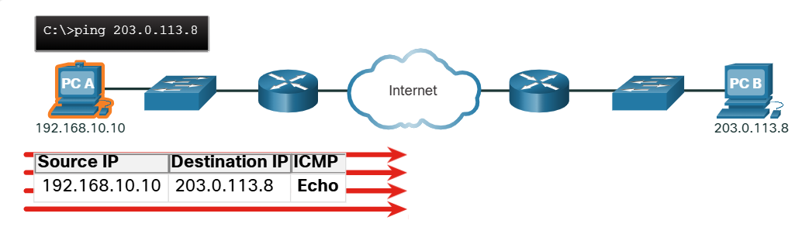

The destination host receives and processes the ICMP echos. As shown in the figure, PC B responds by sending four ICMP echo reply messages to PC A.

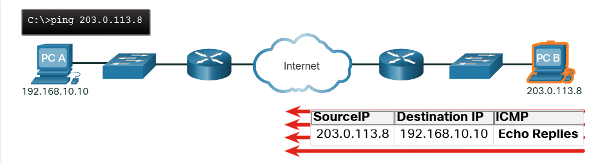

As shown in the command output, PC A has received echo replies from PC-B verifying the Layer 3 network connection.

```
C:\Users\PC-A> ping 10.1.1.10
Pinging 10.1.1.10 with 32 bytes of data:
Reply from 10.1.1.10: bytes=32 time=47ms TTL=51
Reply from 10.1.1.10: bytes=32 time=60ms TTL=51
Reply from 10.1.1.10: bytes=32 time=53ms TTL=51
Reply from 10.1.1.10: bytes=32 time=50ms TTL=51
Ping statistics for 10.1.1.10:
    Packets: Sent = 4, Received = 4, Lost = 0 (0% loss),
Approximate round trip times in milli-seconds:
    Minimum = 47ms, Maximum = 60ms, Average = 52ms
C:\Users\PC-A>
```

The output validates Layer 3 connectivity between PC A and PC B.
A Cisco IOS ping command output varies from a Windows host. For instance, the IOS ping sends five ICMP echo messages, as shown in
the output.

```
R1# ping 10.1.1.10
Type escape sequence to abort.
Sending 5, 100-byte ICMP Echos to 10.1.1.10, timeout is 2 seconds:
!!!!!
Success rate is 100 percent (5/5), round-trip min/avg/max = 1/1/2 ms
R1#
```

Notice the !!!!! output characters. The IOS ping command displays an indicator for each ICMP echo reply received. The table lists the
most common output characters from the ping command.

### IOS Ping Indicators

| Element | Description |
|---|---|
| ! | * Exclamation mark indicates successful receipt of an echo reply message. <br> * It validates a Layer 3 connection between source and destination. |
| . | * A period means that time expired waiting for an echo reply message. <br> * This indicates a connectivity problem occurred somewhere along the path. |
| U | * Uppercase U indicates a router along the path responded with an ICMP Type 3 "destination unreachable" error message. <br> * Possible reasons include the router does not know the direction to the destination network or it could not find the host on the destination network. |

Note: Other possible ping replies include Q, M, ?, or &. However, the meaning of these are out of scope for this module.

## 17.4.2 Extended Ping

A standard ping uses the IP address of the interface closest to the destination network as the source of the ping. The source IP address of the ping 10.1.1.10 command on R1 would be that of the G0/0/0 interface (i.e., 209.165.200.225), as illustrated in the example.

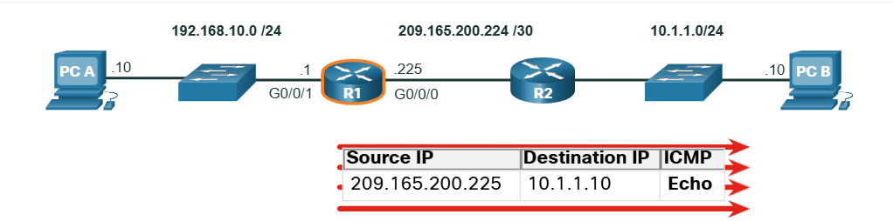

The Cisco IOS offers an "extended" mode of the ping command. This mode enables the user to create special type of pings by adjusting parameters related to the command operation.

Extended ping is entered in privileged EXEC mode by typing ping without a destination IP address. You will then be given several prompts to customize the extended ping.

Note: Pressing Enter accepts the indicated default values.

For example, assume you wanted to test connectivity from the R1 LAN (i.e., 192.168.10.0/24) to the 10.1.1.0 LAN. This could be verified from the PC A. However, an extended ping could be configured on R1 to specify a different source address.

As illustrated in the example, the source IP address of the extended ping command on R1 could be configured to use the G0/0/1 interface IP address (i.e., 192.168.10.1).

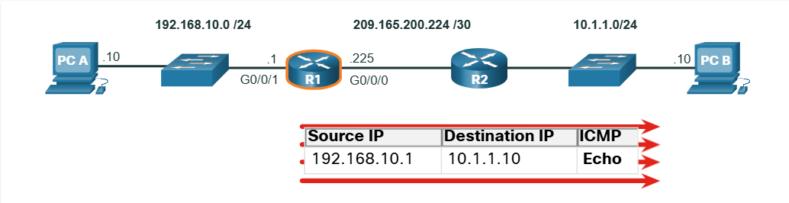

The following command output configures an extended ping on R1 and specifies the source IP address to be that of the G0/0/1 interface (i.e., 192.168.10.1).

```
R1# ping
Protocol [ip]:
Target IP address: 10.1.1.10
Repeat count [5]:
Datagram size [100]:
Timeout in seconds [2]:
Extended commands [n]: y
Ingress ping [n]:
Source address or interface: 192.168.10.1
DSCP Value [0]:
Type of service [0]:
Set DF bit in IP header? [no]:
Validate reply data? [no]:
Data pattern [0x0000ABCD]:
Loose, Strict, Record, Timestamp, Verbose [none]:
Sweep range of sizes [n]:
Type escape sequence to abort.
Sending 5, 100-byte ICMP Echos to 10.1.1.1, timeout is 2 seconds:
Packet sent with a source address of 192.168.10.1
!!!!!
Success rate is 100 percent (5/5), round-trip min/avg/max = 1/1/1 ms
R1#
```

Note: The ping ipv6 command is used for IPv6 extended pings.

## 17.4.3 Verify Connectivity with Traceroute

The ping command is useful to quickly determine if there is a Layer 3 connectivity problem. However, it does not identify where the problem is located along the path.

Traceroute can help locate Layer 3 problem areas in a network. A trace returns a list of hops as a packet is routed through a network. It could be used to identify the point along the path where the problem can be found. The syntax of the trace command varies between operating systems, as illustrated in the figure. 

### Windows and Cisco IOS Trace Commands

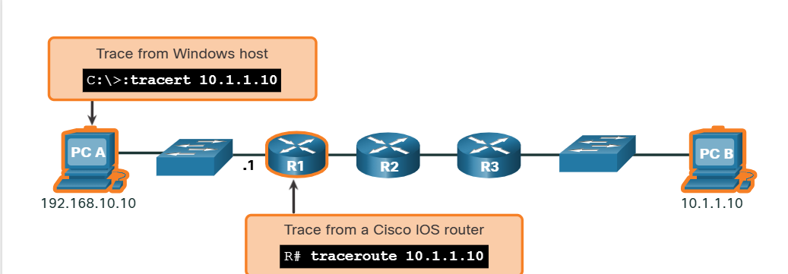

The following is a sample output of tracert command on a Windows 10 host.

```
C:\Users\PC-A> tracert 10.1.1.10
Tracing route to 10.1.10 over a maximum of 30 hops:
1    2 ms    2 ms     2 ms   192.168.10.1
2    *       *        *      Request timed out.
3    *       *        *      Request timed out.
4    *       *        *      Request timed out.
^C
C:\Users\PC-A>
```

Note: Use Ctrl-C to interrupt a tracert in Windows.

The only successful response was from the gateway on R1. Trace requests to the next hop timed out as indicated by the asterisk (*), meaning that the next hop router did not respond. The timed out requests indicate that there is a failure in the internetwork beyond the LAN, or that these routers have been configured to not respond to echo requests used in the trace. In this example there appears to be a problem between R1 and R2.

A Cisco IOS traceroute command output varies from the Windows tracert command. For instance, refer to the following topology.

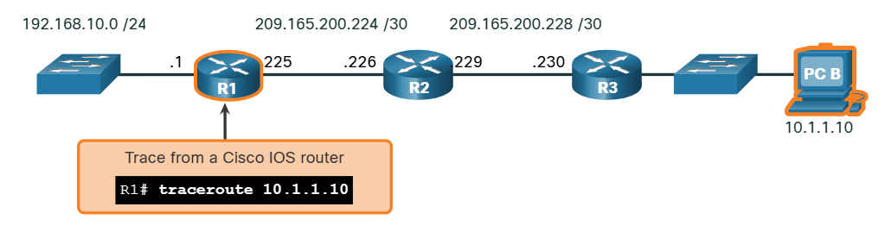

The following is a sample output of traceroute command from R1.

```
R1# traceroute 10.1.1.10
Type escape sequence to abort.
Tracing the route to 10.1.1.10
VRF info: (vrf in name/id, vrf out name/id)
    1 209.165.200.226 1 msec 0 msec 1 msec
    2 209.165.200.230 1 msec 0 msec 1 msec
    3 10.1.1.10 1 msec 0 msec
R1#
```

In this example, the trace validated that it could successfully reach PC В. Timeouts indicate a potential problem. For instance, if the 10.1.1.10 host was not available, the traceroute command would display the following output.

```
R1# traceroute 10.1.1.10
Type escape sequence to abort.
Tracing the route to 10.1.1.10
VRF info: (vrf in name/id, vrf out name/id)
    1 209.165.200.226 1 msec 0 msec 1 msec
    2 209.165.200.230 1 msec 0 msec 1 msec
    3 * * *
    4 * * *
    5 *
```

Use Ctrl-Shift-6 to interrupt a traceroute in Cisco IOS.

Note: Windows implementation of traceroute (tracert) sends ICMP Echo Requests. Cisco IOS and Linux use UDP with an invalid port number. The final destination will return an ICMP port unreachable message.

## 17.4.4 Extended Traceroute

Like the extended ping command, there is also an extended traceroute command. It allows the administrator to adjust parameters related to the command operation. This is helpful in locating the problem when troubleshooting routing loops, determining the exact next-hop router, or determining where packets are getting dropped or denied by a router or firewall.

The Windows tracert command allows the input of several parameters through options in the command line. However, it is not guided like the extended traceroute IOS command. The following output displays the available options for the Windows tracert command.

```
C:\Users\PC-A> tracert /?
Usage: tracert [-d] [-h maximum_hops] [-j host-list] [-w timeout]
                [-R] [-S srcaddr] [-4] [-6] target_name

Options:
    -d Do not resolve addresses to hostnames.
    -h maximum_hops Maximum number of hops to search for target.
    -j host-list Loose source route along host-list (IPv4-only).
    -w timeout Wait timeout milliseconds for each reply.
    -R Trace round-trip path (IPv6-only).
    -S srcaddr Source address to use (IPv6-only).
    -4 Force using IPv4.
    -6 Force using IPv6.
C:\Users\PC-A>
```

The Cisco IOS extended traceroute option enables the user to create a special type of trace by adjusting parameters related to the command operation. Extended traceroute is entered in privileged EXEC mode by typing traceroute without a destination IP address. IOS will guide you through the command options by presenting a number of prompts related to the setting of all the different parameters. 

Note: Pressing Enter accepts the indicated default values.

For example, assume you want to test connectivity to PC B from the R1 LAN. Although this could be verified from PC A, an extended **traceroute** could be configured on R1 to specify a different source address.

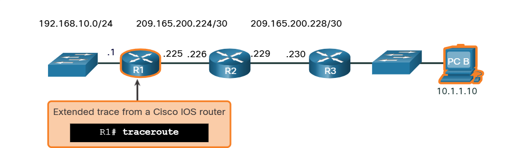

As illustrated in the example, the source IP address of the extended traceroute command on R1 could be configured to use the R1 LAN interface IP address (i.e., 192.168.10.1).

```
R1# traceroute
Protocol [ip]:
Target IP address: 10.1.1.10
Ingress traceroute [n]:
Source address: 192.168.10.1
DSCP Value [0]:
Numeric display [n]:
Timeout in seconds [3]:
Probe count [3]:
Minimum Time to Live [1]:
Maximum Time to Live [30]:
Port Number [33434]:
Loose, Strict, Record, Timestamp, Verbose [none]:
Type escape sequence to abort.
Tracing the route to 192.168.10.10
VRF info: (vrf in name/id, vrf out name/id)
    1 209.165.200.226 1 msec 1 msec 1 msec
    2 209.165.200.230 0 msec 1 msec 0 msec
    3 *
10.1.1.10 2 msec 2 msec
R1#
```

## 17.4.5 Network Baseline

One of the most effective tools for monitoring and troubleshooting network performance is to establish a network baseline. Creating an effective network performance baseline is accomplished over a period of time. Measuring performance at varying times and loads will assist in creating a better picture of overall network performance.

The output derived from network commands contributes data to the network baseline. One method for starting a baseline is to copy and paste the results from an executed ping, trace, or other relevant commands into a text file. These text files can be time stamped with the date and saved into an archive for later retrieval and comparison.

Among items to consider are error messages and the response times from host to host. If there is a considerable increase in response times, there may be a latency issue to address.

For example, the following ping output was captured and pasted into a text file.

**August 19, 2019 at 08:14:43**

```
C:\Users\PC-A> ping 10.1.1.10
Pinging 10.1.1.10 with 32 bytes of data:
Reply from 10.1.1.10: bytes=32 time<1ms TTL=64
Reply from 10.1.1.10: bytes=32 time<1ms TTL=64
Reply from 10.1.1.10: bytes=32 time<1ms TTL=64
Reply from 10.1.1.10: bytes=32 time<1ms TTL=64
Ping statistics for 10.1.1.10:
    Packets: Sent = 4, Received = 4, Lost = 0 (0% loss),
Approximate round trip times in milli-seconds:
    Minimum = 0ms, Maximum = 0ms, Average = 0ms
C:\Users\PC-A>
```

Notice the ping round-trip times are less than 1 ms.

A month later, the ping is repeated and captured.

**September 19, 2019 at 10:18:21**

```
C:\Users\PC-A> ping 10.1.1.10
Pinging 10.1.1.10 with 32 bytes of data:
Reply from 10.1.1.10: bytes=32 time=50ms TTL=64
Reply from 10.1.1.10: bytes=32 time=49ms TTL=64
Reply from 10.1.1.10: bytes=32 time=46ms TTL=64
Reply from 10.1.1.10: bytes=32 time=47ms TTL=64
Ping statistics for 10.1.1.10:
    Packets: Sent = 4, Received = 4, Lost = 0 (0% loss),
Approximate round trip times in milli-seconds:
    Minimum = 46ms, Maximum = 50ms, Average = 48ms
C:\Users\PC-A>
```

Notice this time that the ping round-trip times are much longer indicating a potential problem. 

Corporate networks should have extensive baselines; more extensive than we can describe in this course. Professional-grade software tools are available for storing and maintaining baseline information. In this course, we cover a few basic techniques and discuss the purpose of baselines.

Cisco's best practices for baseline processes can be found by searching the internet for "Baseline Process Best Practices".

# 17.5 Host and IOS Commands 

## 17.5.1 IP Configuration on a Windows Host

If you have used any of the tools in the previous topic to verify connectivity and found that some part of your network is not working as it should, now is the time to use some commands to troubleshoot your devices. Host and IOS commands can help you determine if the problem is with the IP addressing of your devices, which is a common network problem.

Checking the IP addressing on host devices is a common practice in networking for verifying and troubleshooting end-to-end connectivity. In Windows 10, you can access the IP address details from the **Network and Sharing Center**, as shown in the figure, to quickly view the four important settings: address, mask, router, and DNS.

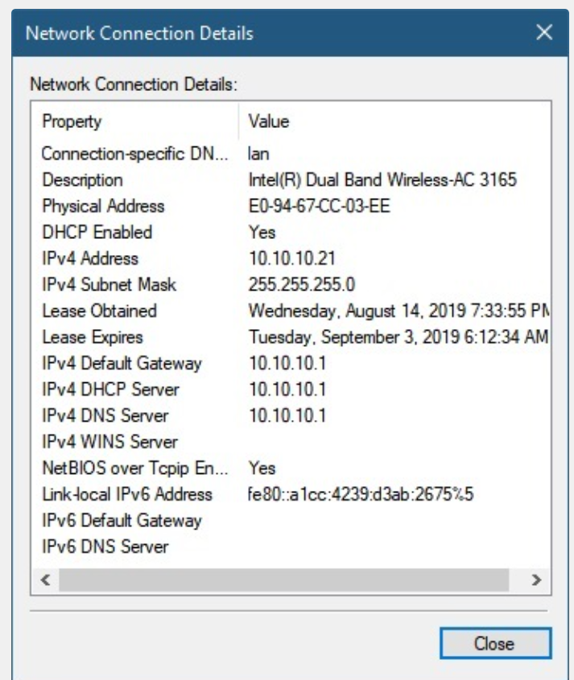

However, network administrators typically view the IP addressing information on a Windows host by issuing the ipconfig command at the command line of a Windows computer, as shown in the sample output.

```
C:\Users\PC-A> ipconfig
Windows IP Configuration
    (Output omitted)
    Wireless LAN adapter Wi-Fi:
    Connection-specific DNS Suffix . . . . . :
    Link-local IPv6 Address . . . . . . . . . : fe80::a4aa:2dd1:ae2d:a75e%16
    IPv4 Address. . . . . . . . . . . . . . . : 192.168.10.10
    Subnet Mask . . . . . . . . . . . . . . . : 255.255.255.0
    Default Gateway . . . . . . . . . . . . . : 192.168.10.1
(Output omitted)
```

Use the ipconfig /all command to view the MAC address, as well as a number of details regarding the Layer 3 addressing of the device, as shown in the example output.

```
C:\Users\PC-A> ipconfig /all
Windows IP Configuration
    Host Name . . . . . . . . . . . . . . . . . : PC-A-00H20
    Primary Dns Suffix . . . . . . . . . . . . : cisco.com
    Node Type . . . . . . . . . . . . . . . . . : Hybrid
    IP Routing Enabled. . . . . . . . . . . . . : No
    WINS Proxy Enabled. . . . . . . . . . . . . : No
    DNS Suffix Search List. . . . . . . . . . . : cisco.com

(Output omitted)

    Wireless LAN adapter Wi-Fi:

    Connection-specific DNS Suffix . . . . . . . :
    Description . . . . . . . . . . . . . . . . : Intel(R) Dual Band Wireless-AC 8265
    Physical Address. . . . . . . . . . . . . . : F8-94-C2-E4-C5-0A
    DHCP Enabled. . . . . . . . . . . . . . . . : Yes
    Autoconfiguration Enabled . . . . . . . . . : Yes
    Link-local IPv6 Address . . . . . . . . . . : fe80::a4aa:2dd1:ae2d:a75e%16 (Preferred)
    IPv4 Address. . . . . . . . . . . . . . . . : 192.168.10.10 (Preferred)
    Subnet Mask . . . . . . . . . . . . . . . . : 255.255.255.0
    Lease Obtained. . . . . . . . . . . . . . . : August 17, 2019 1:20:17 PM
    Lease Expires . . . . . . . . . . . . . . . : August 18, 2019 1:20:18 PM
    Default Gateway . . . . . . . . . . . . . . : 192.168.10.1
    DHCP Server . . . . . . . . . . . . . . . . : 192.168.10.1
    DHCPv6 IAID . . . . . . . . . . . . . . . . : 100177090
    DHCPv6 Client DUID. . . . . . . . . . . . . : 00-01-00-01-21-F3-76-75-54-E1-AD-DE-DA-9A
    DNS Servers . . . . . . . . . . . . . . . . : 192.168.10.1
    NetBIOS over Tcpip. . . . . . . . . . . . . : Enabled
```

If a host is configured as a DHCP client, the IP address configuration can be renewed using the ipconfig /release and ipconfig /renew commands, as shown in the sample output.

```
C:\Users\PC-A> ipconfig /release
(Output omitted)
Wireless LAN adapter Wi-Fi:
    Connection-specific DNS Suffix
    Link-local IPv6 Address:        fe80::a4aa:2dd1:ae2d:a75e%16
    Default Gateway
(Output omitted)
C:\Users\PC-A> ipconfig /renew
(Output omitted)
Wireless LAN adapter Wi-Fi:
    Connection-specific DNS Suffix
    Link-local IPv6 Address:        fe80::a4aa:2dd1:ae2d:a75e%16
    IPv4 Address:                   192.168.1.124
    Subnet Mask:                    255.255.255.0
    Default Gateway:                192.168.1.1
(Output omitted)
C:\Users\PC-A>
```

The DNS Client service on Windows PCs also optimizes the performance of DNS name resolution by storing previously resolved names in memory. The ipconfig /displaydns command displays all of the cached DNS entries on a Windows computer system, as shown in the example output.

```
C:\Users\PC-A> ipconfig /displaydns
Windows IP Configuration
(Output omitted)
    netacad.com
    Record Name . . . . . . . . : netacad.com
    Record Type . . . . . . . . : 1
    Time To Live . . . . . . . : 602
    Data Length . . . . . . . . : 4
    Section . . . . . . . . . . : Answer
    A (Host) Record . . . . . . : 54.165.95.219
(Output omitted)
```

## 17.5.2 IP Configuration on a Linux Host

Verifying IP settings using the GUI on a Linux machine will differ depending on the Linux distribution (distro) and desktop interface. The figure shows the **Connection Information** dialog box on the Ubuntu distro running the Gnome desktop.

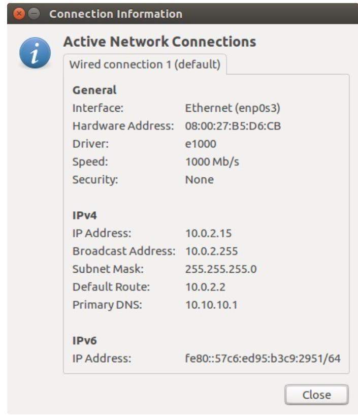

On the command line, network administrators use the ifconfig command to display the status of the currently active interfaces and their IP configuration, as shown in the output.

```
[analyst@secops ~]$ ifconfig
enp0s3  Link encap:Ethernet HWaddr 08:00:27:b5:d6:cb
        inet addr: 10.0.2.15 Bcast:10.0.2.255 Mask: 255.255.255.0
        inet6 addr: fe80::57c6ed95:b3c9:2951/64 Scope: Link
        UP BROADCAST RUNNING MULTICAST MTU:1500 Metric:1
        RX packets:1332239 errors:0 dropped:0 overruns:0 frame:0
        TX packets:105910 errors:0 dropped:0 overruns:0 carrier:0
        collisions:0 txqueuelen:1000
        RX bytes:1855455014 (1.8 GB) TX bytes:13140139 (13.1 MB)
lo: flags=73<UP,LOOPBACK,RUNNING> mtu 65536
        inet 127.0.0.1 netmask 255.0.0.0
        inet6 ::1 prefixlen 128 scopeid 0x10<host>
        loop txqueuelen 1000 (Local Loopback)
        RX packets ø bytes 0 (0.0 B)
        RX errors @ dropped e overruns e frame e
        TX packets 0 bytes 0 (0.0 B)
        TX errors e dropped e overruns e carrier e collisions e
```

The Linux ip address command is used to display addresses and their properties. It can also be used to add or delete IP addresses.

Note: The output displayed may vary depending on the Linux distribution.

## 17.5.3 IP Configuration on a macOS Host

In the GUI of a Mac host, open Network Preferences > Advanced to get the IP addressing information, as shown in the figure.

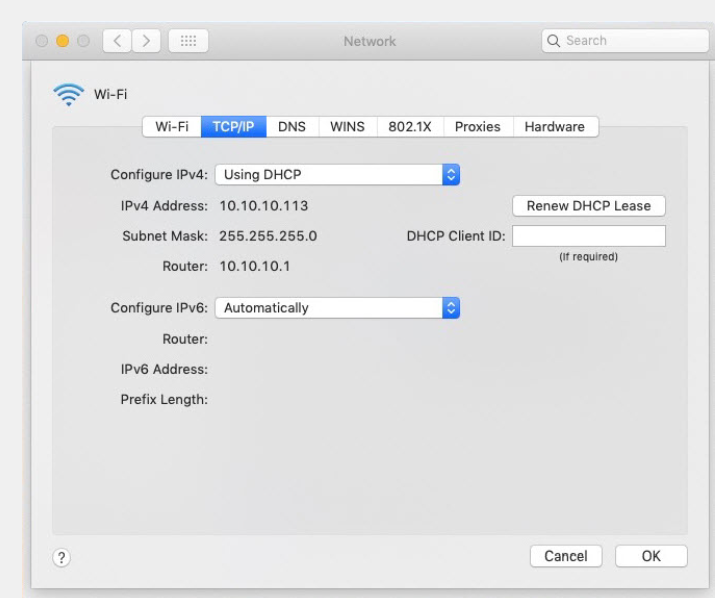

However, the ifconfig command can also be used to verify the interface IP configuration a shown in the output.

```
MacBook-Air:- Admin$ ifconfig ene
eno: flags=8863 mtu 1500
    ether c4:b3:01:a0:64:98
    inet6 fe80::c0f:1bf4:60b1:3adb%eno prefixlen 64 secured scopeid 0x5
    inet 10.10.10.113 netmask 0xffffffee broadcast 10.10.10.255
    nd6 options=201
    media: autoselect
    status: active
MacBook-Air:- Admin$
```

Other useful macOS commands to verify the host IP settings include `networksetup -listallnetworkservices` and the `networksetup -getinfo <network service>`, as shown in the following output.

```
MacBook-Air:- Admin$ networksetup -listallnetworkservices
An asterisk (*) denotes that a network service is disabled.
iPhone USB
Wi-Fi
Bluetooth PAN
Thunderbolt Bridge
MacBook-Air:- Admin$
MacBook-Air:- Admin$ networksetup -getinfo Wi-Fi
DHCP Configuration
IP address: 10.10.10.113
Subnet mask: 255.255.255.0
Router: 10.10.10.1
Client ID:
IPv6: Automatic
IPv6 IP address: none
IPv6 Router: none
Wi-Fi ID: c4:b3:01:a0:64:98
MacBook-Air:- Admin$
```

## 17.5.4 The arp Command
The arp command is executed from the Windows, Linux, or Mac command prompt. The command lists all devices currently in the ARP cache of the host, which includes the IPv4 address, physical address, and the type of addressing (static/dynamic), for each device. For instance, refer to the topology in the figure.

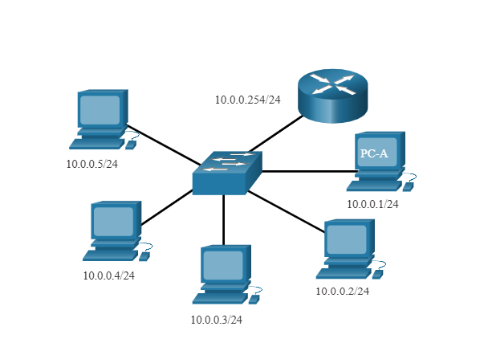

The output of the arp -a command on the Windows PC-A host is displayed.

```
C:\Users\PC-A> arp -a
Interface: 192.168.93.175 --- 0xc
Internet Address | Physical Address | Type
---|---|---
10.0.0.2 | d0-67-e5-b6-56-4b | dynamic
10.0.0.3 | 78-48-59-e3-b4-01 | dynamic
10.0.0.4 | 00-21-66-00-16-97 | dynamic
10.0.0.254 | 00-15-99-cd-38-d9 | dynamic
```

The arp -a command displays the known IP address and MAC address binding. Notice how IP address 10.0.0.5 is not included in the list. This is because the ARP cache only displays information from devices that have been recently accessed.

To ensure that the ARP cache is populated, ping a device so that it will have an entry in the ARP table. For instance, if PC-A pinged 10.0.0.5, then the ARP cache would contain an entry for that IP address.

The cache can be cleared by using the netsh interface ip delete arpcache command in the event the network administrator wants to repopulate the cache with updated information.

Note: You may need administrator access on the host to be able to use the netsh interface ip delete arpcache command.

## 17.5.5 Common show Commands Revisited

In the same way that commands and utilities are used to verify a host configuration, commands can be used to verify the interfaces of intermediary devices. The Cisco IOS provides commands to verify the operation of router and switch interfaces.

The Cisco IOS CLI show commands display relevant information about the configuration and operation of the device. Network technicians use show commands extensively for viewing configuration files, checking the status of device interfaces and processes, and verifying the device operational status. The status of nearly every process or function of the router can be displayed using a show command.

Commonly used show commands and when to use them are listed in the table.

| Command | Useful for ... |
|---|---|
| show running-config | To verify the current configuration and settings |
| show interfaces | To verify the interface status and see if there are any error messages |
| show ip interface | To verify the Layer 3 information of an interface |
| show arp | To verify the list of known hosts on the local Ethernet LANs |
| show ip route | To verify the Layer 3 routing information |
| show protocols | To verify which protocols are operational |
| show version | To verify the memory, interfaces, and licences of the device |

### show running-config

Verifies the current configuration and settings
```
R1# show running-config
(Output omitted)
!
version 15.5
service timestamps debug datetime msec
service timestamps log datetime msec
service password-encryption
!
hostname R1
!
interface GigabitEthernet0/0/0
description Link to R2
ip address 209.165.200.225 255.255.255.252
negotiation auto
!
interface GigabitEthernet0/0/1
description Link to LAN
ip address 192.168.10.1 255.255.255.0
negotiation auto
!
router ospf 10
network 192.168.10.0 0.0.0.255 area 0
network 209.165.200.224 0.0.0.3 area 0
!
banner motd ^C Authorized access only! ^C
!
line con 0
password 7 141418180F0B
login
line vty 0 4
password 7 00071A150754
login
transport input telnet ssh
!
end
R1#
```

### show interfaces

Verifies the interface status and displays any error messages

```
R1# show interfaces
GigabitEthernet0/0/0 is up, line protocol is up
    Hardware is ISR4321-2x1GE, address is a0e0.af0d.e140 (bia a0e0.afod.e140)
    Description: Link to R2
    Internet address is 209.165.200.225/30
    MTU 1500 bytes, BW 100000 Kbit/sec, DLY 100 usec,
        reliability 255/255, txload 1/255, rxload 1/255
    Encapsulation ARPA, loopback not set
    Keepalive not supported
    Full Duplex, 100Mbps, link type is auto, media type is RJ45
    output flow-control is off, input flow-control is off
    ARP type: ARPA, ARP Timeout 04:00:00
    Last input 00:00:01, output 00:00:21, output hang never
    Last clearing of "show interface" counters never
    Input queue: 0/375/0/0 (size/max/drops/flushes); Total output drops: 0
    Queueing strategy: fifo
    Output queue: 0/40 (size/max)
    5 minute input rate e bits/sec, o packets/sec
    5 minute output rate e bits/sec, e packets/sec
        5127 packets input, 590285 bytes, e no buffer
        Received 29 broadcasts (0 IP multicasts)
        0 runts, e giants, e throttles
        e input errors, Ø CRC, Ø frame, e overrun, e ignored
        O watchdog, 5043 multicast, o pause input
        1150 packets output, 153999 bytes, 0 underruns
        • output errors, e collisions, 2 interface resets
        e unknown protocol drops
        Ø babbles, o late collision, e deferred
        1 lost carrier, e no carrier, o pause output
        • output buffer failures, e output buffers swapped out
    GigabitEthernet0/0/1 is up, line protocol is up
(Output omitted)
```

### show ip interface

Verifies the Layer 3 information of an interface

```
R1# show ip interface
GigabitEthernet0/0/0 is up, line protocol is up
    Internet address is 209.165.200.225/30
    Broadcast address is 255.255.255.255
    Address determined by setup command
    MTU is 1500 bytes
    Helper address is not set
    Directed broadcast forwarding is disabled
    Multicast reserved groups joined: 224.0.0.5 224.0.0.6
    Outgoing Common access list is not set
    Outgoing access list is not set
    Inbound Common access list is not set
    Inbound access list is not set
    Proxy ARP is enabled
    Local Proxy ARP is disabled
    Security level is default
    Split horizon is enabled
    ICMP redirects are always sent
    ICMP unreachables are always sent
    ICMP mask replies are never sent
    IP fast switching is enabled
    IP Flow switching is disabled
    IP CEF switching is enabled
    IP CEF switching turbo vector
    IP Null turbo vector
    Associated unicast routing topologies:
    Topology "base", operation state is UP
    IP multicast fast switching is enabled
    IP multicast distributed fast switching is disabled
    IP route-cache flags are Fast, CEF
    Router Discovery is disabled
    IP output packet accounting is disabled
    IP access violation accounting is disabled
    TCP/IP header compression is disabled
    RTP/IP header compression is disabled
    Probe proxy name replies are disabled
    Policy routing is disabled
    Network address translation is disabled
    BGP Policy Mapping is disabled
    Input features: MCI Check
    IPv4 WCCP Redirect outbound is disabled
    IPv4 WCCP Redirect inbound is disabled
    IPv4 WCCP Redirect exclude is disabled
    GigabitEthernet0/0/1 is up, line protocol is up
(Output omitted)
```


### show arp

Verifies the list of known hosts on the local Ethernet LANs

```
R1# show arp
Protocol Address            Age (min)   Hardware Addr          Type    Interface
Internet 192.168.10.1           -       a0e0.afod.e141          ARPA    GigabitEthernet0/0/1
Internet 192.168.10.10          95      c07b.bcc4.a9c0          ARPA    GigabitEthernet0/0/1
Internet 209.165.200.225                a0e0.afed.e140          ARPA    GigabitEthernet0/0/0
Internet 209.165.200.226        138     a03d.6fe1.9d90          ARPA    GigabitEthernet0/0/0
R1#
```

### show ip route

Verifies the Layer 3 routing information

```
R1# show ip route
Codes: L - local, C - connected, S - static, R - RIP, M - mobile, B - BGP
    D - EIGRP, EX - EIGRP external, O - OSPF, IA - OSPF inter area
    N1 - OSPF NSSА external type 1, N2 - OSPF NSSА external type 2
    E1 - OSPF external type 1, E2 - OSPF external type 2
    i - IS-IS, su - IS-IS summary, L1 - IS-IS level-1, L2 - IS-IS level-2
    ia - IS-IS inter area, * - candidate default, U - per-user static route
    o - ODR, P - periodic downloaded static route, H - NHRP, 1 - LISP
    a - application route
    + - replicated route, % - next hop override, p - overrides from PFR
Gateway of last resort is 209.165.200.226 to network 0.0.0.0
O*E2 0.0.0.0/0 [110/1] via 209.165.200.226, 02:19:50, GigabitEthernet0/0/0
    10.0.0.0/24 is subnetted, 1 subnets
O       10.1.1.0/24 [110/3] via 209.165.200.226, 02:05:42, GigabitEthernet0/0/0
    192.168.10.0/24 is variably subnetted, 2 subnets, 2 masks
C       192.168.10.0/24 is directly connected, GigabitEthernet0/0/1
L       192.168.10.1/32 is directly connected, GigabitEthernet0/0/1
    209.165.200.0/24 is variably subnetted, 3 subnets, 2 masks
C       209.165.200.224/30 is directly connected, GigabitEthernet0/0/0
L       209.165.200.225/32 is directly connected, GigabitEthernet0/0/0
O       209.165.200.228/30
        [110/2] via 209.165.200.226, 02:07:19, GigabitEthernet0/0/0
R1#
```

### show protocols

Verifies which protocols are operational

```
R1# show protocols
Global values:
Internet Protocol routing is enabled
GigabitEthernet0/0/0 is up, line protocol is up
Internet address is 209.165.200.225/30
GigabitEthernet0/0/1 is up, line protocol is up
Internet address is 192.168.10.1/24
Serial0/1/0 is down, line protocol is down
Serial0/1/1 is down, line protocol is down
GigabitEtherneto is administratively down, line protocol is down
R1#
```

### show version

Verifies the memory, interfaces, and licences of the device

```
R1# show version
Cisco IOS XE Software, Version 03.16.08.S - Extended Support Release
Cisco IOS Software, ISR Software (X86_64_LINUX_IOSD-UNIVERSALK9-M), Version 15.5(3)S8, RELEASE SOFTWARE
(fc2)
Technical Support: http://www.cisco.com/techsupport
Copyright (c) 1986-2018 by Cisco Systems, Inc.
Compiled Wed 08-Aug-18 10:48 by mcpre

(Output omitted)

ROM: IOS-XE ROMMON
R1 uptime is 2 hours, 25 minutes
Uptime for this control processor is 2 hours, 27 minutes
System returned to ROM by reload
System image file is "bootflash:/isr4300-universalk9.03.16.08.S.155-3.58-ext.SPA.bin"
Last reload reason: LocalSoft
(Output omitted)

Technology Package License Information:

| Technology | Technology-package Current | Type | Technology-package Next reboot |
|---|---|---|---|
| appxk9 | appxk9 | RightToUse | appxk9 |
| uck9 | None | None | None |
| securityk9 | securityk9 | Permanent | securityk9 |
| ipbase | ipbasek9 | Permanent | ipbasek9 |

cisco ISR4321/K9 (1RU) processor with 1647778K/6147K bytes of memory.
Processor board ID FLM2044W0LT
2 Gigabit Ethernet interfaces
2 Serial interfaces
32768K bytes of non-volatile configuration memory.
4194304K bytes of physical memory.
3207167K bytes of flash memory at bootflash:.
978928K bytes of USB flash at usbe:.
Configuration register is 0x2102
R1#
```


## 17.5.6 The show cdp neighbors Command

There are several other IOS commands that are useful. The Cisco Discovery Protocol (CDP) is a Cisco proprietary protocol that runs at the data link layer. Because CDP operates at the data link layer, two or more Cisco network devices, such as routers that support different network layer protocols, can learn about each other even if Layer 3 connectivity has not been established.

When a Cisco device boots, CDP starts by default. CDP automatically discovers neighboring Cisco devices running CDP, regardless of which Layer 3 protocol or suites are running. CDP exchanges hardware and software device information with its directly connected CDP neighbors.

CDP provides the following information about each CDP neighbor device:
- Device identifiers - The configured host name of a switch, router, or other device
- Address list - Up to one network layer address for each protocol supported
- Port identifier - The name of the local and remote port in the form of an ASCII character string, such as FastEthernet 0/0
- Capabilities list - For example, whether a specific device is a Layer 2 switch or a Layer 3 switch
- Platform - The hardware platform of the device--for example, a Cisco 1841 series router.

Refer to the topology and the show cdp neighbor command output.


```
R3# show cdp neighbors
Capability Codes: R - Router, T - Trans Bridge, B - Source Route Bridge
        S - Switch, H - Host, I - IGMP, r - Repeater, P - Phone,
        D - Remote, C - CVTA, M - Two-port Mac Relay
Device ID Local Intrfce Holdtme Capability Platform Port ID
S3      Gig 0/0/1       122             S I     WS-C2960+ Fas 0/5
Total cdp entries displayed : 1
R3#
```

The output displays that the R3 GigabitEthernet 0/0/1 interface is connected to the FastEthernet 0/5 interface of S3, which is a Cisco Catalyst 2960+ switch. Notice that R3 has not gathered information about S4. This is because CDP can only discover directly connected Cisco devices. S4 is not directly connected to R3 and therefore is not listed in the output.

The show cdp neighbors detail command reveals the IP address of a neighboring device, as shown in the output. CDP will reveal the IP address of the neighbor regardless of whether or not you can ping that neighbor. This command is very helpful when two Cisco routers cannot route across their shared data link. The show cdp neighbors detail command will help determine if one of the CDP neighbors has an IP configuration error.

As helpful as CDP is, it can also be a security risk because it can provide useful network infrastructure information to threat actors. For example, by default many IOS versions send CDP advertisements out all enabled ports. However, best practices suggest that CDP should be enabled only on interfaces that are connecting to other infrastructure Cisco devices. CDP advertisements should be disabled on user- facing ports.

Because some IOS versions send out CDP advertisements by default, it is important to know how to disable CDP. To disable CDP globally, use the global configuration command no cdp run. To disable CDP on an interface, use the interface command no cdp enable.

## 17.5.7 The show ip interface brief Command

One of the most frequently used commands is the show ip interface brief command. This command provides a more abbreviated output than the show ip interface command. It provides a summary of the key information for all the network interfaces on a router.

For example, the show ip interface brief output displays all interfaces on the router, the IP address assigned to each interface, if any, and the operational status of the interface.

```
R1# show ip interface brief
Interface              IP-Address      OK? Method Status                Protocol
Gigabitethernet0/0     209.165.200.225 YES manual up                   up
Gigabitethernet0/1     192.168.10.1    YES manual up                   up
Serial0/1/0            unassigned      NO  unset  down                 down
Serial0/1/1            unassigned      NO  unset  down                 down
Gigabitethernet0       unassigned      YES unset  administratively down down
R1#
```

### Verify Switch Interfaces

The show ip interface brief command can also be used to verify the status of the switch interfaces, as shown in the output.

```
S1# show ip interface brief
Interface              IP-Address      OK? Method Status                Protocol
Vlan1                  192.168.254.250 YES manual up                   up
FastEthernet0/1        unassigned      YES unset  down                 down
FastEthernet0/2        unassigned      YES unset  up                   up
FastEthernet0/3        unassigned      YES unset  up                   up
```

The VLAN1 interface is assigned an IPv4 address of 192.168.254.250, has been enabled, and is operational.

The output also shows that the FastEthernet0/1 interface is down. This indicates that either no device is connected to the interface or the device that is connected has a network interface that is not operational.

In contrast, the output shows that the FastEthernet0/2 and FastEthernet0/3 interfaces are operational. This is indicated by both the status and protocol being shown as up.

# 17.6 Troubleshooting Methodologies 

## 17.6.1 Basic Troubleshooting Approaches

In the previous two topics, you learned about some utilities and commands that you can use to help identify problem areas in your network. This is an important part of troubleshooting. There are many ways to troubleshoot a network problem. This topic details a structured troubleshooting process that can help you to become a better network administrator. It also provides a few more commands to help you resolve problems. Network problems can be simple or complex, and can result from a combination of hardware, software, and connectivity issues. Technicians must be able to analyze the problem and determine the cause of the error before they can resolve the network issue. This process is called troubleshooting.

A common and efficient troubleshooting methodology is based on the scientific method.

The table shows the six main steps in the troubleshooting process.

| Step | Description |
|---|---|
| Step 1. Identify the Problem | - This is the first step in the troubleshooting process. <br> - Although tools can be used in this step, a conversation with the user is often very helpful. |
| Step 2. Establish a Theory of Probable Causes | - After the problem is identified, try to establish a theory of probable causes. <br> - This step often yields more than a few probable causes to the problem. |
| Step 3. Test the Theory to Determine Cause | - Based on the probable causes, test your theories to determine which one is the cause of the problem. <br> - A technician will often apply a quick procedure to test and see if it solves the problem. <br> - If a quick procedure does not correct the problem, you might need to research the problem further to establish the exact cause. |
| Step 4. Establish a Plan of Action and Implement the Solution | After you have determined the exact cause of the problem, establish a plan of action to resolve the problem and implement the solution. |
| Step 5. Verify Solution and Implement Preventive Measures | - After you have corrected the problem, verify full functionality. <br> - If applicable, implement preventive measures. |
| Step 6. Document Findings, Actions, and Outcomes | - In the final step of the troubleshooting process, document your findings, actions, and outcomes. <br> - This is very important for future reference. |

To assess the problem, determine how many devices on the network are experiencing the problem. If there is a problem with one device on the network, start the troubleshooting process at that device. If there is a problem with all devices on the network, start the troubleshooting process at the device where all other devices are connected. You should develop a logical and consistent method for diagnosing network problems by eliminating one problem at a time.


## 17.6.2 Resolve or Escalate?

In some situations, it may not be possible to resolve the problem immediately. A problem should be escalated when it requires a manager decision, some specific expertise, or network access level unavailable to the troubleshooting technician.

For example, after troubleshooting, the technician concludes a router module should be replaced. This problem should be escalated for manager approval. The manager may have to escalate the problem again as it may require the approval of the financial department before a new module can be purchased.

A company policy should clearly state when and how a technician should escalate a problem.

## 17.6.3 The debug Command

OS processes, protocols, mechanisms and events generate messages to communicate their status. These messages can provide valuable information when troubleshooting or verifying system operations. The IOS debug command allows the administrator to display these messages in real-time for analysis. It is a very important tool for monitoring events on a Cisco IOS device.

All debug commands are entered in privileged EXEC mode. The Cisco IOS allows for narrowing the output of debug to include only the relevant feature or subfeature. This is important because debugging output is assigned high priority in the CPU process and it can render the system unusable. For this reason, use debug commands only to troubleshoot specific problems.

For example, to monitor the status of ICMP messages in a Cisco router, use debug ip icmp, as shown in the example.

```
R1# debug ip icmp
ICMP packet debugging is on
R1#
R1# ping 10.1.1.1
Type escape sequence to abort.
Sending 5, 100-byte ICMP Echos to 10.1.1.1, timeout is 2 seconds:
!!!!!
Success rate is 100 percent (5/5), round-trip min/avg/max = 1/1/2 ms
R1#
*Aug 20 14:18:59.605: ICMP: echo reply rcvd, src 10.1.1.1, dst 209.165.200.225, topology BASE, dscp 0 topoid 0
*Aug 20 14:18:59.606: ICMP: echo reply rcvd, src 10.1.1.1, dst 209.165.200.225, topology BASE, dscp 0 topoid 0
*Aug 20 14:18:59.608: ICMP: echo reply rcvd, src 10.1.1.1, dst 209.165.200.225,topology BASE, dscp 0 topoid 0
*Aug 20 14:18:59.609: ICMP: echo reply rcvd, src 10.1.1.1, dst 209.165.200.225, topology BASE, dscp 0 topoid 0
*Aug 20 14:18:59.611: ICMP: echo reply rcvd, src 10.1.1.1, dst 209.165.200.225, topology BASE, dscp 0 topoid 0
R1#
```

To list a brief description of all the debugging command options, use the debug ? command in privileged EXEC mode at the command
line.

To turn off a specific debugging feature, add the no keyword in front of the debug command:

```
Router# no debug ip icmp
```

Alternatively, you can enter the undebug form of the command in privileged EXEC mode:

```
Router# undebug ip icmp
```

To turn off all active debug commands at once, use the undebug all command:

```
Router# undebug all
```

Be cautious using some debug command. Commands such as debug all and debug ip packet generate a substantial amount of output and can use a large portion of system resources. The router could get so busy displaying debug messages that it would not have enough processing power to perform its network functions, or even listen to commands to turn off debugging. For this reason, using these command options is not recommended and should be avoided.

## 17.6.4 The terminal monitor Command

Connections to grant access to the IOS command line interface can be established in the following two ways:
- Locally - Local connections (i.e., console connection) require physical access to the router or switch console port using a rollover cable.
* Remotely - Remote connections require the use of Telnet or SSH to establish a connection to an IP configured device.

Certain IOS messages are automatically displayed on a console connection but not on a remote connection. For instance, debug output is displayed by default on console connections. However, debug output is not automatically displayed on remote connections. This is because debug messages are log messages which are prevented from being displayed on vty lines.

In the following output for instance, the user established a remote connection using Telnet from R2 to R1. The user then issued the debug ip icmp command. However, the command failed to display debug output.

```
R2# telnet 209.165.200.225
Trying 209.165.200.225 ... Open
Authorized access only!
User Access Verification
Password:
R1> enable
Password:
R1# debug ip icmp
ICMP packet debugging is on
R1# ping 10.1.1.1
Type escape sequence to abort.
Sending 5, 100-byte ICMP Echos to 10.1.1.1, timeout is 2 seconds:
!!!!!
Success rate is 100 percent (5/5), round-trip min/avg/max = 1/1/2 ms
R1#
! No debug output displayed>
```

To display log messages on a terminal (virtual console), use the terminal monitor privileged EXEC command. To stop logging messages on a terminal, use the terminal no monitor privileged EXEC command.

For instance, notice how the terminal monitor command has now been entered and the ping command displays the debug output.

```
R1# terminal monitor
R1# ping 10.1.1.1
Type escape sequence to abort.
Sending 5, 100-byte ICMP Echos to 10.1.1.1, timeout is 2 seconds:
!!!!!
Success rate is 100 percent (5/5), round-trip min/avg/max = 1/1/2 ms
R1#
*Aug 20 16:03:49.735: ICMP: echo reply rcvd, src 10.1.1.1, dst 209.165.200.225, topology BASE, dscp 0 topoid 0
**Aug 20 16:03:49.737: ICMP: echo reply rcvd, src 10.1.1.1, dst 209.165.200.225, topology BASE, dscp 0 topoid 0
**Aug 20 16:03:49.738: ICMP: echo reply rcvd, src 10.1.1.1, dst 209.165.200.225, topology BASE, dscp 0 topoid 0
**Aug 20 16:03:49.740: ICMP: echo reply rcvd, src 10.1.1.1, dst 209.165.200.225, topology BASE, dscp o topoid e
**Aug 20 16:03:49.741: ICMP: echo reply rcvd, src 10.1.1.1, dst 209.165.200.225, topology BASE, dscp 0 topoid e
R1# no debug ip icmp
ICMP packet debugging is off
R1#
```

Note: The intent of the debug command is to capture live output for a short period of time (i.e., a few seconds to a minute or so). Always disable debug when not required.

# 17.7 Troubleshooting Scenarios 

## 17.7.1 Duplex Operation and Mismatch Issues

Many common network problems can be identified and resolved with little effort. Now that you have the tools and the process for troubleshooting a network, this topic reviews some common networking issues that you are likely to find as a network administrator. In data communications, duplex refers to the direction of data transmission between two devices.

There are two duplex communication modes:
- Half-duplex - Communication is restricted to the exchange of data in one direction at a time.
- Full-duplex - Communications is permitted to be sent and received simultaneously.

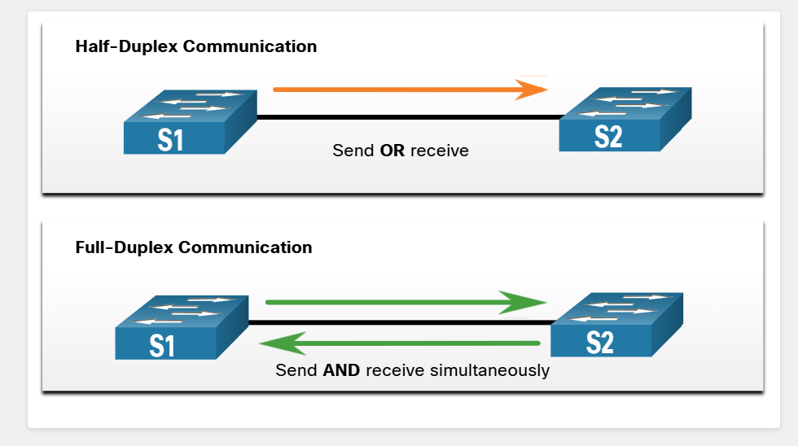

Interconnecting Ethernet interfaces must operate in the same duplex mode for best communication performance and to avoid inefficiency and latency on the link.

The Ethernet autonegotiation feature facilitates configuration, minimizes problems and maximizes link performance between two interconnecting Ethernet links. The connected devices first announce their supported capabilities and then choose the highest performance mode supported by both ends. For example, the switch and router in the figure have successfully autonegotiated full-duplex mode.

The figure illustrates how each duplex method operates.


If one of the two connected devices is operating in full-duplex and the other is operating in half-duplex, a duplex mismatch occurs. While data communication will occur through a link with a duplex mismatch, link performance will be very poor.

Duplex mismatches are typically caused by a misconfigured interface or in rare instances by a failed autonegotiation. Duplex mismatches may be difficult to troubleshoot as the communication between devices still occurs.

## 17.7.2 IP Addressing Issues on IOS Devices

IP address-related problems will likely keep remote network devices from communicating. Because IP addresses are hierarchical, any IP address assigned to a network device must conform to that range of addresses in that network. Wrongly assigned IP addresses create a variety of issues, including IP address conflicts and routing problems.

Two common causes of incorrect IPv4 assignment are manual assignment mistakes or DHCP-related issues.

Network administrators often have to manually assign IP addresses to devices such as servers and routers. If a mistake is made during the assignment, then communications issues with the device are very likely to occur.

On an IOS device, use the show ip interface or show ip interface brief commands to verify what IPv4 addresses are assigned to the network interfaces. For example, issuing the show ip interface brief command as shown would validate the interface status on R1.

```
R1# show ip interface brief
Interface IP-Address OK? Method Status Protocol
GigabitEthernet0/0/0 209.165.200.225 YES manual up up
GigabitEthernet0/0/1 192.168.10.1 YES manual up up
Serial0/1/0 unassigned NO unset down down
Serial0/1/1 unassigned NO unset down down
GigabitEthernet0 unassigned YES unset administratively down down
R1#
```

## 17.7.3 IP Addressing Issues on End Devices

In Windows-based machines, when the device cannot contact a DHCP server, Windows will automatically assign an address belonging to the 169.254.0.0/16 range. This feature is called Automatic Private IP Addressing (APIPA) and is designed to facilitate communication within the local network. Think of it as Windows saying, "I will use this address from the 169.254.0.0/16 range because I could not get any other address".

Often, a computer with an APIPA address will not be able to communicate with other devices in the network because those devices will most likely not belong to the 169.254.0.0/16 network. This situation indicates an automatic IPv4 address assignment problem that should be fixed.

Note: Other operating systems, such Linux and OS X, will not assign an IPv4 address to the network interface if communication with a DHCP server fails.

Most end devices are configured to rely on a DHCP server for automatic IPv4 address assignment. If the device is unable to communicate with the DHCP server, then the server cannot assign an IPv4 address for the specific network and the device will not be able to communicate.

To verify the IP addresses assigned to a Windows-based computer, use the ipconfig command, as shown in the output.

```
C:\Users\PC-A> ipconfig
Windows IP Configuration
(Output omitted)
Wireless LAN adapter Wi-Fi:
Connection-specific DNS Suffix:
Link-local IPv7 Address:            fe80::a4aa:2dd1:ae2d:a75e%16
IPv4 Address:                       192.168.10.10
Subnet Mask:                        255.255.255.0
Default Gateway:                    192.168.10.1
(Output omitted)
```

## 17.7.4 Default Gateway Issues

The default gateway for an end device is the closest networking device that can forward traffic to other networks. If a device has an incorrect or nonexistent default gateway address, it will not be able to communicate with devices in remote networks. Because the default gateway is the path to remote networks, its address must belong to the same network as the end device.

The address of the default gateway can be manually set or obtained from a DHCP server. Similar to IPv4 addressing issues, default gateway problems can be related to misconfiguration (in the case of manual assignment) or DHCP problems (if automatic assignment is in use).

To solve misconfigured default gateway issues, ensure that the device has the correct default gateway configured. If the default address was manually set but is incorrect, simply replace it with the proper address. If the default gateway address was automatically set, ensure the device can communicate with the DHCP server. It is also important to verify that the proper IPv4 address and subnet mask were configured on the interface of the router and that the interface is active.

To verify the default gateway on Windows-based computers, use the `ipconfig` command as shown.

```
C:\Users\PC-A> ipconfig
Windows IP Configuration
(Output omitted)
Wireless LAN adapter Wi-Fi:
Connection-specific DNS Suffix . . . . . . . . . :
Link-local IPv6 Address . . . . . . . . . . . . : fe80::a4aa:2dd1:ae2d:a75e%16
IPv4 Address. . . . . . . . . . . . . . . . . . : 192.168.10.10
Subnet Mask . . . . . . . . . . . . . . . . . . : 255.255.255.0
Default Gateway . . . . . . . . . . . . . . . . : 192.168.10.1
(Output omitted)
```

On a router, use the show ip route command to list the routing table and verify that the default gateway, known as a default route, has been set. This route is used when the destination address of the packet does not match any other routes in its routing table.

For example, the output verifies that R1 has a default gateway (i.e., Gateway of last resort) configured pointing to IP address 209.168.200.226.

```
R1# show ip route | begin Gateway
Gateway of last resort is 209.165.200.226 to network 0.0.0.0
O*E2 0.0.0.0/0 [110/1] via 209.165.200.226, 02:19:50, GigabitEthernet0/0/0
  10.0.0.0/24 is subnetted, 1 subnets
O   10.1.1.0 [110/3] via 209.165.200.226, 02:05:42, GigabitEthernet0/0/0
    192.168.10.0/24 is variably subnetted, 2 subnets, 2 masks
C   192.168.10.0/24 is directly connected, GigabitEthernet0/0/1
L   192.168.10.1/32 is directly connected, GigabitEthernet0/0/1
    209.165.200.0/24 is variably subnetted, 3 subnets, 2 masks
C   209.165.200.224/30 is directly connected, GigabitEthernet0/0/0
L   209.165.200.225/32 is directly connected, GigabitEthernet0/0/0
O   209.165.200.228/30
    [110/2] via 209.165.200.226, 02:07:19, GigabitEthernet0/0/0
R1#
```

The first highlighted line basically states that the gateway to any (i.e., 0.0.0.0) should be sent to IP address 209.165.200.226. The second highlighted displays how R1 learned about the default gateway. In this case, R1 received the information from another OSPF-enabled router.

## 17.7.5 Troubleshooting DNS Issues

Domain Name System (DNS) defines an automated service that matches names, such as www.cisco.com, with the IP address. Although DNS resolution is not crucial to device communication, it is very important to the end user.

It is common for users to mistakenly relate the operation of an internet link to the availability of the DNS. User complaints such as "the network is down" or "the internet is down" are often caused by an unreachable DNS server. While packet routing and all other network services are still operational, DNS failures often lead the user to the wrong conclusion. If a user types in a domain name such as www.cisco.com in a web browser and the DNS server is unreachable, the name will not be translated into an IP address and the website will not display.

DNS server addresses can be manually or automatically assigned. Network administrators are often responsible for manually assigning DNS server addresses on servers and other devices, while DHCP is used to automatically assign DNS server addresses to clients.

Although it is common for companies and organizations to manage their own DNS servers, any reachable DNS server can be used to resolve names. Small office and home office (SOHO) users often rely on the DNS server maintained by their ISP for name resolution. ISP- maintained DNS servers are assigned to SOHO customers via DHCP. Additionally, Google maintains a public DNS server that can be used by anyone and it is very useful for testing. The IPv4 address of Google's public DNS server is 8.8.8.8 and 2001:4860:4860::8888 for its IPv6 DNS address.

Cisco offers OpenDNS which provides secure DNS service by filtering phishing and some malware sites. You can change your DNS address to 208.67.222.222 and 208.67.220.220 in the Preferred DNS server and Alternate DNS server fields. Advanced features such as web content filtering and security are available to families and businesses.

Use the ipconfig /all as shown to verify which DNS server is in use by the Windows computer.

```
C:\Users\PC-A> ipconfig /all
(Output omitted)
Wireless LAN adapter Wi-Fi:
Connection-specific DNS Suffix . . . . . . . :
Description . . . . . . . . . . . . . . . . . : Intel(R) Dual Band Wireless-AC 8265
Physical Address. . . . . . . . . . . . . . : F8-94-C2-E4-C5-0A
DHCP Enabled. . . . . . . . . . . . . . . . : Yes
Autoconfiguration Enabled . . . . . . . . . : Yes
Link-local IPv6 Address . . . . . . . . . . : fe80::a4aa:2dd1:ae2d:a75e%16 (Preferred)
IPv4 Address. . . . . . . . . . . . . . . . : 192.168.10.10 (Preferred)
Subnet Mask . . . . . . . . . . . . . . . . : 255.255.255.0
Lease Obtained. . . . . . . . . . . . . . . : August 17, 2019 1:20:17 PM
Lease Expires . . . . . . . . . . . . . . . : August 18, 2019 1:20:18 PM
Default Gateway . . . . . . . . . . . . . . : 192.168.10.1
DHCP Server . . . . . . . . . . . . . . . . : 192.168.10.1
DHCPv6 IAID . . . . . . . . . . . . . . . . : 100177090
DHCPv6 Client DUID. . . . . . . . . . . . . : 00-01-00-01-21-F3-76-75-54-E1-AD-DE-DA-9A
DNS Servers . . . . . . . . . . . . . . . . : 208.67.222.222
NetBIOS over Tcpip. . . . . . . . . . . . . : Enabled
(Output omitted)
```

The nslookup command is another useful DNS troubleshooting tool for PCs. With nslookup a user can manually place DNS queries and analyze the DNS response. The nslookup command shows the output for a query for www.cisco.com. Notice you can also simply enter an IP address and nslookup will resolve the name.

Note: It is not always possible to type an IP address in nslookup and receive the domain name. One of the most common reasons for this is that most websites run on servers that support multiple sites.

```
C:\Users\PC-A> nslookup
Default Server: Home-Net
Address: 192.168.1.1
> cisco.com
Server: Home-Net
Address: 192.168.1.1
Non-authoritative answer:
Name: cisco.com
Addresses: 2001:420:1101:1::185
        72.163.4.185
> 8.8.8.8
Server: Home-Net
Address: 192.168.1.1
Name: dns.google
Address: 8.8.8.8
>
> 208.67.222.222
Server: Home-Net
Address: 192.168.1.1
Name: resolver1.opendns.com
Address: 208.67.222.222
>
```
