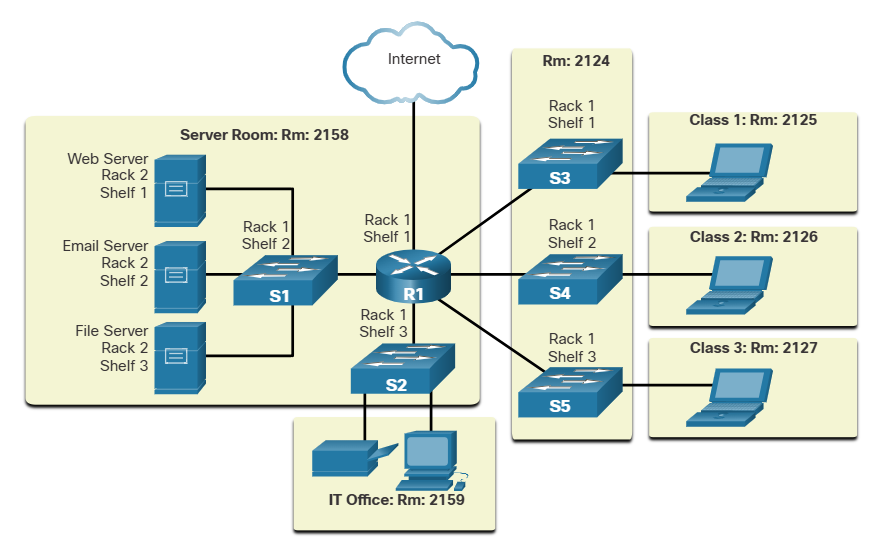
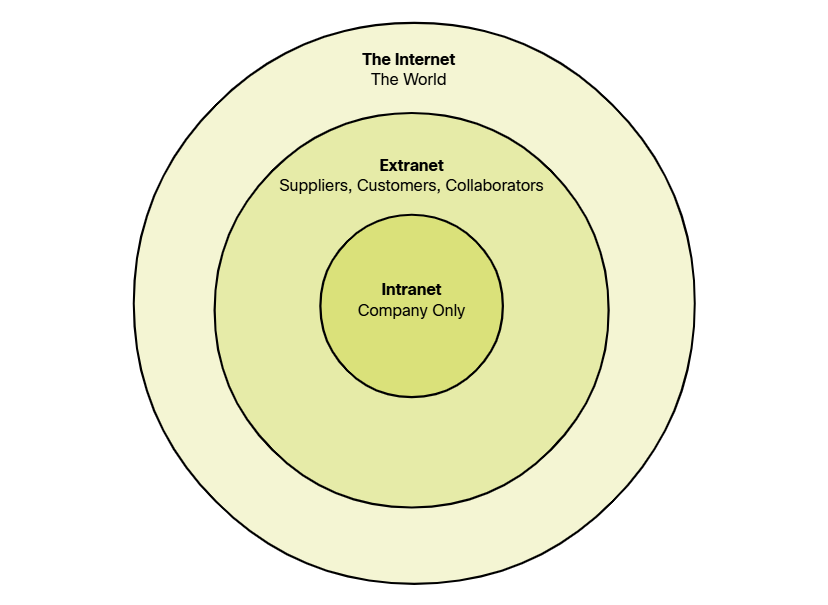
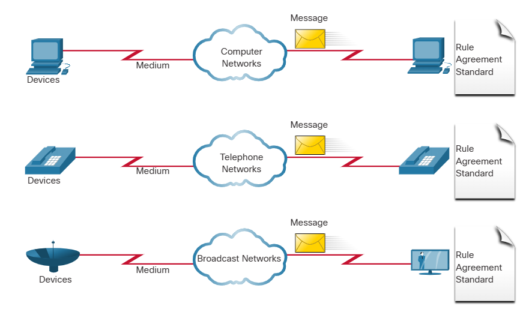
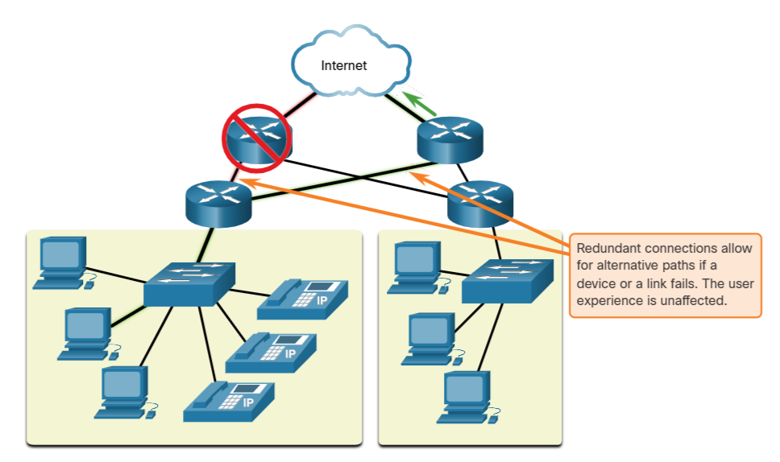
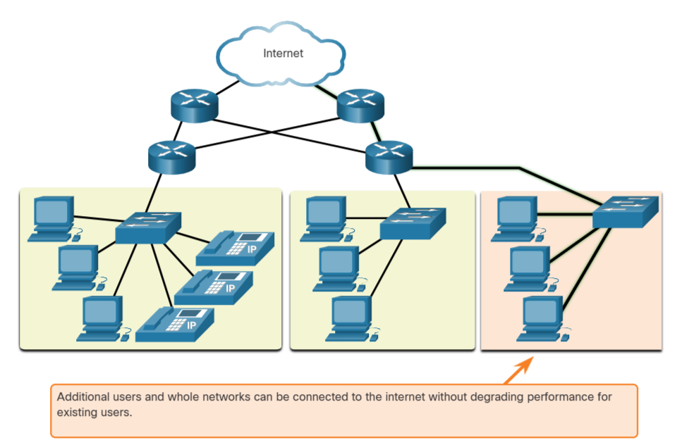
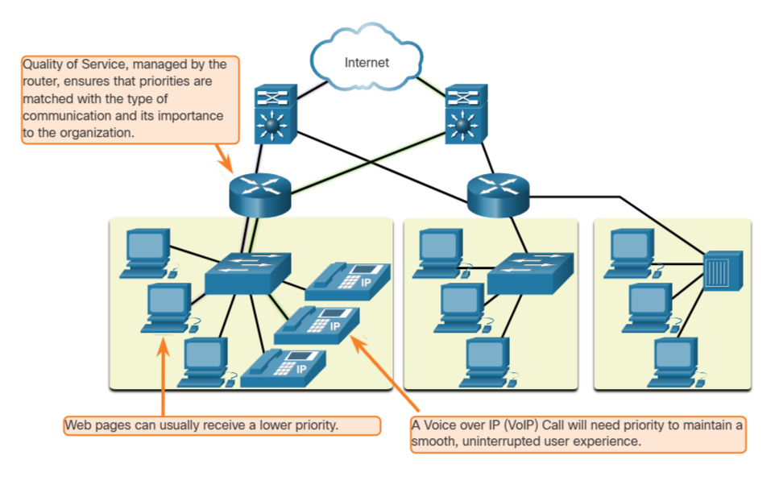
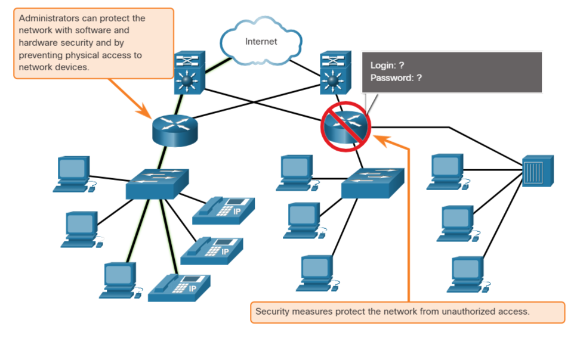
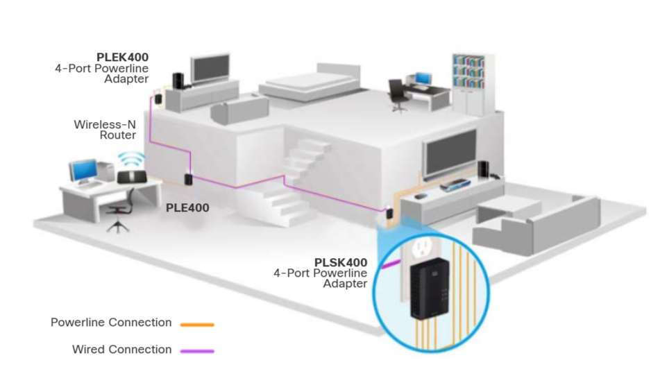
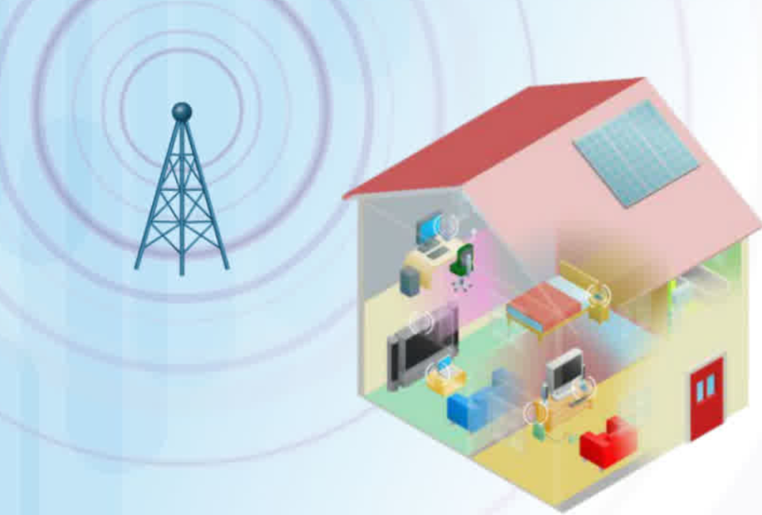
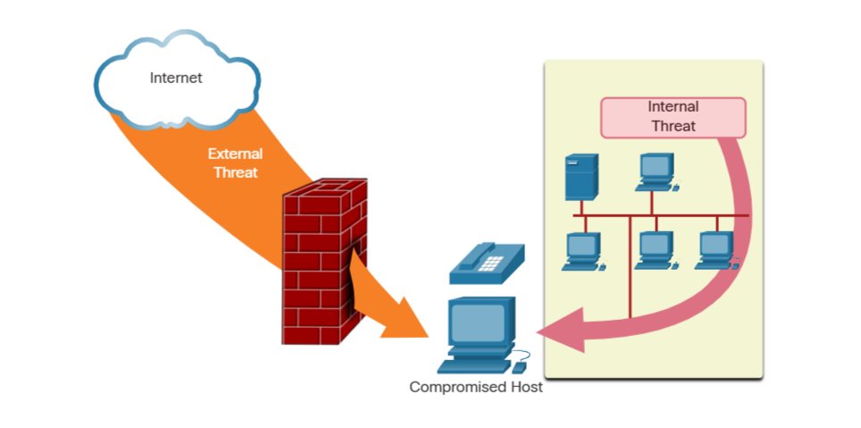

# Module 1: Networking Today

- Packet Tracer is a tool that allows you to simulate real networks. It provides three main menus:
    - You can add devices and connect them via cables or wireless.
    - You can select, delete, inspect, label, and group components within your network.
    - You can manage your network by opening an existing/sample network, saving your current network, and modifying your user profile or preferences.

# 1.2 Network Components

## 1.2.1 Host Roles

If you want to be a part of a global online community, your computer, tablet, or smart phone must first be connected to a network. That network must be connected to the internet. This topic discusses the parts of a network. See if you recognize these components in your own home or school network!

All computers that are connected to a network and participate directly in network communication are classified as hosts. Hosts can be called end devices. Some hosts are also called clients. However, the term hosts specifically refers to devices on the network that are assigned a number for communication purposes. This number identifies the host within a particular network. This number is called the Internet Protocol (IP) address. An IP address identifies the host and the network to which the host is attached.

# 1.9 The IT Professional

## 1.9.1 CCNA


Servers are computers with software that allow them to provide information, like email or web pages, to other end devices on the network. Each service requires separate server software. For example, a server requires web server software in order to provide web services to the network. A computer with server software can provide services simultaneously to many different clients.

As mentioned before, clients are a type of host. Clients have software for requesting and displaying the information obtained from the server, as shown in the figure.

```
Client PC < --- > Internet < --- > Server 
```

An example of client software is a web browser, like Chrome or FireFox. A single computer can also run multiple types of client software. For example, a user can check email and view a web page while instant messaging and listening to an audio stream. The table lists three common types of server software.

| Type | Description |
| ---- | ----------- |
| Email | The email server runs email server software. Clients use mail client software, such as Microsoft Outlook, to access email on the server. |
| Web | The web server runs web server software. Clients use browser software, such as Windows Internet Explorer, to access web pages on the server. |
| File | The file server stores corporate and user files in a central location. The client devices access these files with client software such as the Windows File Explorer. |

## 1.2.2 Peer-to-Peer

Client and server software usually run on separate computers, but it is also possible for one computer to be used for both roles at the same time. In small businesses and homes, many computers function as the servers and clients on the network. This type of network is called a peer-to-peer network.

In the figure, the print sharing PC has a Universal Serial Bus (USB) connection to the printer and a network connection, using a network interface card (NIC), to the file sharing PC.

The advantages of peer-to-peer networking:
- Easy to set up
- Less complex
- Lower cost because network devices and dedicated servers may not be required
- Can be used for simple tasks such as transferring files and sharing printers

The disadvantages of peer-to-peer networking:
- No centralized administration
- Not as secure 
- Not scalable 
- All devices may act as both clients and servers which can slow their performance 

## 1.2.3 End devices

The network devices that people are most familiar with are end devices. To distinguish one end device from another, each end device on a network has an address. When an end device initiates communication, it uses the address of the destination end device to specify where to deliver the message.

An end device is either the source or destination of a message transmitted over the network.

## 1.2.4 Intermediary Devices 

Intermediary devices connect the individual end devices to the network. They can connect multiple individual networks to form an internetwork. These intermediary devices provide connectivity and ensure that data flows across the network.

Intermediary devices use the destination end device address, in conjunction with information about the network interconnections, to determine the path that messages should take through the network. Examples of the more common intermediary devices and a list of functions are shown in the figure.

Most common intermediary devices: wireless router, multilayer switch, LAN switch, firewall application, router.

Intermediary network devices perform some or all of these functions:
- Regenerate and retransmit communication signals 
- Maintain information about what pathways exist through the network and internetwork
- Notify other devices of errors and communication failures
- Direct data along alternate pathways when there is a link failure 
- Classify and direct messages according to priorities
- Permit or deny the flow of data, based on security settings 

 Not shown is a legacy Ethernet hub. An Ethernet hub is also known as a multiport repeater. Repeaters regenerate and retransmit communication signals. Notice that all intermediary devices perform the function of a repeater.

 ## 1.2.5 Network Media

 Communication transmits across a network on media. The media provides the channel over which the message travels from source to destination.

 Modern networks primarily use three types of media to interconnect devices, as shown in the figure:
 - Metal wires within cables - Data is encoded into electrical impulses.
 - Glass or plastic fibers within cables (fiber-optic cable) - Data is encoded into pulses of light.
 - Wireless transmission - Data is encoded via modulation of specific frequencies of electromagnetic waves.

The four main criteria for choosing network media are these:
- What is the maximum distance that the media can successfully carry a signal? 
- What is the environment in which the media will be installed? 
- What is the amount of data and at what speed must it be transmitted? 
- What is the cost of the media and installation?

## 1.2.6 Quiz 

1. Which of the following is the name for all computers connected to a network that participate directly in network communication?
    **Hosts**
2. When data is encoded as pulses of light, which media is being used to transmit the data?
    **Fiber-optic cable**
3. Which two devices are intermediary devices? (Choose two)
    **Routers** and **Switches**

# 1.3 Network Representations and Topologies

## 1.3.1 Network Representations

Network architects and administrators must be able to show what their networks will look like. They need to be able to easily see which components connect to other components, where they will be located, and how they will be connected. Diagrams of networks often use symbols, like those shown in the figure, to represent the different devices and connections that make up a network.

End Devices: desktop computer, laptop, printer, IP phone, wireless tablet, TelePresence endpoint.

Intermediary devices: wireless router, multilayer switch, LAN switch, firewall application, router.

Network Media: wireless media, LAN media, WAN media.


A diagram provides an easy way to understand how devices connect in a large network. This type of “picture” of a network is known as a topology diagram. The ability to recognize the logical representations of the physical networking components is critical to being able to visualize the organization and operation of a network.

In addition to these representations, specialized terminology is used to describe how each of these devices and media connect to each other:
- Network Interface Card (NIC) - A NIC physically connects the end device to the network. 
- Physical Port - A connector or outlet on a networking device where the media connects to an end device or another networking device.
- Interface - Specialized ports on a networking device that connect to individual networks. Because routers connect networks, the ports on a router are referred to as network interfaces.

Note: The terms port and interface are often used interchangeably.

## 1.3.2 Topology Diagrams

Topology diagrams are mandatory documentation for anyone working with a network. They provide a visual map of how the network is connected. There are two types of topology diagrams: physical and logical.

### Physical Topology diagrams
Physical topology diagrams illustrate the physical location of intermediary devices and cable installation, as shown in the figure. You can see that the rooms in which these devices are located are labeled in this physical topology.



### Logical Topology diagrams
Logical topology diagrams illustrate devices, ports, and the addressing scheme of the network, as shown in the figure. You can see which end devices are connected to which intermediary devices and what media is being used.


The topologies shown in the physical and logical diagrams are appropriate for your level of understanding at this point in the course. Search the internet for “network topology diagrams” to see some more complex examples. If you add the word “Cisco” to your search phrase, you will find many topologies using icons that are similar to what you have seen in these figures.

## 1.3.3 Quiz 

1. Which connection physically connects the end device to the network?
    **NIC**
2. Which connections are specialized ports on a networking device that connect to individual networks?
    **Interface**
3. Which type of network topology lets you see which end devices are connected to which intermediary devices and what media is being used?
    **Logical Topology**
4. Which type of network topology lets you see the actual location of intermediary devices and cable installation?
    **Physical Topology**

# 1.4 Common Types of Networks

## 1.4.1 Networks of Many Sizes 

Now that you are familiar with the components that make up networks and their representations in physical and logical topologies, you are ready to learn about the many different types of networks.

Networks come in all sizes. They range from simple networks consisting of two computers, to networks connecting millions of devices.

Simple home networks let you share resources, such as printers, documents, pictures, and music, among a few local end devices.

Small office and home office (SOHO) networks allow people to work from home, or a remote office. Many self-employed workers use these types of networks to advertise and sell products, order supplies, and communicate with customers.

Businesses and large organizations use networks to provide consolidation, storage, and access to information on network servers. Networks provide email, instant messaging, and collaboration among employees. Many organizations use their network’s connection to the internet to provide products and services to customers.

The internet is the largest network in existence. In fact, the term internet means a “network of networks”. It is a collection of interconnected private and public networks.

In small businesses and homes, many computers function as both the servers and clients on the network. This type of network is called a peer-to-peer network.

Small Home Networks: connect a few computers to each other and to the internet.

Small Office and Home Office Networks: the SOHO network allows computers in a home office or a remote office to connect to a corporate network, or access centralized, shared resources. 

Medium to Large Networks: medium to large networks, such as those used by coportations and schools, can have many locations with hundreds or thousands or interconnected hosts.

World Wide Networks: the internet is a network of networks that connects hundreds of millions of computers world-wide.

## 1.4.2 LANs and WANs 

Network infrastructures vary greatly in terms of:
- size of the area covered
- number of users connected 
- number and types of services avaliable
- area of responsibility

The two most common types of network infrastructures are Local Area Networks (LANs), and Wide Area Networks (WANs). A LAN is a network infrastructure that provides access to users and end devices in a small geographical area. A LAN is typically used in a department within an enterprise, a home, or a small business network. A WAN is a network infrastructure that provides access to other networks over a wide geographical area, which is typically owned and managed by a larger corporation or a telecommunications service provider. The figure shows LANs connected to a WAN.


### LANs 

A LAN is a network infrastructure that spans a small geographical area. LANs have specific characteristics:
- LANs interconnect end devices in a limited area such as a home, school, office building, or campus.
- A LAN is usually administered by a single organization or individual. Administrative control is enforced at the network level and governs the security and access control policies. 
- LANs provide high-speed bandwidth to internal end devices and intermediary devices, as shown in the figure.


### WANs 

The figure shows a WAN which interconnects two LANs. A WAN is a network infrastructure that spans a wide geographical area. WANs are typically managed by service providers (SPs) or Internet Service Providers (ISPs).

WANs have specific characteristics:
- WANs interconnect LANs over wide geographical areas such as between cities, states, provinces, countries, or continents.
- WANs are usually administered by multiple service providers.
- WANs typically provide slower speed links between LANs.


## 1.4.3 The Internet

The internet is a worldwide collection of interconnected networks (internetworks, or internet for short). The figure shows one way to view the internet as a collection of interconnected LANs and WANs.


LANs use WAN services to interconnect.

Some of the LAN examples are connected to each other through a WAN connection. WANs are then connected to each other. WANs can connect through copper wires, fiber-optic cables, and wireless transmissions (not shown).

The internet is not owned by any individual or group. Ensuring effective communication across this diverse infrastructure requires the application of consistent and commonly recognized technologies and standards as well as the cooperation of many network administration agencies. There are organizations that were developed to help maintain the structure and standardization of internet protocols and processes. These organizations include the Internet Engineering Task Force (IETF), Internet Corporation for Assigned Names and Numbers (ICANN), and the Internet Architecture Board (IAB), plus many others.

## 1.4.4 Intranets and Extranets

There are two other terms which are similar to the term internet: intranet and extranet.

Intranet is a term often used to refer to a private connection of LANs and WANs that belongs to an organization. An intranet is designed to be accessible only by the organization's members, employees, or others with authorization.

An organization may use an extranet to provide secure and safe access to individuals who work for a different organization but require access to the organization’s data. Here are some examples of extranets:
- A company that is providing access to outside suppliers and contractors
- A hospital that is providing a booking system to doctors so they can make appointments for their patients
- A local office of education that is providing budget and personnel information to the schools in its district

The figure illustrates the levels of access that different groups have to a company intranet, a company extranet, and the internet.



## 1.4.5 Quiz 

1. Which network infrastructure provides access to users and end devices in a small geographical area, which is typically a network in a department in an enterprise, a home, or small business?
    **LAN** 
2. Which network infrastructure might an organization use to provide secure and safe access to individuals who work for a different organization but require access to the organization's data?
    **Extranet**
3. Which network infrastructure provides access to other networks over a large geographical area, which is often owned and managed by a telecommunications service provider?
    **WAN**

# 1.5 Internet Connectons 

## 1.5.1 Internet Access Technologies 

So, now you have a basic understanding of what makes up a network and the different types of networks. But, how do you actually connect users and organizations to the internet? As you may have guessed, there are many different ways to do this.

Home users, remote workers, and small offices typically require a connection to an ISP to access the internet. Connection options vary greatly between ISPs and geographical locations. However, popular choices include broadband cable, broadband digital subscriber line (DSL), wireless WANs, and mobile services.

Organizations usually need access to other corporate sites as well as the internet. Fast connections are required to support business services including IP phones, video conferencing, and data center storage. SPs offer business-class interconnections. Popular business-class services include business DSL, leased lines, and Metro Ethernet.

## 1.5.2 Home and Small Office Internet Connections 


- Cable - Typically offered by cable television service providers, the internet data signal transmits on the same cable that delivers cable television. It provides a high bandwidth, high availability, and an always-on connection to the internet.
- DSL - Digital Subscriber Lines also provide high bandwidth, high availability, and an always-on connection to the internet. DSL runs over a telephone line. In general, small office and home office users connect using Asymmetrical DSL (ADSL), which means that the download speed is faster than the upload speed.
- Cellular - Cellular internet access uses a cell phone network to connect. Wherever you can get a cellular signal, you can get cellular internet access. Performance is limited by the capabilities of the phone and the cell tower to which it is connected.
- Satellite - The availability of satellite internet access is a benefit in those areas that would otherwise have no internet connectivity at all. Satellite dishes require a clear line of sight to the satellite.
- Dial-up Telephone - An inexpensive option that uses any phone line and a modem. The low bandwidth provided by a dial-up modem connection is not sufficient for large data transfer, although it is useful for mobile access while traveling.

The choice of connection varies depending on geographical location and service provider availability.

## 1.5.3 Businesses Internet Connections 

Corporate connection options differ from home user options. Businesses may require higher bandwidth, dedicated bandwidth, and managed services. Connection options that are available differ depending on the type of service providers located nearby.

The figure illustrates common connection options for businesses.


- Dedicated Leased Line - Leased lines are reserved circuits within the service provider’s network that connect geographically separated offices for private voice and/or data networking. The circuits are rented at a monthly or yearly rate.
- Metro Ethernet - This is sometimes known as Ethernet WAN. In this module, we will refer to it as Metro Ethernet. Metro ethernets extend LAN access technology into the WAN. Ethernet is a LAN technology you will learn about in a later module.
- Business DSL - Business DSL is available in various formats. A popular choice is Symmetric Digital Subscriber Line (SDSL) which is similar to the consumer version of DSL but provides uploads and downloads at the same high speeds.
- Satellite - Satellite service can provide a connection when a wired solution is not available.

The choice of connection varies depending on geographical location and service provider availability.

## 1.5.4 The Converging Network 

Traditional Separate Networks

Consider a school built thirty years ago. Back then, some classrooms were cabled for the data network, telephone network, and video network for televisions. These separate networks could not communicate with each other. Each network used different technologies to carry the communication signal. Each network had its own set of rules and standards to ensure successful communication. Multiple services ran on multiple networks.



Converged Networks

Today, the separate data, telephone, and video networks converge. Unlike dedicated networks, converged networks are capable of delivering data, voice, and video between many different types of devices over the same network infrastructure. This network infrastructure uses the same set of rules, agreements, and implementation standards. Converged data networks carry multiple services on one network.


# 1.6 Reliable Networks 

## 1.6.1 Network Architecture

Have you ever been busy working online, only to have “the internet go down”? As you know by now, the internet did not go down, you just lost your connection to it. It is very frustrating. With so many people in the world relying on network access to work and learn, it is imperative that networks are reliable. In this context, reliability means more than your connection to the internet. This topic focuses on the four aspects of network reliability.

The role of the network has changed from a data-only network to a system that enables the connections of people, devices, and information in a media-rich, converged network environment. For networks to function efficiently and grow in this type of environment, the network must be built upon a standard network architecture.

Networks also support a wide range of applications and services. They must operate over many different types of cables and devices, which make up the physical infrastructure. The term network architecture, in this context, refers to the technologies that support the infrastructure and the programmed services and rules, or protocols, that move data across the network.

As networks evolve, we have learned that there are four basic characteristics that network architects must address to meet user expectations:
- Fault Tolerance
- Scalability
- Quality of Service (QoS)
- Security

## 1.6.2 Fault Tolerance 

A fault tolerant network is one that limits the number of affected devices during a failure. It is built to allow quick recovery when such a failure occurs. These networks depend on multiple paths between the source and destination of a message. If one path fails, the messages are instantly sent over a different link. Having multiple paths to a destination is known as redundancy.

Implementing a packet-switched network is one way that reliable networks provide redundancy. Packet switching splits traffic into packets that are routed over a shared network. A single message, such as an email or a video stream, is broken into multiple message blocks, called packets. Each packet has the necessary addressing information of the source and destination of the message. The routers within the network switch the packets based on the condition of the network at that moment. This means that all the packets in a single message could take very different paths to the same destination. In the figure, the user is unaware and unaffected by the router that is dynamically changing the route when a link fails.



## 1.6.3 Scalability

A scalable network expands quickly to support new users and applications. It does this without degrading the performance of services that are being accessed by existing users. The figure shows how a new network is easily added to an existing network. These networks are scalable because the designers follow accepted standards and protocols. This lets software and hardware vendors focus on improving products and services without having to design a new set of rules for operating within the network.



## 1.6.4 Quality of Service 

Quality of Service (QoS) is an increasing requirement of networks today. New applications available to users over networks, such as voice and live video transmissions, create higher expectations for the quality of the delivered services. Have you ever tried to watch a video with constant breaks and pauses? As data, voice, and video content continue to converge onto the same network, QoS becomes a primary mechanism for managing congestion and ensuring reliable delivery of content to all users.

Congestion occurs when the demand for bandwidth exceeds the amount available. Network bandwidth is measured in the number of bits that can be transmitted in a single second, or bits per second (bps). When simultaneous communications are attempted across the network, the demand for network bandwidth can exceed its availability, creating network congestion.

When the volume of traffic is greater than what can be transported across the network, devices will hold the packets in memory until resources become available to transmit them. In the figure, one user is requesting a web page, and another is on a phone call. With a QoS policy in place, the router can manage the flow of data and voice traffic, giving priority to voice communications if the network experiences congestion.The focus of QoS is to prioritize time-sensitive traffic. The type of traffic, not the content of the traffic, is what is important.



## 1.6.5 Network Security 

The network infrastructure, services, and the data contained on network-attached devices are crucial personal and business assets. Network administrators must address two types of network security concerns: network infrastructure security and information security.

Securing the network infrastructure includes physically securing devices that provide network connectivity and preventing unauthorized access to the management software that resides on them, as shown in the figure.



Network administrators must also protect the information contained within the packets being transmitted over the network, and the information stored on network attached devices. In order to achieve the goals of network security, there are three primary requirements.
- Confidentiality - Data confidentiality means that only the intended and authorized recipients can access and read data.
- Integrity - Data integrity assures users that the information has not been altered in transmission, from origin to destination.
- Availability - Data availability assures users of timely and reliable access to data services for authorized users.

## 1.6.6 Quiz 

1. When designers follow accepted standards and protocols, which of the four basic characteristics of network architecture is achieved?
    **Scalability**
2. Confidentiality, integrity, and availability are requirements of which of the four basic characteristics of network architecture?
    **Security**
3. With which type of policy, a router can manage the flow of data and voice traffic, giving priority to voice communications if the network experiences congestion?
    **Qos**
4. Having multiple paths to a destination is known as redundancy. This is an example of which characteristic of network architecture?
    **Fault Tolerance**

# 1.7 Network Trends

## 1.7.1 Recent Trends 

You know a lot about networks now, what they are made of, how they connect us, and what is needed to keep them reliable. But networks, like everything else, continue to change. There are a few trends in networking that you, as a NetAcad student, should know about.

As new technologies and end-user devices come to market, businesses and consumers must continue to adjust to this ever-changing environment. There are several networking trends that affect organizations and consumers:
- Bring Your Own Device (BYOD)
- Online collaboration
- Video communication 
- Cloud Computing 

## 1.7.2 Bring Your Own Device (BYOD)

The concept of any device, for any content, in any manner, is a major global trend that requires significant changes to the way we use devices and safely connect them to networks. This is called Bring Your Own Device (BYOD).

BYOD enables end users the freedom to use personal tools to access information and communicate across a business or campus network. With the growth of consumer devices, and the related drop in cost, employees and students may have advanced computing and networking devices for personal use. These include laptops, notebooks, tablets, smart phones, and e-readers. These may be purchased by the company or school, purchased by the individual, or both.

BYOD means any device, with any ownership, used anywhere.

## 1.7.3 Online Collaboration 

Individuals want to connect to the network, not only for access to data applications, but also to collaborate with one another. Collaboration is defined as “the act of working with another or others on a joint project.” Collaboration tools, like Cisco WebEx, shown in the figure, give employees, students, teachers, customers, and partners a way to instantly connect, interact, and achieve their objectives.

Collaboration is a critical and strategic priority that organizations are using to remain competitive. Collaboration is also a priority in education. Students need to collaborate to assist each other in learning, to develop the team skills used in the workforce, and to work together on team-based projects.

Cisco Webex Teams is a multifunctional collaboration tool that lets you send instant messages to one or more people, post images, and post videos and links. Each team ‘space’ maintains a history of everything that is posted there.

## 1.7.4 Video Communications 

Another facet of networking that is critical to the communication and collaboration effort is video. Video is used for communications, collaboration, and entertainment. Video calls are made to and from anyone with an internet connection, regardless of where they are located.

Video conferencing is a powerful tool for communicating with others, both locally and globally. Video is becoming a critical requirement for effective collaboration as organizations extend across geographic and cultural boundaries.

## 1.7.5 Video - Cisco Webex for Huddles 

speaks for itself 

## 1.7.6 Cloud Computing 

Cloud computing is one of the ways that we access and store data. Cloud computing allows us to store personal files, even backup an entire drive on servers over the internet. Applications such as word processing and photo editing can be accessed using the cloud.

For businesses, Cloud computing extends the capabilities of IT without requiring investment in new infrastructure, training new personnel, or licensing new software. These services are available on-demand and delivered economically to any device that is anywhere in the world without compromising security or function.

Cloud computing is possible because of data centers. Data centers are facilities used to house computer systems and associated components. A data center can occupy one room of a building, one or more floors, or an entire warehouse-sized building. Data centers are typically very expensive to build and maintain. For this reason, only large organizations use privately built data centers to house their data and provide services to users. Smaller organizations that cannot afford to maintain their own private data center can reduce the overall cost of ownership by leasing server and storage services from a larger data center organization in the cloud.

For security, reliability, and fault tolerance, cloud providers often store data in distributed data centers. Instead of storing all the data of a person or an organization in one data center, it is stored in multiple data centers in different locations.

There are four primary types of clouds: Public clouds, Private clouds, Hybrid clouds, and Community clouds, as shown in the table.

### Cloud Types

| Cloud Type | Description |
| ---------- | ----------- |
| Public clouds | Cloud-based applications and services offered in a public cloud are made available to the general population. Services may be free or are offered on a pay-per-use model, such as paying for online storage. The public cloud uses the internet to provide services. |
| Private clouds | Cloud-based applications and services offered in a private cloud are intended for a specific organization or entity, such as a government. A private cloud can be set up using the organization’s private network, though this can be expensive to build and maintain. A private cloud can also be managed by an outside organization with strict access security. |
| Hybrid clouds | A hybrid cloud is made up of two or more clouds (example: part private, part public), where each part remains a distinct object, but both are connected using a single architecture. Individuals on a hybrid cloud would be able to have degrees of access to various services based on user access rights. |
| Community clouds | A community cloud is created for exclusive use by specific entities or organizations. The differences between public clouds and community clouds are the functional needs that have been customized for the community. For example, healthcare organizations must remain compliant with policies and laws (e.g., HIPAA) that require special authentication and confidentiality. Community clouds are used by multiple organizations that have similar needs and concerns. Community clouds are similar to a public cloud environment, but with set levels of security, privacy, and even regulatory compliance of a private cloud. |

## 1.7.7 Technology Trends in the Home

Networking trends are not only affecting the way we communicate at work and at school, but also changing many aspects of the home. The newest home trends include ‘smart home technology’.

Smart home technology integrates into every-day appliances, which can then connect with other devices to make the appliances more ‘smart’ or automated. For example, you could prepare food and place it in the oven for cooking prior to leaving the house for the day. You program your smart oven for the food you want it to cook. It would also be connected to your ‘calendar of events’ so that it could determine what time you should be available to eat and adjust start times and length of cooking accordingly. It could even adjust cooking times and temperatures based on changes in schedule. Additionally, a smart phone or tablet connection lets you connect to the oven directly, to make any desired adjustments. When the food is ready, the oven sends an alert message to you (or someone you specify) that the food is done and warming.

Smart home technology is currently being developed for all rooms within a house. Smart home technology will become more common as home networking and high-speed internet technology expands.

## 1.7.8 Powerline Networking

Powerline networking for home networks uses existing electrical wiring to connect devices, such as shown in the figure. 



Using a standard powerline adapter, devices can connect to the LAN wherever there is an electrical outlet. No data cables need to be installed, and there is little to no additional electricity used. Using the same wiring that delivers electricity, powerline networking sends information by sending data on certain frequencies.

Powerline networking is especially useful when wireless access points cannot reach all the devices in the home. Powerline networking is not a substitute for dedicated cabling in data networks. However, it is an alternative when data network cables or wireless communications are not possible or effective.

## 1.7.9 Wireless Broadband 

In many areas where cable and DSL are not available, wireless may be used to connect to the internet.

### Wireless Internet Service Providers

A Wireless Internet Service Provider (WISP) is an ISP that connects subscribers to a designated access point or hot spot using similar wireless technologies found in home wireless local area networks (WLANs). WISPs are more commonly found in rural environments where DSL or cable services are not available.

Although a separate transmission tower may be installed for the antenna, typically the antenna is attached to an existing elevated structure, such as a water tower or a radio tower. A small dish or antenna is installed on the subscriber’s roof in range of the WISP transmitter. The subscriber’s access unit is connected to the wired network inside the home. From the perspective of the home user, the setup is not much different than DSL or cable service. The main difference is that the connection from the home to the ISP is wireless instead of a physical cable.

### Wireless Broadband Services

Another wireless solution for the home and small businesses is wireless broadband, as shown in the figure.



This solution uses the same cellular technology as a smart phone. An antenna is installed outside the house providing either wireless or wired connectivity for devices in the home. In many areas, home wireless broadband is competing directly with DSL and cable services.

## 1.7.10 Quiz 

1. Which feature is a good conferencing tool to use with others who are located elsewhere in your city, or even in another country?
    **Video Communication**
2. Which feature describes using personal tools to access information and communicate across a business or campus network?
    **BYOD**
3. Which feature contains options such as Public, Private, Custom and Hybrid?
    **Cloud Computing**
4. Which feature is being used when connecting a device to the network using an electrical outlet?
    **Powerline**
5.  Which feature uses the same cellular technology as a smartphone?
    **Wireless Broadband**

# 1.8 Network Security 

## 1.8.1 Security Threats 

You have, no doubt, heard or read news stories about a company network being breached, giving threat actors access to the personal information of thousands of customers. For this reason, network security is always going to be a top priority of administrators.

Network security is an integral part of computer networking, regardless of whether the network is in a home with a single connection to the internet or is a corporation with thousands of users. Network security must consider the environment, as well as the tools and requirements of the network. It must be able to secure data while still allowing for the quality of service that users expect of the network.

Securing a network involves protocols, technologies, devices, tools, and techniques in order to protect data and mitigate threats. Threat vectors may be external or internal. Many external network security threats today originate from the internet.

There are several common external threats to networks:
- Viruses, worms, and Trojan horses - These contain malicious software or code running on a user device.
- Spyware and adware - These are types of software which are installed on a user’s device. The software then secretly collects information about the user.
- Zero-day attacks - Also called zero-hour attacks, these occur on the first day that a vulnerability becomes known.
- Threat actor attacks - A malicious person attacks user devices or network resources.
- Denial of service attacks - These attacks slow or crash applications and processes on a network device.
- Data interception and theft - This attack captures private information from an organization’s network.
- Identity theft - This attack steals the login credentials of a user in order to access private data.

It is equally important to consider internal threats. There have been many studies that show that the most common data breaches happen because of internal users of the network. This can be attributed to lost or stolen devices, accidental misuse by employees, and in the business environment, even malicious employees. With the evolving BYOD strategies, corporate data is much more vulnerable. Therefore, when developing a security policy, it is important to address both external and internal security threats, as shown in the figure.



## 1.8.2 Security Solutions

No single solution can protect the network from the variety of threats that exist. For this reason, security should be implemented in multiple layers, using more than one security solution. If one security component fails to identify and protect the network, others may succeed.

A home network security implementation is usually rather basic. Typically, you implement it on the end devices, as well as at the point of connection to the internet, and can even rely on contracted services from the ISP.

These are the basic security components for a home or small office network:
- Antivirus and antispyware - These applications help to protect end devices from becoming infected with malicious software.
- Firewall filtering - Firewall filtering blocks unauthorized access into and out of the network. This may include a host-based firewall system that prevents unauthorized access to the end device, or a basic filtering service on the home router to prevent unauthorized access from the outside world into the network.

In contrast, the network security implementation for a corporate network usually consists of many components built into the network to monitor and filter traffic. Ideally, all components work together, which minimizes maintenance and improves security. Larger networks and corporate networks use antivirus, antispyware, and firewall filtering, but they also have other security requirements:
- Dedicated firewall systems - These provide more advanced firewall capabilities that can filter large amounts of traffic with more granularity.
- Access control lists (ACL) - These further filter access and traffic forwarding based on IP addresses and applications.
- Intrusion prevention systems (IPS) - These identify fast-spreading threats, such as zero-day or zero-hour attacks.
- Virtual private networks (VPN) - These provide secure access into an organization for remote workers.

Network security requirements must consider the environment, as well as the various applications, and computing requirements. Both home and business environments must be able to secure their data while still allowing for the quality of service that users expect of each technology. Additionally, the security solution implemented must be adaptable to the growing and changing trends of the network.

The study of network security threats and mitigation techniques starts with a clear understanding of the underlying switching and routing infrastructure used to organize network services.

## 1.8.3 Quiz 

1. Which attack slows down or crashes equipment and programs?
    **Denial of Service (DoS)
2. Which option creates a secure connection for remote workers?
    **Virtual Private Network (VPN)**
3. Which option blocks unauthorized access to your network?
    **Firewall**
4. Which option describes a network attack that occurs on the first day that a vulnerability becomes known?
    **Zero-day** or **Zero-hour**
5. Which option describes malicious code running on user devices?
    **Virus, worm, or Trojan horse**

# 1.9 The IT Professional

## 1.9.1 CCNA

# Module Quiz

1. During a routine inspection, a technician discovered that software that was installed on a computer was secretly collecting data about websites that were visited by users of the computer. Which type of threat is affecting this computer?
    **Spyware**
2. Which term refers to a network that provides secure access to the corporate offices by suppliers, customers and collaborators?
    **Extranet** 
3. A large corporation has modified its network to allow users to access network resources from their personal laptops and smart phones. Which networking trend does this describe?
    **BYOD**
4. What is an ISP?
    **It is an organization that enables individuals and businesses to connect to the Internet.**
5. In which scenario would the use of a WISP be recommended?
    **A farm in a rural area without wired broadband access**
6. What characteristic of a network enables it to quickly grow to support new users and applications without impacting the performance of the service being delivered to existing users?
    **Scalability**
7. A college is building a new dormitory on its campus. Workers are digging in the ground to install a new water pipe for the dormitory. A worker accidentally damages a fiber optic cable that connects two of the existing dormitories to the campus data center. Although the cable has been cut, students in the dormitories only experience a very short interruption of network services. What characteristic of the network is shown here?
    **Fault Tolerance**
8. What are two characteristics of a scalable network? (Choose two.)
    **Grows in size without impacting existing users** and **Suitable for modular devices that allow for expansion**
9. Which device performs the function of determining the path that messages should take through internetworks?
    **A router**
10. Which two Internet connection options do not require that physical cables be run to the building? (Choose two.)
    **Cellular** and **Satellite**
11. What type of network must a home user access in order to do online shopping?
    **The Internet**
12. How does BYOD change the way in which businesses implement networks?
    **BYOD provides flexibility in where and how users can access network resources.**
13. An employee wants to access the network of the organization remotely, in the safest possible way. What network feature would allow an employee to gain secure remote access to a company network?
    **VPN**
14. What is the Internet?
    **It provides connections through interconnected global networks.**
15. What are two functions of end devices on a network? (Choose two.)
    **They originate the data that flows through the network.** and **They are the interface between humans and the communication network.**
