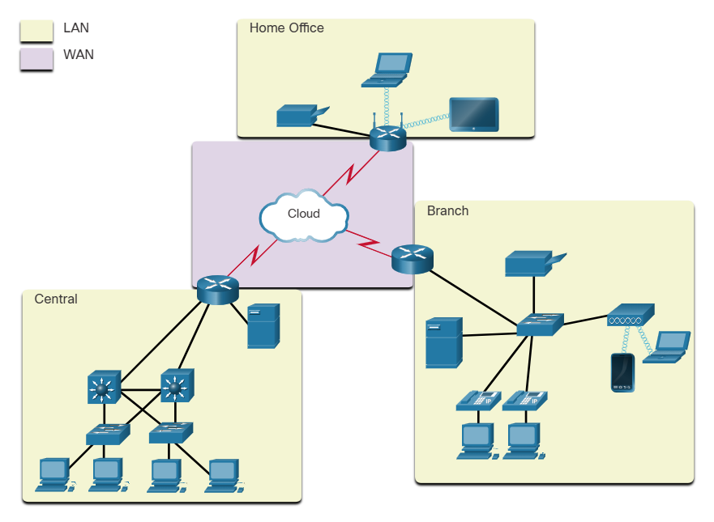
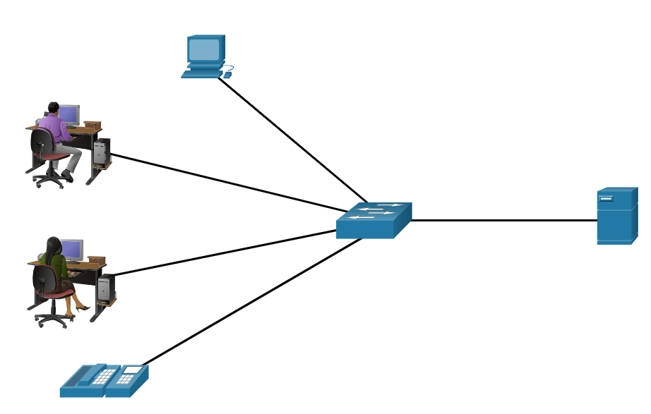
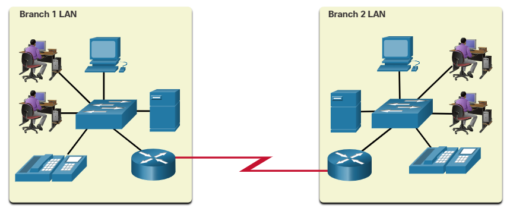
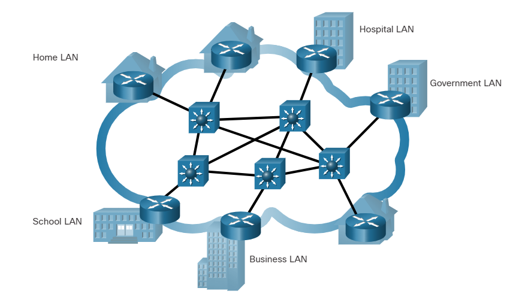
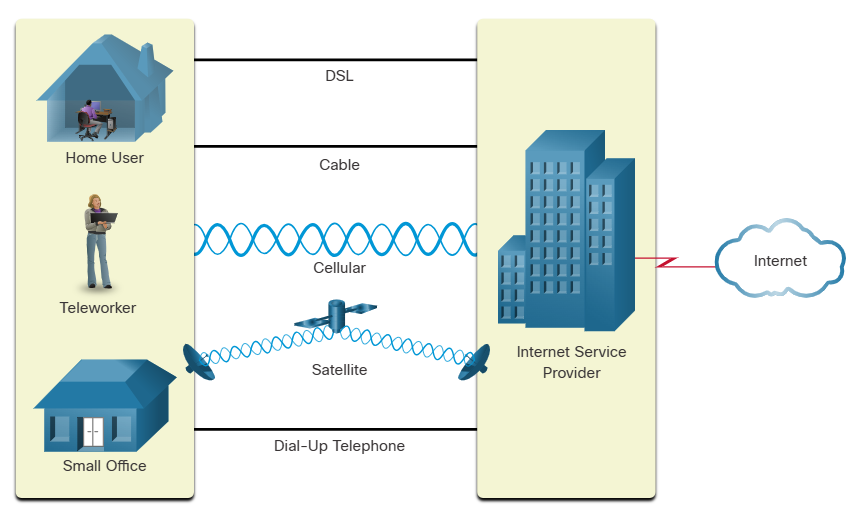
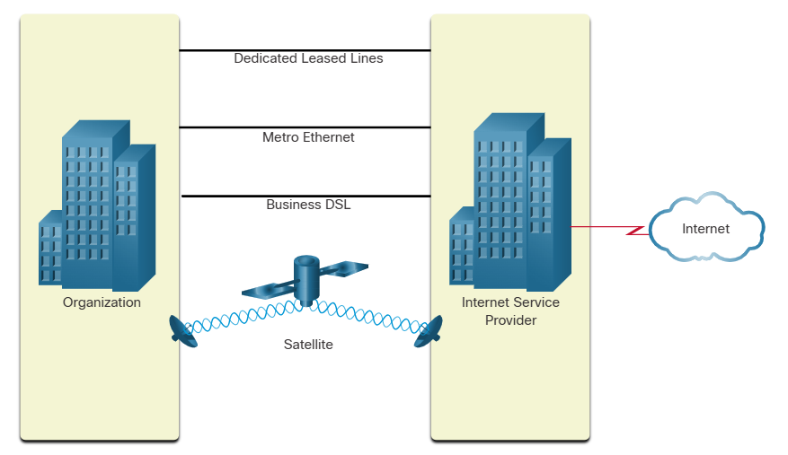
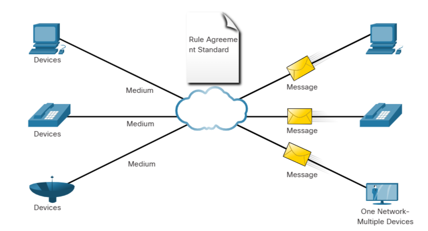

# Module 1 Notes

- Packet Tracer is a tool that allows you to simulate real networks. It provides three main menus:
    - You can add devices and connect them via cables or wireless.
    - You can select, delete, inspect, label, and group components within your network.
    - You can manage your network by opening an existing/sample network, saving your current network, and modifying your user profile or preferences.

# 1.2 Network Components

## 1.2.1 Host Roles

If you want to be a part of a global online community, your computer, tablet, or smart phone must first be connected to a network. That network must be connected to the internet. This topic discusses the parts of a network. See if you recognize these components in your own home or school network!

All computers that are connected to a network and participate directly in network communication are classified as hosts. Hosts can be called end devices. Some hosts are also called clients. However, the term hosts specifically refers to devices on the network that are assigned a number for communication purposes. This number identifies the host within a particular network. This number is called the Internet Protocol (IP) address. An IP address identifies the host and the network to which the host is attached.

Servers are computers with software that allow them to provide information, like email or web pages, to other end devices on the network. Each service requires separate server software. For example, a server requires web server software in order to provide web services to the network. A computer with server software can provide services simultaneously to many different clients.

As mentioned before, clients are a type of host. Clients have software for requesting and displaying the information obtained from the server, as shown in the figure.

```
Client PC < --- > Internet < --- > Server 
```

An example of client software is a web browser, like Chrome or FireFox. A single computer can also run multiple types of client software. For example, a user can check email and view a web page while instant messaging and listening to an audio stream. The table lists three common types of server software.

| Type | Description |
| ---- | ----------- |
| Email | The email server runs email server software. Clients use mail client software, such as Microsoft Outlook, to access email on the server. |
| Web | The web server runs web server software. Clients use browser software, such as Windows Internet Explorer, to access web pages on the server. |
| File | The file server stores corporate and user files in a central location. The client devices access these files with client software such as the Windows File Explorer. |

## 1.2.2 Peer-to-Peer

Client and server software usually run on separate computers, but it is also possible for one computer to be used for both roles at the same time. In small businesses and homes, many computers function as the servers and clients on the network. This type of network is called a peer-to-peer network.

In the figure, the print sharing PC has a Universal Serial Bus (USB) connection to the printer and a network connection, using a network interface card (NIC), to the file sharing PC.

The advantages of peer-to-peer networking:
- Easy to set up
- Less complex
- Lower cost because network devices and dedicated servers may not be required
- Can be used for simple tasks such as transferring files and sharing printers

The disadvantages of peer-to-peer networking:
- No centralized administration
- Not as secure 
- Not scalable 
- All devices may act as both clients and servers which can slow their performance 

## 1.2.3 End devices

The network devices that people are most familiar with are end devices. To distinguish one end device from another, each end device on a network has an address. When an end device initiates communication, it uses the address of the destination end device to specify where to deliver the message.

An end device is either the source or destination of a message transmitted over the network.

## 1.2.4 Intermediary Devices 

Intermediary devices connect the individual end devices to the network. They can connect multiple individual networks to form an internetwork. These intermediary devices provide connectivity and ensure that data flows across the network.

Intermediary devices use the destination end device address, in conjunction with information about the network interconnections, to determine the path that messages should take through the network. Examples of the more common intermediary devices and a list of functions are shown in the figure.

Most common intermediary devices: wireless router, multilayer switch, LAN switch, firewall application, router.

Intermediary network devices perform some or all of these functions:
- Regenerate and retransmit communication signals 
- Maintain information about what pathways exist through the network and internetwork
- Notify other devices of errors and communication failures
- Direct data along alternate pathways when there is a link failure 
- Classify and direct messages according to priorities
- Permit or deny the flow of data, based on security settings 

 Not shown is a legacy Ethernet hub. An Ethernet hub is also known as a multiport repeater. Repeaters regenerate and retransmit communication signals. Notice that all intermediary devices perform the function of a repeater.

 ## 1.2.5 Network Media

 Communication transmits across a network on media. The media provides the channel over which the message travels from source to destination.

 Modern networks primarily use three types of media to interconnect devices, as shown in the figure:
 - Metal wires within cables - Data is encoded into electrical impulses.
 - Glass or plastic fibers within cables (fiber-optic cable) - Data is encoded into pulses of light.
 - Wireless transmission - Data is encoded via modulation of specific frequencies of electromagnetic waves.

The four main criteria for choosing network media are these:
- What is the maximum distance that the media can successfully carry a signal? 
- What is the environment in which the media will be installed? 
- What is the amount of data and at what speed must it be transmitted? 
- What is the cost of the media and installation?

# 1.3 Network Representations and Topologies

## 1.3.1 Network Representations

Network architects and administrators must be able to show what their networks will look like. They need to be able to easily see which components connect to other components, where they will be located, and how they will be connected. Diagrams of networks often use symbols, like those shown in the figure, to represent the different devices and connections that make up a network.

End Devices: desktop computer, laptop, printer, IP phone, wireless tablet, TelePresence endpoint.

Intermediary devices: wireless router, multilayer switch, LAN switch, firewall application, router.

Network Media: wireless media, LAN media, WAN media.


A diagram provides an easy way to understand how devices connect in a large network. This type of “picture” of a network is known as a topology diagram. The ability to recognize the logical representations of the physical networking components is critical to being able to visualize the organization and operation of a network.

In addition to these representations, specialized terminology is used to describe how each of these devices and media connect to each other:
- Network Interface Card (NIC) - A NIC physically connects the end device to the network. 
- Physical Port - A connector or outlet on a networking device where the media connects to an end device or another networking device.
- Interface - Specialized ports on a networking device that connect to individual networks. Because routers connect networks, the ports on a router are referred to as network interfaces.

Note: The terms port and interface are often used interchangeably.

## 1.3.2 Topology Diagrams

Topology diagrams are mandatory documentation for anyone working with a network. They provide a visual map of how the network is connected. There are two types of topology diagrams: physical and logical.

### Physical Topology diagrams
Physical topology diagrams illustrate the physical location of intermediary devices and cable installation, as shown in the figure. You can see that the rooms in which these devices are located are labeled in this physical topology.


### Logical Topology diagrams
Logical topology diagrams illustrate devices, ports, and the addressing scheme of the network, as shown in the figure. You can see which end devices are connected to which intermediary devices and what media is being used.


The topologies shown in the physical and logical diagrams are appropriate for your level of understanding at this point in the course. Search the internet for “network topology diagrams” to see some more complex examples. If you add the word “Cisco” to your search phrase, you will find many topologies using icons that are similar to what you have seen in these figures.

# 1.4 Common Types of Networks

## 1.4.1 Networks of Many Sizes 

Now that you are familiar with the components that make up networks and their representations in physical and logical topologies, you are ready to learn about the many different types of networks.

Networks come in all sizes. They range from simple networks consisting of two computers, to networks connecting millions of devices.

Simple home networks let you share resources, such as printers, documents, pictures, and music, among a few local end devices.

Small office and home office (SOHO) networks allow people to work from home, or a remote office. Many self-employed workers use these types of networks to advertise and sell products, order supplies, and communicate with customers.

Businesses and large organizations use networks to provide consolidation, storage, and access to information on network servers. Networks provide email, instant messaging, and collaboration among employees. Many organizations use their network’s connection to the internet to provide products and services to customers.

The internet is the largest network in existence. In fact, the term internet means a “network of networks”. It is a collection of interconnected private and public networks.

In small businesses and homes, many computers function as both the servers and clients on the network. This type of network is called a peer-to-peer network.

Small Home Networks: connect a few computers to each other and to the internet.

Small Office and Home Office Networks: the SOHO network allows computers in a home office or a remote office to connect to a corporate network, or access centralized, shared resources. 

Medium to Large Networks: medium to large networks, such as those used by coportations and schools, can have many locations with hundreds or thousands or interconnected hosts.

World Wide Networks: the internet is a network of networks that connects hundreds of millions of computers world-wide.

## 1.4.2 LANs and WANs 

Network infrastructures vary greatly in terms of:
- size of the area covered
- number of users connected 
- number and types of services avaliable
- area of responsibility

The two most common types of network infrastructures are Local Area Networks (LANs), and Wide Area Networks (WANs). A LAN is a network infrastructure that provides access to users and end devices in a small geographical area. A LAN is typically used in a department within an enterprise, a home, or a small business network. A WAN is a network infrastructure that provides access to other networks over a wide geographical area, which is typically owned and managed by a larger corporation or a telecommunications service provider. The figure shows LANs connected to a WAN.



### LANs 

A LAN is a network infrastructure that spans a small geographical area. LANs have specific characteristics:
- LANs interconnect end devices in a limited area such as a home, school, office building, or campus.
- A LAN is usually administered by a single organization or individual. Administrative control is enforced at the network level and governs the security and access control policies. 
- LANs provide high-speed bandwidth to internal end devices and intermediary devices, as shown in the figure.



### WANs 

The figure shows a WAN which interconnects two LANs. A WAN is a network infrastructure that spans a wide geographical area. WANs are typically managed by service providers (SPs) or Internet Service Providers (ISPs).

WANs have specific characteristics:
- WANs interconnect LANs over wide geographical areas such as between cities, states, provinces, countries, or continents.
- WANs are usually administered by multiple service providers.
- WANs typically provide slower speed links between LANs.



## 1.4.3 The Internet

The internet is a worldwide collection of interconnected networks (internetworks, or internet for short). The figure shows one way to view the internet as a collection of interconnected LANs and WANs.


LANs use WAN services to interconnect.

Some of the LAN examples are connected to each other through a WAN connection. WANs are then connected to each other. WANs can connect through copper wires, fiber-optic cables, and wireless transmissions (not shown).

The internet is not owned by any individual or group. Ensuring effective communication across this diverse infrastructure requires the application of consistent and commonly recognized technologies and standards as well as the cooperation of many network administration agencies. There are organizations that were developed to help maintain the structure and standardization of internet protocols and processes. These organizations include the Internet Engineering Task Force (IETF), Internet Corporation for Assigned Names and Numbers (ICANN), and the Internet Architecture Board (IAB), plus many others.

## 1.4.4 Intranets and Extranets

There are two other terms which are similar to the term internet: intranet and extranet.

Intranet is a term often used to refer to a private connection of LANs and WANs that belongs to an organization. An intranet is designed to be accessible only by the organization's members, employees, or others with authorization.

An organization may use an extranet to provide secure and safe access to individuals who work for a different organization but require access to the organization’s data. Here are some examples of extranets:
- A company that is providing access to outside suppliers and contractors
- A hospital that is providing a booking system to doctors so they can make appointments for their patients
- A local office of education that is providing budget and personnel information to the schools in its district

The figure illustrates the levels of access that different groups have to a company intranet, a company extranet, and the internet.


# 1.5 Internet Connectons 

## 1.5.1 Internet Access Technologies 

So, now you have a basic understanding of what makes up a network and the different types of networks. But, how do you actually connect users and organizations to the internet? As you may have guessed, there are many different ways to do this.

Home users, remote workers, and small offices typically require a connection to an ISP to access the internet. Connection options vary greatly between ISPs and geographical locations. However, popular choices include broadband cable, broadband digital subscriber line (DSL), wireless WANs, and mobile services.

Organizations usually need access to other corporate sites as well as the internet. Fast connections are required to support business services including IP phones, video conferencing, and data center storage. SPs offer business-class interconnections. Popular business-class services include business DSL, leased lines, and Metro Ethernet.

## 1.5.2 Home and Small Office Internet Connections 



- Cable - Typically offered by cable television service providers, the internet data signal transmits on the same cable that delivers cable television. It provides a high bandwidth, high availability, and an always-on connection to the internet.
- DSL - Digital Subscriber Lines also provide high bandwidth, high availability, and an always-on connection to the internet. DSL runs over a telephone line. In general, small office and home office users connect using Asymmetrical DSL (ADSL), which means that the download speed is faster than the upload speed.
- Cellular - Cellular internet access uses a cell phone network to connect. Wherever you can get a cellular signal, you can get cellular internet access. Performance is limited by the capabilities of the phone and the cell tower to which it is connected.
- Satellite - The availability of satellite internet access is a benefit in those areas that would otherwise have no internet connectivity at all. Satellite dishes require a clear line of sight to the satellite.
- Dial-up Telephone - An inexpensive option that uses any phone line and a modem. The low bandwidth provided by a dial-up modem connection is not sufficient for large data transfer, although it is useful for mobile access while traveling.

The choice of connection varies depending on geographical location and service provider availability.

## 1.5.3 Businesses Internet Connections 

Corporate connection options differ from home user options. Businesses may require higher bandwidth, dedicated bandwidth, and managed services. Connection options that are available differ depending on the type of service providers located nearby.

The figure illustrates common connection options for businesses.



- Dedicated Leased Line - Leased lines are reserved circuits within the service provider’s network that connect geographically separated offices for private voice and/or data networking. The circuits are rented at a monthly or yearly rate.
- Metro Ethernet - This is sometimes known as Ethernet WAN. In this module, we will refer to it as Metro Ethernet. Metro ethernets extend LAN access technology into the WAN. Ethernet is a LAN technology you will learn about in a later module.
- Business DSL - Business DSL is available in various formats. A popular choice is Symmetric Digital Subscriber Line (SDSL) which is similar to the consumer version of DSL but provides uploads and downloads at the same high speeds.
- Satellite - Satellite service can provide a connection when a wired solution is not available.

The choice of connection varies depending on geographical location and service provider availability.

## 1.5.4 The Converging Network 

Traditional Separate Networks

Consider a school built thirty years ago. Back then, some classrooms were cabled for the data network, telephone network, and video network for televisions. These separate networks could not communicate with each other. Each network used different technologies to carry the communication signal. Each network had its own set of rules and standards to ensure successful communication. Multiple services ran on multiple networks.


Converged Networks

Today, the separate data, telephone, and video networks converge. Unlike dedicated networks, converged networks are capable of delivering data, voice, and video between many different types of devices over the same network infrastructure. This network infrastructure uses the same set of rules, agreements, and implementation standards. Converged data networks carry multiple services on one network.


