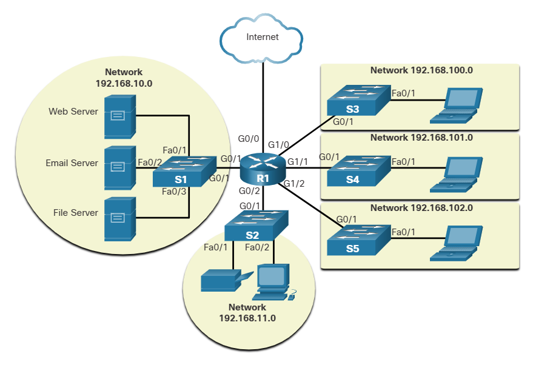

# Module 1 Notes

- Packet Tracer is a tool that allows you to simulate real networks. It provides three main menus:
    - You can add devices and connect them via cables or wireless.
    - You can select, delete, inspect, label, and group components within your network.
    - You can manage your network by opening an existing/sample network, saving your current network, and modifying your user profile or preferences.

# 1.2 Network Components

## 1.2.1 Host Roles

If you want to be a part of a global online community, your computer, tablet, or smart phone must first be connected to a network. That network must be connected to the internet. This topic discusses the parts of a network. See if you recognize these components in your own home or school network!

All computers that are connected to a network and participate directly in network communication are classified as hosts. Hosts can be called end devices. Some hosts are also called clients. However, the term hosts specifically refers to devices on the network that are assigned a number for communication purposes. This number identifies the host within a particular network. This number is called the Internet Protocol (IP) address. An IP address identifies the host and the network to which the host is attached.

Servers are computers with software that allow them to provide information, like email or web pages, to other end devices on the network. Each service requires separate server software. For example, a server requires web server software in order to provide web services to the network. A computer with server software can provide services simultaneously to many different clients.

As mentioned before, clients are a type of host. Clients have software for requesting and displaying the information obtained from the server, as shown in the figure.

```
Client PC < --- > Internet < --- > Server 
```

An example of client software is a web browser, like Chrome or FireFox. A single computer can also run multiple types of client software. For example, a user can check email and view a web page while instant messaging and listening to an audio stream. The table lists three common types of server software.

| Type | Description |
| ---- | ----------- |
| Email | The email server runs email server software. Clients use mail client software, such as Microsoft Outlook, to access email on the server. |
| Web | The web server runs web server software. Clients use browser software, such as Windows Internet Explorer, to access web pages on the server. |
| File | The file server stores corporate and user files in a central location. The client devices access these files with client software such as the Windows File Explorer. |

## 1.2.2 Peer-to-Peer

Client and server software usually run on separate computers, but it is also possible for one computer to be used for both roles at the same time. In small businesses and homes, many computers function as the servers and clients on the network. This type of network is called a peer-to-peer network.

In the figure, the print sharing PC has a Universal Serial Bus (USB) connection to the printer and a network connection, using a network interface card (NIC), to the file sharing PC.

The advantages of peer-to-peer networking:
- Easy to set up
- Less complex
- Lower cost because network devices and dedicated servers may not be required
- Can be used for simple tasks such as transferring files and sharing printers

The disadvantages of peer-to-peer networking:
- No centralized administration
- Not as secure 
- Not scalable 
- All devices may act as both clients and servers which can slow their performance 

## 1.2.3 End devices

The network devices that people are most familiar with are end devices. To distinguish one end device from another, each end device on a network has an address. When an end device initiates communication, it uses the address of the destination end device to specify where to deliver the message.

An end device is either the source or destination of a message transmitted over the network.

## 1.2.4 Intermediary Devices 

Intermediary devices connect the individual end devices to the network. They can connect multiple individual networks to form an internetwork. These intermediary devices provide connectivity and ensure that data flows across the network.

Intermediary devices use the destination end device address, in conjunction with information about the network interconnections, to determine the path that messages should take through the network. Examples of the more common intermediary devices and a list of functions are shown in the figure.

Most common intermediary devices: wireless router, multilayer switch, LAN switch, firewall application, router.

Intermediary network devices perform some or all of these functions:
- Regenerate and retransmit communication signals 
- Maintain information about what pathways exist through the network and internetwork
- Notify other devices of errors and communication failures
- Direct data along alternate pathways when there is a link failure 
- Classify and direct messages according to priorities
- Permit or deny the flow of data, based on security settings 

 Not shown is a legacy Ethernet hub. An Ethernet hub is also known as a multiport repeater. Repeaters regenerate and retransmit communication signals. Notice that all intermediary devices perform the function of a repeater.

 ## 1.2.5 Network Media

 Communication transmits across a network on media. The media provides the channel over which the message travels from source to destination.

 Modern networks primarily use three types of media to interconnect devices, as shown in the figure:
 - Metal wires within cables - Data is encoded into electrical impulses.
 - Glass or plastic fibers within cables (fiber-optic cable) - Data is encoded into pulses of light.
 - Wireless transmission - Data is encoded via modulation of specific frequencies of electromagnetic waves.

The four main criteria for choosing network media are these:
- What is the maximum distance that the media can successfully carry a signal? 
- What is the environment in which the media will be installed? 
- What is the amount of data and at what speed must it be transmitted? 
- What is the cost of the media and installation?

# 1.3 Network Representations and Topologies

## 1.3.1 Network Representations

Network architects and administrators must be able to show what their networks will look like. They need to be able to easily see which components connect to other components, where they will be located, and how they will be connected. Diagrams of networks often use symbols, like those shown in the figure, to represent the different devices and connections that make up a network.

End Devices: desktop computer, laptop, printer, IP phone, wireless tablet, TelePresence endpoint.

Intermediary devices: wireless router, multilayer switch, LAN switch, firewall application, router.

Network Media: wireless media, LAN media, WAN media.


A diagram provides an easy way to understand how devices connect in a large network. This type of “picture” of a network is known as a topology diagram. The ability to recognize the logical representations of the physical networking components is critical to being able to visualize the organization and operation of a network.

In addition to these representations, specialized terminology is used to describe how each of these devices and media connect to each other:
- Network Interface Card (NIC) - A NIC physically connects the end device to the network. 
- Physical Port - A connector or outlet on a networking device where the media connects to an end device or another networking device.
- Interface - Specialized ports on a networking device that connect to individual networks. Because routers connect networks, the ports on a router are referred to as network interfaces.

Note: The terms port and interface are often used interchangeably.

## 1.3.2 Topology Diagrams

Topology diagrams are mandatory documentation for anyone working with a network. They provide a visual map of how the network is connected. There are two types of topology diagrams: physical and logical.

### Physical Topology diagrams
Physical topology diagrams illustrate the physical location of intermediary devices and cable installation, as shown in the figure. You can see that the rooms in which these devices are located are labeled in this physical topology.


### Logical Topology diagrams
Logical topology diagrams illustrate devices, ports, and the addressing scheme of the network, as shown in the figure. You can see which end devices are connected to which intermediary devices and what media is being used.

