# Module 2: Basic Switch and End Device Configuration 
# 2.1 Cisco IOS Access

## 2.1.1 Operating Systems

All end devices and network devices require an operating system (OS). As shown in the figure, the portion of the OS that interacts directly with computer hardware is known as the kernel. The portion that interfaces with applications and the user is known as the shell. The user can interact with the shell using a command-line interface (CLI) or a graphical user interface (GUI).

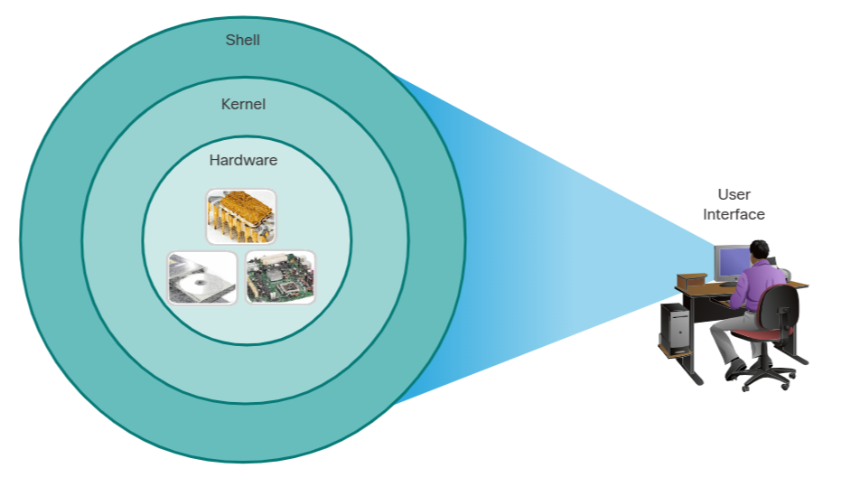
- Shell - The user interface that allows users to request specific tasks from the computer. These requests can be made either through the CLI or GUI interfaces.
- Kernel - Communicates between the hardware and software of a computer and manages how hardware resources are used to meet software requirements.
- Hardware - The physical part of a computer including underlying electronics.

When using a CLI, the user interacts directly with the system in a text-based environment by entering commands on the keyboard at a command prompt, as shown in the example. The system executes the command, often providing textual output. The CLI requires very little overhead to operate. However, it does require that the user have knowledge of the underlying command structure that controls the system.

```
analyst@secOps ~]$
Desktop  Downloads  lab.support.files  second_drive
[analyst@secOps ~]$
```

## 2.1.2 GUI

A GUI such as Windows, macOS, Linux KDE, Apple iOS, or Android allows the user to interact with the system using an environment of graphical icons, menus, and windows. The GUI example in the figure is more user-friendly and requires less knowledge of the underlying command structure that controls the system. For this reason, most users rely on GUI environments.

However, GUIs may not always be able to provide all the features available with the CLI. GUIs can also fail, crash, or simply not operate as specified. For these reasons, network devices are typically accessed through a CLI. The CLI is less resource intensive and very stable when compared to a GUI.

The family of network operating systems used on many Cisco devices is called the Cisco Internetwork Operating System (IOS). Cisco IOS is used on many Cisco routers and switches regardless of the type or size of the device. Each device router or switch type uses a different version of Cisco IOS. Other Cisco operating systems include IOS XE, IOS XR, and NX-OS.

Note: The operating system on home routers is usually called firmware. The most common method for configuring a home router is by using a web browser-based GUI.

## 2.1.3 Purpose of an OS 

Network operating systems are similar to a PC operating system. Through a GUI, a PC operating system enables a user to do the following:
- Use a mouse to make selections and run programs
- Enter text and text-based commands
- View output on a monitor

A CLI-based network operating system (e.g., the Cisco IOS on a switch or router) enables a network technician to do the following:
- Use a keyboard to run CLI-based network programs
- Use a keyboard to enter text and text-based commands
- View output on a monitor

Cisco networking devices run particular versions of the Cisco IOS. The IOS version is dependent on the type of device being used and the required features. While all devices come with a default IOS and feature set, it is possible to upgrade the IOS version or feature set to obtain additional capabilities.

## 2.1.4 Access Methods

A switch will forward traffic by default and does not need to be explicitly configured to operate. For example, two configured hosts connected to the same new switch would be able to communicate.

Regardless of the default behavior of a new switch, all switches should be configured and secured.

| Method | Description |
| ------ | ----------- |
| Console | This is a physical management port that provides out-of-band access to a Cisco device. Out-of-band access refers to access via a dedicated management channel that is used for device maintenance purposes only. The advantage of using a console port is that the device is accessible even if no networking services are configured, such as performing the initial configuration. A computer running terminal emulation software and a special console cable to connect to the device are required for a console connection. |
| Secure Shell | SSH is an in-band and recommended method for remotely establishing a secure CLI connection, through a virtual interface, over a network. Unlike a console connection, SSH connections require active networking services on the device, including an active interface configured with an address. Most versions of Cisco IOS include an SSH server and an SSH client that can be used to establish SSH sessions with other devices. |
| Telnet | Telnet is an insecure, in-band method of remotely establishing a CLI session, through a virtual interface, over a network. Unlike SSH, Telnet does not provide a secure, encrypted connection and should only be used in a lab environment. User authentication, passwords, and commands are sent over the network in plaintext. The best practice is to use SSH instead of Telnet. Cisco IOS includes both a Telnet server and Telnet client. |

Note: Some devices, such as routers, may also support a legacy auxiliary port that was used to establish a CLI session remotely over a telephone connection using a modem. Similar to a console connection, the AUX port is out-of-band and does not require networking services to be configured or available.

## 2.1.5 Terminal Emulation Programs

There are several terminal emulation programs you can use to connect to a networking device either by a serial connection over a console port, or by an SSH/Telnet connection. These programs allow you to enhance your productivity by adjusting window sizes, changing font sizes, and changing color schemes.

PuTTY 

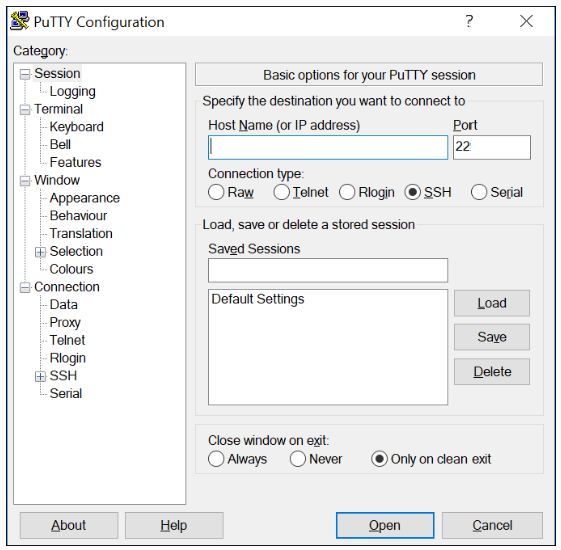

Tera Term 

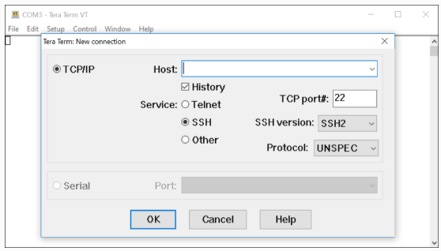

SecureCRT

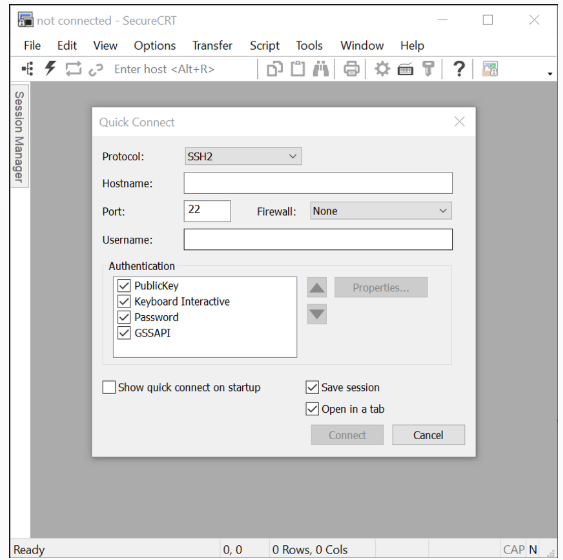

## 2.1.6 Quiz 

1. Which access method would be most appropriate if you were in the equipment room with a new switch that needs to be configured?
    **Console**
2. Which access method would be most appropriate if your manager gave you a special cable and told you to use it to configure the switch?
    **Console**
3. Which access method would be the most appropriate in-band access to the IOS over a network connection?
    **Telnet/SSH**
4. Which access method would be the most appropriate if you call your manager to tell him you cannot access your router in another city over the internet and he provides you with the information to access the router through a telephone connection?
    **Aux**

# 2.2 IOS Navigation

## 2.2.1 Primary Command Modes

In the previous topic, you learned that all network devices require an OS and that they can be configured using the CLI or a GUI. Using the CLI may provide the network administrator with more precise control and flexibility than using the GUI. This topic discusses using CLI to navigate the Cisco IOS.

As a security feature, the Cisco IOS software separates management access into the following two command modes:
- User EXEC Mode - This mode has limited capabilities but is useful for basic operations. It allows only a limited number of basic monitoring commands but does not allow the execution of any commands that might change the configuration of the device. The user EXEC mode is identified by the CLI prompt that ends with the > symbol.
- Privileged EXEC Mode - To execute configuration commands, a network administrator must access privileged EXEC mode. Higher configuration modes, like global configuration mode, can only be reached from privileged EXEC mode. The privileged EXEC mode can be identified by the prompt ending with the # symbol.

The table summarizes the two modes and displays the default CLI prompts of a Cisco switch and router.

| Command Mode | Description | Default Device Prompt |
| ------------ | ----------- | --------------------- |
| User Exec Mode | Mode allows access to only a limited number of basic monitoring commands. It is often referred to as “view-only" mode. | 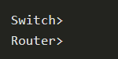
| Privileged EXEC Mode | Mode allows access to all commands and features. The user can use any monitoring commands and execute configuration and management commands. | 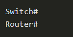

## 2.2.2 Configuration Mode and Subconfiguration Modes

To configure the device, the user must enter global configuration mode,  which is commonly called global config mode.

From global config mode, CLI configuration changes are made that affect the operation of the device as a whole. Global configuration mode is identified by a prompt that ends with (config)# after the device name, such as Switch(config)#

Global configuration mode is accessed before other specific configuration modes. From global config mode, the user can enter different subconfiguration modes. Each of these modes allows the configuration of a particular part or function of the IOS device. Two common subconfiguration modes include:
- Line Configuration Mode -  Used to configure console, SSH, Telnet, or AUX access.
- Interface Configuration Mode -  Used to configure a switch port or router network interface.

When the CLI is used, the mode is identified by the command-line prompt that is unique to that mode. By default, every prompt begins with the device name. Following the name, the remainder of the prompt indicates the mode. For example, the default prompt for line configuration mode is Switch(config-line)# and the default prompt for interface configuration mode is Switch(config-if)#.

## 2.2.3 IOS CLI Primary Command Modes

## 2.2.4 Navigate Between IOS Modes

Various commands are used to move in and out of command prompts. To move from user EXEC mode to privileged EXEC mode, use the **enable** command. Use the **disable** privileged EXEC mode command to return to user EXEC mode.

Note: Privileged EXEC mode is sometimes called **enable mode**.

To move in and out of global configuration mode, use the **configure terminal**  privileged EXEC mode command. To return to the privileged EXEC mode, enter the **exit**  global config mode command.

There are many different subconfiguration modes. For example, to enter line subconfiguration mode, you use the **line**  command followed by the management line type and number you wish to access. Use the **exit**  command to exit a subconfiguration mode and return to global configuration mode.

```
Switch(config)# line console 0
Switch(config-line)# exit 
Switch(config)#
```

To move from any subconfiguration mode of the global configuration mode to the mode one step above it in the hierarchy of modes, enter the **exit**  command.

To move from any subconfiguration mode to the privileged EXEC mode, enter the **end** command or enter the key combination **Ctrl+Z**.

```
Switch(config-line)# end 
Switch# 
```

You can also move directly from one subconfiguration mode to another. Notice how after selecting an interface, the command prompt changes from **(config-line)#** to **(config-line)#**.

```
Switch(config-line)# interface FastEthernet 0/1 
Switch(config-if)# 
```

## 2.2.5 Video - Navigrate Between IOS Modes 

## 2.2.6 A Note About Syntax Checker Activities

When you are learning how to modify device configurations, you might want to start in a safe, non-production environment before trying it on real equipment. NetAcad gives you different simulation tools to help build your configuration and troubleshooting skills. Because these are simulation tools, they typically do not have all the functionality of real equipment. One such tool is the Syntax Checker. In each Syntax Checker, you are given a set of instructions to enter a specific set of commands. You cannot progress in Syntax Checker unless the exact and full command is entered as specified. More advanced simulation tools, such as Packet Tracer, let you enter abbreviated commands, much as you would do on real equipment.

## 2.2.8 Quiz 

1. Which IOS mode allows access to all commands and features?
    **Privileged EXEC Mode**
2. Which IOS mode are you in if the Switch(config)# prompt is displayed?
    **Global Configuration Mode**
3. Which IOS mode are you in if the Switch> prompt is displayed?
    **User EXEC Mode** 
4. Which two commands would return you to the privileged EXEC prompt regardless of the configuration mode you are in? (Choose two.)
    **Ctrl+Z** and **end**

# 2.3 The Command Structure 

## 2.3.1 Basic IOS Command Structure 

This topic covers the basic structure of commands for the Cisco IOS. A network administrator must know the basic IOS command structure to be able to use the CLI for device configuration.

A Cisco IOS device supports many commands. Each IOS command has a specific format, or syntax, and can only be executed in the appropriate mode. The general syntax for a command, shown in the figure, is the command followed by any appropriate keywords and arguments.

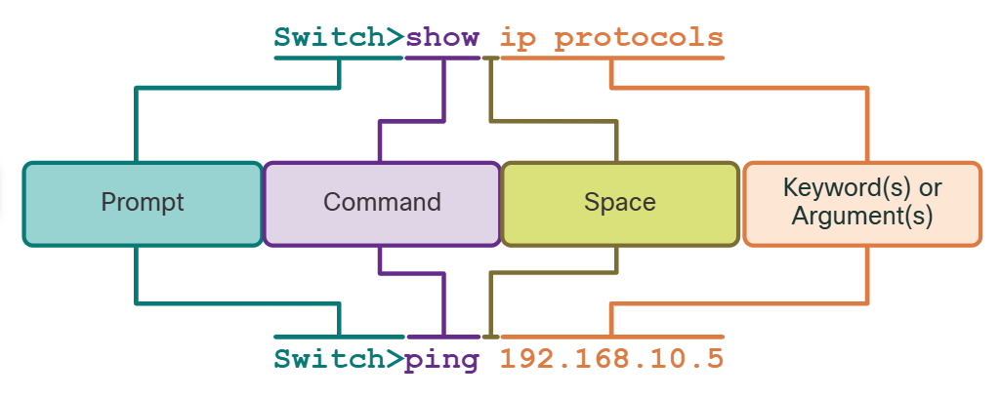

- Keyword - This is a specific parameter defined in the operating system (in the figure, ip protocols).
- Argument - This is not predefined; it is a value or variable defined by the user (in the figure, 192.168.10.5).

## 2.3.2 IOS Command Syntax Check 

A command might require one or more arguments. To determine the keywords and arguments required for a command, refer to the command syntax. The syntax provides the pattern, or format, that must be used when entering a command.

As identified in the table, boldface text indicates commands and keywords that are entered as shown. Italic text indicates an argument for which the user provides the value.

| Convention | Description |
| ---------- | ----------- |
| **boldface** | Boldface text indicates commands and keywords that you enter literally as shown. |
| *italics* | Italic text indicates arguments for which you supply values. |
| [x] | Square brackets indicate an optional element (keyword or argument). |
| {x} | Braces indicate a required element (keyword or argument. |
| [x {y | x}] | Braces and vertical lines within square brackets indicate a required choice within an optional element. Spaces are used to clearly delineate parts of the command. |

For instance, the syntax for using the description command is description string. The argument is a string value provided by the user. The description command is typically used to identify the purpose of an interface. For example, entering the command, **description Connects to the main headquarter office switch**, describes where the other device is at the end of the connection. 

The following examples demonstrate conventions used to document and use IOS commands:
- **ping** ip-address - The command is ping and the user-defined argument is the ip-address of the destination device. For example, ping 10.10.10.5.
- **traceroute** ip-address - The command is traceroute and the user-defined argument is the ip-address of the destination device. For example, traceroute 192.168.254.254.

If a command is complex with multiple arguments, you may see it represented like this:

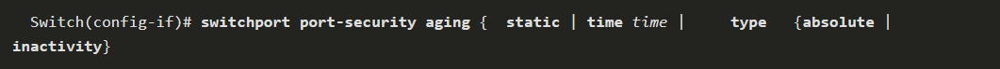

The command will typically be followed with a detailed description of the command and each argument.

The Cisco IOS Command Reference is the ultimate source of information for a particular IOS command.

## 2.3.3 IOS Help Features 

The IOS has two forms of help available: context-sensitive help and command syntax check.

Context-sensitive help enables you to quickly find answers to these questions:
- Which commands are available in each command mode?
- Which commands start with specific characters or group of characters?
- Which arguments and keywords are available to particular commands?

To access context-sensitive help, simply enter a question mark, ?, at the CLI.

Command syntax check verifies that a valid command was entered by the user. When a command is entered, the command line interpreter evaluates the command from left to right. If the interpreter understands the command, the requested action is executed, and the CLI returns to the appropriate prompt. However, if the interpreter cannot understand the command being entered, it will provide feedback describing what is wrong with the command.

## 2.3.4 Video - Context-Sensitive Help and Command Syntax Check.

## 2.3.5 Hot Keys and Shortcuts

The IOS CLI provides hot keys and shortcuts that make configuring, monitoring, and troubleshooting easier. 

Commands and keywords can be shortened to the minimum number of characters that identify a unique selection. For example, the **configure** command can be shorted to **conf** because **configure** is the only command that begins with **conf**. An even shorter version, **con**, will not work because more than one command begins with **con**. Keywords can also be shortened.

| Keystroke | Description |
| --------- | ----------- |
| Tab | Completes a partial command name entry. |
| Backspace | Erases the character to the left of the cursor. |
| Ctrl+D | Erases the character at the cursor. |
| Ctrl+K | Erases all characters from the cursor to the end fo the command line. |
| Esc D | Erases all characters from the cursor to the end of the word. |
| Ctrl+U or Ctrl+X | Erases all characters from the cursor back to the beginning of the command line. |
| Ctrl+W | Erases the word to the left of the cursor. |
| Ctrl+A | Moves the cursor to the beginning of the line. |
| Left Arrow or Ctrl+B | Moves the cursor one character to the left. |
| Esc B | Moves the cursor back one word to the left. |
| Esc F | Moves the cursor forward one word to the right. |
| Right Arrow or Ctrl+F | Moves the cursor one character to the right. |
| Ctrl+E | Moves the cursor to the end of the command line. |
| Up Arrow or Ctrl+P | Recalls the previous command in the history buffer, beginning with the most recent command. |
| Down Arrow or Ctrl+N | Goes to the next line in the history buffer. |
| Ctrl+R or Ctrl+I or Ctrl+L | Redisplays the system prompt and command line after a console message is received. |

Note: While the **Delete** key typically deletes the character to the right of the prompt, the IOS command structure does not recognize the Delete key.

When a command output produces more text than can be displayed in a terminal window, the IOS will display a **“--More--”** prompt. The following table describes the keystrokes that can be used when this prompt is displayed.

| Keystroke | Description | 
| --------- | ----------- |
| Enter key | Displays the next line. |
| Space bar | Displays the next screen. |
| Any other key * |  Ends the display string, returning to previous prompt. Except "y", which answers "yes" to the **--More--** prompt, and acts like the Space bar. |

This table lists command used to exit out of an operation.

| Keystroke | Description |
| --------- | ----------- |
| Ctrl-C | When in any configuration mode, ends the configuration mode and returns to privileged EXEC mode. When in setup mode, aborts back to the command prompt. |
| Ctrl-Z | When in any configuration mode, ends the configuration mode and returns to privileged EXEC mode. |
| Ctrl-Shift-6 | All-purpose break sequence used to abort DNS lookups, traceroutes, pings, etc. |

## 2.3.6 Video - Hot Keys and Shortcuts 

## 2.3.7 Packet Tracer - Navigate the IOS 

## 2.3.8 Lab - Navigate the IOS by using Tera Term for Console Connectivity

# 2.4 Basic Device Configuration 

## 2.4.1 Device Names

You have learned a great deal about the Cisco IOS, navigating the IOS, and the command structure. Now, you are ready to configure devices! The first configuration command on any device should be to give it a unique device name or hostname. By default, all devices are assigned a factory default name. For example, a Cisco IOS switch is "Switch."

The problem is if all switches in a network were left with their default names, it would be difficult to identify a specific device. For instance, how would you know that you are connected to the right device when accessing it remotely using SSH? The hostname provides confirmation that you are connected to the correct device.

The default name should be changed to something more descriptive. By choosing names wisely, it is easier to remember, document, and identify network devices. Here are some important naming guidelines for hosts:
- Start with a letter
- Contain no spaces 
- End with a letter or digit 
- Use only letters, digits, and dashes 
- Be less than 64 characters in length 

An organization must choose a naming convention that makes it easy and intuitive to identify a specific device. The hostnames used in the device IOS preserve capitalization and lowercase characters. For example, the figure shows that three switches, spanning three different floors, are interconnected together in a network. The naming convention that was used incorporated the location and the purpose of each device. Network documentation should explain how these names were chosen so additional devices can be named accordingly.

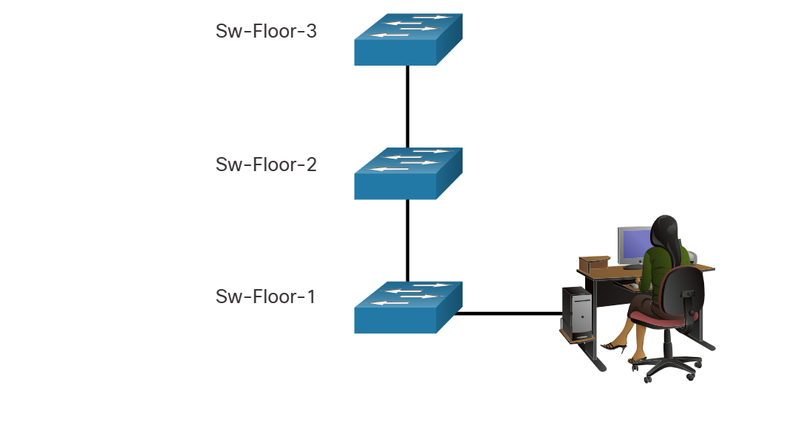

When the naming convention has been identified, the next step is to use the CLI to apply the names to the devices. As shown in the example, from the privileged EXEC mode, access the global configuration mode by entering the **configure terminal** command. Notice the change in the command prompt.

```
Switch# configure terminal
Switch(config)# hostname Sw-Floor-1
Sw-Floor-1(config)#
```

From global configuration mode, enter the command **hostname** followed by the name of the switch and press **Enter**. Notice the change in the command prompt name.

Note: to return the switch to the default prompt, use the **no hostname** global config command.

Always make sure the documentation is updated each time a device is added or modified. Identify devices in the documentation by their location, purpose, and address.

## 2.4.2 Password Guidelines 

The use of weak or easily guessed passwords continues to be the biggest security concern of organizations. Network devices, including home wireless routers, should always have passwords configured to limit administrative access.

Cisco IOS can be configured to use hierarchical mode passwords to allow different access privileges to a network device.

All networking devices should limit administrative access by securing privileged EXEC, user EXEC, and remote Telnet access with passwords. In addition, all passwords should be encrypted and legal notifications provided.

When choosing passwords, use strong passwords that are not easily guessed. There are some key points to consider when choosing passwords:
- Use passwords that are more than eight characters in length.
- Use a combination of upper and lowercase letters, numbers, special characters, and/or numeric sequences.
- Avoid using the same password for all devices.
- Do not use common words because they are easily guessed.

Use an internet search to find a password generator. Many will allow you to set the length, character set, and other parameters.

Note: Most of the labs in this course use simple passwords such as **cisco** or **class**. These passwords are considered weak and easily guessable and should be avoided in production environments. We only use these passwords for convenience in a classroom setting, or to illustrate configuration examples.

## 2.4.3 Configure Passwords 

When you initially connect to a device, you are in user EXEC mode. This mode is secured using the console.

To secure user EXEC mode access, enter line console configuration mode using the **line console 0** global configuration command, as shown in the example. The zero is used to represent the first (and in most cases the only) console interface. Next, specify the user EXEC mode password using the **password** *password* command. Finally, enable user EXEC access using the **login** command.

```
Sw-Floor-1# configure terminal
Sw-Floor-1(config)# line console 0
Sw-Floor-1(config-line)# password cisco
Sw-Floor-1(config-line)# login
Sw-Floor-1(config-line)# end
Sw-Floor-1#
```
Console access will now require a password before allowing access to the user EXEC mode.

To have administrator access to all IOS commands including configuring a device, you must gain privileged EXEC mode access. It is the most important access method because it provides complete access to the device.

To secure privileged EXEC access, use the **enable secret** *password* global config command, as shown in the example.

```
Sw-Floor-1# configure terminal 
Sw-Floor-1(config)# enable secret class
Sw-Floor-1(config)# exit
Sw-Floor-1#
```

Virtual terminal (VTY) lines enable remote access using Telnet or SSH to the device. Many Cisco switches support up to 16 VTY lines that are numbered 0 to 15.

To secure VTY lines, enter line VTY mode using the **line vty 0 15** global config command. Next, specify the VTY password using the **password** *password* command. Lastly, enable VTY access using the **login** command.

An example of securing the VTY lines on a switch is shown.

```
Sw-Floor-1# configure terminal
Sw-Floor-1(config)# line vty 0 15
Sw-Floor-1(config-line)# password cisco
Sw-Floor-1(config-line)# login
Sw-Floor-1(config-line)# end
Sw-Floor-1#
```

## 2.4.4 Encrypt Passwords 

The startup-config and running-config files display most passwords in plaintext. This is a security threat because anyone can discover the passwords if they have access to these files.

To encrypt all plaintext passwords, use the **service password-encryption** global config command as shown in the example.

```
Sw-Floor-1# configure terminal 
Sw-Floor-1(config)# service password-encryption
Sw-Floor-1(config)#
```

The command applies weak encryption to all unencrypted passwords. This encryption applies only to passwords in the configuration file, not to passwords as they are sent over the network. The purpose of this command is to keep unauthorized individuals from viewing passwords in the configuration file.

Use the **show running-config** command to verify that passwords are now encrypted.

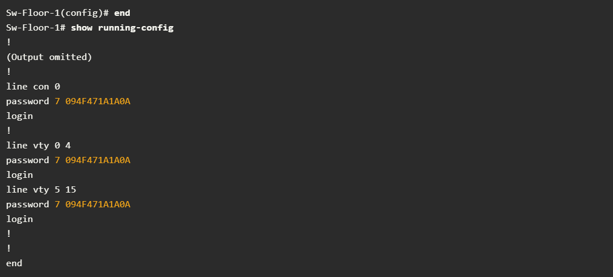

## 2.4.5 Banner Messages 

Although requiring passwords is one way to keep unauthorized personnel out of a network, it is vital to provide a method for declaring that only authorized personnel should attempt to access the device. To do this, add a banner to the device output. Banners can be an important part of the legal process in the event that someone is prosecuted for breaking into a device. Some legal systems do not allow prosecution, or even the monitoring of users, unless a notification is visible.

To create a banner message of the day on a network device, use the **banner motd #** *the message of the day* **#** global config command. The “#” in the command syntax is called the delimiting character. It is entered before and after the message. The delimiting character can be any character as long as it does not occur in the message. For this reason, symbols such as the "#" are often used. After the command is executed, the banner will be displayed on all subsequent attempts to access the device until the banner is removed.

The following example shows the steps to configure the banner on Sw-Floor-1.

```
Sw-Floor-1# configure terminal 
Sw-Floor-1(config)# banner motd #Authorized Access Only#
```

## 2.4.6 Video - Secure Administrative Access to a Switch

## 2.4.8 Quiz 

1. What is the command to assign the name "Sw-Floor-2" to a switch?
    **hostname Sw-Floor-2**
2. How is the privileged EXEC mode access secured on a switch?
    **enable secret class**
3. Which command enables password authentication for user EXEC mode access on a switch?
    **login**
4. Which command encrypts all plaintext passwords access on a switch?
    **service password-encryption**
5. Which is the command to configure a banner to be displayed when connecting to a switch?
    **banner motd $ Keep out $**

# 2.5 Save Configurations 

## 2.5.1 Configuration Files 

You now know how to perform basic configuration on a switch, including passwords and banner messages. This topic will show you how to save your configurations.

There are two system files that store the device configuration:
- **startup-config** - This is the saved configuration file that is stored in NVRAM. It contains all the commands that will be used by the device upon startup or reboot. Flash does not lose its contents when the device is powered off.
- **running-config** - This is stored in Random Access Memory (RAM). It reflects the current configuration. Modifying a running configuration affects the operation of a Cisco device immediately. RAM is volatile memory. It loses all of its content when the device is powered off or restarted.

The **show running-config** privileged EXEC mode command is used to view the running config. As shown in the example, the command will list the complete configuration currently stored in RAM.

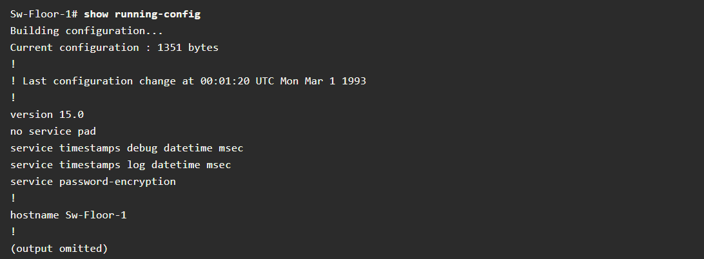

To view the startup configuration file, use the **show startup-config** privileged EXEC command. 

If power to the device is lost, or if the device is restarted, all configuration changes will be lost unless they have been saved. To save changes made to the running configuration to the startup configuration file, use the **copy running-config startup-config** privileged EXEC mode command.

## 2.5.2 Alter the Running Configuration 

If changes made to the running config do not have the desired effect and the running-config has not yet been saved, you can restore the device to its previous configuration. Remove the changed commands individually, or reload the device using the **reload** privileged EXEC mode command to restore the startup-config.

The downside to using the **reload** command to remove an unsaved running config is the brief amount of time the device will be offline, causing network downtime.

When a reload is initiated, the IOS will detect that the running config has changes that were not saved to the startup configuration. A prompt will appear to ask whether to save the changes. To discard the changes, enter **n** or **no**.

Alternatively, if undesired changes were saved to the startup config, it may be necessary to clear all the configurations. This requires erasing the startup config and restarting the device. The startup config is removed by using the **erase startup-config** privileged EXEC mode command. After the command is issued, the switch will prompt you for confirmation. Press **Enter** to accept.

After removing the startup config from NVRAM, reload the device to remove the current running config file from RAM. On reload, a switch will load the default startup config that originally shipped with the device.

## 2.5.3 Video -Alter the Running Configuration 

## 2.5.4 Capture Configuration to a Text File 

Configuration files can also be saved and archived to a text document. This sequence of steps ensures that a working copy of the configuration file is available for editing or reuse later.

For example, assume that a switch has been configured, and the running config has been saved on the device.

**Step 1.** Open terminal emulation software, such as PuTTY or Tera Term, that is already connected to a switch.

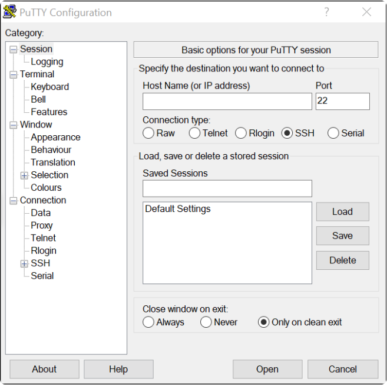

**Step 2.** Enable logging in the terminal software and assign a name and file location to save the log file. The figure displays that **All session output** will be captured to the file specified (i.e., MySwitchLogs).

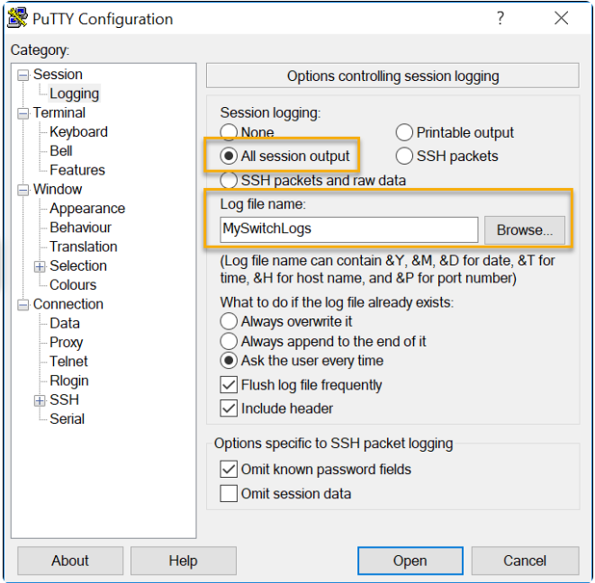

**Step 3.** Execute the **show running-config** or **show startup-config** command at the privileged EXEC prompt. Text displayed in the terminal window will be placed into the chosen file.

```
Sw-Floor-1# show running-config
Building configuration...
(output omitted)
```

**Step 4.** Disable logging in the terminal software. The figure shows how to disable logging by choosing the **None** session logging option. 

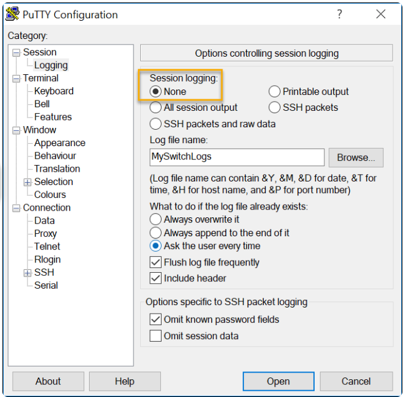

The text file created can be used as a record of how the device is currently implemented. The file could require editing before being used to restore a saved configuration to a device.

To restore a configuration file to a device:

**Step 1.** Enter global configuration mode on the device.
**Step 2.**  Enter global configuration mode on the device.

The text in the file will be applied as commands in the CLI and become the running configuration on the device. This is a convenient method of manually configuring a device.

## 2.5.5 Packet Tracer - Configure Initial Switch Settings

# 2.6 Ports and Addresses 

## 2.6.1 IP Addresses 

Congratulations, you have performed a basic device configuration! Of course, the fun is not over yet. If you want your end devices to communicate with each other, you must ensure that each of them has an appropriate IP address and is correctly connected. You will learn about IP addresses, device ports and the media used to connect devices in this topic.

The use of IP addresses is the primary means of enabling devices to locate one another and establish end-to-end communication on the internet. Each end device on a network must be configured with an IP address. Examples of end devices include these:
- Computers (work stations, laptops, file servers, web servers)
- Network printers
- VoIP phones
- Security camera
- Smart phones 
- Mobile handheld devices (such as wireless barcode scanners)

The structure of an IPv4 address is called dotted decimal notation and is represented by four decimal numbers between 0 and 255. IPv4 addresses are assigned to individual devices connected to a network.

Note: IP in this course refers to both the IPv4 and IPv6 protocols. IPv6 is the most recent version of IP and is replacing the more common IPv4.


With the IPv4 address, a subnet mask is also necessary. An IPv4 subnet mask is a 32-bit value that differentiates the network portion of the address from the host portion. Coupled with the IPv4 address, the subnet mask determines to which subnet the device is a member.

The example in the figure displays the IPv4 address (192.168.1.10), subnet mask (255.255.255.0), and default gateway (192.168.1.1) assigned to a host. The default gateway address is the IP address of the router that the host will use to access remote networks, including the internet.

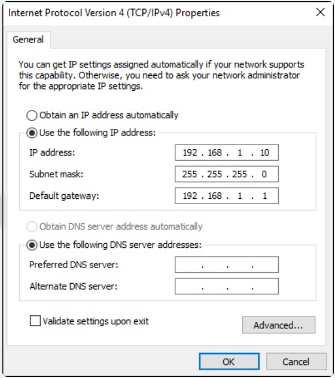

IPv6 addresses are 128 bits in length and written as a string of hexadecimal values. Every four bits is represented by a single hexadecimal digit; for a total of 32 hexadecimal values. Groups of four hexadecimal digits are separated by a colon (:) . IPv6 addresses are not case-sensitive and can be written in either lowercase or uppercase.

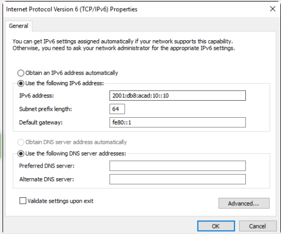

## 2.6.2 Interfaces and Ports 

Network communications depend on end user device interfaces, networking device interfaces, and the cables that connect them. Each physical interface has specifications, or standards, that define it. A cable connecting to the interface must be designed to match the physical standards of the interface. Types of network media include twisted-pair copper cables, fiber-optic cables, coaxial cables, or wireless, as shown in the figure.

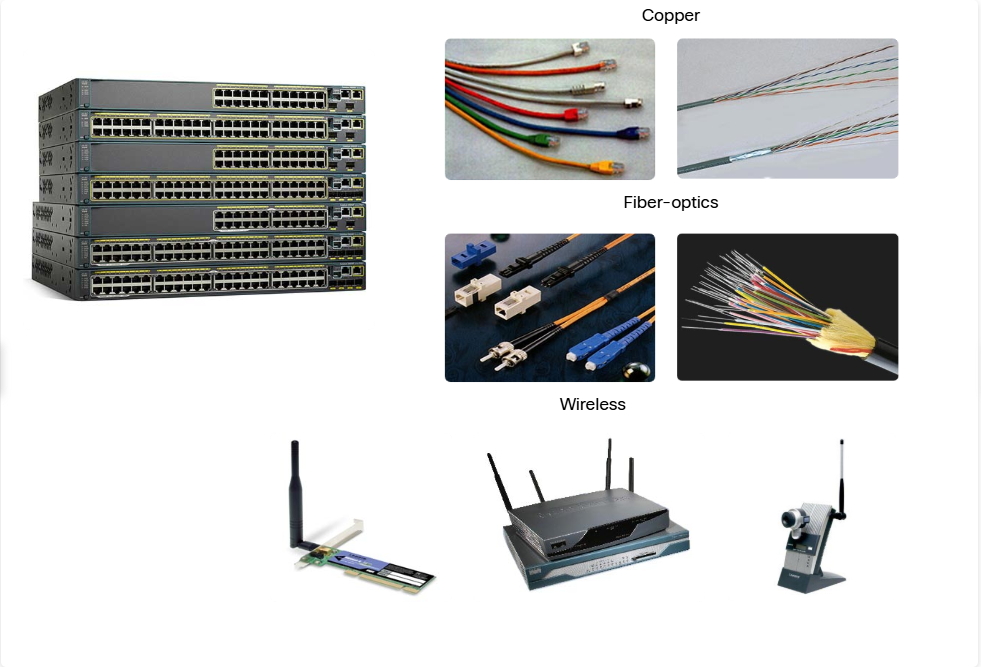

Different types of network media have different features and benefits. Not all network media have the same characteristics. Not all media are appropriate for the same purpose. These are some of the differences between various types of media:
- Distance the media can successfully carry a signal
- Environment in which the media is to be installed 
- Amount of data and the speed at which it must be transmitted 
- Cost of the media and installation 

Not only does each link on the internet require a specific network media type, but each link also requires a particular network technology. For example, Ethernet is the most common local-area network (LAN) technology used today. Ethernet ports are found on end-user devices, switch devices, and other networking devices that can physically connect to the network using a cable.

Cisco IOS Layer 2 switches have physical ports for devices to connect. These ports do not support Layer 3 IP addresses. Therefore, switches have one or more switch virtual interfaces (SVIs). These are virtual interfaces because there is no physical hardware on the device associated with it. An SVI is created in software.

The virtual interface lets you remotely manage a switch over a network using IPv4 and IPv6. Each switch comes with one SVI appearing in the default configuration "out-of-the-box." The default SVI is interface VLAN1.

Note:  A Layer 2 switch does not need an IP address. The IP address assigned to the SVI is used to remotely access the switch. An IP address is not necessary for the switch to perform its operations.

## 2.6.3 Quiz 

1. What is the structure of an IPv4 address called?
    **Dotted-decimal format**
2. How is an IPv4 address represented?
    **Four decimal numbers between 0 and 255 separated by periods.**
3. What type of interface has no physical port associated with it?
    **Switch virtual interface (SVI)**

# 2.7 Configure IP Addressing 

## 2.7.1 Manual IP Address Configuration for End Devices 

Much like you need your friends' telephone numbers to text or call them, end devices in your network need an IP address so that they can communicate with other devices on your network. In this topic, you will implement basic connectivity by configuring IP addressing on switches and PCs.

IPv4 address information can be entered into end devices manually, or automatically using Dynamic Host Configuration Protocol (DHCP).

To manually configure an IPv4 address on a Windows host, open the **Control Panel > Network Sharing Center > Change adapter settings** and choose the adapter. Next right-click and select **Properties** to display the **Local Area Connection Properties**, as shown in the figure.

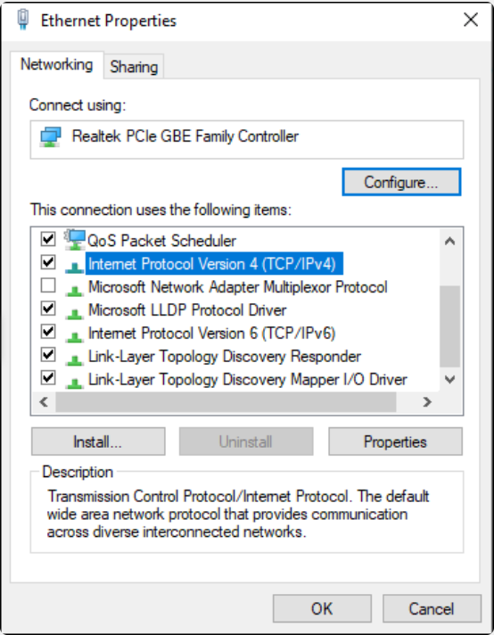

Highlight Internet Protocol Version 4 (TCP/IPv4) and click **Properties** to open the **Internet Protocol Version 4 (TCP/IPv4) Properties** window, shown in the figure. Configure the IPv4 address and subnet mask information, and default gateway.

Note: IPv6 addressing and configuration options are similar to IPv4.

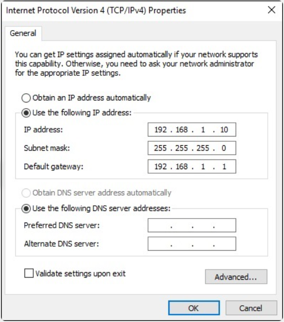

Note:  The DNS server addresses are the IPv4 and IPv6 addresses of the Domain Name System (DNS) servers, which are used to translate IP addresses to domain names, such as www.cisco.com. 

## 2.7.2 Automatic IP Address Configuration for End Devices 

End devices typically default to using DHCP for automatic IPv4 address configuration. DHCP is a technology that is used in almost every network. The best way to understand why DHCP is so popular is by considering all the extra work that would have to take place without it.

In a network, DHCP enables automatic IPv4 address configuration for every end device that is DHCP-enabled. Imagine the amount of time it would take if every time you connected to the network, you had to manually enter the IPv4 address, the subnet mask, the default gateway, and the DNS server. Multiply that by every user and every device in an organization and you see the problem. Manual configuration also increases the chance of misconfiguration by duplicating another device’s IPv4 address.

As shown in the figure, to configure DHCP on a Windows PC, you only need to select **Obtain an IP address automatically** and **Obtain DNS server address automatically**. Your PC will search out a DHCP server and be assigned the address settings necessary to communicate on the network.

Note: IPv6 uses DHCPv6 and SLAAC (Stateless Address Autoconfiguration) for dynamic address allocation.

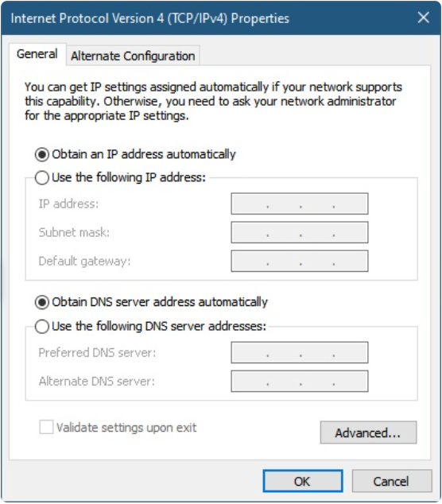

## 2.7.3 Syntax Checker - Verify Windows PC IP Configuration 

## 2.7.4 Switch Virtual Interface Configuration 

To access the switch remotely, an IP address and a subnet mask must be configured on the SVI. To configure an SVI on a switch, use the **interface vlan 1** global configuration command. Vlan 1 is not an actual physical interface but a virtual one. Next assign an IPv4 address using the **ip address** *ip-address subnet-mask* interface configuration command. Finally, enable the virtual interface using the **no shutdown** interface configuration command.

After these commands are configured, the switch has all the IPv4 elements ready for communication over the network.

Note:  Similar to a Windows hosts, switches configured with an IPv4 address will typically also need to have a default gateway assigned. This can be done using the **ip default-gateway** *ip-address* global configuration command.  The *ip-address* parameter would be the IPv4 address of the local router on the network, as shown in the example. However, in this module you will only be configuring a network with switches and hosts. Routers will be introduced later.

```
Sw-Floor-1# configure terminal
Sw-Floor-1(config)# interface vlan 1
Sw-Floor-1(config-if)# ip addres 192.168.1.20 255.255.255.0
Sw-Floor-1(config0if)# no shutdown
Sw-Floor-1(config-if)# exit 
Sw-Floor-1(config) # i[ default-gateway 192.168.1.1
```

## 2.7.5 Syntax Checker - Configure a Switch Virtual Interface

## 2.7.6 Packet Tracer - Implement Basic Connectivity 

# 2.8 Verify Connectivity 

## 2.8.1 Video Activity - Test the Interface Assignment 

## 2.8.2 Video Activity - Test End-to-End Connectivity 

# 2.9 Module Quiz

1. Which statement is true about the running configuration file in a Cisco IOS device?
    **It affects the operation of the device immediately when modified.**
2. Which two statements are true regarding the user EXEC mode? (Choose two.)
    **The device prompt for this mode ends with the '>' symbol.** and **Only some aspects of the router configuration can be viewed.**
3. Which type of access is secured on a Cisco router or switch with the enable secret command?
    **privileged EXEC**
4. What is the default SVI on a Cisco switch?
    **VLAN1**
5. When a hostname is configured through the Cisco CLI, which three naming conventions are part of the guidelines? (Choose three.)
    **The hostname should be fewer than 64 characters in length**, **The hostname should contain no spaces**, and **The hostname should begin with a letter**
6. What is the function of the shell in an OS?
    **It interfaces between the users and the kernel.**
7. A router with a valid operating system contains a configuration file stored in NVRAM. The configuration file has an enable secret password but no console password. When the router boots up, which mode will display?
    **User EXEC mode**
8. An administrator has just changed the IP address of an interface on an IOS device. What else must be done in order to apply those changes to the device?
    **Nothing must be done. Changes to the configuration on an IOS device take effect as soon as the command is typed correctly and the Enter key has been pressed.**
9. Which memory location on a Cisco router or switch will lose all content when the device is restarted?
    **RAM**
10. Why would a technician enter the command copy startup-config running-config?
    **To copy an existing configuration into RAM**
11. Which functionality is provided by DHCP?
    **Automatic assignment of an IP address to each host**
12. Which two functions are provided to users by the context-sensitive help feature of the Cisco IOS CLI? (Choose two.)
    **Displaying a list of all available commands within the current mode** and **Determining which option, keyword, or argument is available for the entered command**
13. Which memory location on a Cisco router or switch stores the startup configuration file?
    **NVRAM**
14. To what subnet does the IP address 10.1.100.50 belong if a subnet mask of 255.255.0.0 is used?
    **10.1.0.0**
