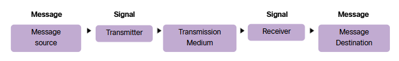
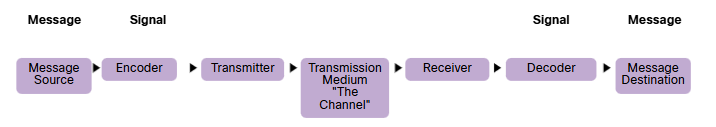
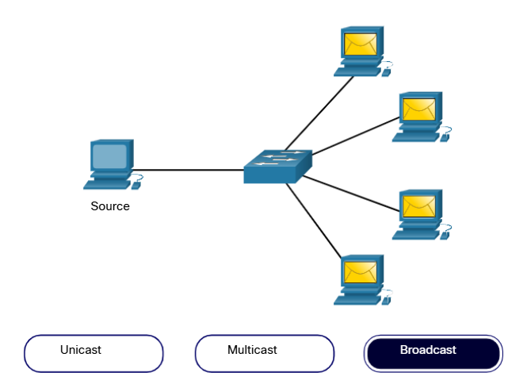
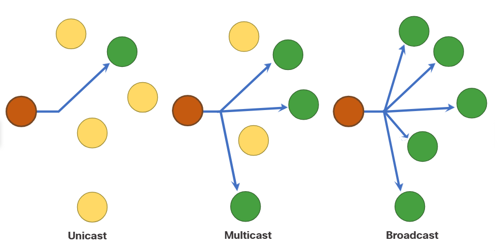
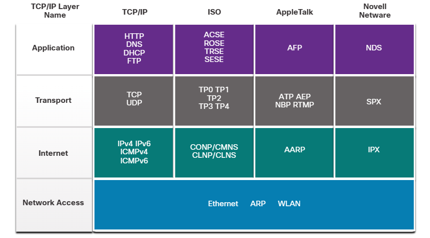
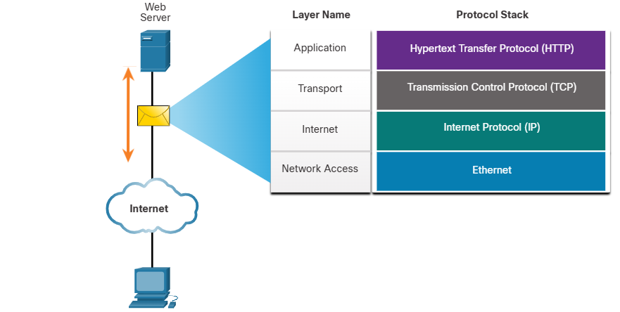
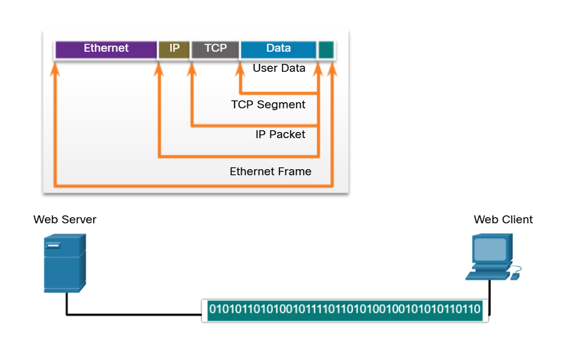
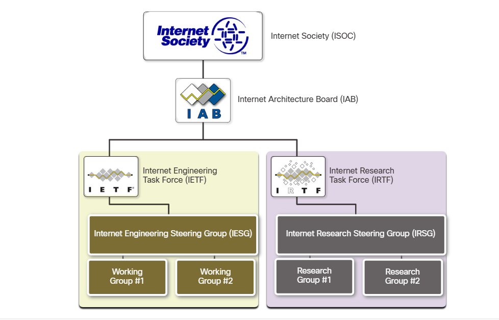
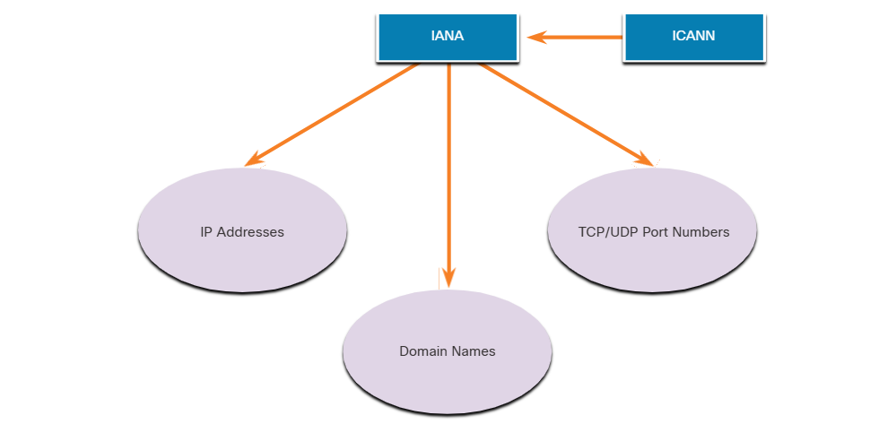
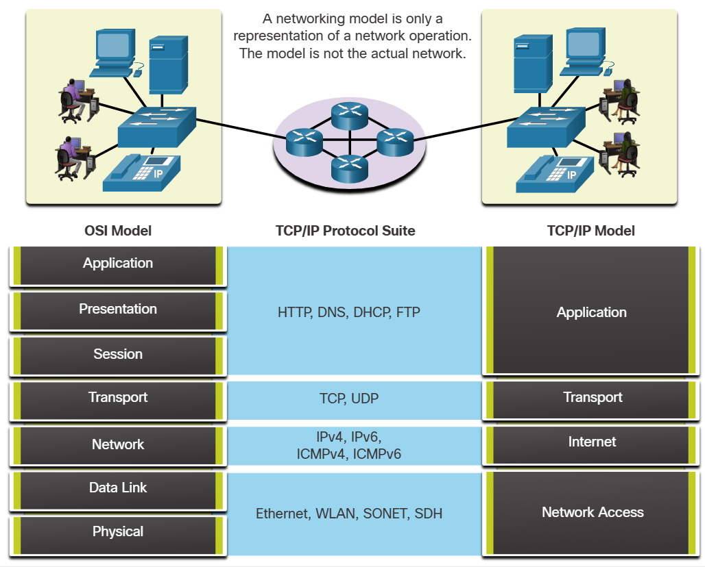

# Module 3: Protocols and Models

# 3.1 The Rules

## 3.1.1 Video - Devices in a Bubble

## 3.1.2 Communication Fundamentals 

Networks vary in size, shape, and function. They can be as complex as devices connected across the internet, or as simple as two computers directly connected to one another with a single cable, and anything in-between. However, simply having a wired or wireless physical connection between end devices is not enough to enable communication. For communication to occur, devices must know “how” to communicate.

People exchange ideas using many different communication methods. However, all communication methods have the following three elements in common:
- **Message source (sender)** - Message sources are people, or electronic devices, that need to send a message to other individuals or devices.
- **Message Destination (receiver)** - The destination receives the message and interprets it.
- **Channel** - This consists of the media that provides the pathway over which the message travels from source to destination.

## 3.1.3 Communication Protocols 

Sending a message, whether by face-to-face communication or over a network, is governed by rules called protocols. These protocols are specific to the type of communication method being used. In our day-to-day personal communication, the rules we use to communicate over one medium, like a telephone call, are not necessarily the same as the rules for using another medium, such as sending a letter.

The process of sending a letter is similar to communication that occurs in computer networks.

### Analogy

Prior to communicating, they must agree on how to communicate. If the communication is using voice, they must first agree on the language. Next, when they have a message to share, they must be able to format that message in a way that is understandable.

If someone uses the English language, but poor sentence structure, the message can easily be misunderstood. Each of these tasks describe protocols that are used to accomplish communication.

### Network 

Prior to communicating, the devices must agree on how to communicate. They must also format the message in a way that is understandable.

As shown in the animation, this is also true for computer communication.



## 3.1.4 Rule Establishment 

Before communicating with one another, individuals must use established rules or agreements to govern the conversation. Consider this message for example:

```
humans communication between govern rules. It is verydifficult tounderstand messages that are not correctly formatted and donot follow the established rules and protocols. A estrutura da gramatica, da lingua, da pontuacao e do sentence faz a configuracao humana compreensivel por muitos individuos diferentes.
```

Notice how it is difficult to read the message because it is not formatted properly. It should be written using rules (i.e., protocols) that are necessary for effective communication. The example shows the message which is now properly formatted for language and grammar.

```
Rules govern communication between humans. It is very difficult to understand messages that are not correctly formatted and do not follow the established rules and protocols. The structure of the grammar, the language, the punctuation and the sentence make the configuration humanly understandable for many different individuals.
```

Protocols must account for the following requirements to successfully deliver a message that is understood by the receiver:
- An identified sender and receiver 
- Common language and grammer
- speed and timing of delivery 
- confirmation or acknowledgment requirements 

## 3.1.5 Network Protocol Requirements

The protocols that are used in network communications share many of these fundamental traits. In addition to identifying the source and destination, computer and network protocols define the details of how a message is transmitted across a network. Common computer protocols include the following requirements:
- Message encoding
- Message formatting and encapsulation
- Message size 
- Message timing
- Message delivery options

## 3.1.6 Message Encoding 

One of the first steps to sending a message is encoding. Encoding is the process of converting information into another acceptable form, for transmission. Decoding reverses this process to interpret the information. 

### Analogy 

Imagine a person calls a friend to discuss the details of a beautiful sunset. Click Play in the figure to view an animation of message encoding.

To communicate the message, she converts her thoughts into an agreed upon language. She then speaks the words using the sounds and inflections of spoken language that convey the message. Her friend listens to the description and decodes the sounds to understand the message he received.

### Network 

Encoding between hosts must be in an appropriate format for the medium. Messages sent across the network are first converted into bits by the sending host. Each bit is encoded into a pattern of voltages on copper wires, infrared light in optical fibers, or microwaves for wireless systems. The destination host receives and decodes the signals to interpret the message.



## 3.1.7 Message Formatting and Excapsulation 

When a message is sent from source to destination, it must use a specific format or structure. Message formats depend on the type of message and the channel that is used to deliver the message.

### Analogy 

An envelope has the address of the sender and receiver, each located at the proper place on the envelope. If the destination address and formatting are not correct, the letter is not delivered.

The process of placing one message format (the letter) inside another message format (the envelope) is called encapsulation. De-encapsulation occurs when the process is reversed by the recipient and the letter is removed from the envelope.


### Network

Similar to sending a letter, a message that is sent over a computer network follows specific format rules for it to be delivered and processed.

Internet Protocol (IP) is a protocol with a similar function to the envelope example. In the figure, the fields of the Internet Protocol version 6 (IPv6) packet identify the source of the packet and its destination. IP is responsible for sending a message from the message source to destination over one or more networks.

Note: The fields of the IPv6 packet are discussed in detail in another module.


## 3.1.8 Message Size 

### Analogy

When people communicate with each other, the messages that they send are usually broken into smaller parts or sentences. These sentences are limited in size to what the receiving person can process at one time, as shown in the figure. It also makes it easier for the receiver to read and comprehend.

### Network 
Likewise, when a long message is sent from one host to another over a network, it is necessary to break the message into smaller pieces, as shown in Figure 2. The rules that govern the size of the pieces, or frames, communicated across the network are very strict. They can also be different, depending on the channel used. Frames that are too long or too short are not delivered.

The size restrictions of frames require the source host to break a long message into individual pieces that meet both the minimum and maximum size requirements. The long message will be sent in separate frames, with each frame containing a piece of the original message. Each frame will also have its own addressing information. At the receiving host, the individual pieces of the message are reconstructed into the original message.

## 3.1.9 Message Timing 

Message timing is also very important in network communications. Message timing includes the following:
- **Flow Control** -  This is the process of managing the rate of data transmission. Flow control defines how much information can be sent and the speed at which it can be delivered. For example, if one person speaks too quickly, it may be difficult for the receiver to hear and understand the message. In network communication, there are network protocols used by the source and destination devices to negotiate and manage the flow of information.
- **Response Timeout** -  If a person asks a question and does not hear a response within an acceptable amount of time, the person assumes that no answer is coming and reacts accordingly. The person may repeat the question or instead, may go on with the conversation. Hosts on the network use network protocols that specify how long to wait for responses and what action to take if a response timeout occurs.
- **Access Method** -  This determines when someone can send a message. Click Play in the figure to see an animation of two people talking at the same time, then a "collision of information" occurs, and it is necessary for the two to back off and start again. Likewise, when a device wants to transmit on a wireless LAN, it is necessary for the WLAN network interface card (NIC) to determine whether the wireless medium is available.


## 3.1.10 Message Delivery Options 

Network communications has similar delivery options to communicate. As shown in the figure, there three types of data communications include:
- **Unicast** - Information is being transmitted to a single end device.
- **Multicast** - Information is being transmitted to a one or more end devices.
- **Broadcast** - Information is being transmitted to all end devices.




## 3.1.11 A Note About the Node inflections

Networking documents and topologies often represent networking and end devices using a node icon. Nodes are typically represented as a circle. The figure shows a comparison of the three different delivery options using node icons instead of computer icons.



# 3.2 Protocols 

## 3.2.1 Network Protocols Overview

You know that for end devices to be able to communicate over a network, each device must abide by the same set of rules. These rules are called protocols and they have many functions in a network. This topic gives you a overview of network protocols.

Network protocols define a common format and set of rules for exchanging messages between devices. Protocols are implemented by end devices and intermediary devices in software, hardware, or both. Each network protocol has its own function, format, and rules for communications.

The table lists the various types of protocols that are needed to enable communications across one or more networks.

| Protocol Type | Description |
| ------------- | ----------- |
| Network Communications Protocols | Protocols enable two or more devices to communicate over one or more networks. The Ethernet family of technologies involves a variety of protocols such as IP, Transmission Control Protocol (TCP), HyperText Transfer Protocol (HTTP), and many more. |
| Network Security Protocols | Protocols secure data to provide authentication, data integrity, and data encryption. Examples of secure protocols include Secure Shell (SSH), Secure Sockets Layer (SSL), and Transport Layer Security (TLS). |
| Routing Protocols | Protocols enable routers to exchange route information, compare path information, and then to select the best path to the destination network. Examples of routing protocols include Open Shortest Path First (OSPF) and Border Gateway Protocol (BGP). |
| Service Discovery Protocols | Protocols are used for the automatic detection of devices or services. Examples of service discovery protocols include Dynamic Host Configuration Protocol (DHCP) which discovers services for IP address allocation, and Domain Name System (DNS) which is used to perform name-to-IP address translation. |


## 3.2.2 Network Protocol Functions

Network communication protocols are responsible for a variety of functions necessary for network communications between end devices. For example, in the figure how does the computer send a message, across several network devices, to the server?


Computers and network devices use agreed-upon protocols to communicate. The table lists the functions of these protocols.

| Function | Description |
| -------- | ----------- |
| Addressing | This identifies the sender and the intended receiver of the message using a defined addressing scheme. Examples of protocols that provide addressing include Ethernet, IPv4, and IPv6. |
| Reliability | This function provides guaranteed delivery mechanisms in case messages are lost or corrupted in transit. TCP provides guaranteed delivery. |
| Flow control | This function ensures that data flows at an efficient rate between two communicating devices. TCP provides flow control services. |
| Sequencing | This function uniquely labels each transmitted segment of data. The receiving device uses the sequencing information to reassemble the information correctly. This is useful if the data segments are lost, delayed or received out-of-order. TCP provides sequencing services. |
| Error Detection | This function is used to determine if data became corrupted during transmission. Various protocols that provide error detection include Ethernet, IPv4, IPv6, and TCP. |
| Application Interface | This function contains information used for process-to-process communications between network applications. For example, when accessing a web page, HTTP or HTTPS protocols are used to communicate between the client and server web processes. |

## 3.2.3 Protocol Interaction

A message sent over a computer network typically requires the use of several protocols, each one with its own functions and format. The figure shows some common network protocols that are used when a device sends a request to a web server for its web page.


The protocols in the figure are described as follows:
- Hypertext Transfer Protocol (HTTP) - This protocol governs the way a web server and a web client interact. HTTP defines the content and formatting of the requests and responses that are exchanged between the client and server. Both the client and the web server software implement HTTP as part of the application. HTTP relies on other protocols to govern how the messages are transported between the client and server.
- Transmission Control Protocol (TCP) - This protocol manages the individual conversations. TCP is responsible for guaranteeing the reliable delivery of the information and managing flow control between the end devices.
- Internet Protocol (IP) - This protocol is responsible for delivering messages from the sender to the receiver. IP is used by routers to forward the messages across multiple networks.
- Ethernet- This protocol is responsible for the delivery of messages from one NIC to another NIC on the same Ethernet local area network (LAN).

# 3.3 Protocol Suites

## 3.3.1 Network Protocol Suites

In many cases, protocols must be able to work with other protocols so that your online experience gives you everything you need for network communications. Protocol suites are designed to work with each other seamlessly.

A protocol suite is a group of inter-related protocols necessary to perform a communication function.

One of the best ways to visualize how the protocols within a suite interact is to view the interaction as a stack. A protocol stack shows how the individual protocols within a suite are implemented. The protocols are viewed in terms of layers, with each higher-level service depending on the functionality defined by the protocols shown in the lower levels. The lower layers of the stack are concerned with moving data over the network and providing services to the upper layers, which are focused on the content of the message being sent.

As illustrated in the figure, we can use layers to describe the activity occurring in face-to-face communication. At the bottom is the physical layer where we have two people with voices saying words out loud. In the middle is the rules layer that stipulates the requirements of communication including that a common language must be chosen. At the top is the content layer and this is where the content of the communication is actually spoken.


Protocol suites are sets of rules that work together to help solve a problem.

## 3.3.2 Evolution of Protocol Suites

A protocol suite is a set of protocols that work together to provide comprehensive network communication services. Since the 1970s there have been several different protocol suites, some developed by a standards organization and others developed by various vendors.

During the evolution of network communications and the internet there were several competing protocol suites, as shown in the figure.



- Internet Protocol Suite or TCP/IP - This is the most common and relevant protocol suite used today. The TCP/IP protocol suite is an open standard protocol suite maintained by the Internet Engineering Task Force (IETF).
- Open Systems Interconnection (OSI) protocols - This is a family of protocols developed jointly in 1977 by the International Organization for Standardization (ISO) and the International Telecommunications Union (ITU). The OSI protocol also included a seven-layer model called the OSI reference model. The OSI reference model categorizes the functions of its protocols. Today OSI is mainly known for its layered model. The OSI protocols have largely been replaced by TCP/IP.
- AppleTalk - A short-lived proprietary protocol suite released by Apple Inc. in 1985 for Apple devices. In 1995, Apple adopted TCP/IP to replace Apple Talk.
- Novell NetWare - A short-lived proprietary protocol suite and network operating system developed by Novell Inc. in 1983 using the IPX network protocol. In 1995, Novell adopted TCP/IP to replace IPX.

## 3.3.3 TCP/IP Protocol Example
TCP/IP protocols are available for the application, transport, and internet layers. There are no TCP/IP protocols in the network access layer. The most common network access layer LAN protocols are Ethernet and WLAN (wireless LAN) protocols. Network access layer protocols are responsible for delivering the IP packet over the physical medium.

The figure shows an example of the three TCP/IP protocols used to send packets between the web browser of a host and the web server. HTTP, TCP, and IP are the C/IP protocols used. At the network access layer, Ethernet is used in the example. However, this could also be a wireless standard such as WLAN or cellular service.



## 3.3.4 TCP/IP Protocol Suite

Today, the TCP/IP protocol suite includes many protocols and continues to evolve to support new services. Some of the more popular ones are shown in the figure.


TCP/IP is the protocol suite used by the internet and the networks of today. TCP/IP has two important aspects for vendors and manufacturers:
- Open standard protocol suite - This means it is freely available to the public and can be used by any vendor on their hardware or in their software.
- Standards-based protocol suite - This means it has been endorsed by the networking industry and approved by a standards organization. This ensures that products from different manufacturers can interoperate successfully.

### Application Layer

Name System
- DNS - Domain Name System. Translates domain names such as cisco.com, into IP addresses.

Host Config
- DHCPv4 - Dynamic Host Configuration Protocol for IPv4. A DHCPv4 server dynamically assigns IPv4 addressing information to DHCPv4 clients at start-up and allows the addresses to be re-used when no longer needed.
- DHCPv6 - Dynamic Host Configuration Protocol for IPv6. DHCPv6 is similar to DHCPv4. A DHCPv6 server dynamically assigns IPv6 addressing information to DHCPv6 clients at start-up.
- SLAAC - Stateless Address Autoconfiguration. A method that allows a device to obtain its IPv6 addressing information without using a DHCPv6 server.

Email
- SMTP - Simple Mail Transfer Protocol. Enables clients to send email to a mail server and enables servers to send email to other servers.
- POP3 - Post Office Protocol version 3. Enables clients to retrieve email from a mail server and download the email to the client's local mail application.
- IMAP - Internet Message Access Protocol. Enables clients to access email stored on a mail server as well as maintaining email on the server.

File Transfer
- FP- File Transfer Protocol. Sets the rules that enable a user on one host to access and transfer files to and from another host over a network. FTP is a reliable, connection-oriented, and acknowledged file delivery protocol.
- SFTP - SSH File Transfer Protocol. As an extension to Secure Shell (SSH) protocol, SFP can be used to establish a secure file transfer session in which the file transfer is encrypted. SSH is a method for secure remote login that is typically used for accessing the command line of a device.
- TFTP - Trivial File Transfer Protocol. A simple, connectionless file transfer protocol with best-effort, unacknowledged file delivery. It uses less overhead than FTP.

Web and Web Service
- HTTP - Hypertext Transfer Protocol. A set of rules for exchanging text, graphic images, sound, video, and other multimedia files on the World Wide Web.
- HTTPS - HTTP Secure. A secure form of HTTP that encrypts the data that is exchanged over the World Wide Web.
- REST - Representational State Transfer. A web service that uses application programming interfaces (APs) and HTTP requests to create web applications.

### Transport Layer 

Connection-Oriented
- TCP - Transmission Control Protocol. Enables reliable communication between processes running on separate hosts and provides reliable, acknowledged transmissions that confirm successful delivery. Connectionless
- UDP - User Datagram Protocol. Enables a process running on one host to send packets to a process running on another host. However, UDP does not confirm successful datagram transmission.

### Internet Layer 

Internet Protocol
- IPv4 - Internet Protocol version 4. Receives message segments from the transport layer, packages messages into packets, and addresses packets for end-to-end delivery over a network. IPv4 uses a 32-bit address.
- IPv6 - IP version 6. Similar to IPv4 but uses a 128-bit address.
- NAT - Network Address Translation. Translates IPv4 addresses from a private network into globally unique public IPv4 addresses.

Messaging
- ICMPv4 - Internet Control Message Protocol for IPv4. Provides feedback from a destination host to a source host about errors in packet delivery.
- ICMPv6 - ICMP for IPv6. Similar functionality to ICMPv4 but is used for IPv6 packets.
- ICMPV6 ND - ICMPv6 Neighbor Discovery. Includes four protocol messages that are used for address resolution and duplicate address detection.

Routing Protocols
- OSPF - Open Shortest Path First. Link-state routing protocol that uses a hierarchical design based on areas. OSPF is an open standard interior routing protocol.
- EIGRP -EIGRP - Enhanced Interior Gateway Routing Protocol. An open standard routing protocol developed by Cisco that uses a composite metric based on bandwidth, delay, load and reliability.
- BGP - Border Gateway Protocol. An open standard exterior gateway routing protocol used between Internet Service Providers (ISPs). BGP is also commonly used between ISPs and their large private clients to exchange routing information.

### Network Access Layer 

Address Resolution
- ARP - Address Resolution Protocol. Provides dynamic address mapping between an IPv4 address and a hardware address. 
- Note: You may see other documentation state that ARP operates at the Internet Layer (OSI Layer 3). However, in this course we state that ARP operates at the Network Access layer (OSI Layer 2) because it's primary purpose is the discover the MAC address of the destination. A MAC address is a Layer 2 address.

Data Link Protocols
- Ethernet - Defines the rules for wiring and signaling standards of the network access layer.
- WLAN - Wireless Local Area Network. Defines the rules for wireless signaling across the 2.4 GHz and 5 GHz radio frequencies.

## 3.3.5 TCP/IP Communication Process

The animations in the figures demonstrate the complete communication process using an example of a web server transmitting data to a client.



# 3.4 Standards Organizations 

## 3.4.1 Open Standards
When buying new tires for a car, there are many manufacturers you might choose. Each of them will have at least one type of tire that fits your car. That is because the automotive industry uses standards when they make cars. It is the same with protocols. Because there are many different manufacturers of network components, they must all use the same standards. In networking, standards are developed by international standards organizations.

Open standards encourage interoperability, competition, and innovation. They also guarantee that the product of no single company can monopolize the market or have an unfair advantage over its competition.

A good example of this is when purchasing a wireless router for the home. There are many different choices available from a variety of vendors, all of which incorporate standard protocols such as IPv4, IPv6, DHCP, SLAAC, Ethernet, and 802.11 Wireless LAN. These open standards also allow a client running the Apple OS X operating system to download a web page from a web server running the Linux operating system. This is because both operating systems implement the open standard protocols, such as those in the TCP/IP protocol suite.

Standards organizations are usually vendor-neutral, non-profit organizations established to develop and promote the concept of open standards. These organizations are important in maintaining an open internet with freely accessible specifications and protocols that can be implemented by any vendor.

A standards organization may draft a set of rules entirely on its own or, in other cases, may select a proprietary protocol as the basis for the standard. If a proprietary protocol is used, it usually involves the vendor who created the protocol.


## 3.4.2 Internet Standards

Various organizations have different responsibilities for promoting and creating standards for the internet and TCP/IP protocol.

The figure displays standards organizations involved with the development and support of the internet.



- Internet Society (ISOC) - Responsible for promoting the open development and evolution of internet use throughout the world.
- Internet Architecture Board (IAB) - Responsible for the overall management and development of internet standards
- Internet Engineering Task Force (IETF) - Develops, updates, and maintains internet and TCP/IP technologies. This includes the process and documents for developing new protocols and updating existing protocols, which are known as Request for Comments (RFC) documents.
- Internet Research Task Force (IRTF)- Focused on long-term research related to internet and TCP/IP protocols such as Anti-Spam Research Group (ASRG), Crypto Forum Research Group (CFRG), and Peer-to-Peer Research Group (P2PRG).

The next figure displays standards organizations involved with the development and support of TCP/IP and include IANA and ICANN.



- Internet Corporation for Assigned Names and Numbers (ICANN)- Based in the United States, ICANN coordinates IP address allocation, the management of domain names, and assignment of other information used in TCP/IP protocols.
- Internet Assigned Numbers Authority (IANA) - Responsible for overseeing and managing IP address allocation, domain name management, and protocol identifiers for ICANN.

## 3.4.3 Electronic and Communications Standards

Other standards organizations have responsibilities for promoting and creating the electronic and communication standards used to deliver the IP packets as electronic signals over a wired or wireless medium.

These standard organizations include the following:
- Institute of Electrical and Electronics EngineersIEEE, pronounced "I-triple-E") - Organization of electrical engineering and electronics dedicated to advancing technological innovation and creating standards in a wide area of industries including power and energy, healthcare, telecommunications, and networking. Important IEEE networking standards include 802.3 Ethernet and 802.11 WLAN standard. Search the internet for other IEEE network standards.
- Electronic Industries Alliance (EIA) - Organization is best known for its standards relating to electrical wiring, connectors, and the 19-inch racks used to mount networking equipment.
- Telecommunications Industry Association (TIA) - Organization responsible for developing communication standards in a variety of areas including radio equipment, cellular towers, Voice over IP (VolP) devices, satellite communications, and more.
- International Telecommunications Union-Telecommunication Standardization Sector (ITU-T) - One of the largest and oldest communication standards organizations. The ITU-T defines standards for video compression, Internet Protocol Television (IPTV), and broadband communications, such as a digital subscriber line (DSL).

# 3.5 Reference Models

## 3.5.1 The Benefits of Using a Layered Model

You cannot actually watch real packets travel across a real network, the way you can watch the components of a car being put together on an assembly line. so, it helps to have a way of thinking about a network so that you can imagine what is happening. A model is useful in these situations.

Complex concepts such as how a network operates can be difficult to explain and understand. For this reason, a layered model is used to modularize the operations of a network into manageable layers.

These are the benefits of using a layered model to describe network protocols and operations:
- Assisting in protocol design because protocols that operate at a specific layer have defined information that they act upon and a defined interface to the layers above and below
- Fostering competition because products from different vendors can work together
- Preventing technology or capability changes in one layer from affecting other layers above and below
- Providing a common language to describe networking functions and capabilities 

As shown in the figure, there are two layered models that are used to describe network operations:
- Open System Interconnection (OSI) Reference Model
- TCP/IP Reference Model



## 3.5.2 The OSI Reference Model

The OSI reference model provides an extensive list of functions and services that can occur at each layer. This type of model provides consistency within all types of network protocols and services by describing what must be done at a particular layer, but not prescribing how it should be accomplished.

It also describes the interaction of each layer with the layers directly above and below. The TCP/IP protocols discussed in this course are structured around both the OSI and TCP/IP models. The table shows details about each layer of the OSI model. The functionality of each layer and the relationship between layers will become more evident throughout this course as the protocols are discussed in more detail.

| OSI Model Layer | Description |
|---|---|
| 7 - Application | The application layer contains protocols used for process-to-process communications. |
| 6 - Presentation | The presentation layer provides for common representation of the data transferred between application layer services. |
| 5 - Session | The session layer provides services to the presentation layer to organize its dialogue and to manage data exchange. |
| 4 - Transport | The transport layer defines services to segment, transfer, and reassemble the data for individual communications between the end devices. |
| 3 - Network | The network layer provides services to exchange the individual pieces of data over the network between identified end devices. |
| 2 - Data Link | The data link layer protocols describe methods for exchanging data frames between devices over a common media |
| 1 - Physical | The physical layer protocols describe the mechanical, electrical, functional, and procedural means to activate, maintain, and de-activate physical connections for a bit transmission to and from a network device. |
