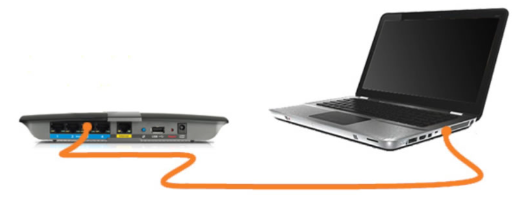
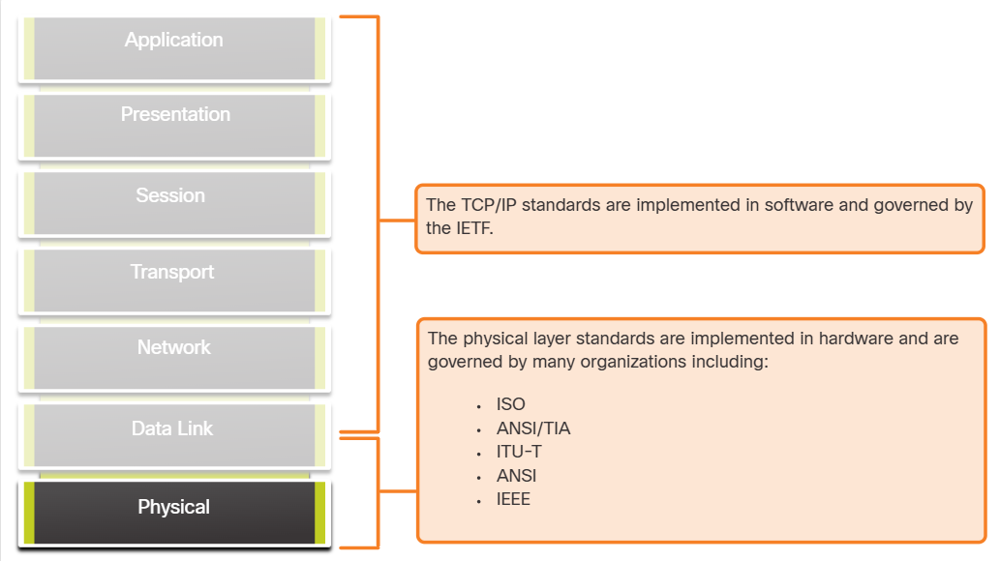
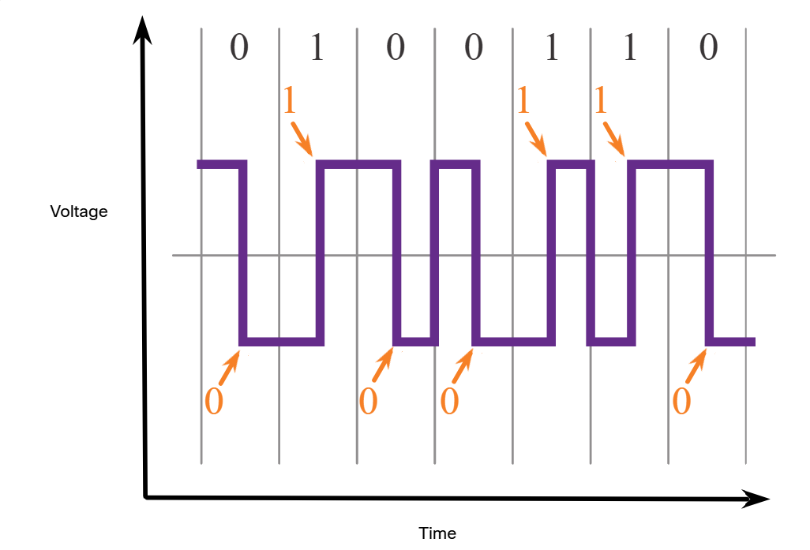
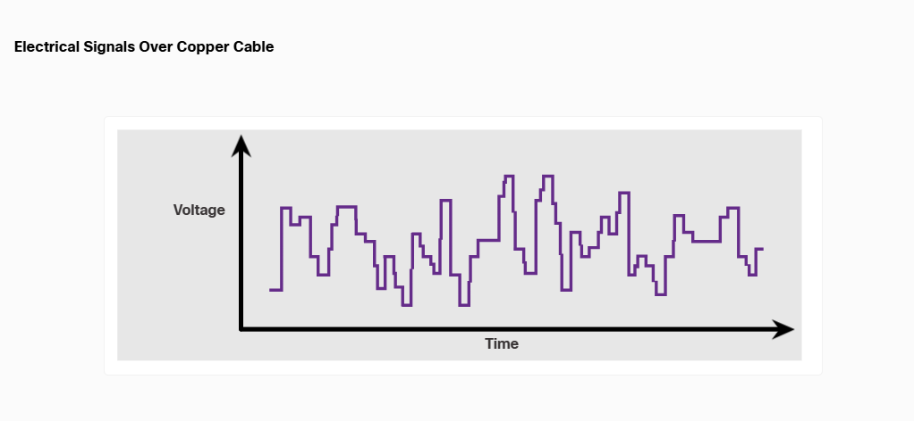
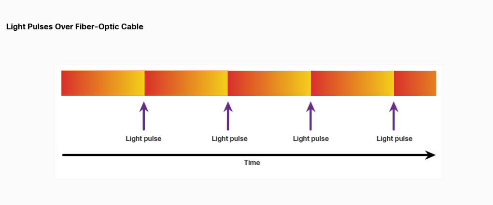
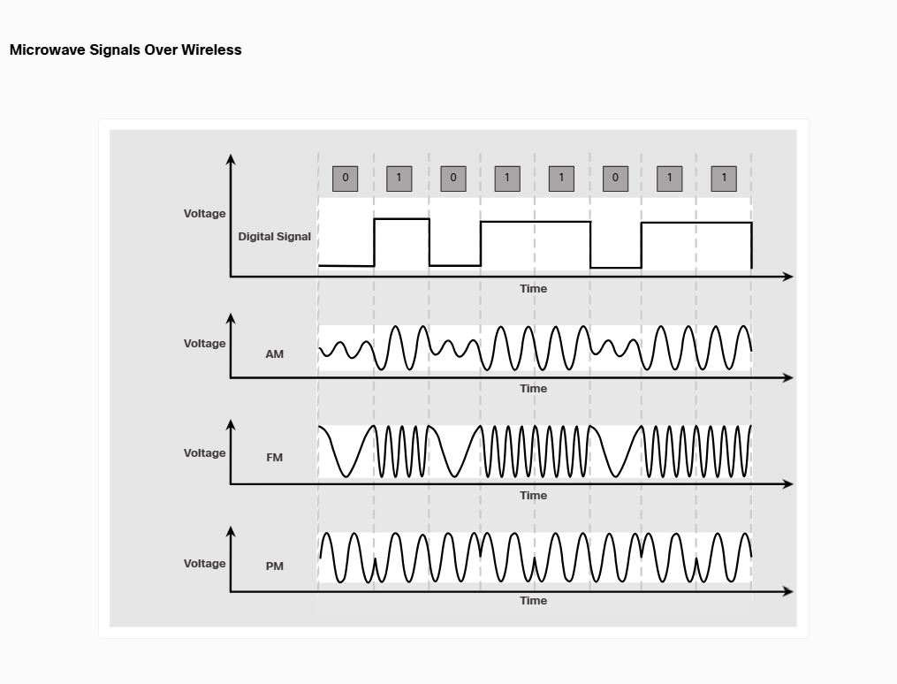
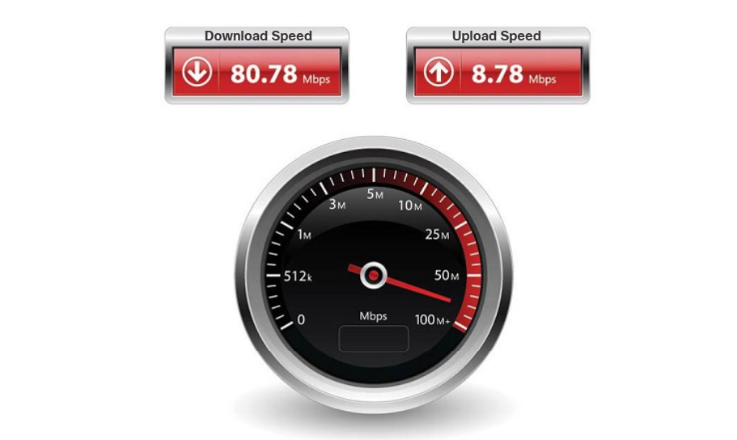
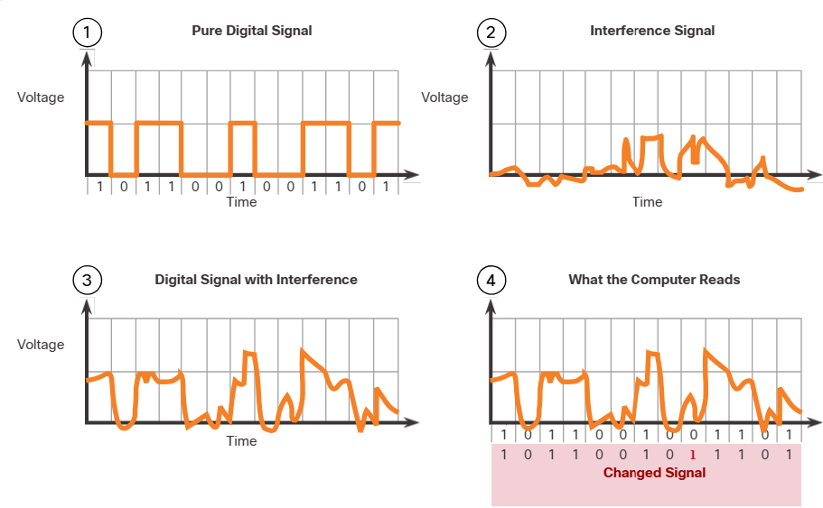
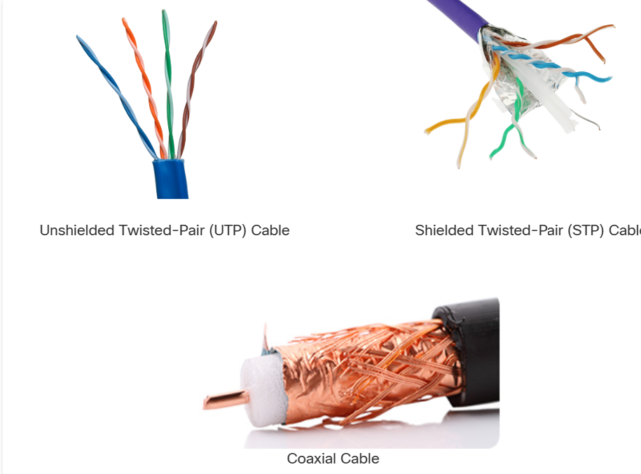
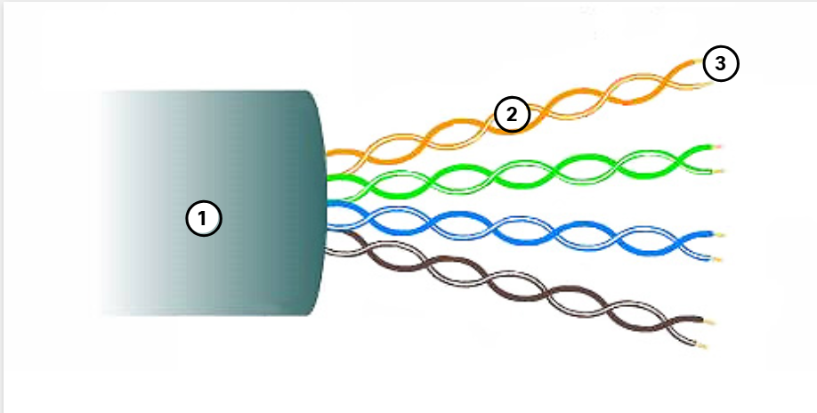

# Module 4: Physical Layer

# 4.1 Purpose of the Physical Layer

## 4.1.1 The Physical Connection

Whether connecting to a local printer in the home or a website in another country, before any network communications can occur, a physical connection to a local network must be established. A physical connection can be a wired connection using a cable or a wireless connection using radio waves.

The type of physical connection used depends upon the setup of the network. For example, in many corporate offices, employees have desktop or laptop computers that are physically connected, via cable, to a shared switch. This type of setup is a wired network. Data is transmitted through a physical cable.

In addition to wired connections, many businesses also offer wireless connections for laptops, tablets, and smartphones. With wireless devices, data is transmitted using radio waves. Wireless connectivity is common as individuals and businesses alike discover its advantages. Devices on a wireless network must be connected to a wireless access point (AP) or wireless router like the one shown in the figure.

### Wired Connection to Wireless Router

These are the components of an access point:
1. The wireless antennas (These are embedded inside the router version shown in the figure above.)
2. Several Ethernet switchports
3. An internet port

### Network Interface Cards

Network interface cards (NICs) connect a device to the network. Ethernet NICs are used for a wired connection, as shown in the figure, whereas wireless local area network (WLAN) NICs are used for wireless. An end-user device may include one or both types of NICs. A network printer, for example, may only have an Ethernet NIC, and therefore, must connect to the network using an Ethernet cable. Other devices, such as tablets and smartphones, might only contain a WLAN NIC and must use a wireless connection.

### Wired Connection Using an Ethernet NIC

Not all physical connections are equal, in terms of the performance level, when connecting to a network.

# 4.1.2 The Physical Layer 

The OSI physical layer provides the means to transport the bits that make up a data link layer frame across the network media. This layer accepts a complete frame from the data link layer and encodes it as a series of signals that are transmitted to the local media. The encoded bits that comprise a frame are received by either an end device or an intermediate device.

Click Play in the figure to see an example of the encapsulation process. The last part of this process shows the bits being sent over the physical medium. The physical layer encodes the frames and creates the electrical, optical, or radio wave signals that represent the bits in each frame. These signals are then sent over the media, one at a time.

The destination node physical layer retrieves these individual signals from the media, restores them to their bit representations, and passes the bits up to the data link layer as a complete frame.

# 4.2 Physical Layer Characteristics 

## 4.2.1 Physical Layer Standards

In the previous topic, you gained a high level overview of the physical layer and its place in a network. This topic dives a bit deeper into the specifics of the physical layer. This includes the components and the media used to build a network, as well as the standards that are required so that everything works together.

The protocols and operations of the upper OSI layers are performed using software designed by software engineers and computer scientists. The services and protocols in the TCP/IP suite are defined by the Internet Engineering Task Force (IETF).

The physical layer consists of electronic circuitry, media, and connectors developed by engineers. Therefore, it is appropriate that the standards governing this hardware are defined by the relevant electrical and communications engineering organizations.

There are many different international and national organizations, regulatory government organizations, and private companies involved in establishing and maintaining physical layer standards. For instance, the physical layer hardware, media, encoding, and signaling standards are defined and governed by these standards organizations:

- International Organization for Standardization (ISO)
- Telecommunications Industry Association/Electronic Industries Association (TIA/EIA)
- International Telecommunication Union (ITU)
- American National Standards Institute (ANSI)
- Institute of Electrical and Electronics Engineers (IEEE)
- National telecommunications regulatory authorities including the Federal Communication Commission (FCC) in the USA and the
European Telecommunications Standards Institute (ETSI)

In addition to these, there are often regional cabling standards groups such as CSA (Canadian Standards Association), CENELEC (European Committee for Electrotechnical Standardization), and JSA/JIS (Japanese Standards Association), which develop local specifications.

## 4.2.2 Physical Components

The physical layer standards address three functional areas:
- Physical Components
- Encoding
- Signaling

### Physical Components

The physical components are the electronic hardware devices, media, and other connectors that transmit the signals that represent the bits. Hardware components such as NICs, interfaces and connectors, cable materials, and cable designs are all specified in standards associated with the physical layer. The various ports and interfaces on a Cisco 1941 router are also examples of physical components with specific connectors and pinouts resulting from standards.

## 4.2.3 Encoding

Encoding or line encoding is a method of converting a stream of data bits into a predefined "code". Codes are groupings of bits used to provide a predictable pattern that can be recognized by both the sender and the receiver. In other words, encoding is the method or pattern used to represent digital information. This is similar to how Morse code encodes a message using a series of dots and dashes.

For example, Manchester encoding represents a 0 bit by a high to low voltage transition, and a 1 bit is represented as a low to high voltage transition. An example of Manchester encoding is illustrated in the figure. The transition occurs at the middle of each bit period. This type of encoding is used in 10 Mbps Ethernet. Faster data rates require more complex encoding. Manchester encoding is used in older Ethernet standards such as 10BASE-T. Ethernet 100BASE-TX uses 4B/5B encoding and 1000BASE-T uses 8B/10B encoding.

The transition occurs a the middle of each bit period.

## 4.2.4 Signaling

The physical layer must generate the electrical, optical, or wireless signals that represent the "1" and "0" on the media. The way that bits are represented is called the signaling method. The physical layer standards must define what type of signal represents a "1" and what type of signal represents a "0". This can be as simple as a change in the level of an electrical signal or optical pulse. For example, a long pulse might represent a 1 whereas a short pulse might represent a 0.

This is similar to the signaling method used in Morse code, which may use a series of on-off tones, lights, or clicks to send text over telephone wires or between ships at sea.

The figures display signaling.

## 4.2.5 Bandwidth

Different physical media support the transfer of bits at different rates. Data transfer is usually discussed in terms of bandwidth. Bandwidth is the capacity at which a medium can carry data. Digital bandwidth measures the amount of data that can flow from one place to another in a given amount of time. Bandwidth is typically measured in kilobits per second (kbps), megabits per second (Mbps), or gigabits per second (Gbps). Bandwidth is sometimes thought of as the speed that bits travel, however this is not accurate. For example, in both 10Mbps and 100Mbps Ethernet, the bits are sent at the speed of electricity. The difference is the number of bits that are transmitted per second.

A combination of factors determines the practical bandwidth of a network:
- The properties of the physical media
- The technologies chosen for signaling and detecting network signals

Physical media properties, current technologies, and the laws of physics all play a role in determining the available bandwidth.

The table shows the commonly used units of measure for bandwidth.

| Unit of Bandwidth | Abbreviation | Equivalence |
|---|---|---|
| Bits per second | bps | 1 bps = fundamental unit of bandwidth |
| Kilobits per second | Kbps | 1 Kbps = 1,000 bps = 10³ bps |
| Megabits per second | Mbps | 1 Mbps = 1,000,000 bps = 10⁶ bps |
| Gigabits per second | Gbps | 1 Gbps = 1,000,000,000 bps = 10⁹ bps |
| Terabits per second | Tbps | 1 Tbps = 1,000,000,000,000 bps = 10¹² bps |

## 4.2.6 Bandwidth Terminology

Terms used to measure the quality of bandwidth include:
- Latency
- Throughput
- Goodput

### Latency

Latency refers to the amount of time, including delays, for data to travel from one given point to another.

In an internetwork, or a network with multiple segments, throughput cannot be faster than the slowest link in the path from source to destination. Even if all, or most, of the segments have high bandwidth, it will only take one segment in the path with low throughput to create a bottleneck in the throughput of the entire network.

### Throughput

Throughput is the measure of the transfer of bits across the media over a given period of time.

Due to a number of factors, throughput usually does not match the specified bandwidth in physical layer implementations. Throughput is usually lower than the bandwidth. There are many factors that influence throughput:
- The amount of traffic
- The type of traffic
- The latency created by the number of network devices encountered between source and destination

There are many online speed tests that can reveal the throughput of an internet connection. The figure provides sample results from a speed test.

### Goodput

There is a third measurement to assess the transfer of usable data; it is known as goodput. Goodput is the measure of usable data transferred over a given period of time. Goodput is throughput minus traffic overhead for establishing sessions, acknowledgments, encapsulation, and retransmitted bits. Goodput is always lower than throughput, which is generally lower than the bandwidth.

# 4.3 Copper cabling

# 4.3.1 Characteristics of Copper Cabling

Copper cabling is the most common type of cabling used in networks today. In fact, copper cabling is not just one type of cable. There are three different types of copper cabling that are each used in specific situations.

Networks use copper media because it is inexpensive, easy to install, and has low resistance to electrical current. However, copper media is limited by distance and signal interference.

Data is transmitted on copper cables as electrical pulses. A detector in the network interface of a destination device must receive a signal that can be successfully decoded to match the signal sent. However, the farther the signal travels, the more it deteriorates. This is referred to as signal attenuation. For this reason, all copper media must follow strict distance limitations as specified by the guiding standards.

The timing and voltage values of the electrical pulses are also susceptible to interference from two sources:

-   **Electromagnetic interference (EMI) or radio frequency interference (RFI)** - EMI and RFI signals can distort and corrupt the data signals being carried by copper media. Potential sources of EMI and RFI include radio waves and electromagnetic devices, such as fluorescent lights or electric motors.
-   **Crosstalk** - Crosstalk is a disturbance caused by the electric or magnetic fields of a signal on one wire to the signal in an adjacent wire. In telephone circuits, crosstalk can result in hearing part of another voice conversation from an adjacent circuit. Specifically, when an electrical current flows through a wire, it creates a small, circular magnetic field around the wire, which can be picked up by an adjacent wire.

The figure shows how data transmission can be affected by interference.

1. A pure digital signal is transmitted.
2. On the medium, there is an interference signal.
3. The digital signal is corrupted by the interference signal.
4. The receiving computer reads a changed signal. Notice that a 0 bit is now interpreted as a 1 bit.

To counter the negative effects of EMI and RFI, some types of copper cables are wrapped in metallic shielding and require proper grounding connections.

To counter the negative effects of crosstalk, some types of copper cables have opposing circuit wire pairs twisted together, which effectively cancels the crosstalk.

The susceptibility of copper cables to electronic noise can also be limited using these recommendations:
- Selecting the cable type or category most suited to a given networking environment
- Designing a cable infrastructure to avoid known and potential sources of interference in the building structure
- Using cabling techniques that include the proper handling and termination of the cables

## 4.3.2 Types of Copper Cabling

There are three main types of coppermedia used in networking. 

## 4.3.3 Unshielded twisted-pair (UTP)
Unshielded twisted-pair (UTP) cabling is the most common networking media. UTP cabling, terminated with RJ-45 connectors, is used for interconnecting network hosts with intermediary networking devices, such as switches and routers.

In LANs, UTP cable consists of four pairs of color-coded wires that have been twisted together and then encased in a flexible plastic sheath that protects from minor physical damage. The twisting of wires helps protect against signal interference from other wires.

As seen in the figure, the color codes identify the individual pairs and wires and aid in cable termination.

The numbers in the figure identify some key characteristics of unshielded twisted-pair cable:
1. The outer jacket protects the copper wires from physical damage.
2. Twisted-pairs protect the signal from interference.
3. Color-coded plastic insulation electrically isolates wires from each other and identifies each pair.
