# Module 6: Data Link Layer 

# 6.1 Purpose of the Data Link Layer

## 5.1.1 The Data Link Layer 

The data link layer of the OSI model (Layer 2), as shown in the figure, prepares network data for the physical network. The data link layer is responsible for network interface card (NIC) to network interface card communications. The data link layer does the following:

- Enables upper layers to access the media. The upper layer protocol is completely unaware of the type of media that is used to forward the data.
- Accepts data, usually Layer 3 packets (i.e., IPv4 or IPv6), and encapsulates them into Layer 2 frames.
- Controls how data is placed and received on the media.
- Exchanges frames between endpoints over the network media.
- Receives encapsulated data, usually Layer 3 packets, and directs them to the proper upper-layer protocol.
- Performs error detection and rejects any corrupt frame.

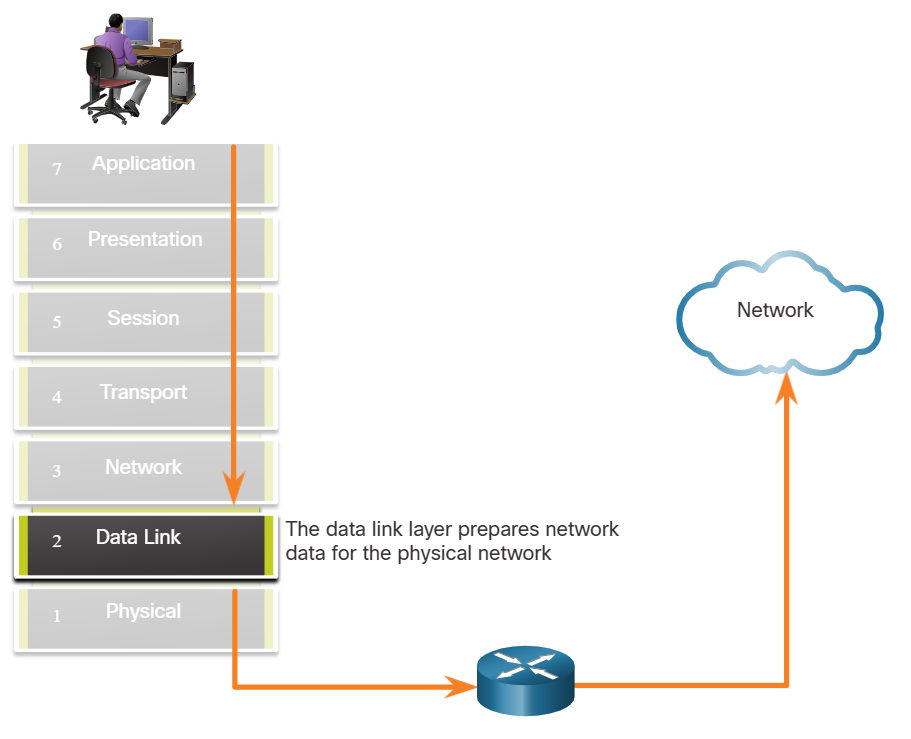

In computer networks, a node is a device that can receive, create, store, or forward data along a communications path. A node can be either an end device such as a laptop or mobile phone, or an intermediary device such as an Ethernet switch.

Without the data link layer, network layer protocols such as IP, would have to make provisions for connecting to every type of media that could exist along a delivery path. Additionally, every time a new network technology or medium was developed IP, would have to adapt.

The figure displays an example of how the data link layer adds Layer 2 Ethernet destination and source NIC information to a Layer 3 packet. It would then convert this information to a format supported by the physical layer (i.e., Layer 1).

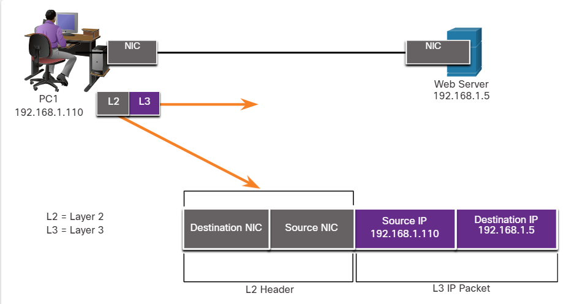

## 6.1.2 IEEE 802 LAN/MAN Data Link Sublayers

IEEE 802 LAN/MAN standards are specific to Ethernet LANs, wireless LANs (WLAN), wireless personal area networks (WPAN) and other types of local and metropolitan area networks. The IEEE 802 LAN/MAN data link layer consists of the following two sublayers:
- **Logical Link Control (LLC)** - This IEEE 802.2 sublayer communicates between the networking software at the upper layers and the device hardware at the lower layers. It places information in the frame that identifies which network layer protocol is being used for the frame. This information allows multiple Layer 3 protocols, such as IPv4 and IPv6, to use the same network interface and media.
- **Media Access Control (MAC)** - Implements this sublayer (IEEE 802.3, 802.11, or 802.15) in hardware. It is responsible for data encapsulation and media access control. It provides data link layer addressing and it is integrated with various physical layer technologies.

The figure shows the two sublayers (LLC and MAC) of the data link layer.

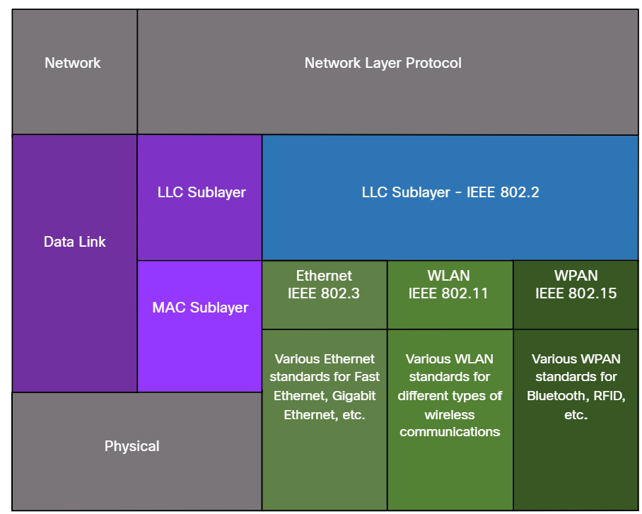

The LLC sublayer takes the network protocol data, which is typically an IPv4 or IPv6 packet, and adds Layer 2 control information to help deliver the packet to the destination node.

The MAC sublayer controls the NIC and other hardware that is responsible for sending and receiving data on the wired or wireless LAN/MAN medium.

The MAC sublayer provides data encapsulation:
- **Frame delimiting** - The framing process provides important delimiters to identify fields within a frame. These delimiting bits provide synchronization between the transmitting and receiving nodes.
- **Addressing** - Provides source and destination addressing for transporting the Layer 2 frame between devices on the same shared medium.
- **Error detection** - Includes a trailer used to detect transmission errors.
The MAC sublayer also provides media access control, allowing multiple devices to communicate over a shared (half-duplex) medium. Full-duplex communications do not require access control.

## 6.1.3 Providing Access to Media

Each network environment that packets encounter as they travel from a local host to a remote host can have different characteristics. For example, an Ethernet LAN usually consists of many hosts contending for access on the network medium. The MAC sublayer resolves this. With serial links the access method may only consist of a direct connection between only two devices, usually two routers. Therefore, they do not require the techniques employed by the IEEE 802 MAC sublayer.

Router interfaces encapsulate the packet into the appropriate frame. A suitable media access control method is used to access each link. In any given exchange of network layer packets, there may be numerous data link layers and media transitions.

At each hop along the path, a router performs the following Layer 2 functions:
1. Accepts a frame from a medium
2. De-encapsulates the frame
3. Re-encapsulates the packet into a new frame
4. Forwards the new frame appropriate to the medium of that segment of the physical network

Press play to view the animation. The router in the figure has an Ethernet interface to connect to the LAN and a serial interface to connect to the WAN. As the router processes frames, it will use data link layer services to receive the frame from one medium, de-encapsulate it to the Layer 3 PDU, re-encapsulate the PDU into a new frame, and place the frame on the medium of the next link of the network.

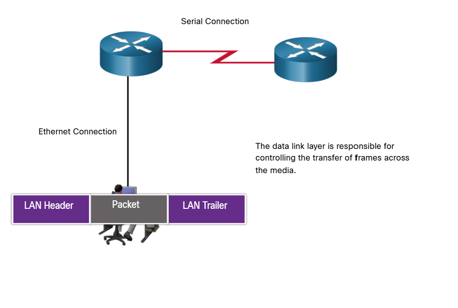
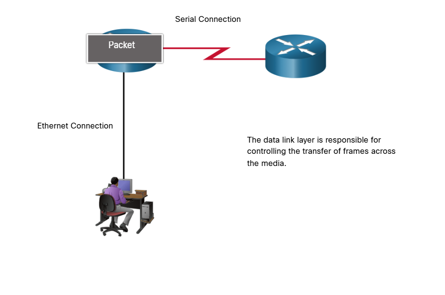
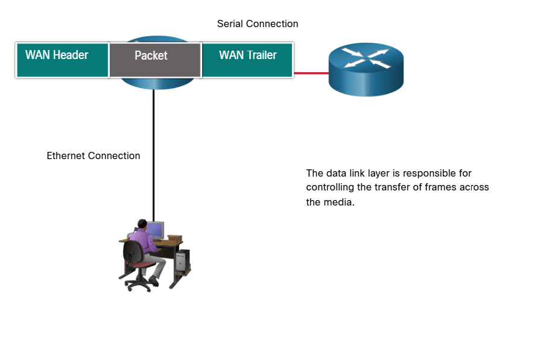
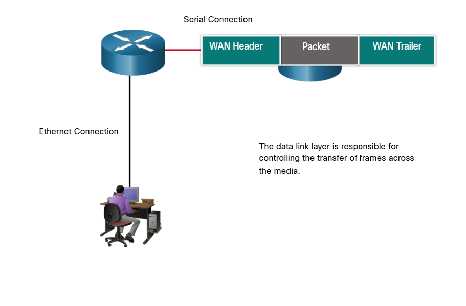

## 6.1.4 Data Link Layer Standards

Data link layer protocols are generally not defined by Request for Comments (RFCs), unlike the protocols of the upper layers of the TCP/IP suite. The Internet Engineering Task Force (IETF) maintains the functional protocols and services for the TCP/IP protocol suite in the upper layers, but they do not define the functions and operation of the TCP/IP network access layer.

Engineering organizations that define open standards and protocols that apply to the network access layer (i.e., the OSI physical and data link layers) include the following:

- Institute of Electrical and Electronics Engineers (IEEE)
- International Telecommunication Union (ITU)
- International Organization for Standardization (ISO)
- American National Standards Institute (ANSI)

The logos for these organizations are shown in the figure.

### Engineering Organization Logos

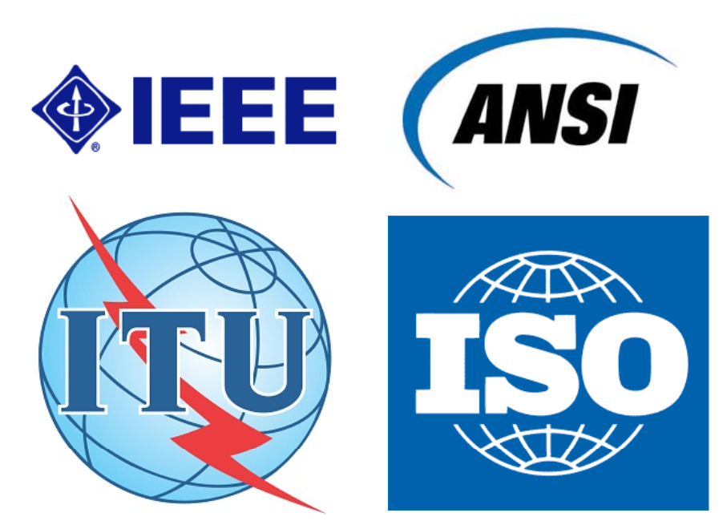

# 6.2 Topologies 

## 6.2.1 Physical and Logical Topologies 

As you learned in the previous topic, the data link layer prepares network data for the physical network. It must know the logical topology of a network in order to be able to determine what is needed to transfer frames from one device to another. This topic explains the ways in which the data link layer works with different logical network topologies.

The topology of a network is the arrangement, or the relationship, of the network devices and the interconnections between them.

There are two types of topologies used when describing LAN and WAN networks:
- **Physical topology** - Identifies the physical connections and how end devices and intermediary devices (i.e, routers, switches, and
wireless access points) are interconnected. The topology may also include specific device location such as room number and
location on the equipment rack. Physical topologies are usually point-to-point or star.
- **Logical topology** - Refers to the way a network transfers frames from one node to the next. This topology identifies virtual connections using device interfaces and Layer 3 IP addressing schemes.

The data link layer "sees" the logical topology of a network when controlling data access to the media. It is the logical topology that influences the type of network framing and media access control used.

The figure displays a sample physical topology for a small sample network.

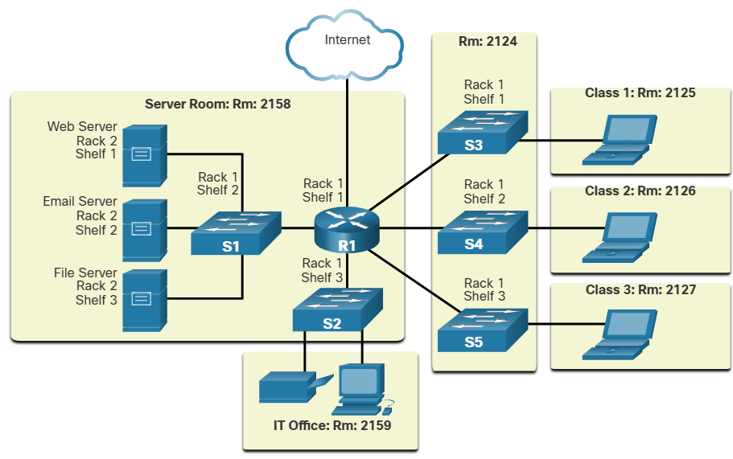

The next figure displays a sample logical topology for the same network.

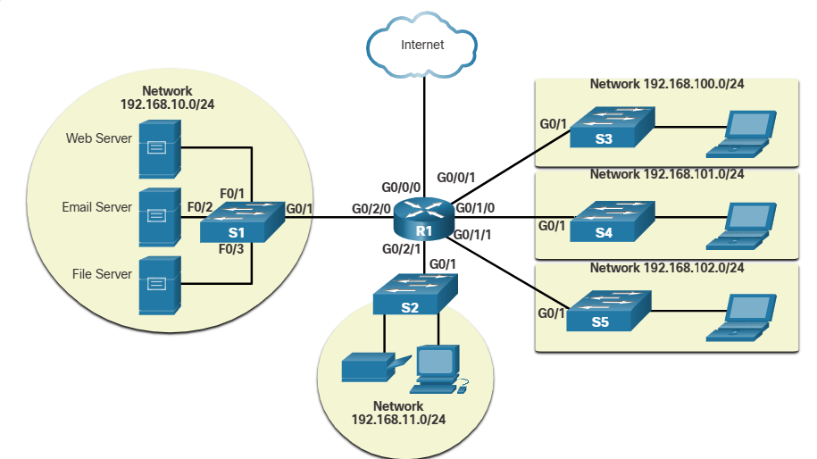

## 6.2.2 WAN Topologies 

The figures illustrate how WANs are commonly interconnected using three common physical WAN topologies.

### Point-to-Point
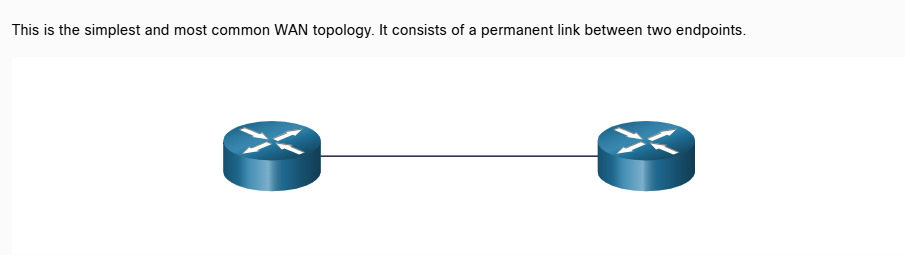

### Hub and Spoke
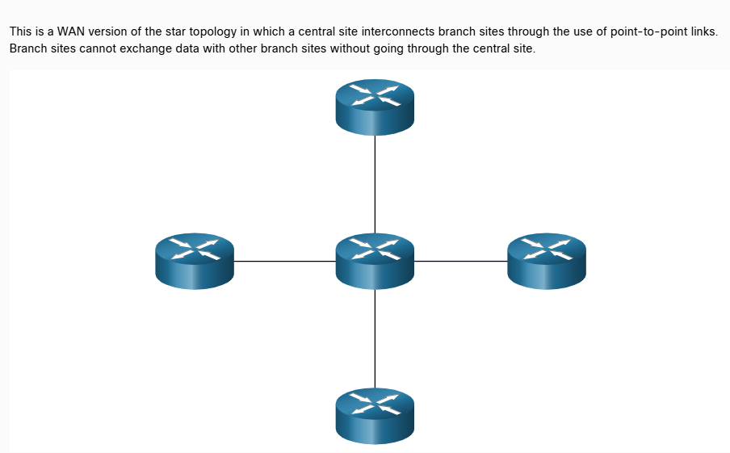

### Mesh
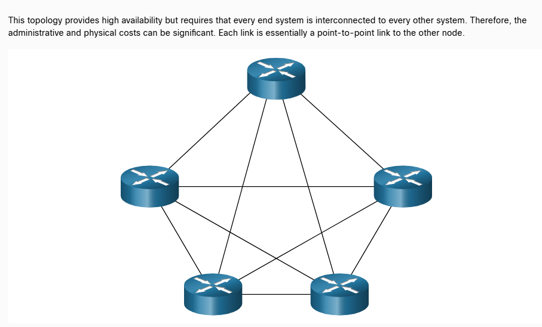

A hybrid is a variation or combination of any topologies. For example, a partial mesh is a hybrid topology in which some, but not all, end devices are interconnected.

## 6.2.3 Point-to-Point WAN Topology 

Physical point-to-point topologies directly connect two nodes, as shown in the figure. In this arrangement, two nodes do not have to share the media with other hosts. Additionally, when using a serial communications protocol such as Point-to-Point Protocol (PPP), a node does not have to make any determination about whether an incoming frame is destined for it or another node. Therefore, the logical data link protocols can be very simple, as all frames on the media can only travel to or from the two nodes. The node places the frames on the media at one end and those frames are taken from the media by the node at the other end of the point-to-point circuit.

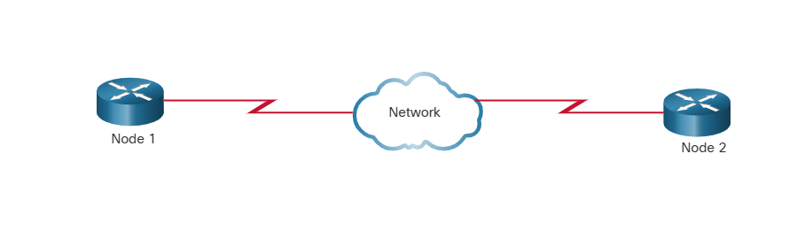

Point-to-point topologies are limited to two nodes. 

Note: A point-to-point connection over Ethernet requires the device to determine if the incoming frame is destined for this node.

A source and destination node may be indirectly connected to each other over some geographical distance using multiple intermediary devices. However, the use of physical devices in the network does not affect the logical topology, as illustrated in the figure. In the figure, adding intermediary physical connections may not change the logical topology. The logical point-to-point connection is the same.

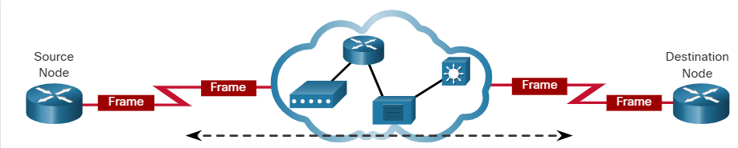

## 6.2.4 LAN Topologies

In multiaccess LANs, end devices (i.e., nodes) are interconnected using star or extended star topologies, as shown in the figure. In this type of topology, end devices are connected to a central intermediary device, in this case, an Ethernet switch. An extended star extends this topology by interconnecting multiple Ethernet switches. The star and extended topologies are easy to install, very scalable (easy to add and remove end devices), and easy to troubleshoot. Early star topologies interconnected end devices using Ethernet hubs.

At times there may be only two devices connected on the Ethernet LAN. An example is two interconnected routers. This would be an example of Ethernet used on a point-to-point topology.

### Legacy LAN Topologies

Early Ethernet and legacy Token Ring LAN technologies included two other types of topologies:
- Bus - All end systems are chained to each other and terminated in some form on each end. Infrastructure devices such as switches are not required to interconnect the end devices. Legacy Ethernet networks were often bus topologies using coax cables because it was inexpensive and easy to set up.
- Ring - End systems are connected to their respective neighbor forming a ring. The ring does not need to be terminated, unlike in the bus topology. Legacy Fiber Distributed Data Interface (FDDI) and Token Ring networks used ring topologies.

The figures illustrate how end devices are interconnected on LANs. It is common for a straight line in networking graphics to represent an Ethernet LAN including a simple star and an extended star.

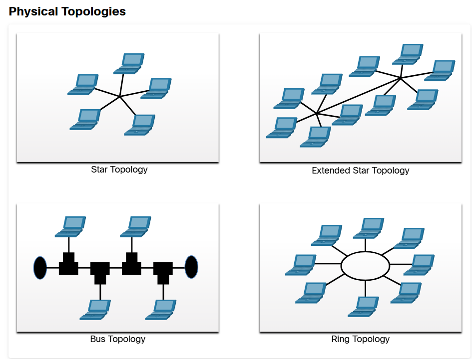

## 6.2.5 Half and Full Duplex Communication

Understanding duplex communication is important when discussing LAN topologies because it refers to the direction of data transmission between two devices. There are two common modes of duplex.

### Half-duplex communication

Both devices can transmit and receive on the media but cannot do so simultaneously. WLANs and legacy bus topologies with Ethernet hubs use the half-duplex mode. Half-duplex allows only one device to send or receive at a time on the shared medium. Click play in the figure to see the animation showing half-duplex communication.

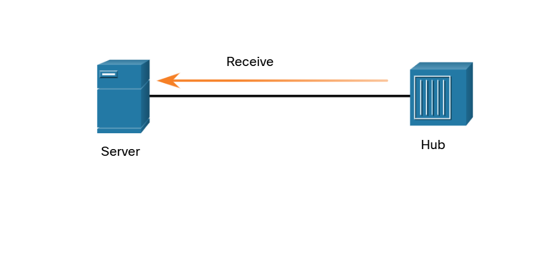
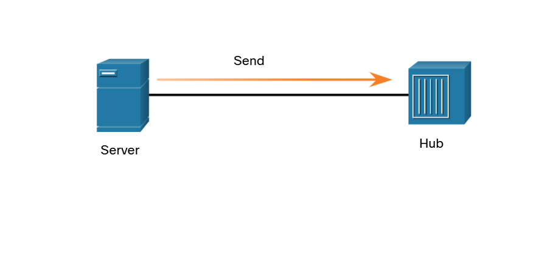
