# Module 8: Network Layer

# 8.1 Network Layer Characteristics

## 8.1.1 The Network Layer Characteristics

The network layer, or OSI Layer 3, provides services to allow end devices to exchange data across networks. As shown in the figure, IP version 4 (IPv4) and IP version 6 (IPv6) are the principle network layer communication protocols. Other network layer protocols include routing protocols such as Open Shortest Path First (OSPF) and messaging protocols such as Internet Control Message Protocol (ICMP).

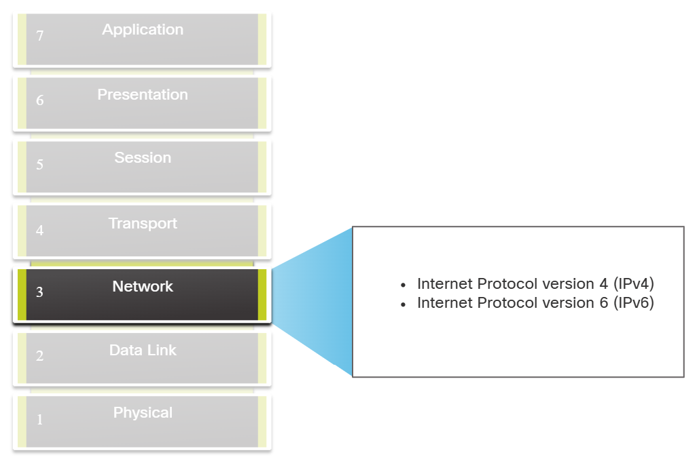

To accomplish end-to-end communications across network boundaries, network layer protocols perform four basic operations:
- **Addressing end devices** - End devices must be configured with a unique IP address for identification on the network.
- **Encapsulation** - The network layer encapsulates the protocol data unit (PDU) from the transport layer into a packet. The encapsulation process adds IP header information, such as the IP address of the source (sending) and destination (receiving) hosts. The encapsulation process is performed by the source of the IP packet.
- **Routing** - The network layer provides services to direct the packets to a destination host on another network. To travel to other networks, the packet must be processed by a router. The role of the router is to select the best path and direct packets toward the destination host in a process known as routing. A packet may cross many routers before reaching the destination host. Each router a packet crosses to reach the destination host is called a hop.
- **De-encapsulation** - When the packet arrives at the network layer of the destination host, the host checks the IP header of the packet. If the destination IP address within the header matches its own IP address, the IP header is removed from the packet. After the packet is de-encapsulated by the network layer, the resulting Layer 4 PDU is passed up to the appropriate service at the transport layer. The de-encapsulation process is performed by the destination host of the IP packet.

Unlike the transport layer (OSI Layer 4), which manages the data transport between the processes running on each host, network layer communication protocols (i.e., IPv4 and IPv6) specify the packet structure and processing used to carry the data from one host to another host. Operating without regard to the data carried in each packet allows the network layer to carry packets for multiple types of communications between multiple hosts.

Click Play in the figure to view an animation that demonstrates the exchange of data.

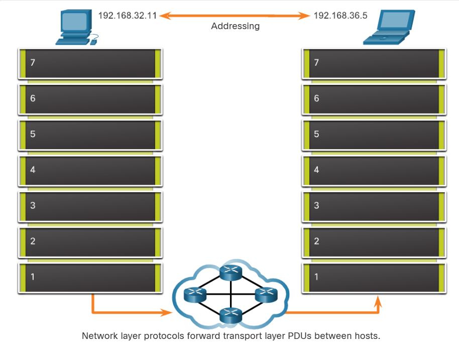
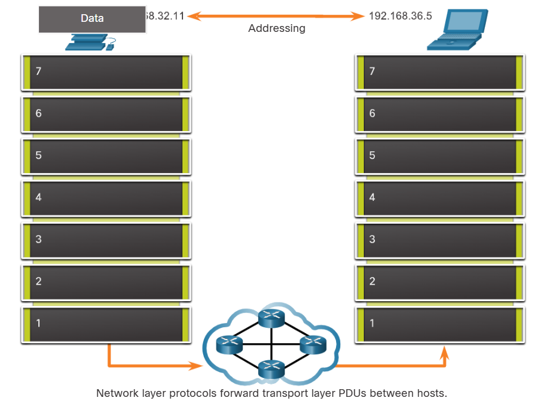
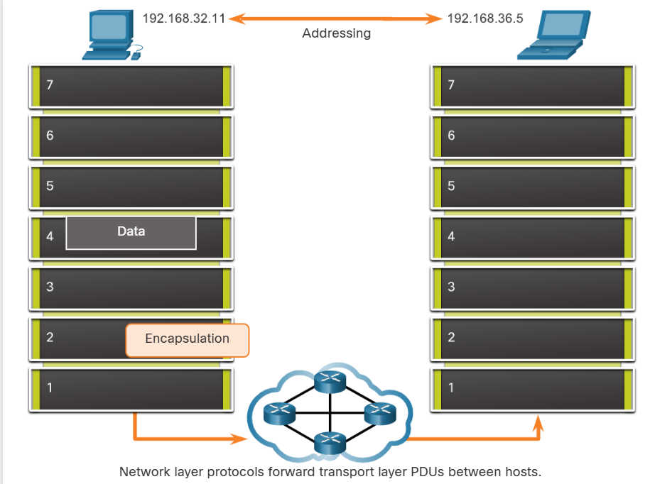
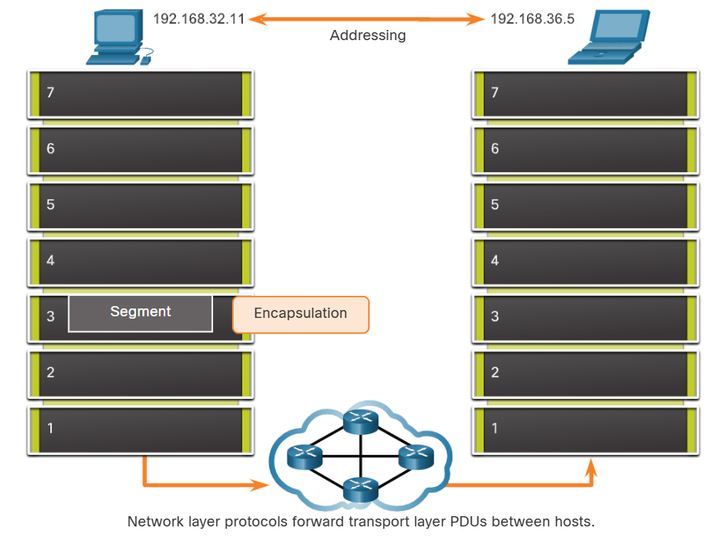
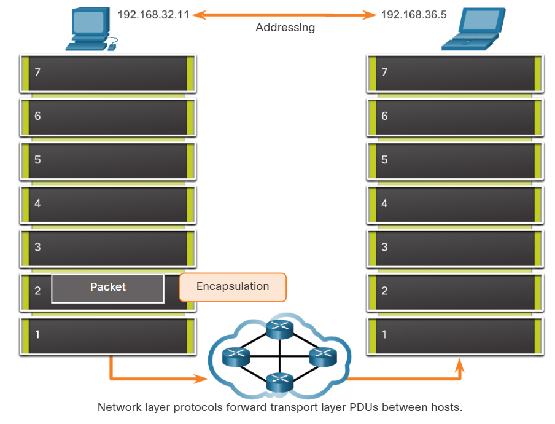
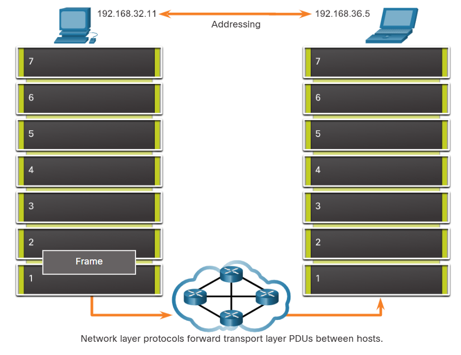
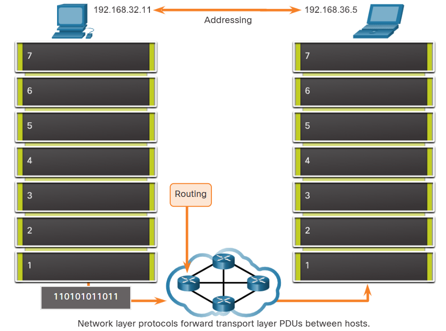
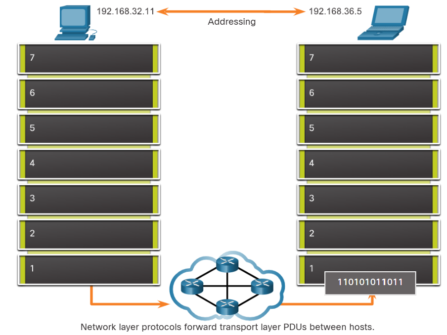
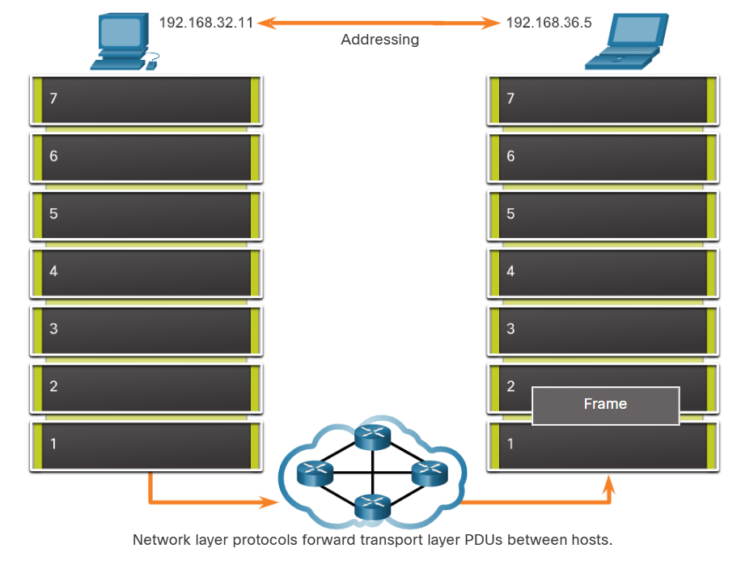
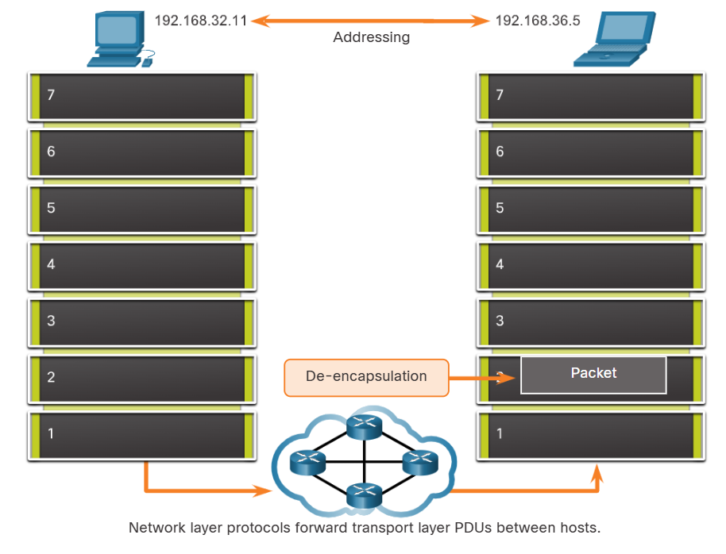
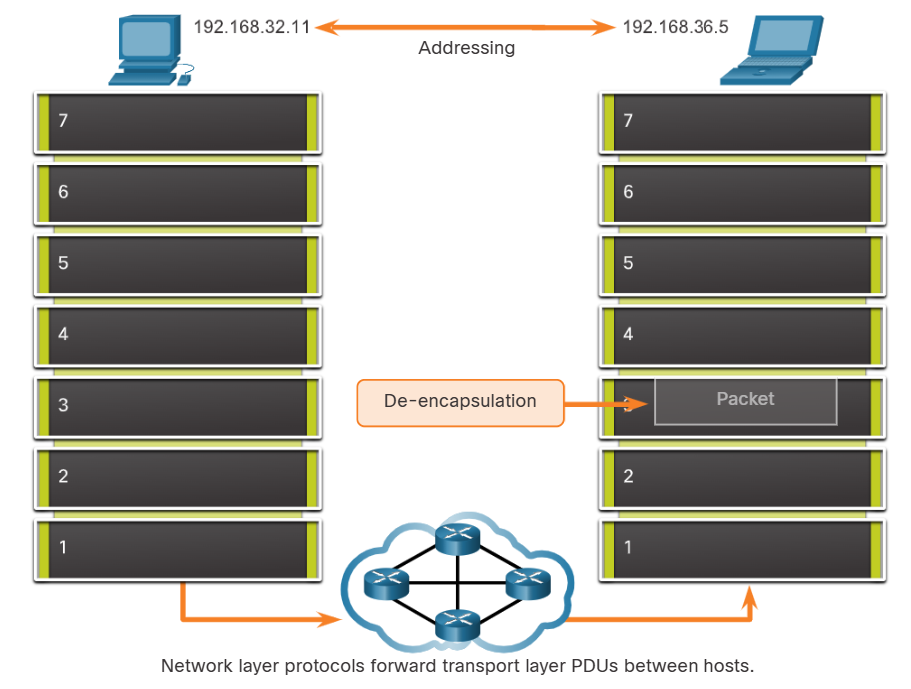
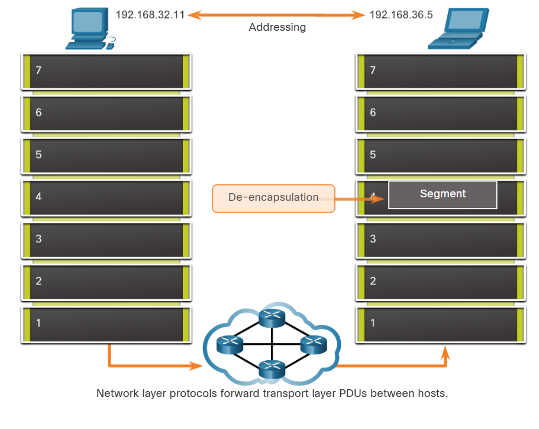
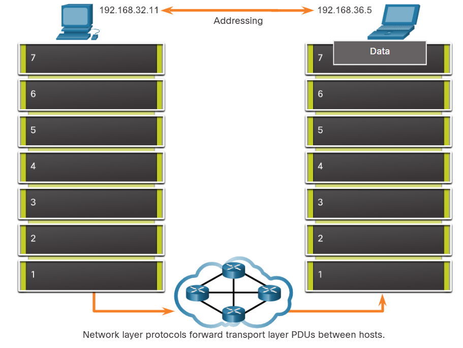

## 8.1.2 IP Encapsulation

IP encapsulates the transport layer (the layer just above the network layer) segment or other data by adding an IP header. The IP header is used to deliver the packet to the destination host.

The figure illustrates how the transport layer PDU is encapsulated by the network layer PDU to create an IP packet.

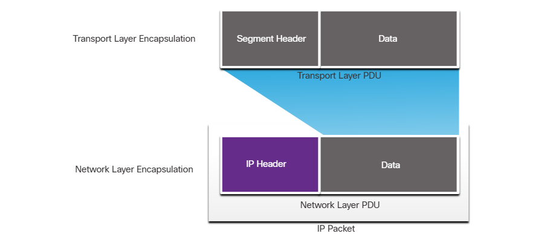

The process of encapsulating data layer by layer enables the services at the different layers to develop and scale without affecting the other layers. This means the transport layer segments can be readily packaged by IPv4 or IPv6 or by any new protocol that might be developed in the future.

The IP header is examined by Layer 3 devices (i.e., routers and Layer 3 switches) as it travels across a network to its destination. It is important to note, that the IP addressing information remains the same from the time the packet leaves the source host until it arrives at the destination host, except when translated by the device performing Network Address Translation (NAT) for IPv4.

**Note:** NAT is discussed in later modules.

Routers implement routing protocols to route packets between networks. The routing performed by these intermediary devices examines the network layer addressing in the packet header. In all cases, the data portion of the packet, that is, the encapsulated transport layer PDU or other data, remains unchanged during the network layer processes.

## 8.1.3 Characteristics of IP

IP was designed as a protocol with low overhead. It provides only the functions that are necessary to deliver a packet from a source to a destination over an interconnected system of networks. The protocol was not designed to track and manage the flow of packets. These functions, if required, are performed by other protocols at other layers, primarily TCP at Layer 4.

These are the basic characteristics of IP:
- Connectionless - There is no connection with the destination established before sending data packets.
- Best Effort - IP is inherently unreliable because packet delivery is not guaranteed.
- Media Independent - Operation is independent of the medium (i.e., copper, fiber-optic, or wireless) carrying the data.

## 8.1.4 Connectionless

IP is connectionless, meaning that no dedicated end-to-end connection is created by IP before data is sent. Connectionless communication is conceptually similar to sending a letter to someone without notifying the recipient in advance. The figure summarizes this key point.

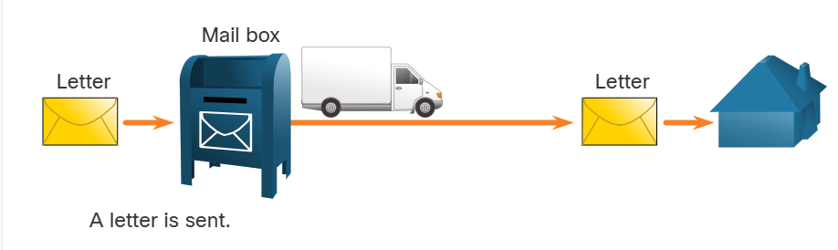

Connectionless data communications work on the same principle. As shown in the figure, IP requires no initial exchange of control information to establish an end-to-end connection before packets are forwarded.

## 8.1.5 Best Effort

IP also does not require additional fields in the header to maintain an established connection. This process greatly reduces the overhead of IP. However, with no pre-established end-to-end connection, senders are unaware whether destination devices are present and functional when sending packets, nor are they aware if the destination receives the packet, or if the destination device is able to access and read the packet.

The IP protocol does not guarantee that all packets that are delivered are, in fact, received. The figure illustrates the unreliable or best- effort delivery characteristic of the IP protocol.

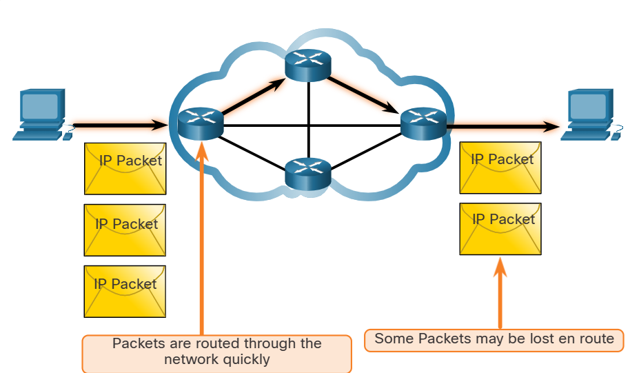

As an unreliable network layer protocol, IP does not guarantee that all sent packets will be received. Other protocols manage the process of tracking packets and ensuring their delivery.

## 8.1.6 Media Independent

Unreliable means that IP does not have the capability to manage and recover from undelivered or corrupt packets. This is because while IP packets are sent with information about the location of delivery, they do not contain information that can be processed to inform the sender whether delivery was successful. Packets may arrive at the destination corrupted, out of sequence, or not at all. IP provides no capability for packet retransmissions if errors occur.

If out-of-order packets are delivered, or packets are missing, then applications using the data, or upper layer services, must resolve these issues. This allows IP to function very efficiently. In the TCP/IP protocol suite, reliability is the role of the TCP protocol at the transport layer.

IP operates independently of the media that carry the data at lower layers of the protocol stack. As shown in the figure, IP packets can be communicated as electronic signals over copper cable, as optical signals over fiber, or wirelessly as radio signals.

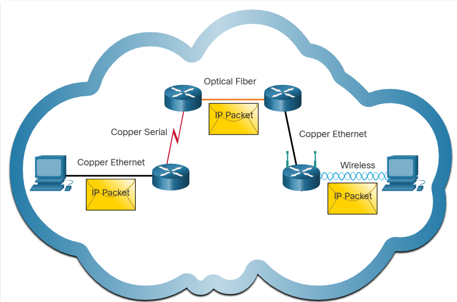

IP packets can travel over different media.

The OSI data link layer is responsible for taking an IP packet and preparing it for transmission over the communications medium. This means that the delivery of IP packets is not limited to any particular medium.

There is, however, one major characteristic of the media that the network layer considers: the maximum size of the PDU that each medium can transport. This characteristic is referred to as the maximum transmission unit (MTU). Part of the control communication between the data link layer and the network layer is the establishment of a maximum size for the packet. The data link layer passes the MTU value up to the network layer. The network layer then determines how large packets can be.

In some cases, an intermediate device, usually a router, must split up an IPv4 packet when forwarding it from one medium to another medium with a smaller MTU. This process is called fragmenting the packet, or fragmentation. Fragmentation causes latency. IPv6 packets cannot be fragmented by the router.

# 3.2 IPv4 Packet 

# 8.2.1 IPv4 Packet Header

IPv4 is one of the primary network layer communication protocols. The IPv4 packet header is used to ensure that this packet is delivered to its next stop on the way to its destination end device.

An IPv4 packet header consists of fields containing important information about the packet. These fields contain binary numbers which are examined by the Layer 3 process.

# 8.2.2 IPv4 Packet Header Fields

The binary values of each field identify various settings of the IP packet. Protocol header diagrams, which are read left to right, and top down, provide a visual to refer to when discussing protocol fields. The IP protocol header diagram in the figure identifies the fields of an IPv4 packet.

### Fields in the IPv4 Packet Header

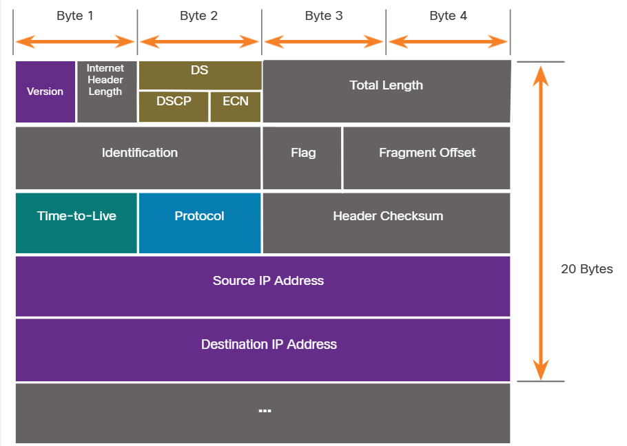

Significant fields in the IPv4 header include the following:
- **Version** - Contains a 4-bit binary value set to 0100 that identifies this as an IPv4 packet.
- **Differentiated Services or DiffServ (DS)** - Formerly called the type of service (ToS) field, the DS field is an 8-bit field used to determine the priority of each packet. The six most significant bits of the DiffServ field are the differentiated services code point (DSCP) bits and the last two bits are the explicit congestion notification (ECN) bits.
- **Time to Live (TTL)** - TTL contains an 8-bit binary value that is used to limit the lifetime of a packet. The source device of the IPv4 packet sets the initial TTL value. It is decreased by one each time the packet is processed by a router. If the TTL field decrements to zero, the router discards the packet and sends an Internet Control Message Protocol (ICMP) Time Exceeded message to the source IP address. Because the router decrements the TTL of each packet, the router must also recalculate the Header Checksum.
- **Protocol** - This field is used to identify the next level protocol. This 8-bit binary value indicates the data payload type that the packet is carrying, which enables the network layer to pass the data to the appropriate upper-layer protocol. Common values include ICMP (1), TCP (6), and UDP (17).
- **Header Checksum** - This is used to detect corruption in the IPv4 header.
- **Source IPv4 Address** - This contains a 32-bit binary value that represents the source IPv4 address of the packet. The source IPv4 address is always a unicast address.
- **Destination IPv4 Address** - This contains a 32-bit binary value that represents the destination IPv4 address of the packet. The destination IPv4 address is a unicast, multicast, or broadcast address.

The two most commonly referenced fields are the source and destination IP addresses. These fields identify where the packet is coming from and where it is going. Typically, these addresses do not change while travelling from the source to the destination.

The Internet Header Length (IHL), Total Length, and Header Checksum fields are used to identify and validate the packet.

Other fields are used to reorder a fragmented packet. Specifically, the IPv4 packet uses Identification, Flags, and Fragment Offset fields to keep track of the fragments. A router may have to fragment an IPv4 packet when forwarding it from one medium to another with a smaller MTU.

The Options and Padding fields are rarely used and are beyond the scope of this module.

# 8.3 IPv6 Packet 

## 8.3.1 Limitations of IPv4

IPv4 is still in use today. This topic is about IPv6, which will eventually replace IPv4. To better understand why you need to know the IPv6 protocol, it helps to know the limitations of IPv4 and the advantages of IPv6.

Through the years, additional protocols and processes have been developed to address new challenges. However, even with changes, IPv4 still has three major issues:

-   **IPv4 address depletion** - IPv4 has a limited number of unique public addresses available. Although there are approximately 4 billion IPv4 addresses, the increasing number of new IP-enabled devices, always-on connections, and the potential growth of less- developed regions have increased the need for more addresses.
-   **Lack of end-to-end connectivity** - Network Address Translation (NAT) is a technology commonly implemented within IPv4 networks. NAT provides a way for multiple devices to share a single public IPv4 address. However, because the public IPv4 address is shared, the IPv4 address of an internal network host is hidden. This can be problematic for technologies that require end-to-end connectivity.
-   **Increased network complexity** - While NAT has extended the lifespan of IPv4 it was only meant as a transition mechanism to IPv6. NAT in its various implementation creates additional complexity in the network, creating latency and making troubleshooting more difficult.

## 8.3.2 IPv6 Overview

In the early 1990s, the Internet Engineering Task Force (IETF) grew concerned about the issues with IPv4 and began to look for a replacement. This activity led to the development of IP version 6 (IPv6). IPv6 overcomes the limitations of IPv4 and is a powerful enhancement with features that better suit current and foreseeable network demands.

Improvements that IPv6 provides include the following:
- Increased address space - IPv6 addresses are based on 128-bit hierarchical addressing as opposed to IPv4 with 32 bits. Improved packet handling - The IPv6 header has been simplified with fewer fields.
- Eliminates the need for NAT - With such a large number of public IPv6 addresses, NAT between a private IPv4 address and a public IPv4 is not needed. This avoids some of the NAT-induced problems experienced by applications that require end-to-end connectivity.

The 32-bit IPv4 address space provides approximately 4,294,967,296 unique addresses. IPv6 address space provides 340,282,366,920, 938,463,463,374,607,431,768,211,456, or 340 undecillion addresses. This is roughly equivalent to every grain of sand on Earth. 

The figure provides a visual to compare the IPv4 and IPv6 address space.

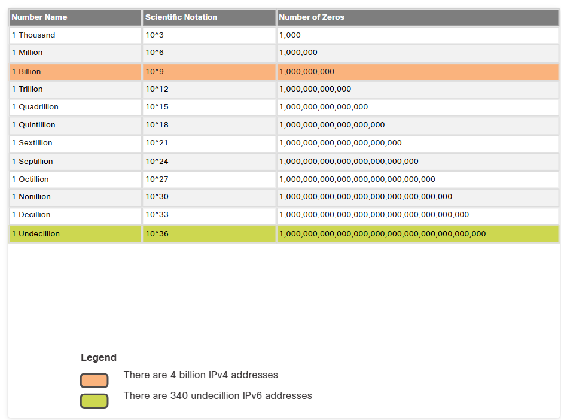

## 8.3.3 IPv4 Packet Header Fields in the IPv6 Packet Header

One of the major design improvements of IPv6 over IPv4 is the simplified IPv6 header.

For example, the IPv4 header consists of a variable length header of 20 octets (up to 60 bytes if the Options field is used) and 12 basic header fields, not including the Options field and Padding field.

For IPv6, some fields have remained the same, some fields have changed names and positions, and some IPv4 fields are no longer required, as highlighted in the figure.

### IPv4 Packet Header

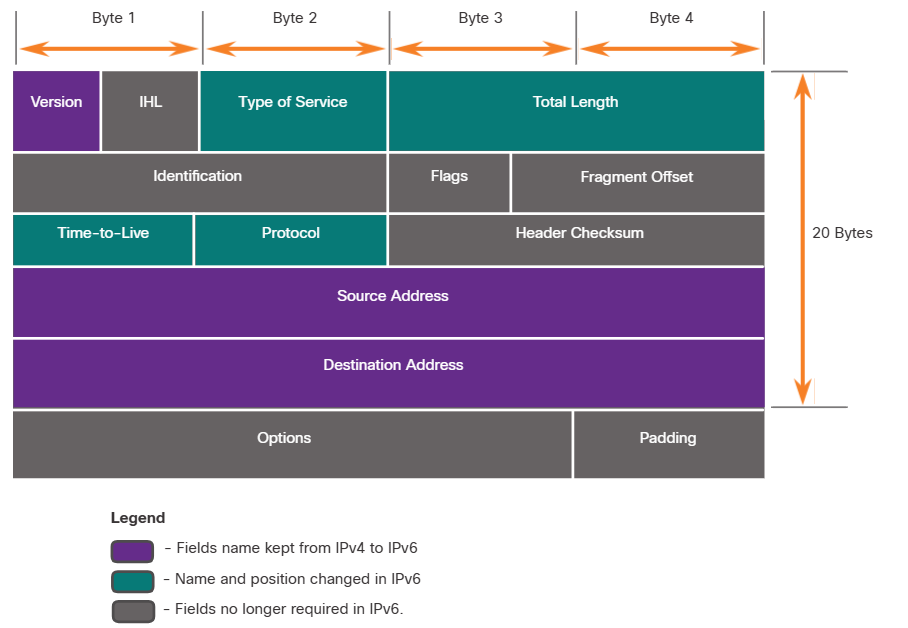

The figure shows IPv4 packet header fields that were kept, moved, changed, as well as those that were not kept in the IPv6 packet header.

In contrast, the simplified IPv6 header shown the next figure consists of a fixed length header of 40 octets (largely due to the length of the source and destination IPv6 addresses).

The IPv6 simplified header allows for more efficient processing of IPv6 headers.

### IPv6 Packet Header 

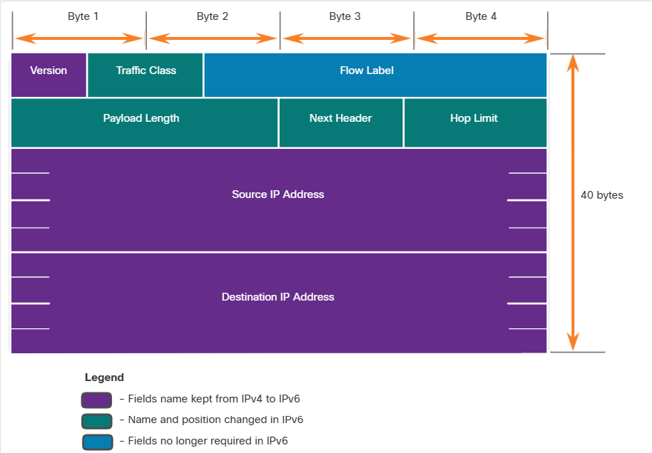 

The figure shows the IPv4 packet header fields that were kept or moved along with the new IPv6 packet header fields.

## 8.3.4 IPv6 Packet Header

The IP protocol header diagram in the figure identifies the fields of an IPv6 packet.

### Fields in the IPv6 Packet Header

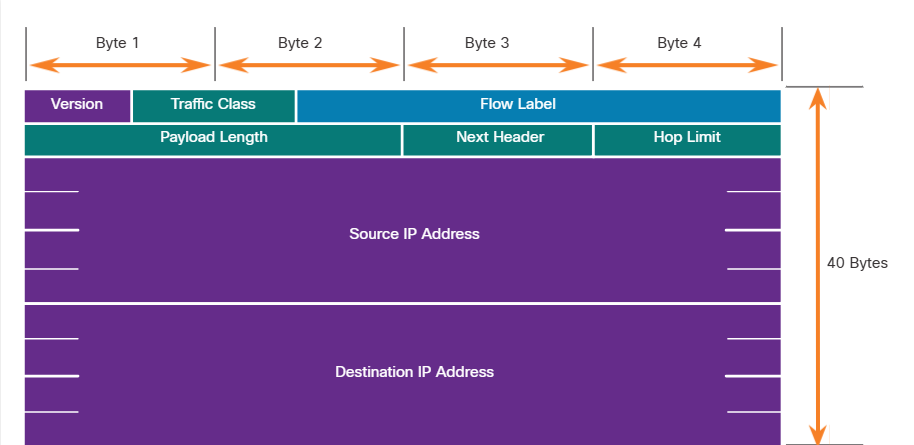

The fields in the IPv6 packet header include the following:
- Version - This field contains a 4-bit binary value set to 0110 that identifies this as an IP version 6 packet.
- Traffic Class - This 8-bit field is equivalent to the IPv4 Differentiated Services (DS) field.
- Flow Label - This 20-bit field suggests that all packets with the same flow label receive the same type of handling by routers.
- Payload Length - This 16-bit field indicates the length of the data portion or payload of the IPv6 packet. This does not include the length of the IPv6 header, which is a fixed 40-byte header.
- Next Header - This 8-bit field is equivalent to the IPv4 Protocol field. It indicates the data payload type that the packet is carrying, enabling the network layer to pass the data to the appropriate upper-layer protocol.
- Hop Limit - This 8-bit field replaces the IPv4 TTL field. This value is decremented by a value of 1 by each router that forwards the packet. When the counter reaches 0, the packet is discarded, and an ICMPv6 Time Exceeded message is forwarded to the sending host,. This indicates that the packet did not reach its destination because the hop limit was exceeded. Unlike IPv4, IPv6 does not include an IPv6 Header Checksum, because this function is performed at both the lower and upper layers. This means the checksum does not need to be recalculated by each router when it decrements the Hop Limit field, which also improves network performance.
- Source IPv6 Address - This 128-bit field identifies the IPv6 address of the sending host.
- Destination IPv6 Address - This 128-bit field identifies the IPv6 address of the receiving host.

An IPv6 packet may also contain extension headers (EH), which provide optional network layer information. Extension headers are optional and are placed between the IPv6 header and the payload. EHs are used for fragmentation, security, to support mobility and more.

Unlike IPv4, routers do not fragment routed IPv6 packets.

# 8.4 How a Host Routes

## 8.4.1 Host Forwarding Decision

With both IPv4 and IPv6, packets are always created at the source host. The source host must be able to direct the packet to the destination host. To do this, host end devices create their own routing table. This topic discusses how end devices use routing tables.

Another role of the network layer is to direct packets between hosts. A host can send a packet to the following:
- **Itself** - A host can ping itself by sending a packet to a special IPv4 address of 127.0.0.1 or an IPv6 address :: 1, which is referred to as the loopback interface. Pinging the loopback interface tests the TCP/IP protocol stack on the host.
- **Local host** - This is a destination host that is on the same local network as the sending host. The source and destination hosts share the same network address.
- **Remote host** - This is a destination host on a remote network. The source and destination hosts do not share the same network address.

The figure illustrates PC1 connecting to a local host on the same network, and to a remote host located on another network.

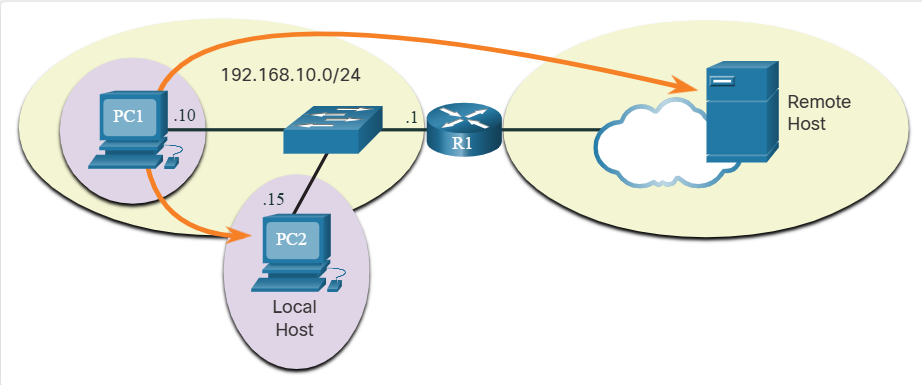

Whether a packet is destined for a local host or a remote host is determined by the source end device. The source end device determines whether the destination IP address is on the same network that the source device itself is on. The method of determination varies by IP version:
- In IPv4 - The source device uses its own subnet mask along with its own IPv4 address and the destination IPv4 address to make this determination.
- In IPv6 - The local router advertises the local network address (prefix) to all devices on the network.

In a home or business network, you may have several wired and wireless devices interconnected together using an intermediary device, such as a LAN switch or a wireless access point (WAP). This intermediary device provides interconnections between local hosts on the local network. Local hosts can reach each other and share information without the need for any additional devices. If a host is sending a packet to a device that is configured with the same IP network as the host device, the packet is simply forwarded out of the host interface, through the intermediary device, and to the destination device directly.

Of course, in most situations we want our devices to be able to connect beyond the local network segment, such as out to other homes, businesses, and the internet. Devices that are beyond the local network segment are known as remote hosts. When a source device sends a packet to a remote destination device, then the help of routers and routing is needed. Routing is the process of identifying the best path to a destination. The router connected to the local network segment is referred to as the default gateway.

## 8.4.2 Default Gateway

The default gateway is the network device (i.e., router or Layer 3 switch) that can route traffic to other networks. If you use the analogy that a network is like a room, then the default gateway is like a doorway. If you want to get to another room or network you need to find the doorway.

On a network, a default gateway is usually a router with these features:
- It has a local IP address in the same address range as other hosts on the local network.
- It can accept data into the local network and forward data out of the local network.
- It routes traffic to other networks.

A default gateway is required to send traffic outside of the local network. Traffic cannot be forwarded outside the local network if there is no default gateway, the default gateway address is not configured, or the default gateway is down.

## 8.4.3 A Host Routes to the Default Gateway

A host routing table will typically include a default gateway. In IPv4, the host receives the IPv4 address of the default gateway either dynamically from Dynamic Host Configuration Protocol (DHCP) or configured manually. In IPv6, the router advertises the default gateway address or the host can be configured manually.

In the figure, PC1 and PC2 are configured with the IPv4 address of 192.168.10.1 as the default gateway.

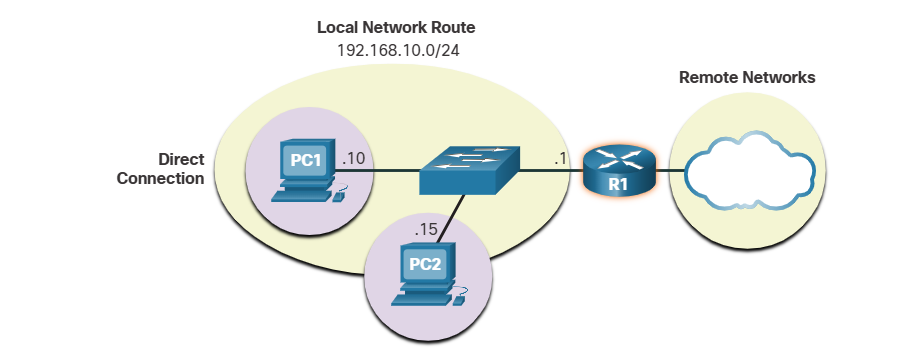

Having a default gateway configured creates a default route in the routing table of the PC. A default route is the route or pathway your computer will take when it tries to contact a remote network.

Both PC1 and PC2 will have a default route to send all traffic destined to remote networks to R1.

## 8.4.4 Host Routing Tables

On a Windows host, the route print or netstat -r command can be used to display the host routing table. Both commands generate the same output. The output may seem overwhelming at first, but is fairly simple to understand.

The figure displays a sample topology and the output generated by the netstat -r command.

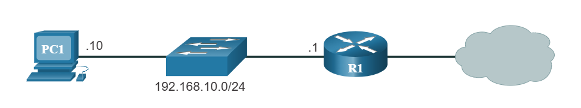

### IPv4 Routing Table for PC1

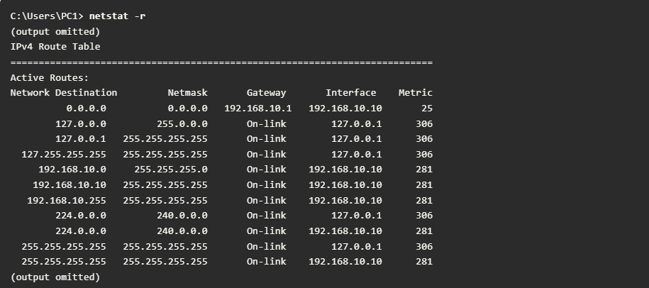

Note: The output only displays the IPv4 route table.

Entering the netstat -r command or the equivalent route print command displays three sections related to the current TCP/IP network connections:
- Interface List - Lists the Media Access Control (MAC) address and assigned interface number of every network-capable interface on the host, including Ethernet, Wi-Fi, and Bluetooth adapters.
- IPv4 Route Table - Lists all known IPv4 routes, including direct connections, local network, and local default routes.
- IPv6 Route Table - Lists all known IPv6 routes, including direct connections, local network, and local default routes.

# 8.5 Introduction to Routing 

# 8.5.1 Router Packet Forwarding Decision

The previous topic discussed host routing tables. Most networks also contain routers, which are intermediary devices. Routers also contain routing tables. This topic covers router operations at the network layer. When a host sends a packet to another host, it consults its routing table to determine where to send the packet. If the destination host is on a remote network, the packet is forwarded to the default gateway, which is usually the local router.

What happens when a packet arrives on a router interface?

The router examines the destination IP address of the packet and searches its routing table to determine where to forward the packet. The routing table contains a list of all known network addresses (prefixes) and where to forward the packet. These entries are known as route entries or routes. The router will forward the packet using the best (longest) matching route entry.

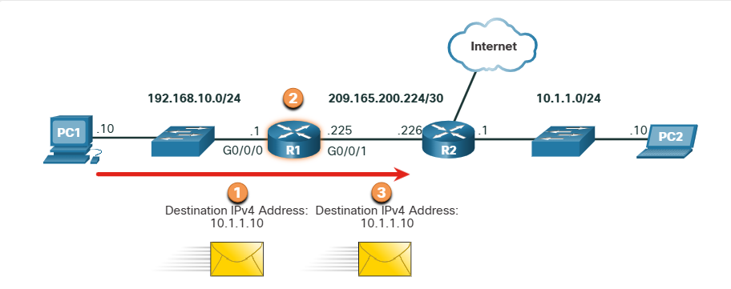

1. Packet arrives on the Gigabit Ethernet 0/0/0 interface of router R1. R1 de-encapsulates the Layer 2 Ethernet header and trailer.
2. Router R1 examines the destination IPv4 address of the packet and searches for the best match in its IPv4 routing table. The route entry indicates that this packet is to be forwarded to router R2.
3. Router R1 encapsulates the packet into a new Ethernet header and trailer, and forwards the packet to the next hop router R2.

The following table shows the pertinent information from the R1 routing table.

### R1 Routing Table

| Route                   | Next Hop or Exit Interface |
| :---------------------- | :------------------------- |
| 192.168.10.0 /24        | G0/0/0                     |
| 209.165.200.224/30      | G0/0/1                     |
| 10.1.1.0/24             | via R2                     |
| Default Route 0.0.0.0/0 | via R2                     |

## 8.5.2 IP Router Routing Table

The routing table of the router contains network route entries listing all the possible known network destinations.

The routing table stores three types of route entries:
- **Directly-connected networks** - These network route entries are active router interfaces. Routers add a directly connected route when an interface is configured with an IP address and is activated. Each router interface is connected to a different network segment. In the figure, the directly-connected networks in the R1 IPv4 routing table would be 192.168.10.0/24 and 209.165.200.224/30.
- **Remote networks** - These network route entries are connected to other routers. Routers learn about remote networks either by being explicitly configured by an administrator or by exchanging route information using a dynamic routing protocol. In the figure, the remote network in the R1 IPv4 routing table would be 10.1.1.0/24.
- **Default route** - Like a host, most routers also include a default route entry, a gateway of last resort. The default route is used when there is no better (longer) match in the IP routing table. In the figure, the R1 IPv4 routing table would most likely include a default route to forward all packets to router R2.

The figure identifies the directly connected and remote networks of router R1.

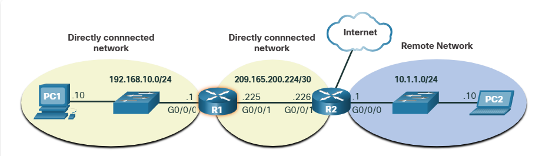

R1 has two directly connected networks:
- 192.168.10.0/24
- 209.165.200.224/30
R1 also has remote networks (i.e. 10.1.1.0/24 and the internet) that it can learn about.

A router can learn about remote networks in one of two ways:
- **Manually** - Remote networks are manually entered into the route table using static routes.
- **Dynamically** - Remote routes are automatically learned using a dynamic routing protocol.

## 8.5.3 Static Routing

Static routes are route entries that are manually configured. The figure shows an example of a static route that was manually configured on router R1. The static route includes the remote network address and the IP address of the next hop router.

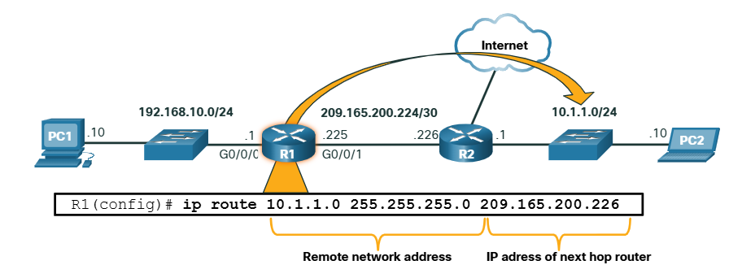

R1 is manually configured with a static route to reach the 10.1.1.0/24 network. If this path changes, R1 will require a new static route.

If there is a change in the network topology, the static route is not automatically updated and must be manually reconfigured. For example, in the figure R1 has a static route to reach the 10.1.1.0/24 network via R2. If that path is no longer available, R1 would need to be reconfigured with a new static route to the 10.1.1.0/24 network via R3. Router R3 would therefore need to have a route entry in its routing table to send packets destined for 10.1.1.0/24 to R2.

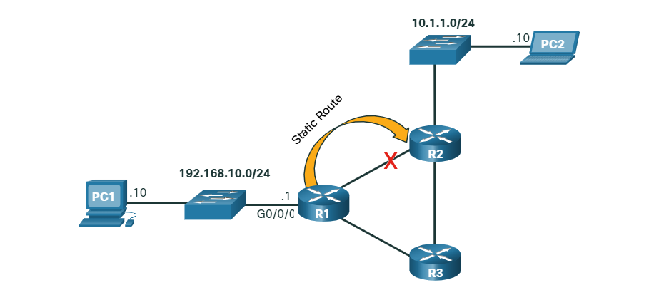

If the route from R1 via R2 is no longer available, a new static route via R3 would need to be configured. A static route does not automatically adjust for topology changes.

Static routing has the following characteristics:
- A static route must be configured manually.
- The administrator needs to reconfigure a static route if there is a change in the topology and the static route is no longer viable.
- A static route is appropriate for a small network and when there are few or no redundant links.

## 8.5.4 Dynamic Routing

A dynamic routing protocol allows the routers to automatically learn about remote networks, including a default route, from other routers. Routers that use dynamic routing protocols automatically share routing information with other routers and compensate for any topology changes without involving the network administrator. If there is a change in the network topology, routers share this information using the dynamic routing protocol and automatically update their routing tables.

Dynamic routing protocols include OSPF and Enhanced Interior Gateway Routing Protocol (EIGRP). The figure shows an example of routers R1 and R2 automatically sharing network information using the routing protocol OSPF.

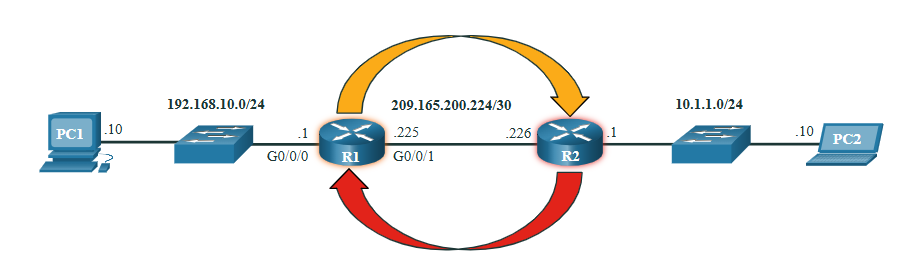

- R1 is using the routing protocol OSPF to let R2 know about the 192.168.10.0/24 network.
- R2 is using the routing protocol OSPF to let R1 know about the 10.1.1.0/24 network.

Basic configuration only requires the network administrator to enable the directly connected networks within the dynamic routing protocol. The dynamic routing protocol will automatically do as follows:
- Discover remote networks
- Maintain up-to-date routing information
- Choose the best path to destination networks
- Attempt to find a new best path if the current path is no longer available

When a router is manually configured with a static route or learns about a remote network dynamically using a dynamic routing protocol, the remote network address and next hop address are entered into the IP routing table. As shown in the figure, if there is a change in the network topology, the routers will automatically adjust and attempt to find a new best path.

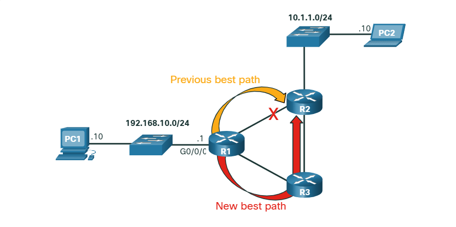 

R1, R2, and R3 are using the dynamic routing protocol OSPF. If there is a network topology change, they can automatically adjust to find a new best path.

**Note:** It is common for some routers to use a combination of both static routes and a dynamic routing protocol.

## 8.5.6 Introduction to an IPv4 Routing Table

Notice in the figure that R2 is connected to the internet. Therefore, the administrator configured R1 with a default static route sending packets to R2 when there is no specific entry in the routing table that matches the destination IP address. R1 and R2 are also using OSPF routing to advertise directly connected networks.

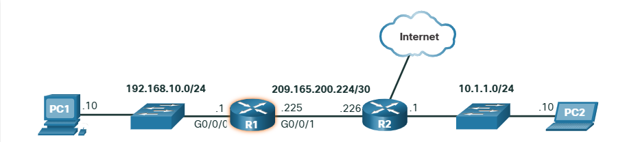

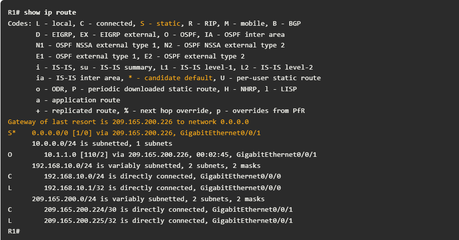 

The show ip route privileged EXEC mode command is used to view the IPv4 routing table on a Cisco IOS router. The example shows the IPv4 routing table of router R1. At the beginning of each routing table entry is a code that is used to identify the type of route or how the route was learned. Common route sources (codes) include these:
- L - Directly connected local interface IP address
- C - Directly connected network
- S - Static route was manually configured by an administrator
- O - OSPF
- D - EIGRP

The routing table displays all of the known IPv4 destination routes for R1.

A directly connected route is automatically created when a router interface is configured with IP address information and is activated. The router adds two route entries with the codes C (i.e., the connected network) and L (i.e., the local interface IP address of the connected network). The route entries also identify the exit interface to use to reach the network. The two directly connected networks in this example are 192.168.10.0/24 and 209.165.200.224/30.

Routers R1 and R2 are also using the OSPF dynamic routing protocol to exchange router information. In the example routing table, R1 has a route entry for the 10.1.1.0/24 network that it learned dynamically from router R2 via the OSPF routing protocol.

A default route has a network address of all zeroes. For example, the IPv4 network address is 0.0.0.0. A static route entry in the routing table begins with a code of S*, as highlighted in the example.

