# Module 9: MAC and IP

# 9.1 MAC and IP

## 9.1.1 Destination on Same Network

Sometimes a host must send a message, but it only knows the IP address of the destination device. The host needs to know the MAC address of that device, but how can it be discovered? That is where address resolution becomes critical.
There are two primary addresses assigned to a device on an Ethernet LAN:
- Physical address (the MAC address) - Used for NIC to NIC communications on the same Ethernet network.
- Logical address (the IP address) - Used to send the packet from the source device to the destination device. The destination IP address may be on the same IP network as the source or it may be on a remote network.

Layer 2 physical addresses (i.e., Ethernet MAC addresses) are used to deliver the data link frame with the encapsulated IP packet from one NIC to another NIC that is on the same network. If the destination IP address is on the same network, the destination MAC address will be that of the destination device.

Consider the following example using simplified MAC address representations.

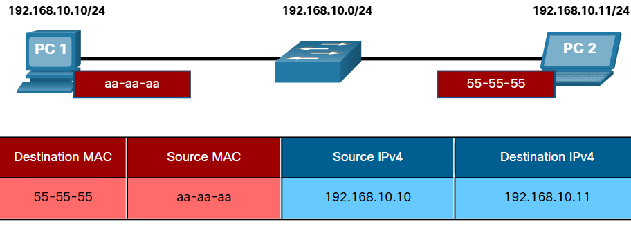

In this example, PC1 wants to send a packet to PC2. The figure displays the Layer 2 destination and source MAC addresses and the Layer 3 IPv4 addressing that would be included in the packet sent from PC1.

The Layer 2 Ethernet frame contains the following:
- **Destination MAC address** - This is the simplified MAC address of PC2, 55-55-55.
- **Source MAC address** - This is the simplified MAC address of the Ethernet NIC on PC1, aa-aa-aa.

The Layer 3 IP packet contains the following:
- **Source IPv4 address** - This is the IPv4 address of PC1, 192.168.10.10.
- **Destination IPv4 address** - This is the IPv4 address of PC2, 192.168.10.11.

## 9.1.2 Destination on Remote Network

When the destination IP address (IPv4 or IPv6) is on a remote network, the destination MAC address will be the address of the host default gateway (i.e., the router interface).

Consider the following example using a simplified MAC address representation.

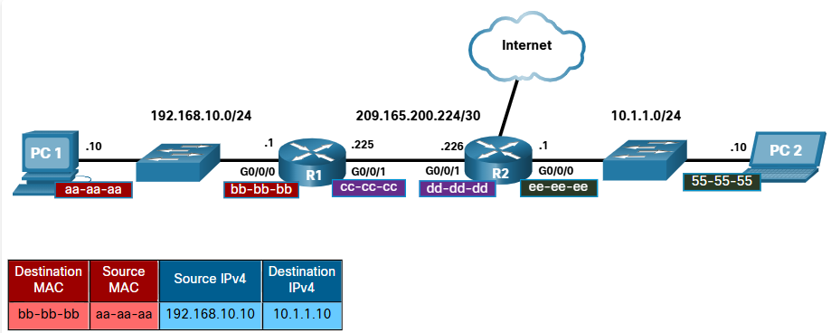

In this example, PC1 wants to send a packet to PC2. PC2 is located on remote network. Because the destination IPv4 address is not on the same local network as PC1, the destination MAC address is that of the local default gateway on the router.

Routers examine the destination IPv4 address to determine the best path to forward the IPv4 packet. When the router receives the Ethernet frame, it de-encapsulates the Layer 2 information. Using the destination IPv4 address, it determines the next-hop device, and then encapsulates the IPv4 packet in a new data link frame for the outgoing interface.

In our example, R1 would now encapsulate the packet with new Layer 2 address information as shown in the figure.

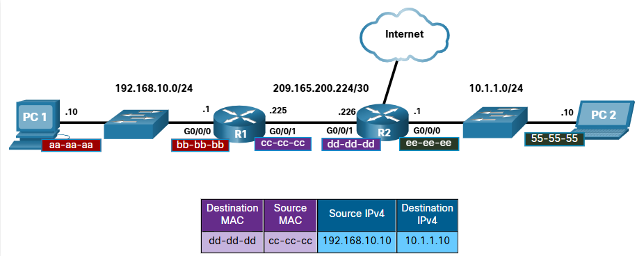

The new destination MAC address would be that of the R2 G0/0/1 interface and the new source MAC address would be that of the R1 G0/0/1 interface.

Along each link in a path, an IP packet is encapsulated in a frame. The frame is specific to the data link technology that is associated with that link, such as Ethernet. If the next-hop device is the final destination, the destination MAC address will be that of the device Ethernet NIC, as shown in the figure.

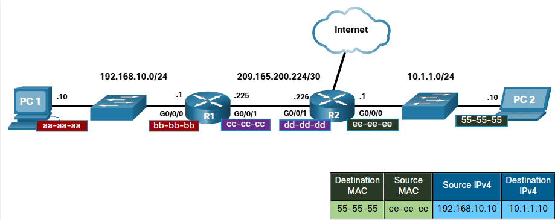

How are the IP addresses of the IP packets in a data flow associated with the MAC addresses on each link along the path to the destination? For IPv4 packets, this is done through a process called Address Resolution Protocol (ARP). For IPv6 packets, the process is ICMPv6 Neighbor Discovery (ND).

# 9.2 ARP 

## 9.2.1 ARP Overview

If your network is using the IPv4 communications protocol, the Address Resolution Protocol, or ARP, is what you need to map IPv4
addresses to MAC addresses. This topic explains how ARP works.

Every IP device on an Ethernet network has a unique Ethernet MAC address. When a device sends an Ethernet Layer 2 frame, it contains these two addresses:

- **Destination MAC address** - The Ethernet MAC address of the destination device on the same local network segment. If the destination host is on another network, then the destination address in the frame would be that of the default gateway (i.e., router).
- **Source MAC address** - The MAC address of the Ethernet NIC on the source host.

The figure illustrates the problem when sending a frame to another host on the same segment on an IPv4 network.

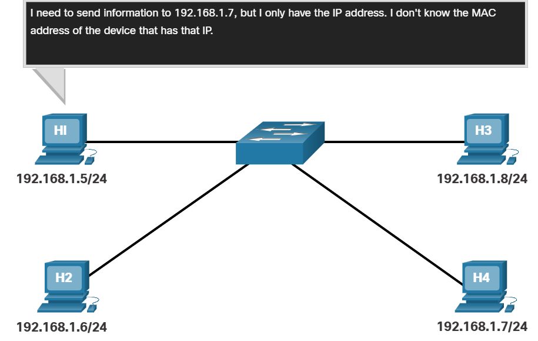

To send a packet to another host on the same local IPv4 network, a host must know the IPv4 address and the MAC address of the destination device. Device destination IPv4 addresses are either known or resolved by device name. However, MAC addresses must be discovered.

A device uses Address Resolution Protocol (ARP) to determine the destination MAC address of a local device when it knows its IPv4 address.

ARP provides two basic functions:
- Resolving IPv4 addresses to MAC addresses
- Maintaining a table of IPv4 to MAC address mappings

## 9.2.2 ARP Functions

When a packet is sent to the data link layer to be encapsulated into an Ethernet frame, the device refers to a table in its memory to find the MAC address that is mapped to the IPv4 address. This table is stored temporarily in RAM memory and called the ARP table or the ARP cache.

The sending device will search its ARP table for a destination IPv4 address and a corresponding MAC address.
- If the packet's destination IPv4 address is on the same network as the source IPv4 address, the device will search the ARP table for the destination IPv4 address.
- If the destination IPv4 address is on a different network than the source IPv4 address, the device will search the ARP table for the IPv4 address of the default gateway.

In both cases, the search is for an IPv4 address and a corresponding MAC address for the device.

Each entry, or row, of the ARP table binds an IPv4 address with a MAC address. We call the relationship between the two values a map. This simply means that you can locate an IPv4 address in the table and discover the corresponding MAC address. The ARP table temporarily saves (caches) the mapping for the devices on the LAN.

If the device locates the IPv4 address, its corresponding MAC address is used as the destination MAC address in the frame. If there is no entry is found, then the device sends an ARP request.

Click Play in the figure to see an animation of the ARP function.

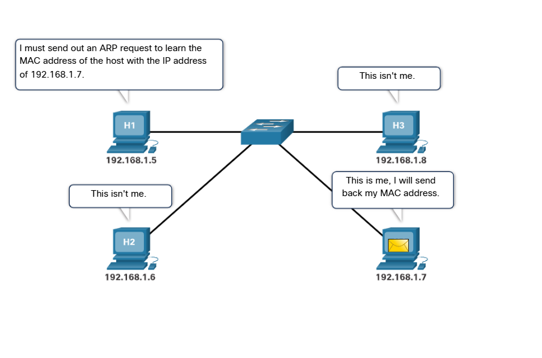

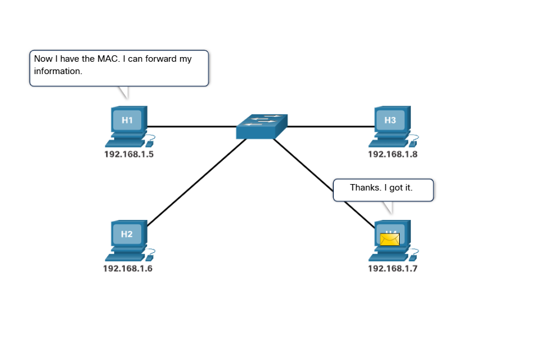

## 9.2.3 Video - ARP Request

An ARP request is sent when a device needs to determine the MAC address that is associated with an IPv4 address, and it does not have an entry for the IPv4 address in its ARP table.

ARP messages are encapsulated directly within an Ethernet frame. There is no IPv4 header. The ARP request is encapsulated in an Ethernet frame using the following header information:
-   **Destination MAC address** - This is a broadcast address FF-FF-FF-FF-FF-FF requiring all Ethernet NICs on the LAN to accept and process the ARP request.
-   **Source MAC address** - This is MAC address of the sender of the ARP request.
-   **Type** - ARP messages have a type field of 0x806. This informs the receiving NIC that the data portion of the frame needs to be passed to the ARP process.

Because ARP requests are broadcasts, they are flooded out all ports by the switch, except the receiving port. All Ethernet NICs on the LAN process broadcasts and must deliver the ARP request to its operating system for processing. Every device must process the ARP request to see if the target IPv4 address matches its own. A router will not forward broadcasts out other interfaces.

Only one device on the LAN will have an IPv4 address that matches the target IPv4 address in the ARP request. All other devices will not reply.

## 9.2.4 Video – ARP Operation - ARP Reply

Only the device with the target IPv4 address associated with the ARP request will respond with an ARP reply. The ARP reply is encapsulated in an Ethernet frame using the following header information:
-   Destination MAC address - This is the MAC address of the sender of the ARP request.
-   Source MAC address - This is the MAC address of the sender of the ARP reply.
-   Type - ARP messages have a type field of 0x806. This informs the receiving NIC that the data portion of the frame needs to be passed to the ARP process.

Only the device that originally sent the ARP request will receive the unicast ARP reply. After the ARP reply is received, the device will add the IPv4 address and the corresponding MAC address to its ARP table. Packets destined for that IPv4 address can now be encapsulated in frames using its corresponding MAC address.

If no device responds to the ARP request, the packet is dropped because a frame cannot be created.

Entries in the ARP table are time stamped. If a device does not receive a frame from a particular device before the timestamp expires, the entry for this device is removed from the ARP table.

Additionally, static map entries can be entered in an ARP table, but this is rarely done. Static ARP table entries do not expire over time and must be manually removed.

Note: IPv6 uses a similar process to ARP for IPv4, known as ICMPv6 Neighbor Discovery (ND). IPv6 uses neighbor solicitation and neighbor advertisement messages, similar to IPv4 ARP requests and ARP replies.

## 9.2.5 Video - ARP Role in Remote Communications

When the destination IPv4 address is not on the same network as the source IPv4 address, the source device needs to send the frame to its default gateway. This is the interface of the local router. Whenever a source device has a packet with an IPv4 address on another network, it will encapsulate that packet in a frame using the destination MAC address of the router.

The IPv4 address of the default gateway is stored in the IPv4 configuration of the hosts. When a host creates a packet for a destination, it compares the destination IPv4 address and its own IPv4 address to determine if the two IPv4 addresses are located on the same Layer 3 network. If the destination host is not on its same network, the source checks its ARP table for an entry with the IPv4 address of the default gateway. If there is not an entry, it uses the ARP process to determine a MAC address of the default gateway.

## 9.2.6 Removing Entries from an ARP Table

For each device, an ARP cache timer removes ARP entries that have not been used for a specified period of time. The times differ depending on the operating system of the device. For example, newer Windows operating systems store ARP table entries between 15 and 45 seconds, as illustrated in the figure.

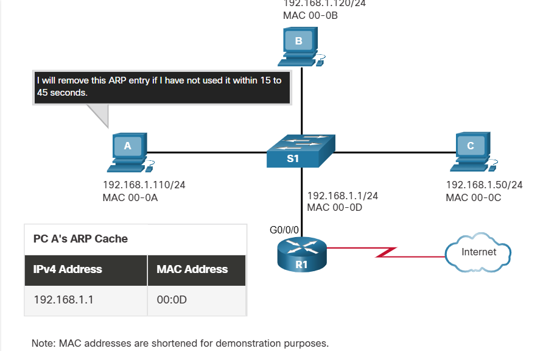

Commands may also be used to manually remove some or all of the entries in the ARP table. After an entry has been removed, the process for sending an ARP request and receiving an ARP reply must occur again to enter the map in the ARP table.

## 9.2.7 ARP Tables on Networking Devices

On a Cisco router, the show ip arp command is used to display the ARP table, as shown in the figure.

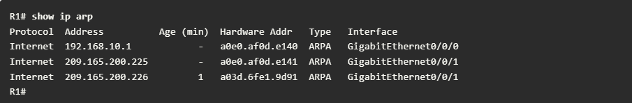

On a Windows 10 PC, the **arp -a** command is used to display the ARP table, as shown in the figure.

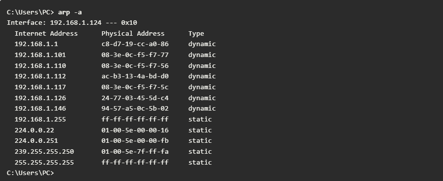

## 9.2.8 ARP Issues - ARP Broadcasts and ARP Spoofing

As a broadcast frame, an ARP request is received and processed by every device on the local network. On a typical business network, these broadcasts would probably have minimal impact on network performance. However, if a large number of devices were to be powered up and all start accessing network services at the same time, there could be some reduction in performance for a short period of time, as shown in the figure. After the devices send out the initial ARP broadcasts and have learned the necessary MAC addresses, any impact on the network will be minimized.

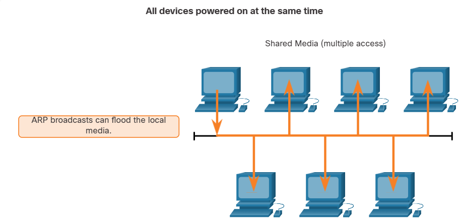

In some cases, the use of ARP can lead to a potential security risk. A threat actor can use ARP spoofing to perform an ARP poisoning attack. This is a technique used by a threat actor to reply to an ARP request for an IPv4 address that belongs to another device, such as the default gateway, as shown in the figure. The threat actor sends an ARP reply with its own MAC address. The receiver of the ARP reply will add the wrong MAC address to its ARP table and send these packets to the threat actor.

Enterprise level switches include mitigation techniques known as dynamic ARP inspection (DAI). DAI is beyond the scope of this course.

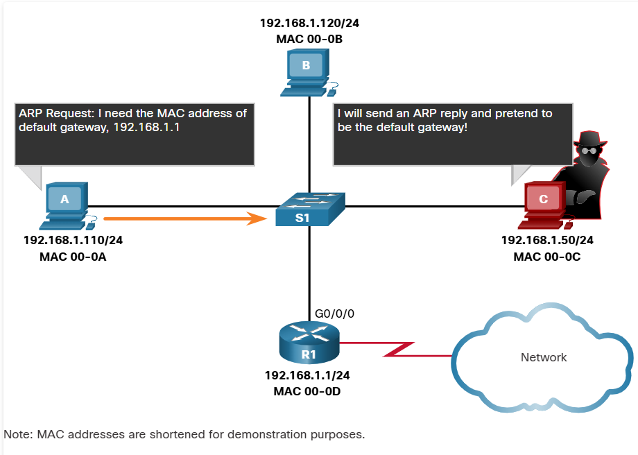

# 9.3 IPv6 Neighbor Discovery 

# 9.3.2 IPv6 Neighbor Discovery Messages

IPv6 Neighbor Discovery protocol is sometimes referred to as ND or NDP. In this course, we will refer to it as ND. ND provides address resolution, router discovery, and redirection services for IPv6 using ICMPv6. ICMPv6 ND uses five ICMPv6 messages to perform these services:

- Neighbor Solicitation messages
- Neighbor Advertisement messages
- Router Solicitation messages
- Router Advertisement messages
- Redirect Message

Neighbor Solicitation and Neighbor Advertisement messages are used for device-to-device messaging such as address resolution (similar to ARP for IPv4). Devices include both host computers and routers.

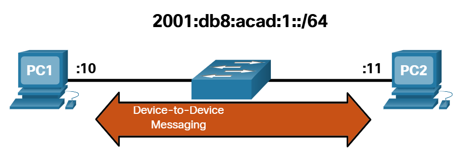

Router Solicitation and Router Advertisement messages are for messaging between devices and routers. Typically router discovery is used for dynamic address allocation and stateless address autoconfiguration (SLAAC).

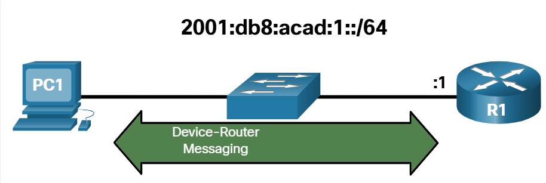

Note: The fifth ICMPv6 ND message is a redirect message which is used for better next-hop selection. This is beyond the scope of this course.

IPv6 ND is defined in the IETF RFC 4861.

## 9.3.3 IPv6 Neighbor Discovery - Address Resolution

Much like ARP for IPv4, IPv6 devices use IPv6 ND to determine the MAC address of a device that has a a known IPv6 address.

ICMPv6 Neighbor Solicitation and Neighbor Advertisement messages are used for MAC address resolution. This is similar to ARP Requests and ARP Replies used by ARP for IPv4. For example, assume PC1 wants to ping PC2 at IPv6 address 2001:db8:acad::11. To determine the MAC address for the known IPv6 address, PC1 sends an ICMPv6 Neighbor Solicitation message as illustrated in the figure.

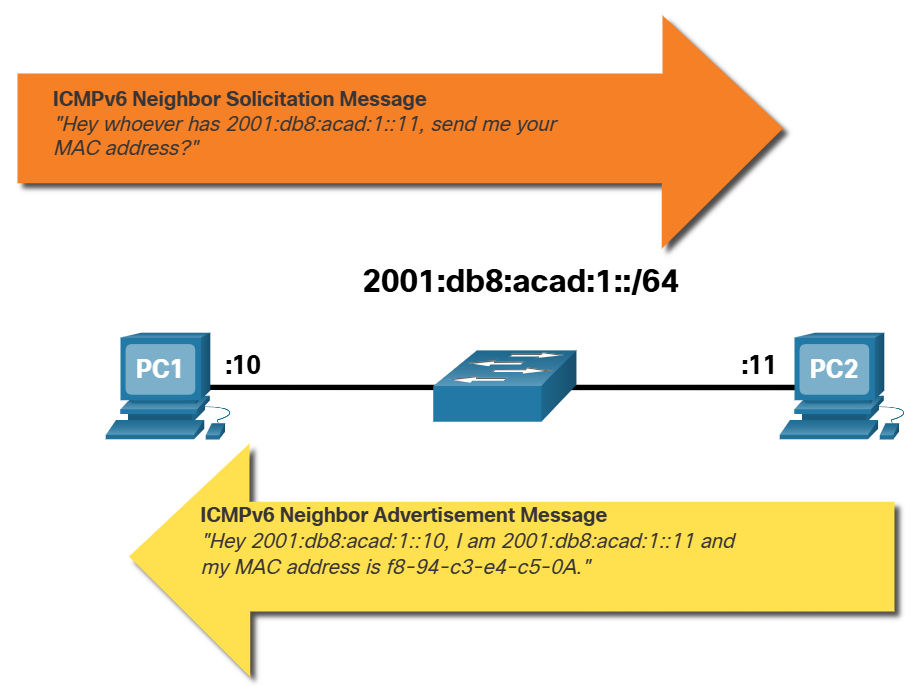

ICMPv6 Neighbor Solicitation messages are sent using special Ethernet and IPv6 multicast addresses. This allows the Ethernet NIC of the receiving device to determine whether the Neighbor Solicitation message is for itself without having to send it to the operating system for processing.

PC2 replies to the request with an ICMPv6 Neighbor Advertisement message which includes its MAC address.

