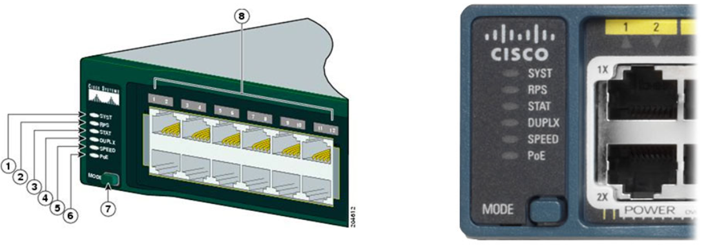
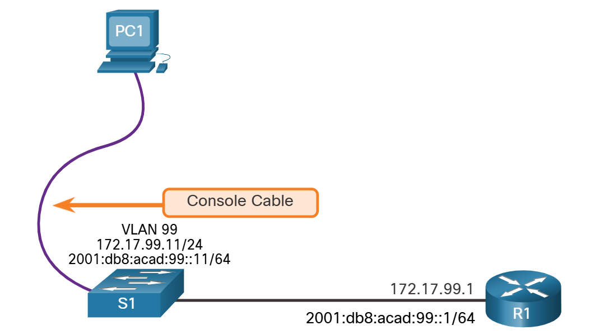
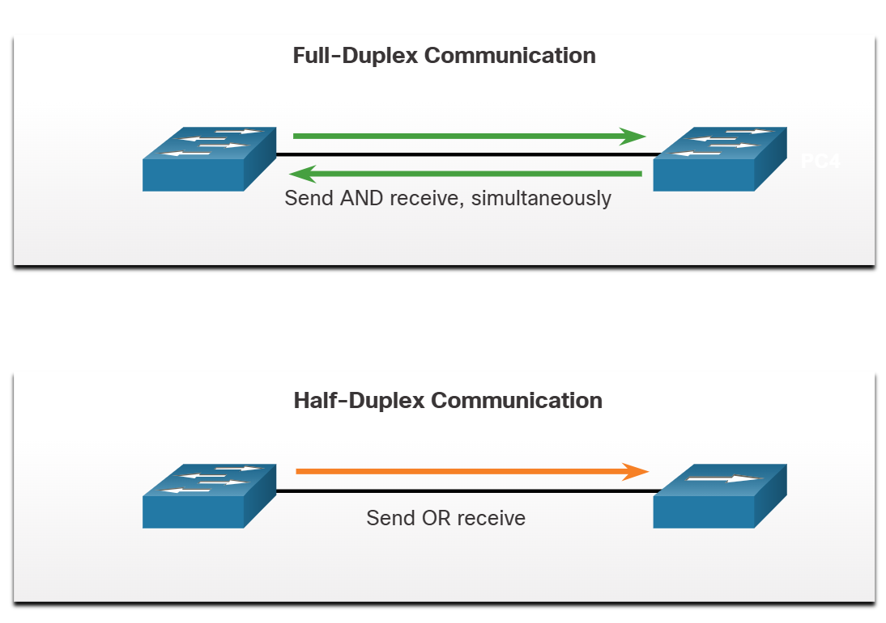
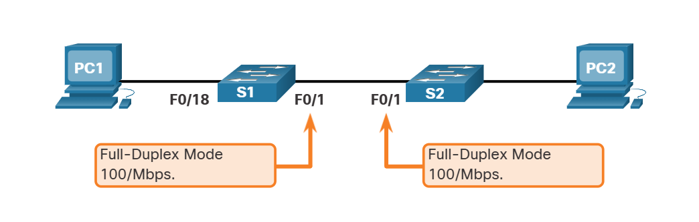
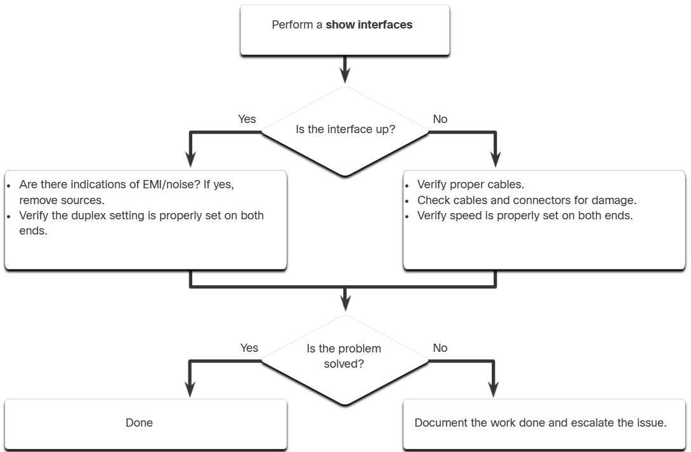
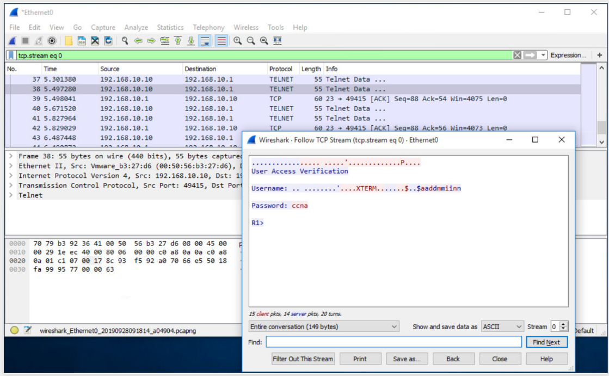
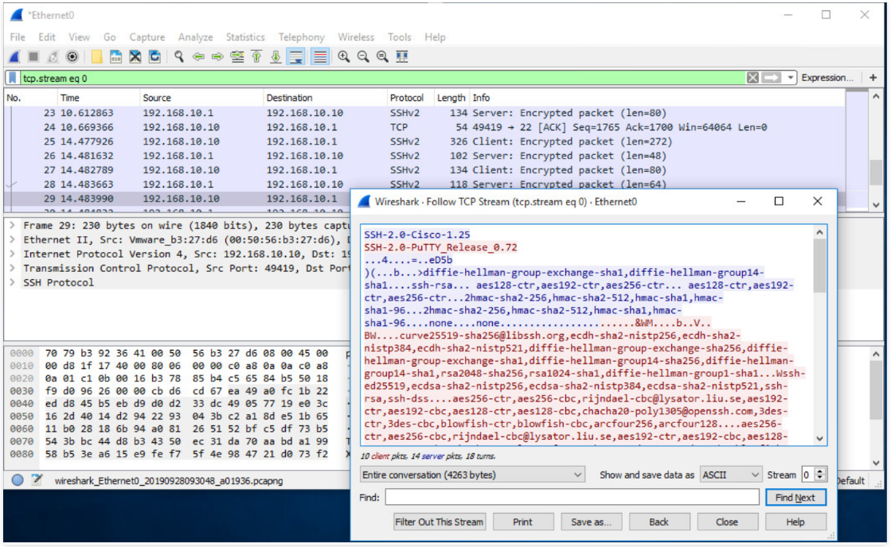
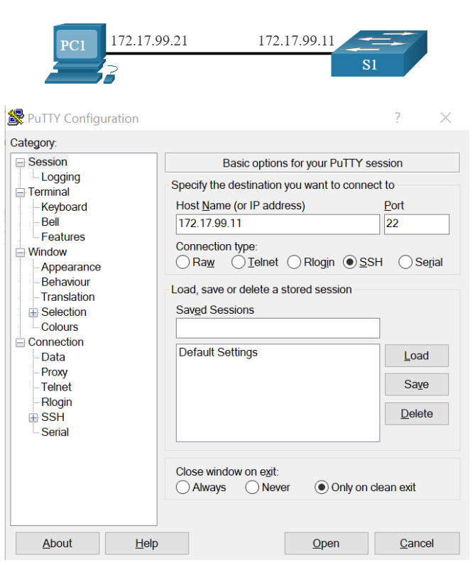
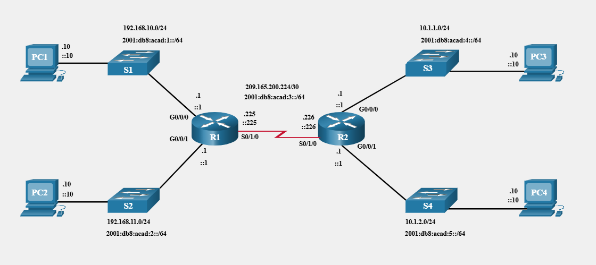
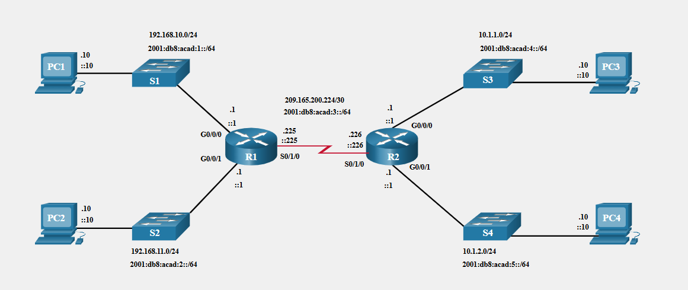

# Module 1: Basic Device Configuration 

# 1.1 Configure a Switch with Initial Settings

## 1.1.1 Switch Boot Sequence

Before you can configure a switch, you need to turn it on and allow it to go through the five-step boot sequence. This topic covers the basics of configuring a switch and includes a lab at the end.

After a Cisco switch is powered on, it goes through the following five-step boot sequence:

Step 1: First, the switch loads a power-on self-test (POST) program stored in ROM. POST checks the CPU subsystem. It tests the CPU, DRAM, and the portion of the flash device that makes up the flash file system.

Step 2: Next, the switch loads the boot loader software. The boot loader is a small program stored in ROM that is run immediately after POST successfully completes.

Step 3: The boot loader performs low-level CPU initialization. It initializes the CPU registers, which control where physical memory is mapped, the quantity of memory, and its speed.

Step 4: The boot loader initializes the flash file system on the system board.

Step 5: Finally, the boot loader locates and loads a default IOS operating system software image into memory and gives control of the switch over to the IOS.

## 1.1.2 The boot system Command

The switch attempts to automatically boot by using information in the BOOT environment variable. If this variable is not set, the switch attempts to load and execute the first executable file it can find. On Catalyst 2960 Series switches, the image file is normally contained in a directory that has the same name as the image file (excluding the .bin file extension).

The IOS operating system then initializes the interfaces using the Cisco IOS commands found in the startup-config file. The startup-config file is called config.text and is located in flash.

In the example, the BOOT environment variable is set using the boot system global configuration mode command. Notice that the IOS is located in a distinct folder and the folder path is specified. Use the command show boot to see what the current IOS boot file is set to.

```
S1(config)# boot system flash:/c2960-lanbasek9-mz.150-2.SE/c2960-lanbasek9-mz.150-2.SE.bin
```

The table defines each part of the boot system command.

| Command | Definition |
| --- | --- |
| `boot system` | The main command |
| `flash:` | The storage device |
| `c2960-lanbasek9-mz.150-2.SE/` | The path to the file system |
| `c2960-lanbasek9-mz.1502.SE.bin` | The IOS file name |


## 1.1.3 Switch LED Indicators
Cisco Catalyst switches have several status LED indicator lights. You can use the switch LEDs to quickly monitor switch activity and performance. Switches of different models and feature sets will have different LEDs and their placement on the front panel of the switch may also vary.

The figure shows the switch LEDs and the Mode button for a Cisco Catalyst 2960 switch.



The Mode button (7 in the figure) is used to toggle through port status, port duplex, port speed, and if supported, the Power over Ethernet (PoE) status of the port LEDs (8 in the figure).

### System LED

Shows whether the system is receiving power and is functioning properly. If the LED is off, it means the system is not powered on. If the LED is green, the system is operating normally. If the LED is amber, the system is receiving power but is not functioning properly.

### Redundant Power System (RPS) LED

Shows the RPS status. If the LED is off, the RPS is off, or it is not properly connected. If the LED is green, the RPS is connected and ready to provide backup power. If the LED is blinking green, the RPS is connected but is unavailable because it is providing power to another device. If the LED is amber, the RPS is in standby mode, or in a fault condition. If the LED is blinking amber, the internal power supply in the switch has failed, and the RPS is providing power.

### Port Status LED

Indicates that the port status mode is selected when the LED is green. This is the default mode. When selected, the port LEDs will display colors with different meanings. If the LED is off, there is no link, or the port was administratively shut down. If the LED is green, a link is present. If the LED is blinking green, there is activity and the port is sending or receiving data. If the LED is alternating green-amber, there is a link fault. If the LED is amber, the port is blocked to ensure that a loop does not exist in the forwarding domain and is not forwarding data (typically, ports will remain in this state for the first 30 seconds after being activated). If the LED is blinking amber, the port is blocked to prevent a possible loop in the forwarding domain.

### Port Duplex LED

Indicates that the port duplex mode is selected when the LED is green. When selected, port LEDs that are off are in half-duplex mode. If the port LED is green, the port is in full-duplex mode.

### Port Speed LED

Indicates that the port speed mode is selected. When selected, the port LEDs will display colors with different meanings. If the LED is off, the port is operating at 10 Mbps. If the LED is green, the port is operating at 100 Mbps. If the LED is blinking green, the port is operating at 1000 Mbps.

### Power over Ethernet (PoE) Mode LED

If PoE is supported, a PoE mode LED will be present. If the LED is off, it indicates the PoE mode is not selected and that none of the ports have been denied power or placed in a fault condition. If the LED is blinking amber, the PoE mode is not selected but at least one of the ports has been denied power or has a PoE fault. If the LED is green, it indicates the PoE mode is selected and the port LEDs will display colors with different meanings. If the port LED is off, the PoE is off. If the port LED is green, the PoE is on. If the port LED is alternating green-amber, PoE is denied because providing power to the powered device will exceed the switch power capacity. If the LED is blinking amber, PoE is off because of a fault. If the LED is amber, PoE for the port has been disabled.

## 1.1.4 Recovering from a System Crash
The boot loader provides access into the switch if the operating system cannot be used because of missing or damaged system files. The boot loader has a command-line that provides access to the files stored in flash memory.

The boot loader can be accessed through a console connection following these steps:

Step 1. Connect a PC by console cable to the switch console port. Configure terminal emulation software to connect to the switch.

Step 2. Unplug the switch power cord.

Step 3. Reconnect the power cord to the switch and, within 15 seconds, press and hold down the Mode button while the System LED is still flashing green.

Step 4. Continue pressing the Mode button until the System LED turns briefly amber and then solid green; then release the Mode button.

Step 5. The boot loader switch: prompt appears in the terminal emulation software on the PC.

Type the help or ? at the boot loader prompt to view a list of available commands.

By default, the switch attempts to automatically boot up by using information in the BOOT environment variable. To view the path of the switch BOOT environment variable type the set command. Then, initialize the flash file system using the flash_init command to view the current files in flash, as shown in the output.

```
switch: set
BOOT=flash:/c2960-lanbasek9-mz.122-55.SE7/c2960-lanbasek9-mz.122-55.SE7.bin
(output omitted)
switch: flash_init
Initializing Flash...
flashfs[0]: 2 files, 1 directories
flashfs[0]: 0 orphaned files, 0 orphaned directories
flashfs[0]: Total bytes: 32514048
flashfs[0]: Bytes used: 11838464
flashfs[0]: Bytes available: 20675584
flashfs[0]: flashfs fsck took 10 seconds.
...done Initializing Flash.
```

After flash has finished initializing you can enter the dir flash: command to view the directories and files in flash, as shown in the output.

```
switch: dir flash:
Directory of flash:/
    2  -rwx  11834846  <date>               c2960-lanbasek9-mz.150-2.SE8.bin
    3  -rwx  2072      <date>               multiple-fs
```

Enter the BOOT=flash command to change the BOOT environment variable path the switch uses to load the new IOS in flash. To verify the new BOOT environment variable path, issue the set command again. Finally, to load the new IOS type the boot command without any arguments, as shown in the output.

```
switch: BOOT=flash:c2960-lanbasek9-mz.150-2.SE8.bin
switch: set
BOOT=flash:c2960-lanbasek9-mz.150-2.SE8.bin
(output omitted)
switch: boot
```

The boot loader commands support initializing flash, formatting flash, installing a new IOS, changing the BOOT environment variable and recovery of lost or forgotten passwords.

## 1.1.5 Switch Management Access

To prepare a switch for remote management access, the switch must have a switch virtual interface (SVI) configured with an IPv4 address and subnet mask or an IPv6 address and a prefix length for IPv6. The SVI is a virtual interface, not a physical port on the switch. Keep in mind that to manage the switch from a remote network, the switch must be configured with a default gateway. This is very similar to configuring the IP address information on host devices.



## 1.1.6 Switch SVI Configuration Example
By default, the switch is configured to have its management controlled through VLAN 1. All ports are assigned to VLAN 1 by default. For security purposes, it is considered a best practice to use a VLAN other than VLAN 1 for the management VLAN, such as VLAN 99 in the example.

### Step 1

Configure the Management Interface

From VLAN interface configuration mode, an IPv4 address and subnet mask is applied to the management SVI of the switch. Specifically, SVI VLAN 99 will be assigned the 172.17.99.11/24 IPv4 address and the 2001:db8:acad:99::1/64 IPv6 address as shown.

Note: The SVI for VLAN 99 will not appear as “up/up” until VLAN 99 is created and there is a device connected to a switch port associated with VLAN 99.

Note: The switch may need to be configured for IPv6. For example, before you can configure IPv6 addressing on a Cisco Catalyst 2960 running IOS version 15.0, you will need to enter the global configuration command sdm prefer dual-ipv4-and-ipv6 default and then reload the switch.

| Task | IOS Commands |
| --- | --- |
| Enter gloabl configuration mode | `S1# configure terminal` |
| Enter interface configuration mode for the SVI | `S1(config)# interface vlan 99` |
| Configure the management interface IPv4 address | `S1(config-if)# ip address 172.17.99.11 255.255.255.0` |
| Configure the management interface IPv6 address | `S1(config-if)# ipv6 address 2001:db8:acad:99::11/64` |
| Enable the management interface | `S1(config-if)# no shutdown` |
| Return to the privileged EXEC mode | `S1(config-if)# end` | 
| Save the running config to the startup config | `S1# copy running-config startup-config` |

### Step 2

Configure the Default Gateway

The switch should be configured with a default gateway if it will be managed remotely from networks that are not directly connected.

Note: Because, it will receive its default gateway information from a router advertisement (RA) message, the switch does not require an IPv6 default gateway.

| Task | IOS Commands |
| --- | --- |
| Enter global configuration mode | `S1# configure terminal` |
| Configure the default gateway for the switch | `S1(config)# ip default-gateway 172.17.99.1` |
| Return to the privileged EXEC mode | `S1(config)# end` |
| Save the running config to the startup config | `S1# copy running-config startup-config` |

### Step 3

Verify Configuration

The show ip interface brief and show ipv6 interface brief commands are useful for determining the status of both physical and virtual interfaces. The output shown confirms that interface VLAN 99 has been configured with an IPv4 and IPv6 address.

Note: An IP address applied to the SVI is only for remote management access to the switch; this does not allow the switch to route Layer 3 packets.

```
S1# show ip interface brief 
Interface       IP-Address      OK? Method      Status      Protocol 
Vlan 99         172.17.99.11    YES manual      down        down
(output omitted)
S1# show ipv6 interface brief 
Vlan99                      [down/down]
    FE80::C27B:BCFF:FEC4:A9C1
    2001:DB8:ACAD:99::11 
(output omitted)
```

# 1.2 Configure Switch Ports 

## 1.2.1 Duplex Communication
The ports of a switch can be configured independently for different needs. This topic covers how to configure switch ports, how to verify your configurations, common errors, and how to troubleshoot switch configuration issues.

Full-duplex communication increases bandwidth efficiency by allowing both ends of a connection to transmit and receive data simultaneously. This is also known as bidirectional communication and it requires microsegmentation. A microsegmented LAN is created when a switch port has only one device connected and is operating in full-duplex mode. There is no collision domain associated with a switch port operating in full-duplex mode.

Unlike full-duplex communication, half-duplex communication is unidirectional. Half-duplex communication creates performance issues because data can flow in only one direction at a time, often resulting in collisions. Half-duplex connections are typically seen in older hardware, such as hubs. Half-duplex hubs have been replaced by switches that use full-duplex communications by default.

The figure illustrates full-duplex and half-duplex communication.



Gigabit Ethernet and 10 Gb NICs require full-duplex connections to operate. In full-duplex mode, the collision detection circuit on the NIC is disabled. Full-duplex offers 100 percent efficiency in both directions (transmitting and receiving).

## 1.2.2 Configure Switch Ports at the Physical Layer

Switch ports can be manually configured with specific duplex and speed settings. Use the duplex interface configuration mode command to manually specify the duplex mode for a switch port. Use the speed interface configuration mode command to manually specify the speed. For example, both switches in the topology should always operate in full-duplex at 100 Mbps.



The table shows the commands for S1. The same commands can be applied to S2.

| Task | IOS Commands |
| --- | --- |
| Enter gloabl configuration mode | `S1# configure terminal` |
| Enter interface configuration mode | `S1(config)# interface FastEthernet 0/1` |
| Configure the interface duplex | `S1(config-if)# duplex full` |
| Configure the interface speed | `S1(config-if)# speed 100` |
| Return to the privileged EXEC mode | `S1(config-if)# end` |
| Save the running config config to the startup config | `S1# copy running-config startup-config` |

The default setting for both duplex and speed for switch ports on Cisco Catalyst 2960 and 3560 switches is auto. The 10/100/1000 ports operate in either half- or full-duplex mode when they are set to 10 or 100 Mbps and operate only in full-duplex mode when it is set to 1000 Mbps (1 Gbps). Autonegotiation is useful when the speed and duplex settings of the device connecting to the port are unknown or may change. When connecting to known devices such as servers, dedicated workstations, or network devices, a best practice is to manually set the speed and duplex settings.

When troubleshooting switch port issues, it is important that the duplex and speed settings should be checked.

Note: Mismatched settings for the duplex mode and speed of switch ports can cause connectivity issues. Autonegotiation failure creates mismatched settings.

All fiber-optic ports, such as 1000BASE-SX ports, operate only at one preset speed and are always full-duplex.

## 1.2.3 Auto-MDIX

Until recently, certain cable types (straight-through or crossover) were required when connecting devices. Switch-to-switch or switch-to-router connections required using different Ethernet cables. Using the automatic medium-dependent interface crossover (auto-MDIX) feature on an interface eliminates this problem. When auto-MDIX is enabled, the interface automatically detects the required cable connection type (straight-through or crossover) and configures the connection appropriately. When connecting to switches without the auto-MDIX feature, straight-through cables must be used to connect to devices such as servers, workstations, or routers. Crossover cables must be used to connect to other switches or repeaters.

With auto-MDIX enabled, either type of cable can be used to connect to other devices, and the interface automatically adjusts to communicate successfully. On newer Cisco switches, the mdix auto interface configuration mode command enables the feature. When using auto-MDIX on an interface, the interface speed and duplex must be set to auto so that the feature operates correctly.

The command to enable auto-MDIX is issued in interface configuration mode on the switch as shown:

```
S1(config-if)# mdix auto
```

Note: The auto-MDIX feature is enabled by default on Catalyst 2960 and Catalyst 3560 switches but is not available on the older Catalyst 2950 and Catalyst 3550 switches.

To examine the auto-MDIX setting for a specific interface, use the show controllers ethernet-controller command with the phy keyword. To limit the output to lines referencing auto-MDIX, use the include MDIX filter. As shown the output indicates On or Off for the feature.

```
S1# show controllers ethernet-controller fa0/1 phy | include MDIX
Auto-MDIX           :  On   [AdminState=1   Flags=0x00052248]
```

## 1.2.4 Switch Verification Commands

The table summarizes some of the more useful switch verification commands.

| Task | IOS Commands | 
| --- | --- |
| Display interface status and configuration | `S1# show interfaces [interface-id]` |
| Display current startup configuration | `S1# show startup-config` |
| Display current running configuration | `S1# show running-config` |
| Display information about flash file system | `S1# show flash` |
| Display system hardware and software status | `S1# show version` |
| Display history of command entered | `S1# show history` |
| Display IP information about an interface | `S1# show ip interface [interface-id]` or `S1# show ipv7 interface [interface-id]` |
| Display the MAC address table | `S1# show mac-address-table` or `S1# show mac address-table` |

## 1.2.5 Verify Switch Port Configuration

The show running-config command can be used to verify that the switch has been correctly configured. From the sample abbreviated output on S1, some important information is shown in the figure:

Fast Ethernet 0/18 interface is configured with the management VLAN 99
VLAN 99 is configured with an IPv4 address of 172.17.99.11 255.255.255.0
The default gateway is set to 172.17.99.1

```
S1# show running-config
Building configuration...
Current configuration : 1466 bytes
!
interface FastEthernet0/18
switchport access vlan 99
switchport mode access
!
(output omitted)
!
interface Vlan99
ip address 172.17.99.11 255.255.255.0
ipv6 address 2001:DB8:ACAD:99::1/64
!
ip default-gateway 172.17.99.1
```

The show interfaces command is another commonly used command, which displays status and statistics information on the network interfaces of the switch. The show interfaces command is frequently used when configuring and monitoring network devices.

The first line of the output for the show interfaces fastEthernet 0/18 command indicates that the FastEthernet 0/18 interface is up/up, meaning that it is operational. Further down, the output shows that the duplex is full and the speed is 100 Mbps.

```
S1# show interfaces fastEthernet 0/18
FastEthernet0/18 is up, line protocol is up (connected)
  Hardware is Fast Ethernet, address is 0025.83e6.9092 (bia 0025.83e6.9092)
  MTU 1500 bytes, BW 100000 Kbit/sec, DLY 100 usec,
     reliability 255/255, txload 1/255, rxload 1/255
  Encapsulation ARPA, loopback not set
  Keepalive set (10 sec)
  Full-duplex, 100Mb/s, media type is 10/100BaseTX
```

## 1.2.6 Network Access Layer Issues
The output from the show interfaces command is useful for detecting common media issues. One of the most important parts of this output is the display of the line and data link protocol status, as shown in the example.

```
S1# show interfaces fastEthernet 0/18
FastEthernet0/18 is up, line protocol is up (connected)
Hardware is Fast Ethernet, address is 0025.83e6.9092 (bia 0025.83e6.9092)MTU 1500 bytes, BW 100000 Kbit/sec, DLY 100 usec,
```

The first parameter (FastEthernet0/18 is up) refers to the hardware layer and indicates whether the interface is receiving a carrier detect signal. The second parameter (line protocol is up) refers to the data link layer and indicates whether the data link layer protocol keepalives are being received.

Based on the output of the show interfaces command, possible problems can be fixed as follows:

- If the interface is up and the line protocol is down, a problem exists. There could be an encapsulation type mismatch, the interface on the other end could be error-disabled, or there could be a hardware problem.
- If the line protocol and the interface are both down, a cable is not attached, or some other interface problem exists. For example, in a back-to-back connection, the other end of the connection may be administratively down.
- If the interface is administratively down, it has been manually disabled (the shutdown command has been issued) in the active configuration.

The show interfaces command output displays counters and statistics for the FastEthernet0/18 interface, as highlighted in the example.

```
S1# show interfaces fastEthernet 0/18
FastEthernet0/18 is up, line protocol is up (connected)
  Hardware is Fast Ethernet, address is 0025.83e6.9092 (bia 0025.83e6.9092)
  MTU 1500 bytes, BW 100000 Kbit/sec, DLY 100 usec,
     reliability 255/255, txload 1/255, rxload 1/255
  Encapsulation ARPA, loopback not set
  Keepalive set (10 sec)
  Full-duplex, 100Mb/s, media type is 10/100BaseTX
  input flow-control is off, output flow-control is unsupported
  ARP type: ARPA, ARP Timeout 04:00:00
  Last input never, output 00:00:01, output hang never
  Last clearing of "show interface" counters never
  Input queue: 0/75/0/0 (size/max/drops/flushes); Total output drops: 0
  Queueing strategy: fifo
  Output queue: 0/40 (size/max)
  5 minute input rate 0 bits/sec, 0 packets/sec
  5 minute output rate 0 bits/sec, 0 packets/sec
     2295197 packets input, 305539992 bytes, 0 no buffer
     Received 1925500 broadcasts (74 multicasts)
     0 runts, 0 giants, 0 throttles
     3 input errors, 3 CRC, 0 frame, 0 overrun, 0 ignored
     0 watchdog, 74 multicast, 0 pause input
     0 input packets with dribble condition detected
     3594664 packets output, 436549843 bytes, 0 underruns
     8 output errors, 0 collisions, 10 interface resets
     0 unknown protocol drops
     0 babbles, 235 late collision, 0 deferred
```

Some media errors are not severe enough to cause the circuit to fail but do cause network performance issues. The table explains some of these common errors which can be detected using the show interfaces command.

| Error Type | Description |
| --- | --- |
| Input Errors | Total number of errors. It includes runts, giants, no buffer, CRC, frame, overrun, and ignored counts. |
| Runts | Frames that are discarded because they are smaller than the minimum frame size for the medium. For instance, any Ethernet frame that is less than 64 bytes is considered a runt. |
| Giants | Frames that are discarded because they exceed the maximum frame size for the medium. For example, any Ethernet frame that is greater than 1,518 bytes is considered a giant. |
| CRC | CRC errors are generated when the calculated checksum is not the same as the checksum received. |
| Output Errors | Sum of all errors that prevented the final transmission of datagrams out of the interface that is being examined. |
| Collisions | Number of messages retransmitted because of an Ethernet collision. |
| Late Collisions | A collision that occurs after 512 bits of the frame have been transmitted. |

## 1.2.7 Interface Input and Output Errors

“Input errors” is the sum of all errors in datagrams that were received on the interface being examined. This includes runts, giants, CRC, no buffer, frame, overrun, and ignored counts. The reported input errors from the show interfaces command include the following:

- Runt Frames - Ethernet frames that are shorter than the 64-byte minimum allowed length are called runts. Malfunctioning NICs are the usual cause of excessive runt frames, but they can also be caused by collisions.
- Giants - Ethernet frames that are larger than the maximum allowed size are called giants.
- CRC errors - On Ethernet and serial interfaces, CRC errors usually indicate a media or cable error. Common causes include electrical interference, loose or damaged connections, or incorrect cabling. If you see many CRC errors, there is too much noise on the link and you should inspect the cable. You should also search for and eliminate noise sources.

“Output errors” is the sum of all errors that prevented the final transmission of datagrams out the interface that is being examined. The reported output errors from the show interfaces command include the following:

- Collisions - Collisions in half-duplex operations are normal. However, you should never see collisions on an interface configured for full-duplex communication.
- Late collisions - A late collision refers to a collision that occurs after 512 bits of the frame have been transmitted. Excessive cable lengths are the most common cause of late collisions. Another common cause is duplex misconfiguration. For example, you could have one end of a connection configured for full-duplex and the other for half-duplex. You would see late collisions on the interface that is configured for half-duplex. In that case, you must configure the same duplex setting on both ends. A properly designed and configured network should never have late collisions.

## 1.2.8 Troubleshooting Network Access Layer Issues

Most issues that affect a switched network are encountered during the original implementation. Theoretically, after it is installed, a network continues to operate without problems. However, cabling gets damaged, configurations change, and new devices are connected to the switch that require switch configuration changes. Ongoing maintenance and troubleshooting of the network infrastructure is required.

To troubleshoot scenarios involving no connection, or a bad connection, between a switch and another device, follow the general process shown in the figure.



Use the show interfaces command to check the interface status.

If the interface is down:

- Check to make sure that the proper cables are being used. Additionally, check the cable and connectors for damage. If a bad or incorrect cable is suspected, replace the cable.
- If the interface is still down, the problem may be due to a mismatch in speed setting. The speed of an interface is typically autonegotiated; therefore, even if it is manually applied to one interface, the connecting interface should autonegotiate accordingly. If a speed mismatch does occur through misconfiguration, or a hardware or software issue, then that may result in the interface going down. Manually set the same speed on both connection ends if a problem is suspected.

If the interface is up, but issues with connectivity are still present:

- Using the show interfaces command, check for indications of excessive noise. Indications may include an increase in the counters for runts, giants, and CRC errors. If there is excessive noise, first find and remove the source of the noise, if possible. Also, verify that the cable does not exceed the maximum cable length and check the type of cable that is used.
- If noise is not an issue, check for excessive collisions. If there are collisions or late collisions, verify the duplex settings on both ends of the connection. Much like the speed setting, the duplex setting is usually autonegotiated. If there does appear to be a duplex mismatch, manually set the duplex to full on both ends of the connection.


# 1.3 Secure Remote Access

## 1.3.1 Telnet Operation

You might not always have direct access to your switch when you need to configure it. You need to be able to access it remotely and it is imperative that your access is secure. This topic discusses how to configure Secure Shell (SSH) for remote access. A Packet Tracer activity gives you the opportunity to try this yourself.

Telnet uses TCP port 23. It is an older protocol that uses unsecure plaintext transmission of both the login authentication (username and password) and the data transmitted between the communicating devices. A threat actor can monitor packets using Wireshark. For example, in the figure the threat actor captured the username admin and password ccna from a Telnet session.



## 1.3.2 SSH Operation
Secure Shell (SSH) is a secure protocol that uses TCP port 22. It provides a secure (encrypted) management connection to a remote device. SSH should replace Telnet for management connections. SSH provides security for remote connections by providing strong encryption when a device is authenticated (username and password) and also for the transmitted data between the communicating devices.

For example, the figure shows a Wireshark capture of an SSH session. The threat actor can track the session using the IP address of the administrator device. However, unlike Telnet, with SSH the username and password are encrypted.



## 1.3.3 Verify the Switch Supports SSH

To enable SSH on a Catalyst 2960 switch, the switch must be using a version of the IOS software including cryptographic (encrypted) features and capabilities. Use the show version command on the switch to see which IOS the switch is currently running. An IOS filename that includes the combination “k9” supports cryptographic (encrypted) features and capabilities. The example shows the output of the show version command.

```
S1# show version
Cisco IOS Software, C2960 Software (C2960-LANBASEK9-M), Version 15.0(2)SE7, RELEASE SOFTWARE (fc1)
```

## 1.3.4 Configure SSH

Before configuring SSH, the switch must be minimally configured with a unique hostname and the correct network connectivity settings.

### Step 1

Verify SSH support.

Use the show ip ssh command to verify that the switch supports SSH. If the switch is not running an IOS that supports cryptographic features, this command is unrecognized.

```
S1# show ip ssh
```

### Step 2

Configure the IP domain.

Configure the IP domain name of the network using the ip domain-name domain-name global configuration mode command. In the figure, the domain-name value is cisco.com.

```
S1(config)# ip domain-name cisco.com
```

### Step 3

Generate RSA key pairs.

Not all versions of the IOS default to SSH version 2, and SSH version 1 has known security flaws. To configure SSH version 2, issue the ip ssh version 2 global configuration mode command. Generating an RSA key pair automatically enables SSH. Use the crypto key generate rsa global configuration mode command to enable the SSH server on the switch and generate an RSA key pair. When generating RSA keys, the administrator is prompted to enter a modulus length. The sample configuration in the figure uses a modulus size of 1,024 bits. A longer modulus length is more secure, but it takes longer to generate and to use.

Note: To delete the RSA key pair, use the crypto key zeroize rsa global configuration mode command. After the RSA key pair is deleted, the SSH server is automatically disabled.

```
S1(config)# crypto key generate rsa
How many bits in the modulus [512]: 1024
```

### Step 4

Configure user authentication.

The SSH server can authenticate users locally or using an authentication server. To use the local authentication method, create a username and password pair using the username username secret password global configuration mode command. In the example, the user admin is assigned the password ccna.

```
S1(config)# username admin secret ccna
```

### Step 5

Configure the vty lines.

Enable the SSH protocol on the vty lines by using the transport input ssh line configuration mode command. The Catalyst 2960 has vty lines ranging from 0 to 15. This configuration prevents non-SSH (such as Telnet) connections and limits the switch to accept only SSH connections. Use the line vty global configuration mode command and then the login local line configuration mode command to require local authentication for SSH connections from the local username database.

```
S1(config)# line vty 0 15
S1(config-line)# transport input ssh
S1(config-line)# login local
S1(config-line)# exit
```

### Step 6

Enable SSH version 2.

By default, SSH supports both versions 1 and 2. When supporting both versions, this is shown in the show ip ssh output as supporting version 2. Enable SSH version using the ip ssh version 2 global configuration command.

```
S1(config)# ip ssh version 2
```

## 1.3.5 Verify SSH is Operational

On a PC, an SSH client such as PuTTY, is used to connect to an SSH server. For example, assume the following is configured:

SSH is enabled on switch S1
Interface VLAN 99 (SVI) with IPv4 address 172.17.99.11 on switch S1
PC1 with IPv4 address 172.17.99.21
The figure shows the PuTTY settings for PC1 to initiate an SSH connection to the SVI VLAN IPv4 address of S1.



When connected, the user is prompted for a username and password as shown in the example. Using the configuration from the previous example, the username admin and password ccna are entered. After entering the correct combination, the user is connected via SSH to the command line interface (CLI) on the Catalyst 2960 switch.

```
Login as: admin
Using keyboard-interactive
Authentication.
Password:
S1> enable
Password:
S1#
```

To display the version and configuration data for SSH on the device that you configured as an SSH server, use the show ip ssh command. In the example, SSH version 2 is enabled.


```
S1# show ip ssh
SSH Enabled - version 2.0
Authentication timeout: 120 secs; Authentication retries: 3
To check the SSH connections to the device, use the show ssh command as shown.
S1# show ssh
%No SSHv1 server connections running.
Connection Version Mode Encryption  Hmac                State          Username
0          2.0     IN   aes256-cbc  hmac-sha1    Session started       admin
0          2.0     OUT  aes256-cbc  hmac-sha1    Session started       admin
S1#
```

# 1.4 Basic Router Configuration 

## 1.4.1 Configure Basic Router Settings
Up to now, this module has only covered switches. If you want devices to be able to send and receive data outside of your network, you will have to configure routers. This topic teaches you basic router configuration and provides two Syntax Checkers and a Packet Tracer activity so you can practice these skills.

Cisco routers and Cisco switches have many similarities. They support a similar modal operating system, similar command structures, and many of the same commands. In addition, both devices have similar initial configuration steps. For example, the following configuration tasks should always be performed. Name the device to distinguish it from other routers and configure passwords, as shown in the example.

```
Router# configure terminal
Enter configuration commands, one per line.  End with CNTL/Z.
Router(config)# hostname R1
R1(config)# enable secret class
R1(config)# line console 0
R1(config-line)# password cisco
R1(config-line)# login
R1(config-line)# exit
R1(config)# line vty 0 4
R1(config-line)# password cisco
R1(config-line)# login
R1(config-line)# exit
R1(config)# service password-encryption
R1(config)#
```

Configure a banner to provide legal notification of unauthorized access, as shown in the example.

```
R1(config)# banner motd #Authorized Access Only!#
R1(config)#
```

Save the changes on a router, as shown in the example.

```
R1# copy running-config startup-config
Destination filename [startup-config]?
Building configuration...
[OK]
```

## 1.4.3 Dual Stack Topology

One distinguishing feature between switches and routers is the type of interfaces supported by each. For example, Layer 2 switches support LANs; therefore, they have multiple FastEthernet or Gigabit Ethernet ports. The dual stack topology in the figure is used to demonstrate the configuration of router IPv4 and IPv6 interfaces.



## 1.4.4 Configure Router Interfaces

Routers support LANs and WANs and can interconnect different types of networks; therefore, they support many types of interfaces. For example, G2 ISRs have one or two integrated Gigabit Ethernet interfaces and High-Speed WAN Interface Card (HWIC) slots to accommodate other types of network interfaces, including serial, DSL, and cable interfaces.

To be available, an interface must be:

- Configured with at least one IP address - Use the ip address ip-address subnet-mask and the ipv6 address ipv6-address/prefix interface configuration commands.
- Activated - By default, LAN and WAN interfaces are not activated (shutdown). To enable an interface, it must be activated using the no shutdown command. (This is similar to powering on the interface.) The interface must also be connected to another device (a hub, a switch, or another router) for the physical layer to be active.
- Description - Optionally, the interface could also be configured with a short description of up to 240 characters. It is good practice to configure a description on each interface. On production networks, the benefits of interface descriptions are quickly realized as they are helpful in troubleshooting and in identifying a third-party connection and contact information.

The following example shows the configuration for the interfaces on R1.

```
R1(config)# interface gigabitethernet 0/0/0
R1(config-if)# ip address 192.168.10.1 255.255.255.0
R1(config-if)# ipv6 address 2001:db8:acad:1::1/64
R1(config-if)# description Link to LAN 1
R1(config-if)# no shutdown
R1(config-if)# exit
R1(config)# interface gigabitethernet 0/0/1
R1(config-if)# ip address 192.168.11.1 255.255.255.0
R1(config-if)# ipv6 address 2001:db8:acad:2::1/64
R1(config-if)# description Link to LAN 2
R1(config-if)# no shutdown
R1(config-if)# exit
R1(config)# interface serial 0/0/0
R1(config-if)# ip address 209.165.200.225 255.255.255.252
R1(config-if)# ipv6 address 2001:db8:acad:3::225/64
R1(config-if)# description Link to R2
R1(config-if)# no shutdown
R1(config-if)# exit
R1(config)#
```

## 1.4.6 IPv4 Loopback Interfaces
Another common configuration of Cisco IOS routers is enabling a loopback interface.

The loopback interface is a logical interface that is internal to the router. It is not assigned to a physical port and can never be connected to any other device. It is considered a software interface that is automatically placed in an “up” state, as long as the router is functioning.

The loopback interface is useful in testing and managing a Cisco IOS device because it ensures that at least one interface will always be available. For example, it can be used for testing purposes, such as testing internal routing processes, by emulating networks behind the router.

Loopback interfaces are also commonly used in lab environments to create additional interfaces. For example, you can create multiple loopback interfaces on a router to simulate more networks for configuration practice and testing purposes. In this curriculum, we often use a loopback interface to simulate a link to the internet.

Enabling and assigning a loopback address is simple:

```
Router(config)# interface loopback number 
```

```
Router(config-if)# ip address ip-address subnet-mask 
```
Multiple loopback interfaces can be enabled on a router. The IPv4 address for each loopback interface must be unique and unused by any other interface, as shown in the example configuration of loopback interface 0 on R1.

```
R1(config)# interface loopback 0
R1(config-if)# ip address 10.0.0.1 255.255.255.0
R1(config-if)# exit
R1(config)#
%LINEPROTO-5-UPDOWN: Line protocol on Interface Loopback0, changed state to up
```

# 1.5 Verify Directly Connected Networks

## 1.5.1 Interface Verification Commands

There is no point in configuring your router unless you verify the configuration and connectivity. This topic covers
the commands to use to verify directly connected networks. It includes two Syntax Checkers and a Packet
Tracer.

There are several **show** commands that can be used to verify the operation and configuration of an interface.
The topology in the figure is used to demonstrate the verification of router interface settings.



The following commands are especially useful to quickly identify the status of an interface:

- **show ip interface brief** and **show ipv6 interface brief** - These display a summary for all interfaces including the IPv4 or IPv6 address of the interface and current operational status.
- **show running-config interface** *interface-id* - This displays the commands applied to the specified interface.
- **show ip route** and **show ipv6 route** - These display the contents of the IPv4 or IPv6 routing table stored in RAM. In Cisco IOS 15, active interfaces should appear in the routing table with two related entries identified by the code 'C' (Connected) or 'L' (Local). In previous IOS versions, only a single entry with the code 'C' will appear.

## 1.5.2 Verify Interface Status

The output of the show ip interface brief and show ipv6 interface brief commands can be used to quickly reveal the status of all interfaces on the router. You can verify that the interfaces are active and operational as indicated by the Status of "up" and Protocol of "up", as shown in the example. A different output would indicate a problem with either the configuration or the cabling.

```
R1# show ip interface brief
Interface IP-Address OK? Method Status Protocol
GigabitEthernet0/0/0 192.168.10.1 YES manual up up
GigabitEthernet0/0/1 192.168.11.1 YES manual up up
Serial0/1/0 209.165.200.225 YES manual up up
Serial0/1/1 unassigned YES unset administratively down down
R1# show ipv6 interface brief
GigabitEthernet0/0/0 [up/up]
FE80::7279:B3FF:FE92:3130
2001:DB8:ACAD:1::1
GigabitEthernet0/0/1 [up/up]
FE80::7279:B3FF:FE92:3131
2001:DB8:ACAD:2::1
Serial0/1/0 [up/up]
FE80::7279:B3FF:FE92:3130
2001:DB8:ACAD:3::1
Serial0/1/1 [down/down] unassigned
```

## # 1.5.3 Verify IPv6 Link Local and Multicast Addresses

The output of the show ipv6 interface brief command displays two configured IPv6 addresses per interface. One address is the IPv6 global unicast address that was manually entered. The other address, which begins with FE80, is the link-local unicast address for the interface. A link-local address is automatically added to an interface whenever a global unicast address is assigned. An IPv6 network interface is required to have a link- local address, but not necessarily a global unicast address.

The show ipv6 interface gigabitethernet 0/0/0 command displays the interface status and all of the IPv6 addresses belonging to the interface. Along with the link local address and global unicast address, the output includes the multicast addresses assigned to the interface, beginning with prefix FF02, as shown in the example.

```
R1# show ipv6 interface gigabitethernet 0/0/0
GigabitEthernet0/0/0 is up, line protocol is up
IPv6 is enabled, link-local address is FE80::7279:B3FF:FE92:3130
No Virtual link-local address(es):
Global unicast address(es):
2001:DB8:ACAD:1::1, subnet is 2001:DB8:ACAD:1::/64
Joined group address(es):
FF02::1
FF02::1:FF00:1
FF02::1:FF92:3130
MTU is 1500 bytes
ICMP error messages limited to one every 100 milliseconds
ICMP redirects are enabled
ICMP unreachables are sent
ND DAD is enabled, number of DAD attempts: 1
ND reachable time is 30000 milliseconds (using 30000)
ND advertised reachable time is 0 (unspecified)
ND advertised retransmit interval is 0 (unspecified)
ND router advertisements are sent every 200 seconds
ND router advertisements live for 1800 seconds
ND advertised default router preference is Medium 
```

## 1.5.4 Verify Interface Configuration

The output of the `show running-config interface` command displays the current commands applied to the specified interface as shown.

```
R1 show running-config interface gigabitethernet 0/0/0
Building configuration...
Current configuration : 158 bytes
!
interface GigabitEthernet0/0/0
 description Link to LAN 1
 ip address 192.168.10.1 255.255.255.0
 negotiation auto
 ipv6 address 2001:DB8:ACAD:1::1/64
end
R1#
```

The following two commands are used to gather more detailed interface information:

- **show interfaces** - Displays interface information and packet flow count for all interfaces on the device.
- **show ip interface** and **show ipv6 interface** - Displays the IPv4 and IPv6 related information for all

## 1.5.5 Verify Routes

The output of the **show ip route** and **show ipv6 route** commands reveal the three directly connected network entries and the three local host route interface entries, as shown in the example. The local host route has an administrative distance of 0. It also has a /32 mask for IPv4, and a /128 mask for IPv6. The local host route is for routes on the router that owns the IP address. It is used to allow the router to process packets destined to that IP.

```
R1# show ip route
Codes: L - local, C - connected, S - static, R - RIP, M - mobile, B - BGP

Gateway of last resort is not set
192.168.10.0/24 is variably subnetted, 2 subnets, 2 masks
C 192.168.10.0/24 is directly connected, GigabitEthernet0/0/0
L 192.168.10.1/32 is directly connected, GigabitEthernet0/0/0
192.168.11.0/24 is variably subnetted, 2 subnets, 2 masks
C 192.168.11.0/24 is directly connected, GigabitEthernet0/0/1
L 192.168.11.1/32 is directly connected, GigabitEthernet0/0/1
209.165.200.0/24 is variably subnetted, 2 subnets, 2 masks
C 209.165.200.224/30 is directly connected, Serial0/1/0
L 209.165.200.225/32 is directly connected, Serial0/1/0

R1# show ipv6 route
IPv6 Routing Table default - 7 entries
Codes: C - Connected, L - Local, S - Static, U - Per-user Static route

C 2001:DB8:ACAD:1::/64 [0/0]
via GigabitEthernet0/0/0, directly connected
L 2001:DB8:ACAD:1::1/128 [0/0]
via GigabitEthernet0/0/0, receive
C 2001:DB8:ACAD:2::/64 [0/0]
via GigabitEthernet0/0/1, directly connected
L 2001:DB8:ACAD:2::1/128 [0/0]
via GigabitEthernet0/0/1, receive
C 2001:DB8:ACAD:3::/64 [0/0]
via Serial0/1/0, directly connected
L 2001:DB8:ACAD:3::1/128 [0/0]
via Serial0/1/0, receive
L FF00::/8 [0/0]
via Null0, receive
R1# 
```

A 'C' next to a route within the routing table indicates that this is a directly connected network. When the router interface is configured with a global unicast address and is in the "up/up" state, the IPv6 prefix and prefix length are added to the IPv6 routing table as a connected route.

The IPv6 global unicast address applied to the interface is also installed in the routing table as a local route. The local route has a /128 prefix. Local routes are used by the routing table to efficiently process packets with the interface address of the router as the destination.

The ping command for IPv6 is identical to the command used with IPv4 except that an IPv6 address is used. As shown in the example, the ping command is used to verify Layer 3 connectivity between R1 and PC1.

```
R1# ping 2001:db8:acad:1::10
Type escape sequence to abort.
Sending 5, 100-byte ICMP Echos to 2001:DB8:ACAD:1::10, timeout is 2 seconds:
!!!!!
Success rate is 100 percent (5/5), round-trip min/avg/max = 1/1/1 ms
```

## 1.5.6 Filter Show Command Output

Commands that generate multiple screens of output are, by default, paused after 24 lines. At the end of the paused output, the --More-- text displays. Pressing **Enter** displays the next line and pressing the spacebar displays the next set of lines. Use the **terminal length** command to specify the number of lines to be displayed. A value of 0 (zero) prevents the router from pausing between screens of output.

Another very useful feature that improves the user experience in the CLI is the filtering of **show** output. Filtering commands can be used to display specific sections of output. To enable the filtering command, enter a pipe (|) character after the **show** command and then enter a filtering parameter and a filtering expression.

There are four filtering parameters that can be configured after the pipe.

### section

Shows the entire section that starts with the filtering expression, as shown in the example.

```
R1# show running-config | section line vty
line vty 0 4
password 7 110A1016141D
login
transport input all
```

### include
Includes all output lines that match the filtering expression, as shown in the example.

```
R1# show ip interface brief
Interface IP-Address OK? Method Status Protocol
GigabitEthernet0/0/0 192.168.10.1 YES manual up up
GigabitEthernet0/0/1 192.168.11.1 YES manual up up
Serial0/1/0 209.165.200.225 YES manual up up
Serial0/1/1 unassigned NO unset down down
R1#
R1# show ip interface brief | include up
GigabitEthernet0/0/0 192.168.10.1 YES manual up up
GigabitEthernet0/0/1 192.168.11.1 YES manual up up
Serial0/1/0 209.165.200.225 YES manual up up
```

### exclude
Excludes all output lines that match the filtering expression, as shown in the example.

```
R1# show ip interface brief
Interface | IP-Address | OK? Method Status | Protocol
---|---|---|---
GigabitEthernet0/0/0 | 192.168.10.1 | YES manual up | up
GigabitEthernet0/0/1 | 192.168.11.1 | YES manual up | up
Serial0/1/0 | 209.165.200.225 | YES manual up | up
Serial0/1/1 | unassigned | NO unset down | down
R1#

R1# show ip interface brief | exclude unassigned
Interface | IP-Address | OK? Method Status | Protocol
---|---|---|---
GigabitEthernet0/0/0 | 192.168.10.1 | YES manual up | up
GigabitEthernet0/0/1 | 192.168.11.1 | YES manual up | up
Serial0/1/0 | 209.165.200.225 | YES manual up | up
```

### begin
Shows all the output lines from a certain point, starting with the line that matches the filtering expression, as shown in the
example.

```
R1# show ip route | begin Gateway
Gateway of last resort is not set
192.168.10.0/24 is variably subnetted, 2 subnets, 2 masks
C    192.168.10.0/24 is directly connected, GigabitEthernet0/0/0
L    192.168.10.1/32 is directly connected, GigabitEthernet0/0/0
    192.168.11.0/24 is variably subnetted, 2 subnets, 2 masks
C    192.168.11.0/24 is directly connected, GigabitEthernet0/0/1
L    192.168.11.1/32 is directly connected, GigabitEthernet0/0/1
    209.165.200.0/24 is variably subnetted, 2 subnets, 2 masks
C    209.165.200.224/30 is directly connected, Serial0/1/0
L    209.165.200.225/32 is directly connected, Serial0/1/0
```

**Note:** Output filters can be used in combination with any **show** command.

## # 1.5.8 Command History Feature

The command history feature is useful because it temporarily stores the list of executed commands to be recalled.

To recall commands in the history buffer, press **Ctrl+P** or the **Up Arrow** key. The command output begins with the most recent command. Repeat the key sequence to recall successively older commands. To return to more recent commands in the history buffer, press **Ctrl+N** or the **Down Arrow** key. Repeat the key sequence to recall successively more recent commands.

By default, command history is enabled and the system captures the last 10 command lines in its history buffer. Use the show history privileged EXEC command to display the contents of the buffer.

It is also practical to increase the number of command lines that the history buffer records during the current terminal session only. Use the terminal history size user EXEC command to increase or decrease the size of the buffer.

An example of the terminal history size and show history commands is shown in the figure.

```
R1# terminal history size 200
R1# show history
show ip int brief
show interface g0/0/0
show ip route
show running-config
show history
terminal history size 200
```
